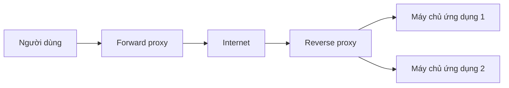

# 🚪 Forward Proxy vs Reverse Proxy — cùng là "trung gian", khác hẳn bài toán

> Nguồn: `011-Forward-Proxy-vs-Reverse-Proxy.txt` · [Udemy](https://ua.udemy.com/course/mastering-system-design-from-basics-to-cracking-interviews/learn/lecture/49357789)

Hôm nay chúng ta sẽ khám phá một trong những pattern quản lý traffic quan trọng nhất của kiến trúc hiện đại: **forward proxy và reverse proxy** — cùng một khái niệm trung gian, nhưng giải hai bài toán hoàn toàn khác nhau ở phía client và phía server. Hiểu đúng sự khác biệt này là nền tảng cho rất nhiều thành phần chúng ta sẽ học tiếp như load balancing hay API gateway.

---

### 🎯 Proxy là gì — người trung gian thông minh

Một **proxy (proxy server)** đơn giản chỉ là **trung gian giữa hai bên**. Thay vì client nói chuyện trực tiếp với server, request đi qua proxy trước — nơi nó có thể được **kiểm tra, chỉnh sửa, định tuyến, cache hoặc bảo vệ** trước khi được chuyển tiếp.

Giá trị lớn nhất của proxy là nó trở thành **điểm kiểm soát (control point) trong kiến trúc**. Khi hệ thống lớn lên, chúng ta thường cần những năng lực như:

* **Security enforcement (áp đặt bảo mật)**
* **Performance optimization (tối ưu hiệu năng)**
* **Traffic management (quản lý traffic)**
* **Access control (kiểm soát truy cập)**

...mà **không cần sửa client lẫn ứng dụng backend**. Proxy cung cấp đúng lớp trừu tượng đó — hãy hình dung nó như một **người gác cổng thông minh** đứng trên đường giao tiếp. Tùy vị trí, nó có thể **đại diện cho client** hoặc **đại diện cho server**, từ đó hình thành hai pattern chính: **forward proxy** quản lý và bảo vệ traffic đi ra của client, còn **reverse proxy** đứng trước các dịch vụ backend để tăng scalability, reliability và security.

---

### 🔍 Forward proxy — đại diện cho client

Nhìn từ góc nhìn của client, điểm mấu chốt của forward proxy là: **server đích không nhìn thấy client gốc trực tiếp, mà thấy proxy đang hành động thay mặt client**. Cơ chế này hữu ích mỗi khi client cần kiểm soát nhiều hơn cách mình truy cập internet.

Một tổ chức có thể muốn:

* Áp đặt **chính sách duyệt web (browsing policies)**.
* **Chặn truy cập** một số website nhất định và **kiểm tra traffic đi ra (outbound traffic)**.
* **Cache nội dung được yêu cầu thường xuyên**.

Thay vì cấu hình những năng lực này trên từng ứng dụng, họ **tập trung hết vào một forward proxy**.

Một use case quan trọng khác là **privacy và anonymity (riêng tư và ẩn danh)**: vì request trông như xuất phát từ proxy chứ không phải client, forward proxy thường được dùng trong **VPN, mạng doanh nghiệp và các hệ thống tập trung vào riêng tư như Tor**. Cơ chế tương tự cũng cho phép **định tuyến traffic qua các vị trí địa lý khác nhau** — lý do forward proxy thường gắn với việc vượt rào cản địa lý (geo-restrictions).

*Về mặt kiến trúc, forward proxy chủ yếu là công cụ phía client: nó cho client một lớp kiểm soát, bảo mật và tối ưu trước khi traffic ra tới internet.*

---

### 🛡️ Reverse proxy — đại diện cho server

Reverse proxy nằm ở phía đối diện của kiến trúc: thay vì đại diện cho client, nó **đại diện cho server backend**. Với người dùng, reverse proxy **trông chính là ứng dụng**, còn các server thật **ẩn hoàn toàn phía sau nó**.

Pattern này trở nên thiết yếu khi hệ thống scale. Một khi có nhiều application server, bạn cần **một entry point duy nhất** có khả năng:

* **Định tuyến traffic thông minh** và **phân phối tải**.
* **Cache response**.
* **Áp đặt chính sách bảo mật**.
* **Xử lý các cross-cutting concerns (mối quan tâm xuyên suốt)** mà không phải đẩy sự phức tạp đó vào từng dịch vụ backend.

Đó là lý do reverse proxy có mặt khắp nơi trong kiến trúc hiện đại:

* **Trải traffic qua nhiều server** để tăng availability.
* **Phục vụ nội dung đã cache gần người dùng hơn** để giảm latency.
* **Hấp thụ traffic độc hại hoặc quá lớn** trước khi nó chạm tới ứng dụng.
* **SSL termination** — tập trung hóa phần mã hóa, để dịch vụ backend tập trung vào business logic thay vì quản lý kết nối.

Dưới góc nhìn kiến trúc sư, reverse proxy thường là **lớp đầu tiên bảo vệ và tối ưu ứng dụng**: nó cải thiện scalability, tăng cường bảo mật và đơn giản hóa thiết kế backend bằng cách tạo ra một **cổng kiểm soát (controlled gateway)** giữa internet và các dịch vụ của bạn.

---

### 📊 Forward vs Reverse — khác biệt cốt lõi

Nhìn bề ngoài, cả hai đều đứng giữa hai bên và chuyển tiếp traffic. Khác biệt quan trọng không nằm ở **việc chúng làm gì**, mà ở **chúng đại diện cho ai**:

* **Forward proxy đại diện cho client.** Server đích thấy proxy thay vì người dùng thật → dùng cho privacy, lọc nội dung, kiểm soát truy cập internet và định tuyến traffic qua nhiều vị trí.
* **Reverse proxy đại diện cho server.** Client không bao giờ tương tác trực tiếp với hệ thống backend; mọi request chảy qua reverse proxy, nơi quyết định traffic đi đâu và xử lý thế nào → viên gạch nền tảng cho scalability, performance và security.

| Tiêu chí | Forward Proxy | Reverse Proxy |
|---|---|---|
| Đại diện cho | Client | Server |
| Vị trí | Phía client, trước khi ra internet | Phía server, trước backend |
| Ai "thấy" nó | Server đích thấy proxy thay vì user | Client tưởng proxy là ứng dụng |
| Mục đích chính | Riêng tư, lọc nội dung, kiểm soát truy cập | Scalability, performance, security |
| Ví dụ | VPN, mạng doanh nghiệp, Tor | Entry point backend, SSL termination, DDoS protection |

Cách nhớ cực gọn: **forward proxy giúp client quản lý việc truy cập internet, còn reverse proxy giúp server quản lý việc truy cập ứng dụng của mình.** Trong system design hiện đại, **reverse proxy phổ biến hơn hẳn** vì gần như mọi ứng dụng quy mô lớn đều cần load balancing, SSL termination, caching và DDoS protection. Forward proxy vẫn giữ vai trò quan trọng, nhưng thường được triển khai khi tổ chức cần kiểm soát, riêng tư hoặc áp đặt chính sách ở phía client. *Cả hai đều là trung gian, nhưng giải hai bài toán ngược nhau từ hai phía của mạng.*

---

### 💡 Vì sao proxy là building block kiến trúc

Proxy không chỉ là thành phần networking — chúng là **viên gạch kiến trúc** giúp đưa bảo mật, kiểm soát, tối ưu hiệu năng và scalability vào hệ thống **mà không cần thay đổi ứng dụng**. Điểm mấu chốt cần nhớ: forward proxy làm việc thay mặt client, cho client nhiều quyền kiểm soát cách truy cập internet; reverse proxy làm việc thay mặt server, tạo ra một cổng an toàn và tối ưu trước backend. Khi hệ thống lớn lên, pattern này càng quan trọng vì nó cho phép chúng ta **tách các cross-cutting concerns — caching, quản lý traffic, bảo mật, kiểm soát truy cập — ra khỏi logic ứng dụng**. Đó là chủ đề lặp đi lặp lại xuyên suốt system design hiện đại. Rahul cũng đã chuẩn bị **PDF câu hỏi phỏng vấn kèm đáp án chi tiết** trong tài nguyên bài giảng để các bạn luyện tập thêm.

---

### 🎯 Tự kiểm tra nhanh

**Câu 1:** Điểm khác biệt cốt lõi giữa forward proxy và reverse proxy là gì?

<b>Xem đáp án</b>

**Đáp án:** Không phải chúng làm gì, mà chúng đại diện cho ai: forward proxy đại diện client, reverse proxy đại diện server.

Giải thích: Cả hai đều là trung gian chuyển tiếp traffic, nhưng đứng ở hai phía đối lập của mạng.

Tham chiếu: Mục Forward vs Reverse — khác biệt cốt lõi.

**Câu 2:** Vì sao forward proxy hữu ích cho privacy và anonymity?

<b>Xem đáp án</b>

**Đáp án:** Vì request trông như xuất phát từ proxy thay vì client — server đích không thấy người dùng gốc.

Giải thích: Cơ chế này được dùng trong VPN, mạng doanh nghiệp và các hệ thống như Tor, kể cả để định tuyến qua vị trí địa lý khác.

Tham chiếu: Mục Forward proxy — đại diện cho client.

**Câu 3:** Reverse proxy giúp gì khi hệ thống có nhiều application server?

<b>Xem đáp án</b>

**Đáp án:** Tạo một entry point duy nhất để định tuyến traffic, phân phối tải, cache, áp đặt bảo mật và xử lý cross-cutting concerns.

Giải thích: Nhờ đó không phải đẩy sự phức tạp đó vào từng dịch vụ backend.

Tham chiếu: Mục Reverse proxy — đại diện cho server.

**Câu 4:** SSL termination tại reverse proxy mang lại lợi ích gì?

<b>Xem đáp án</b>

**Đáp án:** Tập trung hóa phần mã hóa, cho phép dịch vụ backend tập trung vào business logic thay vì quản lý kết nối.

Giải thích: Đây là một trong những trách nhiệm phổ biến của reverse proxy.

Tham chiếu: Mục Reverse proxy — đại diện cho server.

**Câu 5:** Vì sao reverse proxy phổ biến hơn forward proxy trong system design hiện đại?

<b>Xem đáp án</b>

**Đáp án:** Vì gần như mọi ứng dụng quy mô lớn đều cần load balancing, SSL termination, caching và DDoS protection — những thứ reverse proxy cung cấp.

Giải thích: Forward proxy vẫn quan trọng nhưng chủ yếu phục vụ nhu cầu kiểm soát/riêng tư phía client.

Tham chiếu: Mục Forward vs Reverse — khác biệt cốt lõi.

---

Vậy là các bạn đã phân biệt rõ hai pattern proxy: **forward proxy đại diện client — kiểm soát đường ra internet; reverse proxy đại diện server — tạo cổng an toàn và tối ưu trước backend**. Điều đáng nhớ: proxy tách các mối quan tâm xuyên suốt ra khỏi logic ứng dụng, và đó là chủ đề lặp lại xuyên suốt khóa học.

Bài tiếp theo, chúng ta sẽ đi sâu vào năng lực quan trọng nhất mà reverse proxy thường cung cấp: **load balancing** — cách traffic được phân phối qua nhiều server, và vì sao load balancer là điều kiện thiết yếu cho high availability và scalability. Hẹn gặp lại các bạn! 🚀
