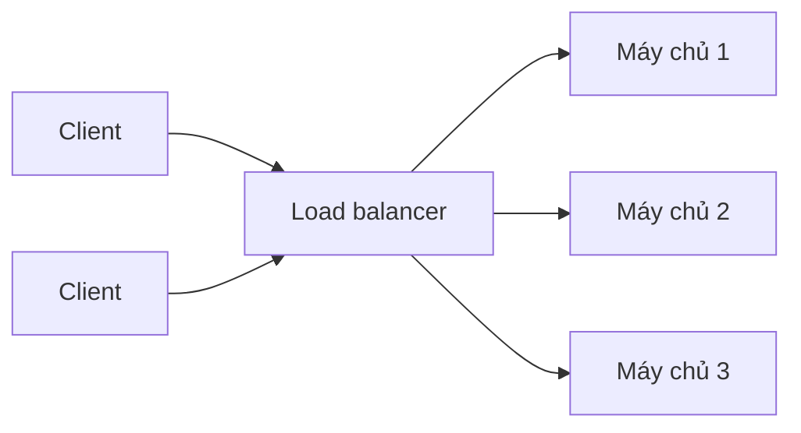

# ⚖️ Load Balancing — khi một máy chủ không còn đủ

> Nguồn: `012-Introduction-to-Load-Balancing.txt` · [Udemy](https://ua.udemy.com/course/mastering-system-design-from-basics-to-cracking-interviews/learn/lecture/49362417)

**Load balancing (cân bằng tải)** là một trong những viên gạch quan trọng nhất của hệ thống có khả năng mở rộng. Bài này mình sẽ giải thích vì sao nó trở thành nhu cầu tất yếu khi ứng dụng vượt qua giới hạn một server, và cách nó đồng thời giải hai bài toán: **capacity (năng lực)** và **reliability (độ tin cậy)**. Đây là bài giới thiệu về "vì sao" — phần thuật toán và các loại load balancer sẽ được đào sâu ở section scalability.

---

### 🎯 Vì sao một server là chưa đủ

Hầu hết hệ thống khởi đầu trên **một server duy nhất**, và giai đoạn đầu điều đó hoàn toàn ổn. Thách thức xuất hiện khi **thành công đến**: nhiều người dùng hơn, nhiều request hơn, nhiều dữ liệu hơn — và kiến trúc từng đơn giản bắt đầu lộ giới hạn.

Điều đáng chú ý là vấn đề **không chỉ nằm ở performance**. Một server đơn lẻ trở thành cả **giới hạn về năng lực** lẫn **rủi ro về độ tin cậy**:

* Nếu máy đó chậm đi, **mọi người dùng đều bị ảnh hưởng**.
* Nếu máy đó hỏng, **toàn bộ ứng dụng mất khả năng truy cập**.

Nói cách khác, **tăng trưởng biến một server đơn lẻ thành single point of failure (điểm hỏng đơn lẻ)**. Đó là lúc load balancing bước vào — **không phải như một tối ưu, mà như một nhu cầu kiến trúc**. Khi vượt qua một máy, chúng ta cần cách phân phối traffic qua nhiều server và khiến chúng **trông như một hệ thống duy nhất với người dùng**. Load balancing làm được cả hai việc: cho phép **horizontal scaling (mở rộng ngang)**, cải thiện **resilience (khả năng phục hồi)** và tạo nền móng cho hệ thống tiếp tục tăng trưởng mà không bị trói buộc vào một chiếc máy.

---

### 📈 Bài toán scaling — thêm phần cứng không giải quyết gốc rễ

Một sai lầm rất phổ biến trong system design là giả định **scalability chỉ đơn thuần là bài toán phần cứng**. Khi ứng dụng bắt đầu chật vật, phản xạ đầu tiên thường là thêm CPU, thêm RAM hoặc chuyển sang server lớn hơn. Ban đầu cách đó **có tác dụng** — nhưng vấn đề nằm ở chỗ **tăng trưởng traffic hiếm khi tuyến tính**:

* Khi nhu cầu tăng, mức tiêu thụ tài nguyên cũng tăng theo, và **cuối cùng server trở thành nút thắt (bottleneck)**.
* **Thời gian phản hồi leo thang**, request bắt đầu **xếp hàng chờ tài nguyên**, lỗi trở nên lộ rõ với người dùng.
* Lúc này, tiếp tục mua máy lớn hơn ngày càng **tốn kém và mang lại lợi ích giảm dần (diminishing returns)**.
* Quan trọng hơn: bạn **vẫn phụ thuộc vào một mảnh hạ tầng duy nhất** — đã tăng capacity nhưng **chưa thay đổi bản chất kiến trúc**.

| Tiêu chí | Vertical scaling | Horizontal scaling |
|---|---|---|
| Cách làm | Thêm CPU, RAM, máy lớn hơn | Thêm nhiều máy chủ |
| Chi phí | Tăng, lợi ích giảm dần | Chia công việc qua nhiều máy |
| Giải quyết | Kéo dài thời gian, không xóa nút thắt | Tăng capacity thật sự |
| Hệ quả | Vẫn phụ thuộc một máy | Phát sinh bài toán phối hợp |

Kiến trúc sư có kinh nghiệm nhận ra đây là **điểm chuyển hướng then chốt**: **vertical scaling (mở rộng dọc) có thể mua thời gian, nhưng không loại bỏ nút thắt**. Cuối cùng, giải pháp phải dịch chuyển từ "làm một máy to hơn" sang **phân tán khối lượng công việc qua nhiều máy** — đó là nơi các chiến lược scalability hiện đại bắt đầu.

---

### 🔁 Horizontal scaling mở ra bài toán phối hợp mới

Đến đây, chúng ta giải quyết được một vấn đề nhưng lại tạo ra vấn đề khác. Thêm server giúp tăng capacity và loại bỏ giới hạn của một máy — **nhưng giờ phải có cách điều phối các server đó**:

1. Khi một request đến, **server nào sẽ xử lý nó**?
2. **Người dùng biết gửi request đi đâu** như thế nào?
3. Và quan trọng hơn — **chúng ta không muốn client tự đưa ra quyết định này**, vì như thế sẽ gắn chặt người dùng vào hạ tầng của hệ thống và rất khó quản lý khi hệ thống lớn lên.

Đây là một pattern rất quen thuộc trong system design: **giải quyết một nút thắt scaling thường đưa vào một thách thức phối hợp mới**. Khi đã có nhiều application instance, câu hỏi thật sự không còn là "liệu chúng ta có xử lý được nhiều traffic hơn không", mà là **"làm sao phân phối traffic hiệu quả qua toàn bộ năng lực sẵn có"**. Nhu cầu **phân phối request thông minh** đó chính là thứ dẫn tới load balancing: horizontal scaling cho chúng ta capacity, còn load balancing là cơ chế biến những server độc lập thành **một hệ thống thống nhất trong mắt người dùng**.

---

### ⚖️ Load balancer — một điểm đến duy nhất

Giải pháp kiến trúc là: thay vì để lộ nhiều application server trực tiếp cho người dùng, chúng ta đưa vào **một lớp chuyên trách đứng trước chúng — load balancer (bộ cân bằng tải)**.

Từ góc nhìn client, **chỉ tồn tại một đích đến duy nhất**. Sự phức tạp của việc quyết định request nên đi đâu được **chuyển khỏi người dùng và tập trung vào bên trong kiến trúc**. Đây là một nguyên lý thiết kế quan trọng: **client nên tương tác với một interface ổn định, còn hệ thống tự quản lý sự phức tạp nội bộ của nó**.

Lợi ích tức thì là **scalability**: khi traffic tăng, có thể thêm server phía sau load balancer mà **không thay đổi cách client truy cập ứng dụng** — capacity tăng lên trong khi trải nghiệm người dùng giữ nguyên. Bên cạnh đó là **lợi thế về reliability**: traffic không còn gắn với một máy duy nhất; hệ thống trở thành **một tập hợp server phối hợp với nhau** thay vì một server gánh mọi trách nhiệm. Vì vậy load balancing là viên gạch nền tảng của hệ phân tán — nó biến nhóm server độc lập thành **một nền tảng thống nhất có thể lớn lên, thích nghi và tiến hóa khi nhu cầu tăng**.

---

### 🛡️ Load balancing tạo ra hệ thống đáng tin cậy

Đây là một trong những "tác dụng phụ" giá trị nhất của load balancing: **reliability**. Khi ứng dụng chạy trên một server, mọi sự cố đều trở thành **sự cố của cả hệ thống** — bất kể nguyên nhân là lỗi phần cứng, ứng dụng crash hay thậm chí chỉ là bảo trì định kỳ. Ứng dụng mất khả năng truy cập.

Một khi traffic được phân phối qua nhiều server, kiến trúc trở nên **chịu lỗi tốt hơn nhiều**: các server riêng lẻ có thể "đến rồi đi" trong khi dịch vụ tổng thể vẫn tiếp tục hoạt động. Trọng tâm chuyển từ **giữ cho từng server sống** sang **giữ cho cả hệ thống luôn sẵn sàng**. Đây là thay đổi tư duy căn bản trong hệ phân tán: **kiến trúc sư có kinh nghiệm không thiết kế với giả định các thành phần sẽ không bao giờ hỏng — họ thiết kế với kỳ vọng có hỏng hóc, và đảm bảo tác động của nó là giới hạn**.

Nguyên lý tương tự áp dụng cho bảo trì: deployment, nâng cấp và thay đổi hạ tầng trở nên **ít rủi ro hơn hẳn** vì traffic có thể tiếp tục chảy qua các server khỏe mạnh còn lại. Ở quy mô hệ thống, **reliability quan trọng ngang với capacity** — và load balancing giúp đạt cả hai bằng cách kết hợp **dự phòng (redundancy)** với **phân phối traffic thông minh**, tạo ra hệ thống vẫn phục vụ người dùng ngay cả khi từng thành phần riêng lẻ gặp sự cố.

*Lưu ý quan trọng: bài này chỉ tập trung vào "vì sao load balancing tồn tại". Chúng ta sẽ quay lại chủ đề này sâu hơn nhiều ở section scalability, với các thuật toán load balancing, các loại load balancer khác nhau, giải pháp cloud và kiến trúc high availability.*

---

### 🎯 Tự kiểm tra nhanh

**Câu 1:** Vì sao tăng trưởng biến một server đơn lẻ thành single point of failure?

<b>Xem đáp án</b>

**Đáp án:** Vì máy đó vừa là giới hạn về năng lực, vừa là rủi ro: chậm thì mọi người bị ảnh hưởng, hỏng thì cả ứng dụng mất khả năng truy cập.

Giải thích: Load balancing ra đời như nhu cầu kiến trúc, không chỉ là tối ưu.

Tham chiếu: Mục Vì sao một server là chưa đủ.

**Câu 2:** Vì sao vertical scaling có giới hạn?

<b>Xem đáp án</b>

**Đáp án:** Vì tăng trưởng traffic hiếm khi tuyến tính; mua máy lớn hơn ngày càng tốn kém, lợi ích giảm dần và vẫn phụ thuộc vào một mảnh hạ tầng duy nhất.

Giải thích: Vertical scaling mua thời gian nhưng không loại bỏ nút thắt.

Tham chiếu: Mục Bài toán scaling — thêm phần cứng không giải quyết gốc rễ.

**Câu 3:** Horizontal scaling tạo ra bài toán phối hợp gì?

<b>Xem đáp án</b>

**Đáp án:** Cần cơ chế quyết định server nào xử lý request nào, mà không để client tự quyết — vì sẽ gắn chặt người dùng vào hạ tầng.

Giải thích: Nhu cầu phân phối request thông minh chính là động lực cho load balancing.

Tham chiếu: Mục Horizontal scaling mở ra bài toán phối hợp mới.

**Câu 4:** Load balancer thay đổi góc nhìn của client như thế nào?

<b>Xem đáp án</b>

**Đáp án:** Từ góc nhìn client chỉ còn một đích đến duy nhất; sự phức tạp định tuyến nội bộ được giấu đi.

Giải thích: Nguyên lý thiết kế: client tương tác với interface ổn định, hệ thống tự quản lý phức tạp nội bộ.

Tham chiếu: Mục Load balancer — một điểm đến duy nhất.

**Câu 5:** Vì sao load balancing cũng là giải pháp reliability, không chỉ scalability?

<b>Xem đáp án</b>

**Đáp án:** Vì traffic không còn phụ thuộc một máy; server riêng lẻ có thể hỏng hoặc bảo trì mà dịch vụ tổng thể vẫn hoạt động.

Giải thích: Kiến trúc sư thiết kế với kỳ vọng có hỏng hóc và giới hạn tác động của nó.

Tham chiếu: Mục Load balancing tạo ra hệ thống đáng tin cậy.

---

Vậy là chúng ta đã có bức tranh tổng quan về load balancing: từ nút thắt của một server, giới hạn của vertical scaling, bài toán phối hợp khi scale ngang, đến vai trò của load balancer như **một điểm đến duy nhất** và là **nền tảng của reliability**. *Điều cốt lõi: scaling hiếm khi là chuyện làm server to hơn — đó là chuyện xây kiến trúc không còn bị trói vào một máy.*

Tiếp theo, chúng ta sẽ khám phá **API gateway** — lớp hạ tầng chuyên biệt trở thành entry point tập trung cho API, xử lý routing, bảo mật, rate limiting và quản lý request trong kiến trúc phân tán hiện đại. Hẹn gặp lại các bạn! 🚀
