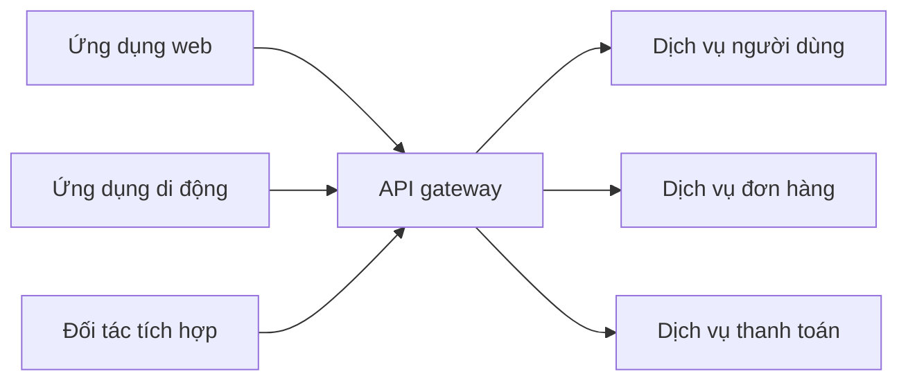

# 🚪 API Gateway — "cửa trước" của hệ thống microservices

> Nguồn: `013-What-is-an-API-Gateway.txt` · [Udemy](https://ua.udemy.com/course/mastering-system-design-from-basics-to-cracking-interviews/learn/lecture/49377655)

Khi hệ thống lớn dần về độ phức tạp, việc quản lý **API traffic, bảo mật và tương tác giữa các dịch vụ** trở thành bài toán ngày càng khó. Đó chính là vấn đề mà **API gateway** được sinh ra để giải quyết. Bài này mình sẽ đi từ khái niệm, cách hoạt động, các lợi ích cốt lõi cho đến câu hỏi quan trọng nhất: **khi nào nên và không nên dùng nó**.

---

### 🎯 API gateway là gì

Khi hệ thống lớn lên, **số lượng client và backend service tăng theo**. Kết nối trực tiếp từng client tới từng service nhanh chóng trở nên **khó bảo mật, khó giám sát và khó tiến hóa**. **API gateway** giải quyết điều này bằng cách tạo ra **một entry point duy nhất giữa người dùng API và toàn bộ hệ sinh thái backend**.

Thay vì đẩy các mối quan tâm như **authentication (xác thực), authorization (phân quyền), routing, rate limiting (giới hạn tần suất), caching và request transformation (biến đổi request)** vào từng dịch vụ, chúng ta **tập trung tất cả vào một chỗ**. Dưới góc nhìn kiến trúc, API gateway trở thành **cửa trước (front door) của hệ thống**:

* **Đơn giản hóa tương tác của client.**
* **Che chắn các dịch vụ nội bộ** khỏi việc bị lộ trực tiếp.
* Cung cấp cách **áp đặt bảo mật và chính sách vận hành nhất quán**.

Điều này đặc biệt giá trị trong môi trường **microservices**, nơi client nếu không có gateway sẽ phải giao tiếp với **hàng chục dịch vụ độc lập**. Ý tưởng cốt lõi: **backend service tập trung vào business logic, còn gateway xử lý các cross-cutting concerns (mối quan tâm xuyên suốt)**. Sự phân tách đó cải thiện khả năng bảo trì, tăng cường bảo mật và tạo ra **một lớp được kiểm soát** để cả hệ sinh thái API tiến hóa và mở rộng.

---

### ⚙️ API gateway hoạt động thế nào

Hãy hình dung hệ thống tiến hóa từ vài API thành **hàng chục, thậm chí hàng trăm dịch vụ**. Không có API gateway, mỗi client phải biết:

1. **Các dịch vụ nằm ở đâu**.
2. **Xác thực với từng dịch vụ thế nào**.
3. **Tương tác với mỗi dịch vụ ra sao**.

Điều đó tạo ra **tight coupling (gắn kết chặt)** và **đẩy rất nhiều phức tạp ra rìa hệ thống**. API gateway giải quyết bằng cách hoạt động như một **reverse proxy**, trở thành **single entry point cho toàn bộ API traffic đi vào**. Mọi request **đến gateway trước tiên**, gateway quyết định request nên đi đâu và xử lý thế nào **trước khi nó chạm tới dịch vụ backend**:

Sức mạnh của gateway nằm ở việc **tập trung hóa mọi cross-cutting concerns**: authentication, rate limiting, request transformation, **protocol translation (chuyển đổi giao thức)** và **response standardization (chuẩn hóa response)** đều được xử lý ở một chỗ thay vì lặp lại trong từng dịch vụ. Điều này tạo ra **tính nhất quán** và cho phép các team backend tập trung vào business logic thay vì các vấn đề hạ tầng. Lợi ích kiến trúc không chỉ là tiện lợi: gateway trở thành **lớp kiểm soát cải thiện bảo mật**, đơn giản hóa tương tác client và là **một điểm duy nhất để áp đặt chính sách vận hành**. Trade-off — tất nhiên — là nó trở thành **hạ tầng trọng yếu (critical infrastructure)**: gateway phải **highly available** và có khả năng xử lý traffic ở quy mô của cả hệ thống.

---

### 💡 Lợi ích của API gateway

Giá trị thật của API gateway **không nằm ở việc nó chuyển tiếp request**, mà ở chỗ nó trở thành **điểm kiểm soát trung tâm cho toàn bộ hệ sinh thái API**. Khi hệ thống lớn lên, việc lặp đi lặp lại cùng một mối quan tâm trong mọi dịch vụ tạo ra **chi phí vận hành, hành vi không nhất quán và lỗ hổng bảo mật**:

* **Security** thường là động lực đầu tiên để áp dụng gateway: thay vì lộ hàng chục backend service trực tiếp ra internet, ta chỉ lộ **một entry point được gia cố**, nơi authentication, authorization và chính sách bảo mật được áp đặt nhất quán.
* **Rate limiting** ngăn traffic lạm dụng làm quá tải dịch vụ.
* **Load balancing** phân phối request thông minh để tránh hotspot và cải thiện availability khi traffic tăng vọt.
* **Caching** cho phép phục vụ dữ liệu được yêu cầu thường xuyên mà không phải gọi backend liên tục — giảm latency cho người dùng và giảm tải hệ thống.
* **Request transformation** tăng tính linh hoạt, cho phép client và dịch vụ **tiến hóa độc lập** ngay cả khi dùng giao thức, định dạng payload hay header khác nhau.
* **Aggregation (tổng hợp)**: thay vì bắt client gọi nhiều backend service, gateway có thể **gộp các request và trả về một response hợp nhất**, giảm network overhead và che giấu sự phức tạp nội bộ.
* **Observability (khả năng quan sát)**: vì mọi traffic chảy qua một lớp duy nhất, gateway trở thành **điểm quan sát tuyệt vời** — logging, monitoring và analytics cho thấy pattern sử dụng, lỗi, latency và các sự kiện bảo mật.

*Ý tưởng kiến trúc then chốt: API gateway không chỉ là thành phần routing, mà là một lớp nền tảng tập trung giúp cải thiện security, performance, observability và tính nhất quán vận hành trên toàn hệ thống.*

---

### 📦 Các lựa chọn triển khai phổ biến

Điều quan trọng cần nhớ: **API gateway là một pattern kiến trúc, không phải một sản phẩm cụ thể**. Các tổ chức chọn cách triển khai khác nhau dựa trên nhu cầu vận hành, chiến lược cloud và quy mô:

* **Giải pháp self-managed như Nginx và Kong** mang lại **độ linh hoạt và kiểm soát cao**, nhưng đòi hỏi team phải tự lo vận hành, scaling, bảo mật và bảo trì.
* **Dịch vụ managed như AWS API Gateway, Azure API Management và Google API Gateway** giúp **giảm chi phí vận hành**, cho phép team tập trung vào thiết kế và quản trị API — đổi lại có thể kéo theo **phụ thuộc nhà cung cấp (vendor dependency)** và **chi phí cao hơn**.

| Tiêu chí | Self-managed — Nginx, Kong | Managed — AWS, Azure, Google |
|---|---|---|
| Kiểm soát | Cao, linh hoạt | Thấp hơn, theo nền tảng |
| Vận hành | Tự lo scaling, bảo mật, bảo trì | Nhà cung cấp lo phần lớn |
| Đánh đổi | Chi phí nhân sự, công vận hành | Phụ thuộc vendor, chi phí có thể cao |

Quyết định then chốt không phải là **"chọn gateway tốt nhất"**, mà là **cân bằng giữa kiểm soát vận hành và sự tiện lợi của managed service**. Dù chọn cách nào, mọi API gateway đều phục vụ cùng một mục đích: cung cấp **một lớp tập trung để quản lý, bảo mật và quản trị API traffic**.

---

### ⚠️ Khi nào nên dùng API gateway

Một sai lầm phổ biến trong system design là giả định **mọi kiến trúc đều cần API gateway**. Nhưng như hầu hết pattern kiến trúc, giá trị của nó **phụ thuộc vào độ phức tạp của bài toán mà nó giải quyết**. API gateway càng có giá trị khi số lượng service, client và yêu cầu vận hành tăng lên:

* Trong **microservices**, nó cung cấp entry point thống nhất, giúp client không phải hiểu chi tiết của hàng chục backend service.
* Đặc biệt hữu ích khi **cùng một API được tiêu thụ bởi nhiều kênh** — ứng dụng web, ứng dụng di động, tích hợp đối tác, thiết bị IoT — mỗi kênh có yêu cầu khác nhau nhưng đều cần **bảo mật và quản trị nhất quán**.
* Càng đáng dùng khi các cross-cutting concerns như **authentication, rate limiting, monitoring, caching và traffic management** cần được áp đặt thống nhất trên toàn nền tảng.

Ngược lại, **không phải hệ thống nào cũng cần lớp bổ sung này**:

* Với **ứng dụng monolith đơn giản** với số lượng API ít, thêm API gateway có thể **tăng độ phức tạp vận hành mà không mang lại giá trị đáng kể**.
* Điều tương tự cũng đúng với **internal service có traffic thấp**, nơi giao tiếp trực tiếp đơn giản và dễ bảo trì hơn.

*Bài học kiến trúc rất rõ ràng: hãy đưa API gateway vào khi nó giảm độ phức tạp ở cấp hệ thống — chứ không phải khi nó chỉ chuyển sự phức tạp sang một thành phần khác.*

---

### 🎯 Tự kiểm tra nhanh

**Câu 1:** API gateway giải quyết bài toán gì ở cấp hệ thống?

<b>Xem đáp án</b>

**Đáp án:** Tạo một entry point duy nhất giữa người dùng API và backend, tập trung hóa authentication, authorization, routing, rate limiting, caching và request transformation.

Giải thích: Nhờ đó client không phải kết nối trực tiếp tới hàng chục dịch vụ.

Tham chiếu: Mục API gateway là gì.

**Câu 2:** Vì sao API gateway được xem là reverse proxy?

<b>Xem đáp án</b>

**Đáp án:** Vì nó đứng trước backend, nhận mọi request đi vào, rồi quyết định request đi đâu và xử lý thế nào trước khi chạm dịch vụ.

Giải thích: Mọi API traffic đều đi qua gateway — single entry point.

Tham chiếu: Mục API gateway hoạt động thế nào.

**Câu 3:** Trade-off lớn nhất khi thêm API gateway là gì?

<b>Xem đáp án</b>

**Đáp án:** Nó trở thành critical infrastructure — phải highly available và chịu được traffic ở quy mô toàn hệ thống.

Giải thích: Đây là cái giá của việc tập trung mọi cross-cutting concerns vào một lớp.

Tham chiếu: Mục API gateway hoạt động thế nào.

**Câu 4:** Managed API gateway đánh đổi điều gì so với self-managed?

<b>Xem đáp án</b>

**Đáp án:** Giảm chi phí vận hành nhưng có thể phụ thuộc nhà cung cấp và chi phí cao hơn.

Giải thích: Quyết định là cân bằng giữa kiểm soát vận hành và tiện lợi managed.

Tham chiếu: Mục Các lựa chọn triển khai phổ biến.

**Câu 5:** Khi nào KHÔNG nên dùng API gateway?

<b>Xem đáp án</b>

**Đáp án:** Với monolith đơn giản có ít API, hoặc internal service traffic thấp — giao tiếp trực tiếp đơn giản hơn.

Giải thích: Chỉ đưa gateway vào khi nó giảm độ phức tạp cấp hệ thống, không phải khi nó chỉ chuyển độ phức tạp đi chỗ khác.

Tham chiếu: Mục Khi nào nên dùng API gateway.

---

Vậy là chúng ta đã nắm trọn API gateway: từ vai trò **cửa trước của hệ thống**, cách nó tập trung hóa cross-cutting concerns, các lợi ích về bảo mật – hiệu năng – observability, hai hướng triển khai self-managed và managed, đến nguyên tắc **chỉ thêm thành phần khi nó giải quyết bài toán thật**. *Kiến trúc tốt không nằm ở việc thêm thật nhiều component, mà ở việc thêm đúng lúc.*

Bài tiếp theo, chúng ta sẽ chuyển từ API traffic sang **phân phối nội dung** — tìm hiểu cách **CDN (Content Delivery Network)** giảm latency, cải thiện trải nghiệm người dùng và mở rộng ứng dụng ra toàn cầu. Hẹn gặp lại các bạn! 🚀
