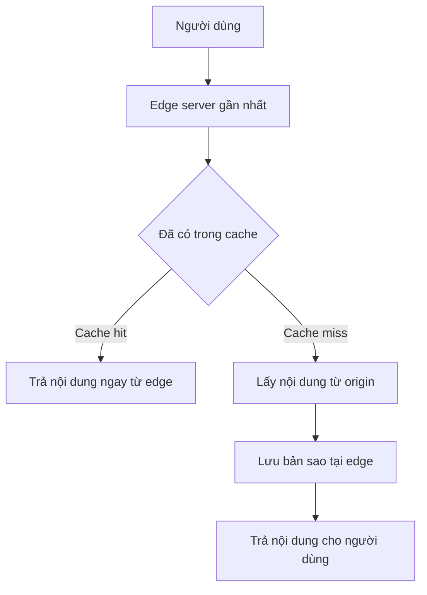

# 🌍 CDN — đưa nội dung đến gần người dùng hơn

> Nguồn: `014-Content-Delivery-Networks-CDN.txt` · [Udemy](https://ua.udemy.com/course/mastering-system-design-from-basics-to-cracking-interviews/learn/lecture/49396997)

Hôm nay chúng ta sẽ khám phá **CDN (Content Delivery Network — mạng phân phối nội dung)** — một trong những thành phần kiến trúc quan trọng nhất để đưa ứng dụng tới người dùng khắp thế giới nhanh hơn, đáng tin cậy hơn và an toàn hơn. Đây cũng là bài khép lại chuỗi thành phần networking trước khi chúng ta tổng kết cả section.

---

### 🎯 Vì sao cần CDN

CDN trở nên quan trọng **ngay khi người dùng của bạn không còn ngồi gần server**. Nếu mọi request đều phải vượt qua các châu lục để tới **origin server (server gốc)**, latency nhanh chóng trở thành **vấn đề trải nghiệm người dùng**. CDN giải quyết bằng cách **đưa nội dung đến gần người dùng hơn** thông qua một **mạng lưới edge location (điểm biên) phân bố toàn cầu** — request được phục vụ từ **node gần nhất** thay vì luôn đập vào origin.

Nhưng performance chỉ là một nửa câu chuyện. Khi traffic tăng, **origin server trở thành cả nút thắt scalability lẫn rủi ro reliability**. CDN đóng vai trò **lớp phân tán phía trước hệ thống**, giúp:

* **Hấp thụ các đợt traffic tăng vọt (traffic spikes).**
* **Phục vụ nội dung cache ở quy mô lớn.**
* **Giảm tải cho hạ tầng backend.**
* **Tăng resilience** bằng cách định tuyến lại request khi node hoặc region gặp sự cố.

Trước khi CDN tồn tại, mọi request đều phải đi hết đường tới origin — điều đó chỉ ổn khi traffic nhỏ và người dùng ở gần. Khi ứng dụng lớn lên, **ba vấn đề lớn** xuất hiện:

1. **Khoảng cách tạo ra latency**: người dùng từ châu lục khác phải chờ dữ liệu băng qua nhiều mạng trước khi nhận được phản hồi. Dù origin server nhanh đến đâu, **khoảng cách vật lý vẫn tạo độ trễ không thể tránh**.
2. **Origin server trở thành nút thắt**: nội dung phổ biến có thể hút **hàng triệu request**, và việc ép mọi request đi qua một địa điểm tạo ra thách thức về scaling lẫn reliability. *Ứng dụng càng thành công, áp lực lên hạ tầng của chính nó càng lớn.*
3. **Mọi request đều tiêu tốn băng thông của origin**: các tài sản tĩnh như **hình ảnh, video, JavaScript, CSS** bị truyền đi truyền lại từ cùng một server, làm **tăng chi phí và chậm tốc độ** vào giờ cao điểm.

---

### 🏗️ Kiến trúc CDN — origin, edge và request routing

Nhìn từ bên ngoài, CDN có vẻ chỉ là một lớp caching đơn giản; nhưng bên trong, nó là **một hệ phân tán gồm ba thành phần chính** phối hợp với nhau:

1. **Origin server** — ở trung tâm, là **nguồn chân lý (source of truth)** nơi nội dung gốc sống. Mục tiêu của CDN **không phải thay thế origin**, mà là **giảm tần suất người dùng phải chạm tới nó trực tiếp**.
2. **Edge server / point of presence (PoP)** — được triển khai ở nhiều khu vực địa lý khác nhau. Các edge location này **cache nội dung gần người dùng**, cho phép phục vụ request từ nơi lân cận thay vì đi ngược về origin. **Đây là nơi phần lớn mức giảm latency đến từ.**
3. **Request routing system** — thành phần nối mọi thứ lại. Khi người dùng đưa ra request, CDN phải quyết định **edge location nào sẽ xử lý**. Quyết định này **không chỉ dựa trên địa lý**, mà còn xét **điều kiện mạng, latency, availability và tải của server** để tìm đường đi tốt nhất có thể.

*Nhìn từ góc độ kiến trúc, CDN về bản chất là việc đưa nội dung đến gần người dùng hơn, đồng thời điều hướng traffic thông minh tới vị trí hiệu quả nhất — nhờ đó giảm cả latency cho người dùng lẫn tải cho origin.*

---

### 🔁 Một request đi qua CDN như thế nào

Sức mạnh thật sự của CDN hiện rõ khi ta đi theo một request xuyên qua hệ thống. Từ góc nhìn người dùng, họ chỉ mở website, xem video hoặc gọi API — nhưng phía sau, CDN đang đưa ra một loạt quyết định để phục vụ nội dung hiệu quả nhất có thể:

1. Khi request đến, CDN **xác định edge location tốt nhất** để phục vụ. Việc này không chỉ dựa vào khoảng cách vật lý — CDN hiện đại còn xét **network latency, tắc nghẽn (congestion), sức khỏe server và tải hiện tại**.
2. Bước tiếp theo phụ thuộc vào việc nội dung **đã được cache ở edge đó chưa**: nếu có, ta có một **cache hit**; nếu chưa, ta có một **cache miss**.
3. Với **cache hit**, nội dung được phục vụ **ngay lập tức từ edge server**, tránh hẳn chuyến đi tới origin và mang lại trải nghiệm nhanh hơn nhiều.
4. Với **cache miss**, edge server **lấy nội dung từ origin**, trả cho người dùng, rồi **lưu một bản sao cục bộ** cho các request sau.

| Tình huống | Điều gì xảy ra | Hệ quả |
|---|---|---|
| Cache hit | Edge phục vụ nội dung ngay, không tới origin | Nhanh, giảm tải origin |
| Cache miss | Edge lấy từ origin, trả user, lưu bản sao | Request đầu chậm hơn, các request sau nhanh |

Đây là lý do **CDN ngày càng hiệu quả theo thời gian**: request đầu tiên có thể vẫn phải chạm origin, nhưng các request sau thường được phục vụ trực tiếp từ edge — **giảm mạnh latency, mức tiêu thụ băng thông và tải cho hệ thống backend**.

---

### 🚀 Performance, reliability và security

Khi hệ thống mở rộng toàn cầu, CDN **không còn chỉ là tối ưu hiệu năng** mà trở thành một phần trọng yếu của kiến trúc. Điều thú vị là **cùng một request có thể hưởng lợi từ nhiều năng lực CDN cùng lúc**:

* **Caching**: phục vụ nội dung từ edge thay vì origin giúp **loại bỏ các network hop không cần thiết** và giảm mạnh thời gian phản hồi.
* **Phân phối traffic và reroute**: nếu hàng triệu người dùng truy cập cùng lúc, CDN phải **phân tải thông minh qua mạng lưới toàn cầu** và **chuyển hướng nhanh khi có lỗi**.
* **Tối ưu nội dung**: mỗi byte truyền đi đều tiêu tốn băng thông và ảnh hưởng trải nghiệm, đặc biệt trên mạng chậm. Vì vậy CDN hiện đại **nén dữ liệu, biến đổi hình ảnh và tối giản tài sản (asset minimization)** trước khi nội dung tới người dùng.
* **Security**: vì mọi traffic đều đi qua CDN, đây là **nơi lý tưởng để áp đặt kiểm soát bảo mật** — **lọc request độc hại, hấp thụ tấn công (DDoS), và kết thúc kết nối mã hóa (TLS termination) ngay tại edge** trước khi traffic chạm tới origin.

Ngày nay, CDN còn tham gia **lọc traffic độc hại, giảm thiểu DDoS và bảo vệ origin khỏi bị lộ trực tiếp** — khiến nó thường là **một trong những lớp kiến trúc đầu tiên mà người dùng tương tác**. Cùng nhau, các năng lực này biến CDN thành **lớp tăng tốc toàn cầu, đảm bảo availability, tối ưu hóa và bảo mật** nằm giữa người dùng và hệ thống backend.

---

### 📦 Use case — từ static đến edge computing

Khi hầu hết kỹ sư nghĩ về CDN, họ nghĩ tới việc phục vụ **hình ảnh, video hoặc tài sản website tĩnh**. Đó đúng là use case phổ biến nhất — nhưng CDN hiện đại đã vượt xa phân phối nội dung tĩnh:

* **Nội dung tĩnh**: giá trị rất rõ ràng — **cache một lần ở edge, phục vụ hàng nghìn đến hàng triệu lần** mà không đập vào origin. Đây là lý do website, nền tảng streaming và hệ thống phân phối phần mềm dựa nhiều vào CDN.
* **Nội dung động**: các trang cá nhân hóa và API response thường **không thể cache toàn phần** vì phụ thuộc người dùng hoặc dữ liệu thời gian thực. Trong tình huống này, CDN vẫn tạo giá trị bằng cách **tối ưu đường truyền, duy trì kết nối thường trú tới origin và cache có chọn lọc dữ liệu chung giữa các request**.
* **API**: nhiều ứng dụng tạo ra **lượng traffic API lớn hơn cả traffic trang web**, và lặp lại việc lấy cùng dữ liệu từ origin là không hiệu quả. **Edge caching** có thể giảm mạnh thời gian phản hồi trong khi bảo vệ backend khỏi tải không cần thiết.
* **Edge computing**: bước tiến mới nhất — thay vì chỉ phân phối nội dung, **edge location có thể thực thi logic nhẹ gần người dùng**. Các tác vụ như **kiểm tra request, cá nhân hóa, chuyển hướng, kiểm tra authentication và biến đổi nội dung** có thể diễn ra ngay tại edge, giảm latency và giảm việc cho backend.

*Điểm mấu chốt: CDN hiện đại không còn chỉ là mạng phân phối nội dung — chúng đang dần trở thành các nền tảng ứng dụng phân tán vận hành ở rìa internet.*

---

### 🎯 Tự kiểm tra nhanh

**Câu 1:** Ba vấn đề nào xuất hiện khi mọi request đều phải tới origin server?

<b>Xem đáp án</b>

**Đáp án:** Khoảng cách tạo latency; origin thành nút thắt; mọi request tiêu tốn băng thông origin.

Giải thích: CDN ra đời để đưa nội dung đến gần người dùng và giảm tải origin.

Tham chiếu: Mục Vì sao cần CDN.

**Câu 2:** Ba thành phần chính trong kiến trúc CDN là gì?

<b>Xem đáp án</b>

**Đáp án:** Origin server, edge server/point of presence, và request routing system.

Giải thích: Routing quyết định edge nào phục vụ, dựa trên cả địa lý lẫn điều kiện mạng, availability và tải.

Tham chiếu: Mục Kiến trúc CDN — origin, edge và request routing.

**Câu 3:** Cache hit và cache miss khác nhau thế nào?

<b>Xem đáp án</b>

**Đáp án:** Cache hit: edge phục vụ ngay, không cần tới origin. Cache miss: edge lấy từ origin, trả cho người dùng rồi lưu bản sao cho lần sau.

Giải thích: Nhờ vậy CDN ngày càng hiệu quả theo thời gian.

Tham chiếu: Mục Một request đi qua CDN như thế nào.

**Câu 4:** Ngoài caching, CDN còn làm gì để tối ưu và bảo vệ?

<b>Xem đáp án</b>

**Đáp án:** Phân phối traffic, reroute khi lỗi, nén và tối giản tài sản, lọc request độc hại, hấp thụ DDoS, TLS termination tại edge.

Giải thích: CDN trở thành lớp tăng tốc, đảm bảo availability, tối ưu hóa và bảo mật phía trước backend.

Tham chiếu: Mục Performance, reliability và security.

**Câu 5:** Vì sao nói CDN ngày nay không còn chỉ là "content delivery network"?

<b>Xem đáp án</b>

**Đáp án:** Vì CDN hiện đại tăng tốc API, hỗ trợ nội dung động và cung cấp edge computing — thực thi logic ngay gần người dùng.

Giải thích: Chúng đang tiến hóa thành nền tảng ứng dụng phân tán ở rìa internet.

Tham chiếu: Mục Use case — từ static đến edge computing.

---

Vậy là chúng ta đã đi trọn CDN: vì sao cần, kiến trúc origin – edge – request routing, luồng cache hit/miss, và bộ ba giá trị **performance – reliability – security** cùng các use case từ static đến edge computing. *Điều cần khắc cốt: CDN thường là lớp đầu tiên người dùng tương tác, nên các quyết định tại edge ảnh hưởng lớn tới toàn hệ thống.*

Bài tiếp theo, chúng ta sẽ **tổng kết toàn bộ section Networking & Communication** — nhìn lại cách các mảnh ghép khớp với nhau và những nguyên tắc networking ảnh hưởng đến quyết định thiết kế thực tế. Hẹn gặp lại các bạn! 🚀
