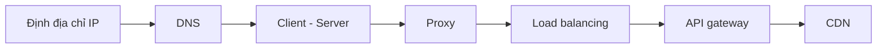

# 🏁 Tổng kết Networking & Communication — khi các mảnh ghép khớp vào nhau

> Nguồn: `015-Networking-Fundamentals-Summary.txt` · [Udemy](https://ua.udemy.com/course/mastering-system-design-from-basics-to-cracking-interviews/learn/lecture/49397019)

Chúng ta đang khép lại section **Networking & Communication**. Đây là lúc cùng nhìn lại toàn bộ hành trình và — quan trọng hơn — thấy được cách tất cả các chủ đề kết nối với nhau để tạo thành **nền tảng của hệ thống phân tán hiện đại**.

---

### 🗺️ Bức tranh tổng thể

Hãy điểm lại con đường chúng ta đã đi qua:

1. Bắt đầu với **fundamentals of networking và addressing** — cách hệ thống nhận diện nhau trên mạng.
2. Tiếp đó là **DNS** — hệ thống giúp các dịch vụ trở nên **có thể tìm thấy (discoverable)**.
3. Rồi đến **cách client và server giao tiếp** — mô hình nền tảng của mọi tương tác.
4. Sang **proxy (forward và reverse)** — những lớp giúp **kiểm soát và bảo vệ luồng traffic**.
5. Cuối cùng là **load balancer, API gateway và CDN** — những thành phần **xuất hiện một cách tự nhiên khi hệ thống mở rộng**, và nhu cầu về **performance, reliability, security** tăng lên.

---

### 🔗 Các mảnh ghép không tách rời

Điểm mấu chốt cần ghi nhớ: đây **không phải những khái niệm cô lập**. Trong một kiến trúc production thực tế, chúng **phối hợp với nhau trên mọi request path** — từ phân giải tên miền, định tuyến, đến quản lý traffic, caching và phân phối nội dung:

*Hiểu cách những viên gạch này tương tác với nhau là điều kiện thiết yếu để thiết kế hệ thống có khả năng mở rộng và chịu lỗi tốt.* Không có thành phần nào là "đủ dùng một mình" — giá trị nằm ở cách chúng bổ trợ cho nhau trong cùng một kiến trúc.

---

### ➡️ Tiếp theo: đi sâu vào tầng giao thức

Ở section kế tiếp, chúng ta sẽ **đi sâu thêm một tầng nữa vào communication stack** và khám phá các **giao thức (protocols)** vận hành những tương tác này:

* **TCP vs UDP** — hai lựa chọn nền tảng với trade-off khác nhau.
* **HTTP và REST** — giao thức và phong cách thiết kế API phổ biến nhất.
* **WebSockets** — giao tiếp hai chiều thời gian thực.
* **gRPC** và **GraphQL** — những lựa chọn hiện đại cho giao tiếp service-to-service và truy vấn dữ liệu linh hoạt.

Trọng tâm sẽ là **khi nào dùng cái nào, trade-off đi kèm là gì**, và **lựa chọn giao thức ảnh hưởng thế nào tới các quyết định system design**.

---

Vậy là các bạn đã có trong tay bức tranh hoàn chỉnh của tầng networking — từ địa chỉ IP, DNS, client-server, proxy, đến load balancing, API gateway và CDN. Hãy xem đây là nền móng chắc chắn trước khi bước sang tầng giao thức. Hẹn gặp lại các bạn ở section tiếp theo! 🚀
