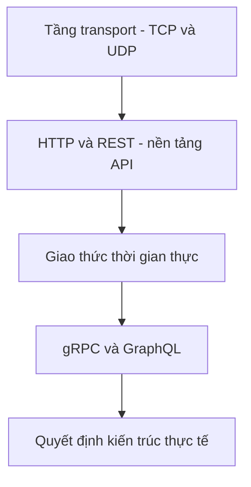

# 🧭 Bắt đầu với Protocols — giao tiếp là nền tảng của mọi hệ phân tán

> Nguồn: `016-Lets-Start-Protocols.txt` · [Udemy](https://ua.udemy.com/course/mastering-system-design-from-basics-to-cracking-interviews/learn/lecture/49413779)

Chào mừng các bạn trở lại với một section hoàn toàn mới: **Protocols (giao thức)**. Mình muốn mở đầu bằng một ý rất đáng khắc cốt: **giao tiếp chính là nền tảng của mọi hệ phân tán**, và lựa chọn giao thức bạn đưa ra ảnh hưởng trực tiếp tới **performance (hiệu năng)**, **scalability (khả năng mở rộng)**, **reliability (độ tin cậy)** cùng trải nghiệm người dùng. Hiểu protocols không phải để thuộc lòng định nghĩa, mà để biết vì sao hệ thống được ghép lại theo cách nó đang vận hành.

---

### 🌐 Vì sao protocols là chủ đề không thể bỏ qua?

Trong section này, chúng ta sẽ cùng khảo sát những công nghệ cho phép **service, ứng dụng và người dùng trao đổi dữ liệu một cách hiệu quả** — từ giao tiếp web truyền thống cho tới kiến trúc thời gian thực và API hiện đại.

Lý do rất đơn giản: **gần như mọi quyết định thiết kế hệ thống cuối cùng đều quy về cách các thành phần nói chuyện với nhau**. Chọn sai giao thức có thể khiến hệ thống chậm hơn, đắt hơn vận hành, hoặc không đáp ứng được yêu cầu nghiệp vụ. Chọn đúng giao thức giúp bạn giải quyết đúng bài toán với chi phí hợp lý.

---

### 🗺️ Lộ trình của section — đi xuyên tầng giao tiếp

Hãy coi section này như một hành trình băng qua **communication stack (chồng giao tiếp)**, đi từ tầng thấp nhất lên tới các API hiện đại:

1. Bắt đầu từ **tầng transport** — nơi `TCP` và `UDP` thiết lập trade-off giữa **độ tin cậy và tốc độ**.
2. Tiếp đó là **HTTP và REST** — nền móng của hầu hết API hiện đại ngày nay.
3. Khi đã hiểu giao tiếp request-response truyền thống, chúng ta khám phá các giao thức dành cho **tương tác thời gian thực**.
4. Sau đó là những cách tiếp cận mới hơn như **gRPC và GraphQL**, giải quyết nhu cầu scalability và performance của hệ thống hiện đại.

---

### 🎯 Mục tiêu: chọn đúng giao thức cho đúng bài toán

Điểm kết thúc của hành trình là lúc chúng ta nối tất cả khái niệm trở lại với **các quyết định kiến trúc trong thế giới thực** — để các bạn tự tin chọn đúng giao thức cho đúng vấn đề.

*Đây cũng chính là điều người phỏng vấn system design muốn thấy: không phải bạn nhớ tên giao thức, mà bạn lý giải được vì sao chọn nó.*

Vậy là chúng ta đã có tấm bản đồ cho section Protocols. Không chần chừ thêm nữa, hãy cùng bắt đầu với chặng đầu tiên: **TCP và UDP** — hai giao thức tầng transport đứng sau gần như mọi giao tiếp trên internet. Hẹn gặp lại các bạn ở bài tiếp theo! 🚀
