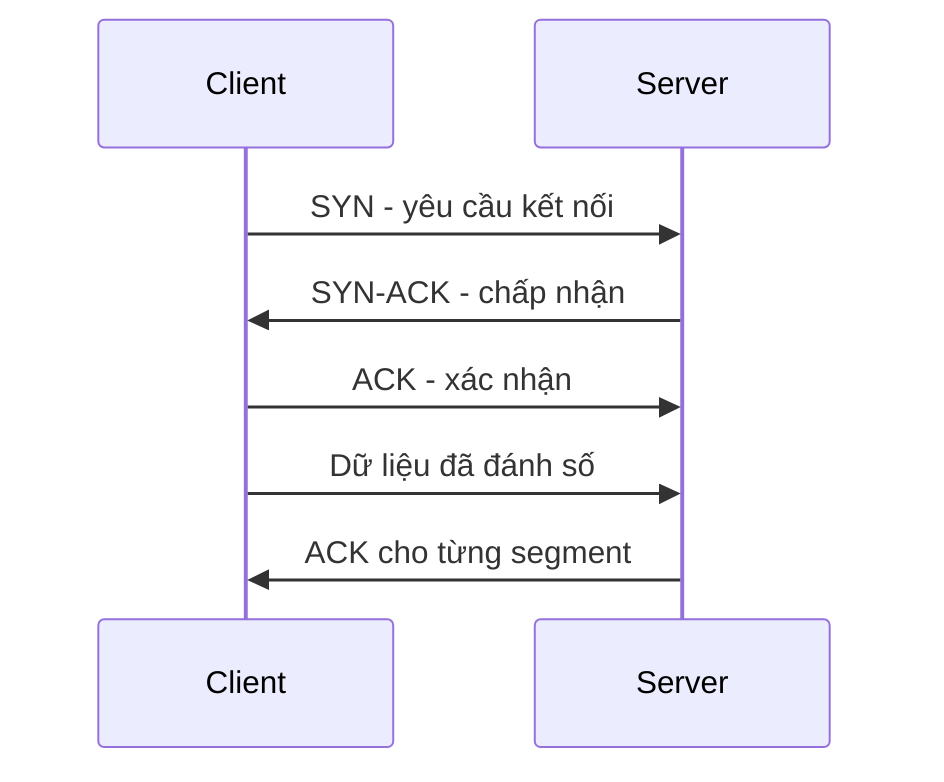

# 🔌 TCP và UDP — Bài toán cân bằng giữa độ tin cậy và tốc độ

> Nguồn: `017-TCP-UDP.txt` · [Udemy](https://ua.udemy.com/course/mastering-system-design-from-basics-to-cracking-interviews/learn/lecture/49413791)

Trong bài này, mình và các bạn sẽ khám phá **TCP** và **UDP** — hai giao thức tầng transport (tầng vận chuyển) cốt lõi của internet — và xem cách trade-off giữa **reliability (độ tin cậy)** và **speed (tốc độ)** của chúng định hình các quyết định thiết kế hệ thống. Đây là bài học nền tảng: hiểu đúng hai giao thức này, các bạn sẽ thấy rất nhiều lựa chọn kiến trúc phía sau trở nên dễ lý giải hơn.

---

### 🔌 TCP là gì?

**Transmission Control Protocol (TCP)** là một trong những lý do khiến internet "cảm giác" đáng tin cậy. Mạng vốn dĩ không thể đoán trước: **packet (gói tin)** có thể bị trễ, đến sai thứ tự, bị nhân bản, hoặc biến mất hoàn toàn. TCP nằm giữa ứng dụng và mạng để che giấu sự phức tạp đó, tạo ra **ảo giác về một kênh giao tiếp đáng tin cậy**.

Việc đầu tiên TCP làm là **thiết lập kết nối** trước khi trao đổi bất kỳ dữ liệu nào. Hãy nghĩ đến một **cuộc gọi điện thoại** thay vì gửi bưu thiếp: hai bên phải xác nhận sẵn sàng trò chuyện, và TCP làm điều đó qua **three-way handshake (bắt tay ba bước)**. Bước khởi tạo này thêm một chút **latency (độ trễ)**, nhưng đổi lại là nền tảng cho giao tiếp tin cậy.

Điều làm TCP đặc biệt giá trị: nó không chỉ gửi dữ liệu — nó **theo dõi** dữ liệu.

* Mỗi **segment (phân đoạn)** đều được đánh số.
* Các **acknowledgment (xác nhận)** được trao đổi qua lại.
* Dữ liệu bị mất được **tự động retransmit (gửi lại)**.
* Kể cả khi packet đi qua nhiều đường mạng khác nhau và đến sai thứ tự, TCP vẫn **tập hợp lại đúng chuẩn** trước khi chuyển lên ứng dụng.

Sự tin cậy này thiết yếu với những workload mà **tính đúng đắn quan trọng hơn tốc độ thô**: chuyển tiền, tải file, tải trang web, gửi email — dữ liệu thiếu hoặc hỏng đều không thể chấp nhận. TCP đảm bảo điều được gửi đúng là điều được nhận.

Đổi lại là **overhead (chi phí phụ trội)**: thiết lập kết nối, xác nhận, gửi lại, sắp xếp thứ tự — tất cả đều tốn thời gian và tài nguyên. Đây chính là **điểm quyết định** với kiến trúc sư:

* Khi **độ chính xác và tính nhất quán** là tối quan trọng → TCP thường là lựa chọn đúng.
* Khi **giảm thiểu latency** quan trọng hơn đảm bảo phân phối → có thể UDP sẽ phù hợp hơn.

*Đó là lý do TCP vẫn là xương sống của hầu hết giao tiếp nghiệp vụ quan trọng trên internet — nó ưu tiên tính đúng đắn và độ tin cậy hơn tốc độ đơn thuần.*

---

### ⚡ UDP là gì?

**User Datagram Protocol (UDP)** được thiết kế cho một mục tiêu rất khác: thay vì tối đa hóa độ tin cậy, nó **tối thiểu hóa overhead và latency**. Nói cách khác, UDP giả định rằng **đưa dữ liệu đến nơi thật nhanh** thường quan trọng hơn đảm bảo mọi packet đều đến.

Khác với TCP, UDP **không thiết lập kết nối** trước khi truyền dữ liệu — không handshake, không thiết lập session (phiên làm việc), không theo dõi trạng thái giao tiếp. Ứng dụng chỉ việc gửi packet rồi đi tiếp — cực kỳ nhẹ và hiệu quả, đặc biệt khi cần trao đổi **hàng triệu thông điệp với độ trễ tối thiểu**.

Lợi thế của UDP là **tốc độ**: vì không chờ xác nhận, không gửi lại, không sắp xếp lại packet, dữ liệu chảy với rất ít chi phí giao thức. Đó là lý do nhiều hệ thống thời gian thực chọn UDP:

* Trong **game online**, cuộc gọi thoại hay **live stream**, nhận thông tin mới nhất ngay lập tức thường giá trị hơn việc khôi phục một packet đã mất vài giây trước.
* UDP là nền tảng cho **live streaming, gaming online, VoIP, DNS lookup và market data feeds** — nơi low latency thường quan trọng hơn phân phối hoàn hảo.

Đổi lại, UDP **không hứa hẹn gì cả**: packet có thể bị mất, nhân bản, trễ hoặc đến sai thứ tự — và giao thức sẽ không sửa những điều đó. Nếu cần reliability, **ứng dụng phải tự cài đặt cơ chế khôi phục của riêng mình**. *Một cách dễ nhớ: TCP hỏi "mọi mảnh dữ liệu đã đến đúng chưa?"; còn UDP hỏi "cách nào đưa dữ liệu đi nhanh nhất?".*

---

### ⚖️ TCP vs UDP — những khác biệt then chốt

Cả hai cùng hoạt động ở **tầng transport**, nhưng tối ưu cho hai mục tiêu rất khác nhau. Với kiến trúc sư, câu hỏi hiếm khi là "giao thức nào tốt hơn", mà là **trade-off nào khớp nhất với yêu cầu của hệ thống**.

| Tiêu chí | TCP | UDP |
|---|---|---|
| Độ tin cậy | Theo dõi, xác nhận, gửi lại packet mất | Không theo dõi, không khôi phục |
| Tốc độ và overhead | Xác nhận, gửi lại, quản lý kết nối gây thêm latency | Rất ít chi phí giao thức, dữ liệu chảy nhanh |
| Cách bắt đầu | Connection-oriented (hướng kết nối), thiết lập session trước | Connectionless (không kết nối), gửi ngay lập tức |
| Thế mạnh | Tính đúng đắn, nhất quán | Responsiveness, tần suất cao, phiên ngắn |

Sự khác biệt về **độ tin cậy** kéo theo khác biệt về **hiệu năng**: acknowledgment, retransmission và quản lý kết nối của TCP thêm latency lẫn overhead; UDP tránh được những chi phí đó nên trao đổi dữ liệu nhanh hơn nhiều. Đó là lý do hệ thống thời gian thực thường chuộng UDP, còn giao dịch nghiệp vụ quan trọng thường dựa vào TCP.

*Một cách hữu ích để ra quyết định: nếu mất một mảnh dữ liệu sẽ gây vấn đề — tải file, thanh toán, API request — TCP thường đúng. Nếu nhận dữ liệu mới nhất thật nhanh quan trọng hơn nhận đủ mọi mảnh — UDP thường hợp hơn. Đây là trade-off kinh điển giữa reliability và latency.*

---

### 🧠 Khi nào chọn TCP, khi nào chọn UDP?

Hiểu khác biệt giữa TCP và UDP là hữu ích, nhưng trong hệ thống thực tế câu hỏi quan trọng hơn là: **khi nào nên chọn cái nào?** Câu trả lời xoay quanh việc ứng dụng của bạn coi trọng **data integrity (tính toàn vẹn dữ liệu)** hay **low latency** hơn.

1. **Khi tính đúng đắn là bất khả thương lượng → TCP.** Web browsing, truyền file, hệ thống email và giao tiếp database đều phụ thuộc vào việc nhận dữ liệu đầy đủ, chính xác. Nếu bạn đang tải tài liệu, xử lý thanh toán hay cập nhật bản ghi database, mất dù chỉ một packet cũng tạo ra vấn đề — và reliability mà TCP đảm bảo xứng đáng với overhead bỏ ra.
2. **Khi nhận dữ liệu mới nhất thật nhanh quan trọng hơn → UDP.** Video streaming, game online, gọi thoại và DNS lookup là nơi chờ gửi lại packet đã mất có thể làm trải nghiệm tệ đi. Một khung hình bị rớt, một packet thoại hỏng hay vị trí người chơi đã cũ thường ít gây hại hơn việc thêm latency.

Ở đây có một **nguyên lý kiến trúc** rất đáng khắc cốt: **không phải mọi dữ liệu đều giữ nguyên giá trị theo thời gian**.

* Một giao dịch ngân hàng từ 2 giây trước vẫn quan trọng và phải đến đúng.
* Một packet thoại từ 2 giây trước đã lỗi thời — khôi phục nó chẳng còn nhiều giá trị vì cuộc trò chuyện đã đi tiếp.

Đó là lý do bạn thường thấy TCP chống lưng cho các hệ thống ưu tiên **consistency (tính nhất quán)** và đúng đắn, còn UDP chống lưng cho các hệ thống ưu tiên **responsiveness (khả năng phản hồi)** và giao tiếp thời gian thực. Mục tiêu của kiến trúc sư **không phải chọn giao thức nhanh nhất hay tin cậy nhất**, mà là chọn giao thức có trade-off khớp với yêu cầu nghiệp vụ và trải nghiệm người dùng.

---

### 💼 Góc phỏng vấn

Trong phỏng vấn system design, người phỏng vấn thường xoáy vào **trade-off giữa reliability và speed**: khi nào chọn TCP thay vì UDP và vì sao. Dù là giải thích cơ chế **acknowledgment và retransmission** của TCP, hay biện luận cho UDP trong gaming, streaming và giao tiếp thời gian thực — **điều quan trọng là lý do đằng sau lựa chọn giao thức**, chứ không phải định nghĩa học thuộc.

*Khóa học có kèm một PDF chi tiết gồm câu hỏi phỏng vấn, câu trả lời và giải thích — các bạn nhớ xem qua trước khi đi tiếp nhé.*

---

### 🎯 Tự kiểm tra nhanh

**Câu 1:** Vì sao TCP được ví như một cuộc gọi điện thoại?

<b>Xem đáp án</b>

**Đáp án:** Vì TCP thiết lập kết nối trước khi trao đổi dữ liệu, qua three-way handshake.

Giải thích: Hai bên phải xác nhận sẵn sàng liên lạc, đổi lại một chút latency nhưng có nền tảng giao tiếp tin cậy.

Tham chiếu: Mục TCP là gì.

**Câu 2:** TCP xử lý packet bị mất hoặc đến sai thứ tự như thế nào?

<b>Xem đáp án</b>

**Đáp án:** Đánh số segment, trao đổi acknowledgment, tự động retransmit dữ liệu mất và tập hợp lại đúng thứ tự trước khi chuyển lên ứng dụng.

Giải thích: TCP không chỉ gửi dữ liệu mà còn theo dõi và khôi phục.

Tham chiếu: Mục TCP là gì.

**Câu 3:** UDP có đảm bảo packet đến đích không?

<b>Xem đáp án</b>

**Đáp án:** Không.

Giải thích: Packet có thể mất, nhân bản, trễ hoặc sai thứ tự; ứng dụng phải tự cài cơ chế khôi phục nếu cần reliability.

Tham chiếu: Mục UDP là gì.

**Câu 4:** Nguyên lý "không phải mọi dữ liệu đều giữ nguyên giá trị theo thời gian" được minh họa thế nào?

<b>Xem đáp án</b>

**Đáp án:** Giao dịch ngân hàng từ 2 giây trước vẫn phải đến đúng, còn packet thoại từ 2 giây trước đã lỗi thời.

Giải thích: Đây là lý do TCP phù hợp với dữ liệu cần đúng đắn, UDP phù hợp với giao tiếp thời gian thực.

Tham chiếu: Mục Khi nào chọn TCP, khi nào chọn UDP.

**Câu 5:** Kể vài workload điển hình nên dùng UDP và lý do?

<b>Xem đáp án</b>

**Đáp án:** Video streaming, game online, VoIP, DNS lookup, market data feeds.

Giải thích: Chờ gửi lại packet mất có thể làm trải nghiệm tệ hơn; nhận dữ liệu mới nhất ngay lập tức quan trọng hơn phân phối hoàn hảo.

Tham chiếu: Mục Khi nào chọn TCP, khi nào chọn UDP.

---

Vậy là các bạn đã nắm trọn trade-off kinh điển nhất của tầng transport: **TCP ưu tiên đúng đắn, UDP ưu tiên tốc độ** — và nghệ thuật của kiến trúc sư nằm ở việc chọn đúng cái cho đúng bài toán. Ở bài tiếp theo, chúng ta sẽ khám phá **HTTP** — giao thức vận hành web hiện đại và cho phép trình duyệt, API và web server trò chuyện với nhau. Hẹn gặp lại các bạn! 🚀
