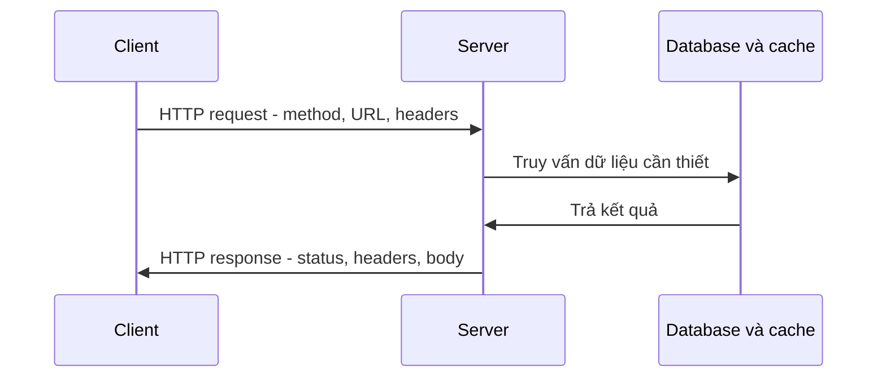

# 🌐 HTTP — Xương sống của web và nền tảng của mọi API

> Nguồn: `018-HTTP---The-Backbone-of-the-Web.txt` · [Udemy](https://ua.udemy.com/course/mastering-system-design-from-basics-to-cracking-interviews/learn/lecture/49415511)

**HTTP** là xương sống của web — giao thức cho phép trình duyệt, ứng dụng và server khắp thế giới giao tiếp, trao đổi thông tin một cách đáng tin cậy. Trong bài này, mình và các bạn sẽ đi từ định nghĩa, cách hoạt động, cho tới những chủ đề phỏng vấn kinh điển: **stateless**, HTTP methods, status codes và HTTPS. Đây là nền móng mà gần như mọi thứ phía sau trong khóa học đều dựa lên.

---

### 🌐 HTTP là gì?

HTTP là một trong những công nghệ ta dùng mỗi ngày nhưng hiếm khi để ý: mỗi lần mở website, gọi API, tải ảnh hay submit form, HTTP đang điều phối cuộc trò chuyện giữa client và server. Hãy nghĩ về HTTP như **một ngôn ngữ chung** mà hai bên đồng ý sử dụng: trình duyệt biết cách hỏi xin tài nguyên, server biết cách trả lời đúng dữ liệu — không có giao thức chung này, web đơn giản là không vận hành được.

* **Stateless (phi trạng thái)** — mỗi request đến độc lập, **không có bộ nhớ tích hợp** về những gì đã xảy ra trước đó; giao thức nhờ vậy **đơn giản và mở rộng tốt**, nhưng ứng dụng phải thêm **cookie, session, token** khi cần duy trì trạng thái người dùng trên server.
* **Đơn giản, dạng text (text-based)** — request và response dễ quan sát, dễ gỡ lỗi và dễ tiến hóa; HTTP cũng vượt khỏi phạm vi trang web để trở thành nền tảng cho **API hiện đại, microservices và giao tiếp cloud-native**.

Với kiến trúc sư, HTTP không chỉ là một protocol — nó là **hợp đồng nền tảng** giúp hệ phân tán giao tiếp tin cậy xuyên internet.

---

### 🔄 HTTP hoạt động như thế nào?

HTTP theo mô hình **client-server** đơn giản: client khởi tạo bằng cách gửi request, server xử lý request đó rồi trả về response. Điều làm nên sức mạnh của mô hình: cùng một mẫu hình này mở rộng từ website nhỏ đến hệ phân tán phục vụ **hàng triệu người dùng**.

Mỗi **HTTP request** gồm vài phần quan trọng: **method** cho server biết client muốn làm gì; **URL** xác định tài nguyên được yêu cầu; **headers** mang ngữ cảnh bổ sung như xác thực, định dạng nội dung, thông tin trình duyệt hay chỉ dẫn caching; và trong một số trường hợp là **body** chứa dữ liệu gửi lên. Server đánh giá request rồi tạo response gồm: **status code** báo thao tác thành công, thất bại hay cần thêm hành động; **response headers** hướng dẫn về nội dung trả về, hành vi caching, chính sách bảo mật; và **response body** chứa dữ liệu thực tế — HTML, JSON, ảnh hay tài nguyên khác.

*Hãy coi request và response như những hợp đồng giữa các hệ thống: request nói rõ ý định, response nói rõ kết quả. Khi bạn gõ URL vào trình duyệt và nhấn enter, ở hậu trường:*

1. Client gửi HTTP request — trình duyệt đang nói "tôi cần tài nguyên này", kèm chi tiết về cách nó muốn nhận kết quả.
2. Server tiếp nhận: kiểm tra request, xác thực quyền nếu cần, chạy business logic, và thường xuyên làm việc với **database, cache và các service khác**. Một request trong hệ thống hiện đại có thể đi qua **nhiều tầng** trước khi có kết quả.
3. Server đóng gói kết quả thành HTTP response: status code báo kết cục, headers mang chỉ dẫn và metadata, body chứa nội dung thực tế.
4. Trình duyệt diễn giải response và render cho người dùng.

Một điều nhiều kỹ sư bỏ qua: render một trang web thường **kích hoạt thêm nhiều HTTP request** cho CSS, JavaScript bundle, ảnh, font và tài nguyên khác — một lần load trang có thể tạo ra **hàng chục, thậm chí hàng trăm request**. Chu trình request-response này là **nhịp tim của web**: mọi tối ưu hiệu năng, chiến lược caching, quyết định thiết kế API và thảo luận scalability cuối cùng đều xây trên dòng chảy nền tảng này.

---

### 🧠 Tính stateless — sức mạnh và bài toán đi kèm

Một lý do HTTP mở rộng thành công khắp internet là nó **stateless**: server không cần nhớ bất cứ điều gì về tương tác trước; mỗi request là cuộc trò chuyện hoàn toàn mới và chứa đủ thông tin để xử lý. Từ góc nhìn kiến trúc, đây là lợi thế lớn: hệ stateless **dễ mở rộng** vì bất kỳ server nào cũng xử lý được bất kỳ request nào, không cần định tuyến người dùng về đúng máy cũ, và có thể thêm/bớt server mà không ảnh hưởng luồng traffic đang chạy. Nhưng sự đơn giản này tạo thách thức: hầu hết ứng dụng thực tế cần **tính liên tục** — người dùng đăng nhập, thêm sản phẩm vào giỏ hàng rồi đi qua luồng checkout, và ứng dụng phải nhớ người đó là ai qua nhiều request. Các cơ chế được thêm vào để bắc cầu:

1. **Cookie** — cho phép trình duyệt lưu những mảnh thông tin nhỏ.
2. **Session** — giữ trạng thái người dùng trên server, client chỉ mang theo **session identifier**.
3. **Token** như **JWT** hoặc **OAuth token** — thông tin xác thực đi kèm mỗi request, phổ biến trong ứng dụng phân tán hiện đại.

Đây là chủ đề **phỏng vấn và thảo luận kiến trúc** rất thường gặp: HTTP vẫn stateless ở tầng giao thức, còn ứng dụng xây state lên trên nó. Hiểu rõ ranh giới này ảnh hưởng tới thiết kế xác thực, scalability, chiến lược load balancing và toàn bộ kiến trúc hệ thống.

---

### 🛠️ HTTP methods — giao tiếp bằng ý định

HTTP methods không chỉ là câu lệnh kỹ thuật; chúng **truyền đạt ý định**, cho server biết client đang cố hoàn thành việc gì và giúp tạo ra những API dễ đoán.

| Method | Dùng khi | Lưu ý kiến trúc |
|---|---|---|
| **GET** | Client chỉ muốn đọc thông tin | Không sửa dữ liệu nên có thể cache, retry, tối ưu bởi browser, CDN, proxy — lý do ứng dụng read-heavy mở rộng hiệu quả |
| **POST** | Tạo tài nguyên mới hoặc kích hoạt thao tác đổi trạng thái server | Lặp lại cùng request có thể tạo kết quả trùng — thường cần **idempotency key** khi reliability quan trọng |
| **PUT** | Cập nhật — **thay thế toàn bộ** tài nguyên | Ảnh hưởng độ rõ ràng của API, kích thước payload và hợp đồng client-server |
| **PATCH** | Cập nhật — chỉ sửa **một số trường cụ thể** | Lựa chọn giữa PUT và PATCH cần cân nhắc theo ngữ cảnh |
| **DELETE** | Xóa tài nguyên | Được thiết kế **idempotent (bất biến khi lặp)** — gọi nhiều lần vẫn đưa hệ thống về cùng trạng thái cuối |

Một khái niệm mà kỹ sư giàu kinh nghiệm rất để tâm là **idempotency**: trong hệ phân tán, request có thể bị retry do lỗi mạng, timeout hoặc dịch vụ gián đoạn. Biết **method nào retry an toàn** là điều thiết yếu để xây API tin cậy và tránh tác dụng phụ ngoài ý muốn — *một API thiết kế tốt không chỉ phơi ra endpoint, mà còn dùng HTTP method đúng cách để hành vi hệ thống trở nên trực quan, dễ đoán và mở rộng tốt.*

---

### 📮 Status codes và HTTPS

**Status code** là một trong những cơ chế giao tiếp đơn giản nhưng mạnh mẽ nhất trong hệ phân tán: body có thể chứa chi tiết, nhưng chỉ cần nhìn status code là client biết ngay request được xử lý thế nào và bước tiếp theo nên là gì. Hãy coi chúng như **hợp đồng** giữa client và server:

* **2xx** — thao tác đã thành công.
* **3xx** — client cần làm thêm một bước, ví dụ đi theo địa chỉ mới hoặc dùng nội dung đã cache.
* **4xx** — client cần sửa điều gì đó trong request.
* **5xx** — vấn đề nằm ở phía server.

Phân biệt **400 và 500** là điều kỹ sư cần nắm chắc: nhiều **400** thường đến từ hành vi client, cách dùng API hoặc validation; còn **500** gia tăng thường là vấn đề vận hành — bug ứng dụng, lỗi hạ tầng, dịch vụ phụ thuộc gặp sự cố hay vấn đề năng lực hệ thống.

Status codes còn ảnh hưởng lên hành vi hệ thống ngoài việc báo lỗi — browser, CDN, API gateway, công cụ monitoring và cả **load balancer (bộ cân bằng tải)** đều ra quyết định dựa trên chúng: **304** giúp tiết kiệm băng thông nhờ caching; **301** cải thiện SEO và điều hướng traffic; **503** báo hiệu server tạm quá tải để cơ chế tự động phục hồi phản ứng phù hợp. Trong production, chọn đúng status code không chỉ để tuân chuẩn: nó **tăng observability (khả năng quan sát)**, đơn giản hóa gỡ lỗi và làm API dễ đoán hơn cho cả lập trình viên lẫn hệ thống tự động.

Vậy còn **HTTPS**? Mọi điều đã nói về HTTP vẫn đúng với HTTPS — khác biệt là HTTPS thêm **lớp bảo mật quan trọng**: dữ liệu đi qua mạng có thể băng qua nhiều hệ trung gian, nếu không mã hóa thì mật khẩu, thông tin thanh toán, token xác thực và dữ liệu cá nhân có thể bị lộ. HTTPS giải quyết bằng **mã hóa TLS (Transport Layer Security)** và mang lại ba đảm bảo:

1. **Confidentiality (tính bảo mật)** — chỉ các bên dự định mới đọc được dữ liệu.
2. **Integrity (tính toàn vẹn)** — chống sửa đổi dữ liệu trên đường truyền.
3. **Authentication (xác thực)** — xác nhận người dùng đang giao tiếp với website/API hợp lệ, không phải kẻ mạo danh.

Ngày nay HTTPS không còn dành riêng cho ngân hàng hay thương mại điện tử: ứng dụng web, API, mobile backend và microservices đều dựa vào giao tiếp mã hóa theo mặc định — nhiều tính năng trình duyệt và cơ chế xác thực **yêu cầu HTTPS** mới hoạt động. *Tư duy của kiến trúc sư rất đơn giản: HTTP giúp hiểu cách web vận hành, nhưng trong production, HTTPS nên là mặc định — bảo mật không còn là phần nâng cấp tùy chọn mà là yêu cầu nền tảng của thiết kế hệ thống hiện đại.*

---

### 🎯 Tự kiểm tra nhanh

**Câu 1:** HTTP stateless nghĩa là gì và vì sao nó giúp hệ thống mở rộng?

<b>Xem đáp án</b>

**Đáp án:** Mỗi request đến độc lập, không có bộ nhớ tích hợp về tương tác trước; vì vậy bất kỳ server nào cũng xử lý được bất kỳ request nào.

Giải thích: Không cần định tuyến người dùng về đúng máy cũ; thêm/bớt server không ảnh hưởng traffic.

Tham chiếu: Mục Tính stateless.

**Câu 2:** Cookie, session và token khác nhau ở điểm nào?

<b>Xem đáp án</b>

**Đáp án:** Cookie lưu mẩu thông tin nhỏ ở trình duyệt; session giữ trạng thái người dùng trên server còn client chỉ mang session identifier; token như JWT/OAuth mang thông tin xác thực theo mỗi request.

Giải thích: Cả ba đều là cơ chế bắc cầu cho ứng dụng cần tính liên tục trên nền HTTP stateless.

Tham chiếu: Mục Tính stateless.

**Câu 3:** PUT và PATCH khác nhau thế nào?

<b>Xem đáp án</b>

**Đáp án:** PUT thay thế toàn bộ tài nguyên, PATCH chỉ sửa một số trường cụ thể.

Giải thích: Lựa chọn giữa chúng ảnh hưởng độ rõ ràng của API, kích thước payload và hợp đồng client-server.

Tham chiếu: Mục HTTP methods.

**Câu 4:** Vì sao phân biệt 400 và 500 lại quan trọng?

<b>Xem đáp án</b>

**Đáp án:** 400 thường đến từ hành vi client, cách dùng API hoặc validation; 500 thường là vấn đề vận hành phía server.

Giải thích: Phân biệt đúng giúp định hướng xử lý và cải thiện observability, debugging.

Tham chiếu: Mục Status codes và HTTPS.

**Câu 5:** HTTPS mang lại ba đảm bảo nào?

<b>Xem đáp án</b>

**Đáp án:** Confidentiality, integrity và authentication.

Giải thích: TLS mã hóa kết nối, chống sửa đổi dữ liệu trên đường truyền và xác thực website/API hợp lệ.

Tham chiếu: Mục Status codes và HTTPS.

---

Vậy là các bạn đã nắm được HTTP từ gốc: mô hình client-server, chu trình request-response, tính stateless cùng các cơ chế state, ý nghĩa của methods và status codes, và vì sao HTTPS là mặc định của production. *Nhớ nhé: HTTP là hợp đồng nền tảng giữa các hệ thống — hiểu nó là hiểu cách web vận hành.* Ở bài tiếp theo, chúng ta sẽ xây tiếp trên nền tảng này với **REST và RESTfulness** — bộ nguyên tắc thiết kế API scalable, dễ đoán và dễ bảo trì. Hẹn gặp lại các bạn! 🚀
