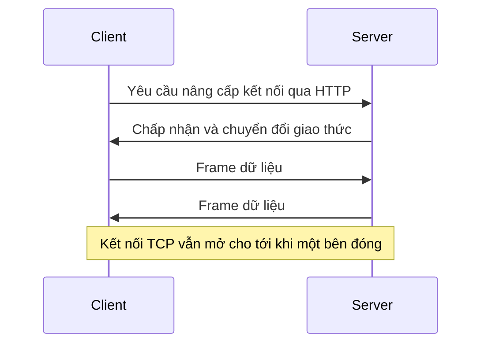
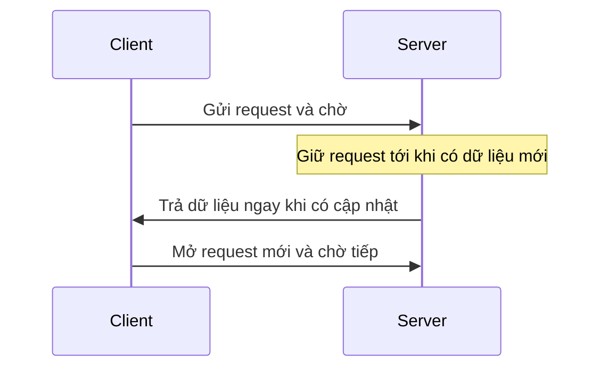

# ⚡ Giao tiếp thời gian thực — WebSocket và long polling

> Nguồn: `020-Real-Time-Communication-Protocols.txt` · [Udemy](https://ua.udemy.com/course/mastering-system-design-from-basics-to-cracking-interviews/learn/lecture/49426853)

Trong bài này, mình và các bạn sẽ khám phá các giao thức vận hành **real-time communication (giao tiếp thời gian thực)** — thứ cho phép ứng dụng cập nhật tức thì, tương tác trực tiếp và mang lại trải nghiệm độ trễ thấp ở quy mô lớn. Đây là nhóm bài toán mà `HTTP` truyền thống bắt đầu chật vật, và cũng là chủ đề phỏng vấn rất được ưa chuộng vì bộc lộ rõ tư duy trade-off.

---

### 🌐 Vì sao cần giao tiếp thời gian thực?

Real-time communication trở nên quan trọng ngay khi người dùng kỳ vọng hệ thống **phản ứng tức thì** thay vì chờ đến request kế tiếp. HTTP truyền thống được thiết kế quanh chu trình request-response — rất tốt để lấy dữ liệu, nhưng **chật vật khi thông tin thay đổi liên tục**: ứng dụng nhắn tin, nền tảng giao dịch chứng khoán hay game nhiều người chơi đều không thể bắt người dùng refresh trang. Thách thức dịch chuyển từ "phục vụ dữ liệu theo yêu cầu" sang **"giao cập nhật ngay khi chúng xảy ra"**, và các mẫu hình giao tiếp thời gian thực ra đời để giải bài toán đó:

* **Polling (hỏi đợi)** — đơn giản nhưng sinh ra nhiều request không cần thiết.
* **Long polling** — giảm bớt overhead bằng cách giữ request mở lâu hơn.
* **Server-Sent Events (SSE – sự kiện do server gửi)** — cho phép server **đẩy cập nhật liên tục theo một chiều**.
* **WebSocket** — kết nối **hai chiều bền vững**, giao tiếp độ trễ thấp ở cả hai hướng.

*Với kiến trúc sư, câu hỏi không phải công nghệ nào tốt nhất, mà là mô hình giao tiếp nào khớp nhất với yêu cầu latency, nhu cầu scalability và độ phức tạp vận hành của ứng dụng.*

---

### 🔌 WebSocket — kết nối hai chiều bền vững

WebSocket ra đời vì việc liên tục mở HTTP request mới trở nên kém hiệu quả khi dữ liệu cần di chuyển trong thời gian thực. Khi ứng dụng cần thông báo tức thì, cộng tác trực tiếp, gaming hay luồng dữ liệu thị trường, **chính overhead kết nối trở thành nút thắt cổ chai**.

Điểm tinh tế của WebSocket: nó **không thay thế HTTP ngay từ đầu — nó bắt đầu bằng HTTP**. Client gửi một HTTP request chuẩn xin server **nâng cấp (upgrade) kết nối**; nếu server đồng ý, nó chuyển đổi giao thức, và từ đó hai bên **ngừng suy nghĩ theo request-response**. Hai bên chia sẻ **một kết nối TCP dài hạn (long-lived)** duy nhất, kết nối giữ nguyên trạng thái mở để **bất kỳ bên nào gửi dữ liệu ngay khi có dữ liệu**, server không còn chờ request trước khi đẩy cập nhật, và dữ liệu di chuyển qua các **frame nhẹ** — hiệu quả hơn nhiều so với trao đổi HTTP header liên tục.

Điều này **giảm mạnh latency và network overhead**, khiến WebSocket lý tưởng cho chat, live dashboard, công cụ chỉnh sửa cộng tác, game online và hệ thống giao dịch tài chính. **Lợi thế lớn nhất là latency**: vì kết nối đã tồn tại, dữ liệu di chuyển tức thì, không cần tạo kết nối mới, gửi HTTP header rồi chờ response mỗi lần có cập nhật. Kết nối bền vững cũng **giảm network overhead**: trong hệ thống dựa trên polling, hàng nghìn hay hàng triệu client liên tục hỏi "có gì mới chưa?" và phần lớn request trả về **không có gì hữu ích** — WebSocket loại bỏ sự lãng phí đó bằng cách **chỉ gửi dữ liệu khi sự kiện thực sự xảy ra**.

Các use case tiêu biểu: **chat** — tin nhắn hiện ra tức thì không cần refresh; **giao dịch chứng khoán** — biến động giá được đẩy tới trader ngay khi thị trường nhúc nhích; **game nhiều người chơi** — tương tác và trạng thái game phải đồng bộ trong **vài mili giây**; và **nền tảng cộng tác** như Google Docs hay Figma — mọi thao tác gõ phím, di chuyển con trỏ hay thay đổi thiết kế được lan truyền real-time tới mọi người đang kết nối.

*Mẫu hình cần nhận ra: khi giá trị nghiệp vụ phụ thuộc vào cập nhật tức thì và tương tác liên tục, WebSocket thường là mô hình giao tiếp hiệu quả nhất — mục tiêu không chỉ là giao tiếp nhanh hơn, mà là tạo ra hệ thống "sống" thực sự với người dùng. Trade-off là kết nối bền vững tiêu tốn tài nguyên server: kiến trúc sư phải thiết kế cho **connection management, scalability, heartbeat, reconnection** và khả năng chịu **hàng triệu kết nối đồng thời**. Key idea rất đơn giản — HTTP tối ưu cho việc truy xuất thông tin, còn WebSocket tối ưu cho cuộc trò chuyện liên tục.*

---

### ⏳ Long polling — mô phỏng thời gian thực trên HTTP

Long polling xuất hiện như một **giải pháp vòng (workaround) thực dụng** cho giới hạn của HTTP truyền thống: ứng dụng cần cập nhật real-time hoặc gần real-time, nhưng browser và server thời đó **chưa phổ biến những công nghệ như WebSocket**. Khác với **polling thường** — nơi client hỏi lại mỗi vài giây — long polling thay đổi **thời điểm trả lời**:

1. Client gửi request, nhưng server **cố ý trì hoãn response** cho tới khi có điều gì đó đáng giá xảy ra.
2. Khi dữ liệu mới xuất hiện, server **trả về ngay lập tức**.
3. Client mở một request mới và tiếp tục chờ.

Cách này **giảm đáng kể traffic không cần thiết** vì server chỉ phản hồi khi có thứ đáng gửi; người dùng cũng thấy **latency thấp hơn polling truyền thống** vì cập nhật đến ngay khi sẵn sàng thay vì chờ đến "nhịp hỏi" kế tiếp. Tuy nhiên, long polling **về bản chất vẫn là HTTP**: mỗi cập nhật rốt cuộc vẫn cần một chu kỳ request-response mới, nghĩa là việc **thiết lập và đóng kết nối vẫn diễn ra lặp đi lặp lại**; khi số người dùng tăng lên, việc duy trì **hàng nghìn request đang chờ** có thể tiêu tốn tài nguyên server đáng kể.

*Đó là lý do long polling thường được xem là **cây cầu** giữa HTTP polling truyền thống và công nghệ real-time thực sự như WebSocket: trải nghiệm tốt hơn hẳn polling chuẩn, mà vẫn tương thích với môi trường nơi kết nối WebSocket bền vững không khả dụng. Bài học kiến trúc: long polling cải thiện hành vi real-time mà không đổi mô hình HTTP — nhưng cái giá là scalability trade-off ngày càng lộ rõ ở quy mô lớn.*

---

### ⚖️ Chọn WebSocket hay long polling?

Chọn giữa WebSocket và long polling thực chất là chọn theo **mẫu hình giao tiếp**. Sai lầm nhiều kỹ sư mắc phải là coi chúng như hai công nghệ đối đầu — thực tế, chúng là giải pháp tối ưu cho những yêu cầu khác nhau.

* **Chọn WebSocket khi** ứng dụng cần **giao tiếp hai chiều liên tục với độ trễ cực thấp**: chat, game nhiều người chơi, nền tảng giao dịch, ứng dụng cộng tác — những nơi sinh ra dòng sự kiện không ngừng; hiệu quả của kết nối bền vững **lấn át độ phức tạp quản lý** mà nó mang lại.
* **Chọn long polling khi** cập nhật **tương đối thưa**: thông báo, cảnh báo hay status update không thường xuyên — chi phí duy trì hàng nghìn kết nối bền vững **không đáng bỏ ra**.
* **Yếu tố hạ tầng** cũng quan trọng: một số mạng doanh nghiệp, môi trường legacy hoặc thiết bị hạn chế **có thể không hỗ trợ WebSocket ổn định**; vì long polling chạy hoàn toàn trên HTTP chuẩn, nó **dễ triển khai hơn** ở nơi tính tương thích quan trọng hơn hiệu năng real-time tuyệt đối.

Trong hệ thống thật, bạn thấy rõ sự phân hóa này: **Slack** và các ứng dụng chat dựa nhiều vào WebSocket vì hội thoại phải "tức thì"; hệ thống **giao dịch tài chính** dùng WebSocket để stream dữ liệu thị trường với latency tối thiểu; ngược lại, workload hướng thông báo, cảnh báo mạng xã hội và **nhiều kịch bản IoT** thường dùng long polling vì cập nhật đến **gián đoạn** thay vì liên tục.

| Tiêu chí | WebSocket | Long polling |
|---|---|---|
| Mô hình | Kết nối hai chiều bền vững | HTTP request-response kéo dài |
| Độ trễ | Rất thấp, đẩy ngay khi sự kiện xảy ra | Thấp hơn polling thường, vẫn qua chu kỳ request mới |
| Chi phí chính | Quản lý kết nối, heartbeat, reconnection | Thiết lập/đóng kết nối lặp lại, nhiều request chờ |
| Phù hợp | Cập nhật liên tục, tương tác hai chiều | Cập nhật thưa, cần tương thích HTTP tốt |

*Quy tắc thực dụng: nếu người dùng đang tương tác real-time liên tục → chọn WebSocket. Nếu cập nhật thỉnh thoảng và khả năng tương thích HTTP quan trọng hơn độ trễ siêu thấp → long polling thường đơn giản và thực tế hơn.*

---

### 💼 Góc phỏng vấn

Câu hỏi phỏng vấn về real-time communication kiểm tra **trade-off kiến trúc, scalability và lựa chọn giao thức trong hệ thống thực tế**, chứ không chỉ định nghĩa — bạn sẽ trả lời được bằng chính các khái niệm trong bài. *Khóa học có kèm một PDF với giải thích chi tiết và câu trả lời mẫu — các bạn xem qua phần tài nguyên khi cần ôn nhanh nhé.*

---

### 🎯 Tự kiểm tra nhanh

**Câu 1:** Vì sao WebSocket lại bắt đầu bằng một HTTP request?

<b>Xem đáp án</b>

**Đáp án:** Vì client gửi HTTP request xin server nâng cấp kết nối; nếu server đồng ý, hai bên chuyển đổi giao thức và chia sẻ một kết nối TCP dài hạn.

Giải thích: WebSocket không thay thế HTTP ngay từ đầu, nó khởi đầu bằng HTTP rồi chuyển sang kết nối bền vững.

Tham chiếu: Mục WebSocket.

**Câu 2:** Trade-off chính của WebSocket là gì?

<b>Xem đáp án</b>

**Đáp án:** Kết nối bền vững tiêu tốn tài nguyên server, đòi hỏi thiết kế connection management, scalability, heartbeat, reconnection, xử lý hàng triệu kết nối đồng thời.

Giải thích: Đổi lại, bạn nhận được latency rất thấp và giảm network overhead.

Tham chiếu: Mục WebSocket.

**Câu 3:** Long polling khác polling thường ở điểm nào?

<b>Xem đáp án</b>

**Đáp án:** Polling thường hỏi lại mỗi vài giây; long polling giữ request mở và server chỉ trả lời khi có dữ liệu đáng gửi, sau đó client mở request mới.

Giải thích: Nhờ đó giảm traffic không cần thiết và cập nhật đến sớm hơn nhịp hỏi.

Tham chiếu: Mục Long polling.

**Câu 4:** Khi nào nên chọn long polling thay vì WebSocket?

<b>Xem đáp án</b>

**Đáp án:** Khi cập nhật tương đối thưa, hoặc môi trường hạ tầng không hỗ trợ WebSocket ổn định và cần tương thích HTTP.

Giải thích: Ví dụ: thông báo, cảnh báo, status update, nhiều kịch bản IoT.

Tham chiếu: Mục Chọn WebSocket hay long polling.

**Câu 5:** Vì sao nói "không có lựa chọn tốt nhất phổ quát" trong giao tiếp thời gian thực?

<b>Xem đáp án</b>

**Đáp án:** Vì lựa chọn đúng phụ thuộc vào yêu cầu latency, tần suất cập nhật, mục tiêu scalability, độ phức tạp vận hành và năng lực hạ tầng.

Giải thích: Thiết kế hệ thống tốt hiếm khi là chọn công nghệ tiên tiến nhất, mà là chọn công nghệ phù hợp nhất.

Tham chiếu: Mục Chọn WebSocket hay long polling.

---

Vậy là các bạn đã nắm được hai cách tiếp cận chủ đạo của giao tiếp thời gian thực: **WebSocket — kết nối hai chiều bền vững, latency tối thiểu**, và **long polling — mô phỏng real-time ngay trên HTTP**, mỗi bên thắng ở một lớp bài toán. *Bài học lớn nhất: không có lựa chọn tốt nhất phổ quát — chỉ có lựa chọn phù hợp nhất.* Ở bài tiếp theo, chúng ta sẽ chuyển sang **các mẫu API hiện đại** với `gRPC` và `GraphQL` — hai công nghệ đang định hình lại cách service và client giao tiếp trong hệ thống quy mô lớn. Hẹn gặp lại các bạn! 🚀
