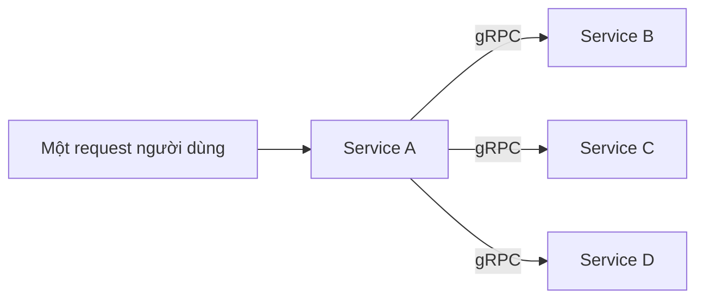
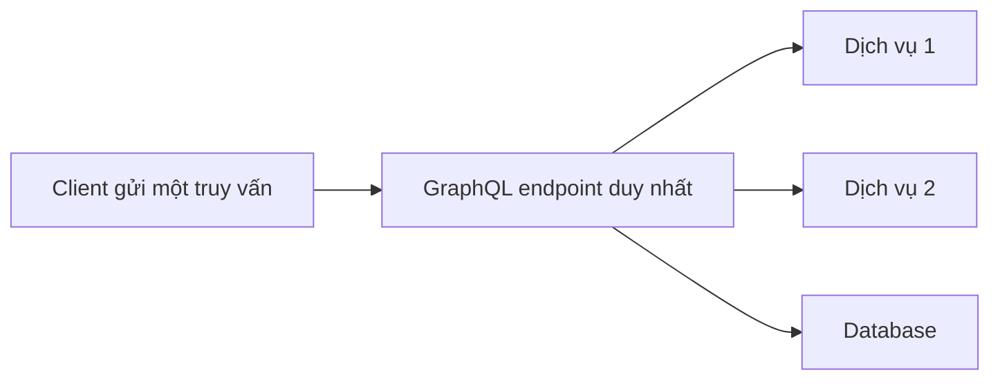

# 🚀 Vượt xa REST — gRPC và GraphQL trong hệ phân tán hiện đại

> Nguồn: `021-Modern-API-Protocols---Beyond-REST.txt` · [Udemy](https://ua.udemy.com/course/mastering-system-design-from-basics-to-cracking-interviews/learn/lecture/49426857)

Khi hệ thống tiến hóa vượt khỏi khuôn khổ REST truyền thống, **gRPC** và **GraphQL** xuất hiện để giải những bài toán hiện đại về hiệu năng, giao tiếp thời gian thực và truy cập dữ liệu linh hoạt. Trong bài này, mình và các bạn sẽ tìm hiểu hai công nghệ này giải quyết vấn đề gì, hoạt động ra sao, và — quan trọng nhất — khi nào nên chọn cái nào. Đây là bài rất "chất trade-off": cả hai đều không thay thế REST, chúng tồn tại vì các yêu cầu hệ thống khác nhau cần những mô hình giao tiếp khác nhau.

---

### 🧭 Vì sao cần nhiều hơn REST?

REST đã giải quyết rất nhiều bài toán, nhưng khi hệ thống trở nên **tương tác và thâm dụng dữ liệu hơn**, những giới hạn của nó lộ rõ:

* **Hiệu quả dữ liệu** — trong REST, server quyết định hình dạng của response. Điều này dẫn tới **overfetching (nhận nhiều dữ liệu hơn cần)** hoặc **underfetching (thiếu dữ liệu, phải gọi thêm request)** để hoàn tất một màn hình. Cả hai đều làm tăng network overhead và giảm hiệu quả.
* **Bài toán tổng hợp dữ liệu** — ứng dụng hiện đại hiển thị dữ liệu gộp từ nhiều nguồn. Một mobile app có thể cần thông tin người dùng, thông báo, tùy chọn và lịch sử hoạt động. Với REST, đó là **nhiều API call tuần tự**, cộng thêm latency và làm trải nghiệm chậm hơn.
* **Không được thiết kế cho real-time** — khi dữ liệu thay đổi thường xuyên, ứng dụng thường phải dựa vào polling, liên tục hỏi server xem có gì thay đổi; ở quy mô lớn, cách này tạo traffic thừa và lãng phí tài nguyên.

*Những thách thức này không làm REST trở nên lỗi thời — nó vẫn là lựa chọn xuất sắc cho nhiều hệ thống. Chúng chỉ tạo ra nhu cầu cho những cách tiếp cận mới: GraphQL tập trung vào truy xuất dữ liệu linh hoạt và chính xác, còn gRPC tập trung vào giao tiếp hiệu năng cao giữa các service.* Với kiến trúc sư, chọn đúng phong cách API **ít liên quan đến xu hướng, mà là ghép giao thức với bài toán cần giải**.

---

### ⚡ gRPC — tốc độ cho giao tiếp giữa các service

Cả gRPC và GraphQL đều ra đời vì hệ thống hiện đại bắt đầu chạm trần REST, nhưng chúng giải hai bài toán rất khác nhau. **gRPC tập trung vào giao tiếp service-to-service (giữa các dịch vụ)**. Thay vì trao đổi payload JSON lớn, gRPC dùng **thông điệp nhị phân (binary) gọn nhẹ** và **HTTP/2**, giúp giảm mạnh network overhead. Trong kiến trúc microservices lớn — nơi các service giao tiếp **hàng nghìn lần mỗi giây** — những khoản tiết kiệm đó chuyển trực tiếp thành **latency thấp hơn và sử dụng tài nguyên tốt hơn**. gRPC cũng hỗ trợ **streaming native**, khiến nó mạnh với hệ thống thời gian thực và thông lượng cao.

Nền tảng hiệu năng của gRPC đến từ sự kết hợp của nhiều lựa chọn thiết kế:

1. **HTTP/2** — khác với request-response truyền thống, HTTP/2 cho phép **nhiều request và response chia sẻ cùng một kết nối đồng thời**. Điều này loại bỏ phần lớn overhead kết nối và giữ giao tiếp nhanh kể cả khi các service tương tác cùng lúc.
2. **Streaming và serialization** — thay vì liên tục mở request mới, client và server duy trì **kết nối dài hạn và trao đổi dữ liệu liên tục hai chiều**, đặc biệt hiệu quả cho hệ thống real-time, event streaming và service-to-service khi cập nhật xảy ra rất thường xuyên. Còn thay vì gửi tài liệu JSON dài dòng, gRPC dùng **protocol buffers (protobuf)**: dữ liệu được mã hóa thành **định dạng nhị phân gọn**, vừa nhỏ hơn trên mạng vừa **serialize/deserialize nhanh hơn** — khi hàng nghìn hay hàng triệu thông điệp được trao đổi mỗi giây, khoản tiết kiệm này trở nên rất đáng kể.

*Sự kết hợp giữa HTTP/2 và protobuf là nguồn gốc danh tiếng low latency, high throughput của gRPC — đây không phải một tối ưu đơn lẻ, mà là cả một communication stack được thiết kế cho tốc độ và scalability trong hệ phân tán.* **Khi nào dùng gRPC?** gRPC mang lại giá trị lớn nhất khi **tốc độ giao tiếp trở thành nút thắt thay vì business logic**:

* **Microservices** là use case phổ biến nhất: một request người dùng có thể kích hoạt **hàng chục lời gọi service-to-service**; ở quy mô đó, giảm vài mili giây mỗi lời gọi tạo tác động đáng kể lên hiệu năng tổng thể. Nhiều nền tảng hiện đại dùng gRPC làm **lớp giao tiếp nội bộ**.
* **Real-time streaming** nhờ **bidirectional stream (luồng hai chiều)**: phù hợp cho live analytics, telemetry, ứng dụng cộng tác và hệ thống tài chính — nơi thông tin thay đổi liên tục.
* **IoT và tổ chức đa ngôn ngữ**: môi trường băng thông hạn chế hưởng lợi vì thông điệp nhị phân gọn giúp giảm cả latency lẫn chi phí hạ tầng; còn với tổ chức dùng nhiều ngôn ngữ, một **hợp đồng protobuf** có thể sinh code client và server cho nhiều technology stack khác nhau, đảm bảo giao tiếp nhất quán mà các team không phải tự bảo trì SDK.

*Bài học kiến trúc: gRPC tỏa sáng bên trong hệ phân tán — nơi performance, efficiency và hợp đồng service chặt chẽ là quan trọng. Với API công khai cho browser và nhà phát triển bên thứ ba, REST và GraphQL thường thực tế hơn. Đó là lý do nhiều tổ chức dùng chúng cùng nhau thay vì coi là đối thủ.*

---

### 🔍 GraphQL — quyền kiểm soát dữ liệu về phía client

Thay đổi lớn nhất của GraphQL: **client, không phải server, quyết định hình dạng của response**. Trong REST, các endpoint khác nhau phơi các tài nguyên khác nhau và client thường phải ghép dữ liệu từ nhiều request. GraphQL đi hướng ngược lại:

* Phơi ra **một endpoint duy nhất**, nơi client mô tả chính xác thông tin mình cần.
* Server trả về **đúng dữ liệu đó — không hơn, không kém**.

Nền tảng của mô hình này là **GraphQL schema**: hãy coi nó như một **bản đồ có kiểu chặt chẽ (strongly typed)** của API — định nghĩa các thực thể khả dụng, quan hệ giữa chúng và các thao tác client được phép thực hiện; schema trở thành **hợp đồng** mà cả team frontend lẫn backend cùng xây dựa trên. Khi một truy vấn (query) đến, GraphQL server **không trả về payload định sẵn**: nó **resolve từng field được yêu cầu một cách động**, thường kéo dữ liệu từ nhiều service hoặc database ở hậu trường rồi lắp thành response tùy biến cho đúng request đó.

Lợi thế kiến trúc là **sự linh hoạt**: các client khác nhau — web, mobile, desktop — lấy được đúng dữ liệu mình cần **mà không cần thêm endpoint mới**. Trade-off là **server phải gánh thêm độ phức tạp**, vì nó phải resolve và điều phối các truy vấn động một cách hiệu quả. *Đó là ý tưởng cốt lõi của GraphQL: một API dẫn dắt bởi schema, nơi client hỏi thứ mình cần và server dựng response theo yêu cầu.*

**Khi nào dùng GraphQL?** GraphQL mang lại giá trị lớn nhất khi **các client khác nhau cần những góc nhìn khác nhau trên cùng một dữ liệu**:

* Ứng dụng có web, mobile, tablet — mỗi màn hình cần một tập thông tin khác nhau. Với REST, các team thường phải tạo thêm endpoint hoặc chấp nhận overfetching; GraphQL cho phép từng client xin đúng trường nó cần, **giúp phát triển frontend hiệu quả hơn và giảm traffic thừa**.
* **Hợp nhất request và lớp tổng hợp** — nơi REST có thể cần vài API call để dựng một màn hình, GraphQL thường lấy được thông tin đó **qua một truy vấn duy nhất**, giảm latency và đơn giản hóa logic phía client (đặc biệt giá trị trên mobile — nơi chất lượng mạng khó đoán, payload nhỏ hơn và ít round-trip hơn chuyển thành load nhanh hơn, tốn ít băng thông hơn); sau một GraphQL endpoint duy nhất, server còn có thể kéo dữ liệu từ nhiều database, microservices hoặc API bên thứ ba rồi trình bày một response thống nhất — **che giấu độ phức tạp backend** khỏi các team frontend và tạo mô hình tích hợp sạch hơn.

*Bài học kiến trúc: GraphQL không chủ yếu về performance — nó về flexibility. Khi yêu cầu của client thay đổi đáng kể và dữ liệu đến từ nhiều nguồn, GraphQL có thể đơn giản hóa mạnh cách ứng dụng tiêu thụ thông tin.*

---

### ⚖️ So sánh REST, gRPC và GraphQL

Điểm mấu chốt cần nhớ: **gRPC tối ưu giao tiếp giữa các service, còn GraphQL tối ưu giao tiếp giữa client và API**. Một bên ưu tiên tốc độ và hiệu quả, bên kia ưu tiên sự linh hoạt và trải nghiệm nhà phát triển.

| Tiêu chí | REST | gRPC | GraphQL |
|---|---|---|---|
| Tối ưu cho | Đơn giản, chuẩn web, phổ quát | Tốc độ và hiệu quả service-to-service | Linh hoạt dữ liệu cho client |
| Truyền tải | JSON/XML trên HTTP | Thông điệp nhị phân protobuf trên HTTP/2 | Truy vấn theo schema qua một endpoint |
| Điểm mạnh | Hệ sinh thái rộng, dễ tích hợp, caching tốt | Latency thấp, streaming, hợp đồng chặt | Client xin đúng trường cần, tổng hợp dữ liệu |
| Thách thức | Overfetching, underfetching, không hợp real-time | Chủ yếu cho nội bộ, kém thân thiện với browser/bên thứ ba | Server phức tạp hơn khi resolve truy vấn động |
| Dùng ở đâu | API công khai | Giao tiếp nội bộ microservices | Lớp tổng hợp cho frontend |

*Không công nghệ nào thay thế hoàn toàn REST. Chúng tồn tại vì những yêu cầu hệ thống khác nhau đòi hỏi mô hình giao tiếp khác nhau — và chọn đúng phụ thuộc vào việc **nút thắt thực sự của bạn nằm ở đâu**.*

---

### 💼 Góc phỏng vấn

Trong thảo luận system design, người phỏng vấn **không kiểm tra bạn có biết tên công nghệ hay không**. Họ đánh giá liệu bạn có thể **biện luận cho lựa chọn của mình dựa trên scalability, latency, flexibility, độ phức tạp vận hành và yêu cầu nghiệp vụ** của hệ thống. *Khóa học có kèm một PDF với câu hỏi phỏng vấn và giải thích chi tiết về gRPC, GraphQL — các bạn xem qua phần tài nguyên khi cần nhé.*

---

### 🎯 Tự kiểm tra nhanh

**Câu 1:** Overfetching và underfetching là gì?

<b>Xem đáp án</b>

**Đáp án:** Overfetching là client nhận nhiều dữ liệu hơn cần; underfetching là thiếu dữ liệu nên phải gọi thêm request để hoàn tất màn hình.

Giải thích: Cả hai làm tăng network overhead — hạn chế điển hình của REST khi server quyết định hình dạng response.

Tham chiếu: Mục Vì sao cần nhiều hơn REST.

**Câu 2:** Hai nền tảng tạo nên hiệu năng của gRPC là gì?

<b>Xem đáp án</b>

**Đáp án:** HTTP/2 (chia sẻ kết nối, streaming hiệu quả) và protocol buffers — protobuf (dữ liệu nhị phân gọn, serialize/deserialize nhanh).

Giải thích: Kết hợp lại cho gRPC danh tiếng low latency, high throughput — cả một stack thiết kế cho tốc độ.

Tham chiếu: Mục gRPC.

**Câu 3:** Điểm khác biệt cốt lõi của GraphQL so với REST là gì?

<b>Xem đáp án</b>

**Đáp án:** Client — không phải server — quyết định hình dạng response; client mô tả đúng dữ liệu cần qua một endpoint duy nhất và server trả về chính xác dữ liệu đó.

Giải thích: Nền tảng là GraphQL schema — bản đồ API có kiểu chặt chẽ, đóng vai trò hợp đồng giữa frontend và backend.

Tham chiếu: Mục GraphQL.

**Câu 4:** Trade-off của GraphQL là gì?

<b>Xem đáp án</b>

**Đáp án:** Server phải gánh thêm độ phức tạp vì phải resolve và điều phối các truy vấn động một cách hiệu quả.

Giải thích: Đổi lại, client có sự linh hoạt tối đa và không cần thêm endpoint mới.

Tham chiếu: Mục GraphQL.

**Câu 5:** Khi nào nên dùng gRPC thay vì REST/GraphQL?

<b>Xem đáp án</b>

**Đáp án:** Khi giao tiếp service-to-service là nút thắt: microservices gọi nhau hàng nghìn lần mỗi giây, streaming real-time, IoT băng thông hạn chế, tổ chức đa ngôn ngữ cần hợp đồng chung.

Giải thích: Với API công khai cho browser và bên thứ ba, REST và GraphQL thường thực tế hơn — nhiều hệ thống dùng cả ba cùng lúc.

Tham chiếu: Mục gRPC.

---

Vậy là các bạn đã có bức tranh đầy đủ về hai mẫu API hiện đại: **gRPC tối ưu tốc độ và hiệu quả cho giao tiếp nội bộ**, còn **GraphQL tối ưu sự linh hoạt dữ liệu cho client**. *Bài học lớn nhất: kiến trúc hiếm khi là tìm công nghệ tốt nhất — mà là hiểu trade-off. Nhiều hệ thống thực tế dùng REST cho API công khai, gRPC cho giao tiếp nội bộ và GraphQL làm lớp tổng hợp, tất cả trong cùng một kiến trúc.* Ở bài tiếp theo — bài cuối của section — chúng ta sẽ tổng kết và kết nối mọi giao thức vào các quyết định kiến trúc thực tế. Hẹn gặp lại các bạn! 🚀
