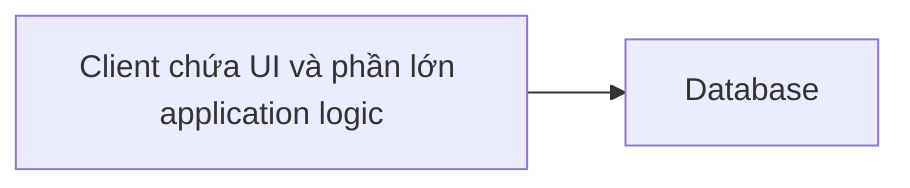
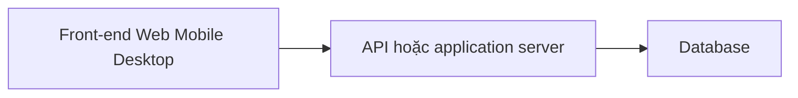

# 🏢 Kiến trúc Multi-Tier: từ two-tier đến N-tier và những đánh đổi để mở rộng

> Nguồn: `025-Multi-Tier-Architecture.txt` · [Udemy](https://ua.udemy.com/course/mastering-system-design-from-basics-to-cracking-interviews/learn/lecture/49456791)

Trong bài này, mình và các bạn sẽ khám phá **multi-tier architecture (kiến trúc đa tầng)** — pattern nền móng giúp tách biệt các mối quan tâm để xây những ứng dụng dễ mở rộng, dễ bảo trì, an toàn hơn và sẵn sàng lớn lên cùng độ phức tạp. Đây là pattern mà các bạn sẽ gặp lại rất nhiều trong phỏng vấn, nên hãy nắm cho chắc.

---

### 🏢 Multi-tier architecture — tách lớp để quản lý độ phức tạp

Khi ứng dụng lớn lên, việc gộp giao diện người dùng, business rule và truy cập database vào một codebase duy nhất nhanh chóng trở nên rất khó bảo trì, khó scale và khó bảo mật — một thay đổi ở chỗ này có thể ảnh hưởng tới mọi thứ khác.

Multi-tier architecture giải quyết vấn đề đó bằng cách **chia ứng dụng thành các tầng riêng biệt**, mỗi tầng phụ trách một mối quan tâm cụ thể:

* Một tầng xử lý **trải nghiệm người dùng**.
* Một tầng chứa **business logic**.
* Một tầng quản lý **lưu trữ và truy xuất dữ liệu**.

Sự phân tách này tạo ra **ranh giới rõ ràng** bên trong hệ thống, giúp ứng dụng dễ phát triển, dễ test và dễ tiến hóa theo thời gian. Giá trị thật sự nằm ở **sự độc lập**: có thể sửa business rule mà không phải thiết kế lại giao diện, database tiến hóa mà không ảnh hưởng workflow, và từng tầng có thể scale theo nhu cầu. Kiến trúc này cũng cải thiện **bảo mật** nhờ kiểm soát dòng dữ liệu giữa các tầng, thay vì phơi bày trực tiếp các hệ thống quan trọng.

Đó là lý do multi-tier architecture vẫn là một trong những pattern được dùng rộng rãi nhất trong ứng dụng doanh nghiệp, nền tảng web và hệ thống cloud hiện đại.

---

### 🧱 Two-tier — đơn giản nhưng chạm trần sớm

**Two-tier architecture** là dạng đơn giản nhất của kiến trúc phân tầng, chỉ gồm **hai lớp: client và database**.

* Client không chỉ hiển thị giao diện mà thường **chứa phần lớn application logic**.
* Database chịu trách nhiệm **lưu trữ và truy xuất dữ liệu**.
* Đặc điểm định hình: **client giao tiếp trực tiếp với database**, không có lớp business logic riêng ở giữa để validate request, thực thi business rule hay trừu tượng hóa việc truy cập dữ liệu.

Với hệ thống nhỏ, giao tiếp trực tiếp giúp thiết kế **đơn giản và hiệu quả**, ít thành phần phải xây và bảo trì. Nhưng trade-off đến nhanh:

* Khi nhiều người dùng kết nối, **database dễ trở thành bottleneck** vì mọi client đều đập thẳng vào nó.
* Việc phơi bày quyền truy cập database cho client làm **tăng attack surface (bề mặt tấn công)** và khiến việc kiểm soát tập trung khó hơn.

Vì vậy, two-tier phù hợp nhất với **môi trường quy mô nhỏ, internal tool (công cụ nội bộ), hoặc ứng dụng desktop** — nơi số người dùng hữu hạn và scalability không phải yêu cầu lớn. Ví dụ kinh điển: một ứng dụng desktop truy vấn trực tiếp vào database SQL.

---

### 🏗️ Three-tier — lớp business logic ở giữa

Khi hệ thống vượt qua vài người dùng, giới hạn của two-tier lộ rõ. Chúng ta cần cách **tập trung hóa business rule, cải thiện bảo mật và scale từng phần độc lập** — đó chính là lúc **three-tier architecture** xuất hiện.

Ý tưởng cốt lõi: thêm một **lớp business logic chuyên trách** nằm giữa giao diện người dùng và database. Thay vì front-end nói chuyện trực tiếp với database, nó gửi request tới một **API hoặc application server**. Lớp giữa này sẽ:

1. **Validate request**.
2. **Áp dụng business rule**.
3. **Thực thi security policy**.
4. **Điều phối tương tác với database**.

Sự phân tách tạo ra ranh giới kiến trúc rõ ràng: front-end lo trải nghiệm người dùng, lớp business lo hành vi ứng dụng, database lo lưu trữ dữ liệu. Vì mỗi tầng có trách nhiệm được định nghĩa tốt, đội ngũ có thể **sửa hoặc scale một tầng mà ít ảnh hưởng các tầng khác**.

**Lợi ích lớn nhất: scalability, maintainability và security.** Business logic được tập trung một chỗ; quyền truy cập database được kiểm soát; nhiều front-end như web, mobile hay desktop đều **dùng lại cùng một bộ back-end service**. Trade-off là **tăng latency một chút** vì request phải đi qua thêm một tầng — nhưng với hầu hết ứng dụng thực tế, lợi ích kiến trúc lớn hơn nhiều so với cái giá đó. Đây là nền tảng của các ứng dụng web truyền thống và vẫn là một trong những pattern phổ biến nhất trong phần mềm doanh nghiệp.

---

### 🚀 Từ N-tier đến hiệu năng và scaling

Khi hệ thống tiếp tục lớn về quy mô và độ phức tạp, ngay cả three-tier cũng bắt đầu chật chội. Ứng dụng lớn thường cần thêm **caching, quản lý API, cô lập service, messaging, kiểm soát bảo mật và observability (khả năng quan sát)**. Đó là lúc **N-tier architecture** trở nên hữu ích.

N-tier là bước tiến hóa của cách tiếp cận phân tầng: thay vì dừng ở UI, business logic và database, ta thêm **những tier chuyên biệt** để giải những bài toán kiến trúc cụ thể — ví dụ **API gateway** tập trung routing và bảo mật, **caching layer** giảm tải database, và các service riêng xử lý từng năng lực kinh doanh độc lập.

Mục tiêu không phải là thêm tầng cho nhiều, mà là **quản lý độ phức tạp ở quy mô lớn**: authentication, tìm kiếm sản phẩm, báo cáo và thanh toán hiếm khi scale cùng tốc độ, nên tách chúng ra giúp scale, tối ưu và tiến hóa từng phần độc lập. Cách này thường thấy ở nền tảng microservices và hệ thống doanh nghiệp lớn, nơi hàng trăm service cùng phục vụ một trải nghiệm ứng dụng.

| Tiêu chí | Two-tier | Three-tier | N-tier |
|---|---|---|---|
| Thành phần | Client và database | Thêm lớp business logic ở giữa | Thêm tier chuyên biệt: API gateway, caching, service riêng |
| Điểm mạnh | Đơn giản, ít thành phần | Scale, bảo mật, maintainability; nhiều front-end dùng lại back-end | Scale và tiến hóa từng phần độc lập |
| Trade-off | Database dễ thành bottleneck, tăng attack surface | Tăng latency nhẹ | Operational complexity cao: nhiều hạ tầng, monitoring, pipeline, điểm lỗi |
| Phù hợp | Hệ nhỏ, internal tool, desktop app | Web app truyền thống, ứng dụng doanh nghiệp | Nền tảng microservices, hệ enterprise quy mô lớn |

**Cái giá của N-tier là độ phức tạp vận hành:** thêm tầng nghĩa là thêm hạ tầng, thêm monitoring, thêm deployment pipeline và thêm điểm có thể hỏng. Vì vậy N-tier thường chỉ được chọn khi quy mô và yêu cầu kinh doanh thật sự biện minh cho độ phức tạp đó.

Vậy còn hiệu năng thì sao? Mỗi tầng thêm vào đồng nghĩa với **một network hop, một bước xử lý và một điểm giao tiếp mới**. Một request có thể đi qua **load balancer, API gateway, application server, cache rồi database** trước khi trả về kết quả — nếu không được thiết kế cẩn thận, chính các tầng này làm tăng latency. Đó là lý do kiến trúc hiện đại dựa nhiều vào tối ưu hóa:

* **Caching** — lưu dữ liệu hay được truy cập trong **in-memory cache (bộ đệm trong bộ nhớ)** như **Redis** hoặc **Memcached**, giúp giảm mạnh thời gian phản hồi và tải database.
* **Load balancing** — phân phối traffic qua nhiều server, tránh một thành phần thành bottleneck, cải thiện cả hiệu năng lẫn availability.
* **Vertical scaling** — tăng tài nguyên của một máy như CPU, memory, storage. Đơn giản nhưng sẽ chạm **giới hạn phần cứng**.
* **Horizontal scaling** — thêm nhiều server và phân phối tải. Vận hành phức tạp hơn nhưng mang lại **scalability và fault tolerance (khả năng chịu lỗi) lớn hơn nhiều**, nên được các ứng dụng cloud quy mô lớn ưu tiên.

*Bài học cốt lõi: thêm nhiều tầng không tự động làm hệ thống chậm hơn. Kiến trúc được thiết kế tốt dùng caching, load balancing và horizontal scaling để vừa hưởng lợi ích modularity, vừa giữ hiệu năng hiệu quả. Một kiến trúc sư giỏi chọn mức độ phức tạp **vừa đủ với nhu cầu của hệ thống — không hơn, không kém**.*

---

### 🎯 Tự kiểm tra nhanh

**Câu 1:** Two-tier architecture gồm những gì và đặc điểm định hình của nó là gì?

<b>Xem đáp án</b>

**Đáp án:** Client và database; client giao tiếp trực tiếp với database, không có lớp business logic riêng ở giữa.

Giải thích: Client thường chứa cả phần lớn application logic.

Tham chiếu: Mục Two-tier — đơn giản nhưng chạm trần sớm.

**Câu 2:** Vì sao two-tier khó scale khi số người dùng tăng?

<b>Xem đáp án</b>

**Đáp án:** Mọi client đập trực tiếp vào database nên database dễ thành bottleneck; attack surface tăng, khó kiểm soát tập trung.

Giải thích: Không có lớp trung gian để validate và điều phối truy cập dữ liệu.

Tham chiếu: Mục Two-tier — đơn giản nhưng chạm trần sớm.

**Câu 3:** Three-tier thêm gì so với two-tier và lợi ích lớn nhất là gì?

<b>Xem đáp án</b>

**Đáp án:** Thêm lớp business logic chuyên trách giữa UI và database; lợi ích lớn nhất là scalability, maintainability và security.

Giải thích: Business logic tập trung một chỗ; web, mobile, desktop dùng lại cùng back-end service.

Tham chiếu: Mục Three-tier — lớp business logic ở giữa.

**Câu 4:** N-tier giải quyết bài toán gì và cái giá phải trả là gì?

<b>Xem đáp án</b>

**Đáp án:** Thêm tier chuyên biệt như API gateway, caching, service riêng để quản lý phức tạp ở quy mô lớn; cái giá là operational complexity tăng cao.

Giải thích: Nhiều hạ tầng, monitoring, deployment pipeline và điểm lỗi hơn.

Tham chiếu: Mục Từ N-tier đến hiệu năng và scaling.

**Câu 5:** Vertical scaling và horizontal scaling khác nhau thế nào?

<b>Xem đáp án</b>

**Đáp án:** Vertical là tăng tài nguyên một máy, đơn giản nhưng chạm giới hạn phần cứng; horizontal là thêm nhiều server, vận hành phức tạp hơn nhưng scale và fault tolerance tốt hơn nhiều.

Giải thích: Vì vậy ứng dụng cloud quy mô lớn thường ưu tiên horizontal scaling.

Tham chiếu: Mục Từ N-tier đến hiệu năng và scaling.

---

Vậy là các bạn đã đi trọn hành trình từ two-tier, three-tier đến N-tier: kiến trúc phân tầng tồn tại để **quản lý độ phức tạp khi hệ thống lớn lên**, và cái giá của mỗi tầng thêm vào luôn phải được cân đo. Ở bài tiếp theo, chúng ta sẽ bước tiếp sang **microservices architecture** — nơi ứng dụng được tách thành các service triển khai độc lập, giúp scale cả hệ thống lẫn đội ngũ phát triển. Hẹn gặp lại các bạn! 🚀
