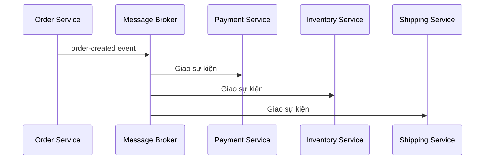

# 🧩 Microservices Architecture — tự chủ để mở rộng, và cái giá của hệ phân tán

> Nguồn: `026-Microservices-Architecture.txt` · [Udemy](https://ua.udemy.com/course/mastering-system-design-from-basics-to-cracking-interviews/learn/lecture/49456797)

Bài này mình và các bạn sẽ đi sâu vào **microservices architecture (kiến trúc vi dịch vụ)** — cách tiếp cận cho phép xây những ứng dụng quy mô lớn từ các service độc lập, có thể scale và tiến hóa mà không bị mắc kẹt trong nút thắt monolith. Chúng ta sẽ đi từ định nghĩa, cách vạch ranh giới, giao tiếp, cho tới những trade-off mà kiến trúc sư phải thiết kế ngay từ ngày đầu.

---

### 🔍 Microservices là gì — và vì sao nó xuất hiện

Khi hệ thống lớn lên, vấn đề lớn nhất của kiến trúc monolithic là **mọi tính năng, mọi lần triển khai và mọi quyết định scale đều dính chặt vào nhau**. Microservices ra đời như câu trả lời: chia ứng dụng thành **những service nhỏ hơn, vận hành độc lập**, mỗi service chịu trách nhiệm cho một **business capability (năng lực kinh doanh)** cụ thể.

* Từ khóa ở đây là **autonomy (sự tự chủ)**: mỗi service có thể được phát triển, test, triển khai và scale **mà không cần sửa toàn bộ ứng dụng**.
* Các service giao tiếp qua **well-defined API (API được định nghĩa rõ ràng)**, nhưng bên trong vẫn khép kín — tạo nên kiến trúc module hóa và linh hoạt hơn nhiều.
* Sự độc lập này còn cải thiện **resilience (khả năng chịu lỗi)**: một service gặp sự cố không nhất thiết kéo sập cả hệ thống.
* Và đội ngũ chỉ cần scale **đúng những service cần thêm năng lực**, thay vì scale toàn bộ ứng dụng.

Chính sự kết hợp giữa **triển khai độc lập, loose coupling, scalability và fault tolerance** đã khiến microservices trở thành lựa chọn phổ biến cho các ứng dụng quy mô lớn và cloud-native.

---

### 🧭 Vạch ranh giới service — bài toán khó nhất

Phần quan trọng nhất — và cũng khó nhất — khi áp dụng microservices là **quyết định vẽ ranh giới service ở đâu**. Nếu ranh giới sai, các bạn chỉ đang **thay một monolith bằng hàng tá service phụ thuộc chặt vào nhau**, tạo ra độ phức tạp còn lớn hơn.

* **Bắt đầu từ business capability, không phải technical layer.** Thay vì tạo các service như "database service" hay "validation service", hãy tạo service quanh các chức năng kinh doanh: **orders, payments, inventory, user management**. Cách này tạo **quyền sở hữu rõ ràng** và giúp kiến trúc khớp với cách doanh nghiệp vận hành.
* **Single Responsibility Principle (nguyên lý đơn trách nhiệm).** Mỗi service nên có một trách nhiệm chính và chỉ tiến hóa vì một lý do. Khi một service bắt đầu ôm nhiều mối quan tâm không liên quan, đó là dấu hiệu cần xem lại ranh giới.
* **Data ownership (quyền sở hữu dữ liệu).** Mỗi microservice nên sở hữu và kiểm soát dữ liệu của riêng nó. Các service dùng chung một database có vẻ tiện lúc đầu, nhưng chính điều đó tạo ra **những phụ thuộc ẩn** khiến việc triển khai và scale độc lập trở nên khó hơn nhiều.
* **Cấu trúc service:** **domain-driven design (DDD)** giúp tổ chức service quanh các **business domain** hợp lý, còn những **API được định nghĩa tốt** — dù là REST, gRPC hay event-driven messaging — sẽ tạo ra **hợp đồng giao tiếp rõ ràng** giữa các service.
* **Granularity (độ hạt) là bài toán cân bằng:** service quá lớn biến thành **mini-monolith**, còn service quá nhỏ tạo ra vô số network call, chi phí vận hành và thách thức phối hợp. Kiến trúc sư có kinh nghiệm luôn tìm điểm cân bằng ở giữa.

Và vì hệ phân tán **vốn khó debug hơn**, **observability trở thành yêu cầu hạng nhất**: logging, monitoring và **distributed tracing (truy vết phân tán)** cho phép hiểu request chảy qua các service thế nào và nhanh chóng xác định điểm lỗi trong production.

---

### 🔄 Giao tiếp giữa các service — sync, async và cái giá

Khi ứng dụng đã được chia thành nhiều microservices, câu hỏi mới xuất hiện: **các service giao tiếp với nhau ra sao?** Mô hình giao tiếp ảnh hưởng lớn tới performance, scalability, reliability và hành vi tổng thể của hệ thống.

**Cách thứ nhất — synchronous communication (giao tiếp đồng bộ):** một service gửi request và **chờ response** trước khi đi tiếp. **REST API** là lựa chọn phổ biến nhất vì đơn giản, chuẩn hóa và dễ áp dụng. Tuy nhiên, mỗi network call đều **cộng thêm latency**, và khi phụ thuộc giữa các service tăng lên, thời gian phản hồi có thể tăng dọc theo cả chuỗi request. Để cải thiện hiệu quả, nhiều tổ chức dùng **gRPC** cho giao tiếp service-to-service: nó dùng **protocol buffer** và **định dạng nhị phân gọn nhẹ**, giúp giảm kích thước payload, đạt **latency thấp hơn và throughput (thông lượng) cao hơn** REST truyền thống — rất hiệu quả cho giao tiếp nội bộ nơi hiệu năng quan trọng.

**Cách thứ hai — asynchronous communication (giao tiếp bất đồng bộ):** thay vì chờ response, các service giao tiếp qua **event**. Một service **publish (xuất bản)** event, và bất kỳ service nào quan tâm có thể phản ứng độc lập. Cách này tạo **loose coupling (liên kết lỏng)** và cho phép hệ thống scale hiệu quả hơn hẳn.

Ví dụ nền tảng thương mại điện tử: khi đơn hàng được đặt, **order service** publish event **order-created**; các service payment, inventory, notification và shipping xử lý event đó độc lập, mà order service **không cần biết ai đang lắng nghe**. Các **message broker (hàng đợi/trung gian thông điệp)** như **Kafka, RabbitMQ hay AWS SNS** giúp hiện thực điều này.

| Tiêu chí | Synchronous | Asynchronous |
|---|---|---|
| Cách hoạt động | Gửi request và chờ response | Publish event rồi tiếp tục làm việc |
| Công nghệ | REST, gRPC | Kafka, RabbitMQ, AWS SNS |
| Điểm mạnh | Đơn giản, dễ suy luận, phù hợp khi cần phản hồi tức thì | Loose coupling, scale tốt, chịu lỗi tốt hơn |
| Trade-off | Phụ thuộc service phía sau; latency cộng dồn theo chuỗi | Phức tạp vận hành; dữ liệu nhất quán sau cùng |

*Điểm mấu chốt: không cách nào tốt hơn tuyệt đối. Khi cần phản hồi tức thì, giao tiếp synchronous là lựa chọn tự nhiên; còn khi ưu tiên scalability, resilience và loose coupling, event-driven messaging tỏa sáng. Hầu hết nền tảng microservices thành công đều **kết hợp cả hai**, dùng mỗi cách ở nơi phù hợp nhất.*

---

### ⚖️ Trade-off, scaling và những bài học thực tế

Đến đây microservices nghe có vẻ hoàn hảo, nhưng mọi lựa chọn kiến trúc đều có trade-off. Khi hệ thống phân tán hơn, nhiều bài toán từng đơn giản trong monolith bỗng trở nên khó hơn hẳn:

* **Data consistency (nhất quán dữ liệu):** trong monolith, một database transaction giữ mọi thứ đồng bộ. Trong microservices, mỗi service sở hữu dữ liệu riêng, nên duy trì nhất quán thường cần **eventual consistency (nhất quán sau cùng)**. Ví dụ khi đặt hàng, inventory, payment và shipping có thể cập nhật bất đồng bộ — hệ thống vẫn đúng, nhưng **đúng dần theo thời gian** thay vì trong một transaction duy nhất.
* **Observability và debugging:** một request người dùng có thể đi qua **5 hoặc 10 service** trước khi trả về. Khi có lỗi, xác định lỗi nằm ở đâu rất khó — vì thế các công cụ **distributed tracing** như **OpenTelemetry** và **Zipkin** trở thành thành phần thiết yếu.
* **Network overhead:** mỗi ranh giới service là một network call, mà network call **chậm và kém tin cậy hơn** lời gọi hàm trong tiến trình. Khi số service tăng, latency cộng dồn qua các chuỗi request. Các kỹ thuật như **gRPC, caching, request aggregation** và giao tiếp bất đồng bộ giúp giảm chi phí này.
* **Security:** trong monolith, bảo mật thường tập trung một chỗ; trong microservices, **mọi tương tác giữa các service đều phải được bảo vệ** — authentication, authorization, mã hóa giao tiếp và truy cập an toàn vào dữ liệu nhạy cảm phải được thực thi nhất quán trên toàn hệ sinh thái. Các công nghệ thường dùng: **API gateway, OAuth, JWT, mutual TLS** và **service mesh**.

*Bài học lớn: microservices không loại bỏ độ phức tạp — chúng **phân phối lại độ phức tạp**. Chúng giải quyết bài toán scalability và tổ chức, nhưng mang theo những thách thức hệ phân tán mà kiến trúc sư phải chủ động thiết kế ngay từ ngày đầu.*

**Vậy scaling trong microservices diễn ra thế nào?** Cách phổ biến nhất là **horizontal scaling**: thay vì làm một server to hơn, ta tạo thêm nhiều instance của service và phân phối traffic qua **load balancer**. Ví dụ trong một đợt sale lớn, **order service** chịu lượng request tăng vọt trong khi các service khác vẫn ổn định — ta chỉ cần scale order service thay vì cả ứng dụng.

Khi hệ thống lớn hơn, scale thủ công nhanh chóng trở nên bất khả thi. Đó là lúc **auto-scaling** phát huy giá trị: **Kubernetes** có thể tự động thêm hoặc bớt instance dựa trên các chỉ số như **CPU, memory hay request volume**, giúp hệ thống chịu được đỉnh traffic mà không lãng phí hạ tầng lúc rảnh rỗi.

Nhưng chỉ scale application là chưa đủ — trong nhiều hệ thống lớn, **database rốt cuộc trở thành bottleneck**. Kiến trúc sư dùng thêm các kỹ thuật database scaling:

* **Read-replicas** — phân tán workload đọc nặng ra nhiều database instance.
* **Sharding (phân mảnh dữ liệu)** — chia dữ liệu thành các phân đoạn nhỏ hơn theo khóa như **customer ID, tenant ID hoặc geographic region**.

*Bài học kiến trúc: scalability thật sự cần suy nghĩ vượt ra ngoài application server — kết hợp scale cấp service, elasticity tự động và tối ưu database.*

Và đây không phải lý thuyết suông. **Netflix** phục vụ hàng triệu người dùng đồng thời với streaming, recommendation, user profiles, content discovery và personalization — mỗi mảng có đặc tính scale rất khác nhau. **Uber** tách ride matching, pricing, payment, navigation, notification và driver management thành các service riêng để scale những service trọng yếu độc lập. **Amazon** tách search, product catalog, payments, inventory và recommendations để các đội ngũ có thể đổi mới, triển khai và scale mà không phải phối hợp trên toàn tổ chức. Điểm chung: họ không chọn microservices vì trào lưu, mà vì **independent scaling, đội ngũ tự chủ, triển khai nhanh hơn và resilience tốt hơn đã trở thành nhu cầu sống còn ở quy mô khổng lồ**.

Để vận hành được, một nền tảng microservices cần hạ tầng hỗ trợ: **API gateway, service discovery và load balancer** đóng vai trò then chốt trong giao tiếp, routing và duy trì availability trên môi trường phân tán.

---

### 🎯 Tự kiểm tra nhanh

**Câu 1:** Vì sao nên vạch ranh giới microservice theo business capability thay vì technical layer?

<b>Xem đáp án</b>

**Đáp án:** Vì cách này tạo quyền sở hữu rõ ràng và giúp kiến trúc khớp với cách doanh nghiệp vận hành.

Giải thích: Tạo service kiểu "database service" hay "validation service" dễ dẫn tới phụ thuộc chặt và phức tạp hơn.

Tham chiếu: Mục Vạch ranh giới service — bài toán khó nhất.

**Câu 2:** Vì sao mỗi microservice nên sở hữu dữ liệu riêng?

<b>Xem đáp án</b>

**Đáp án:** Để tránh phụ thuộc ẩn — dùng chung database trông tiện lúc đầu nhưng khiến triển khai và scale độc lập khó hơn nhiều.

Giải thích: Data ownership là điều kiện để service thật sự độc lập.

Tham chiếu: Mục Vạch ranh giới service — bài toán khó nhất.

**Câu 3:** Vì sao nhiều tổ chức chọn gRPC cho giao tiếp nội bộ giữa các service?

<b>Xem đáp án</b>

**Đáp án:** gRPC dùng protocol buffer và định dạng nhị phân gọn nhẹ, giảm payload, cho latency thấp hơn và throughput cao hơn REST truyền thống.

Giải thích: Điều này đặc biệt hiệu quả khi hiệu năng giao tiếp nội bộ quan trọng.

Tham chiếu: Mục Giao tiếp giữa các service — sync, async và cái giá.

**Câu 4:** Eventual consistency xuất hiện trong microservices vì đâu?

<b>Xem đáp án</b>

**Đáp án:** Vì mỗi service sở hữu dữ liệu riêng và cập nhật bất đồng bộ, nên nhất quán đạt được dần theo thời gian thay vì trong một transaction duy nhất.

Giải thích: Ví dụ đặt hàng — inventory, payment, shipping có thể cập nhật không cùng lúc nhưng hệ thống vẫn đúng.

Tham chiếu: Mục Trade-off, scaling và những bài học thực tế.

**Câu 5:** Ngoài scale application, microservices còn cần những kỹ thuật scaling nào?

<b>Xem đáp án</b>

**Đáp án:** Horizontal scaling với load balancer, auto-scaling (ví dụ Kubernetes theo CPU, memory, request volume), và tối ưu database bằng read-replicas cùng sharding.

Giải thích: Database thường là bottleneck tiếp theo khi hệ thống lớn lên.

Tham chiếu: Mục Trade-off, scaling và những bài học thực tế.

---

Vậy là các bạn đã nắm được microservices từ A đến Z: tự chủ để scale, vạch ranh giới theo nghiệp vụ, chọn sync hay async cho giao tiếp, và những trade-off hệ phân tán phải thiết kế ngay từ đầu. Ở bài tiếp theo, chúng ta sẽ đẩy ý tưởng loose coupling đi xa hơn với **event-driven architecture**. Hẹn gặp lại các bạn! 🚀
