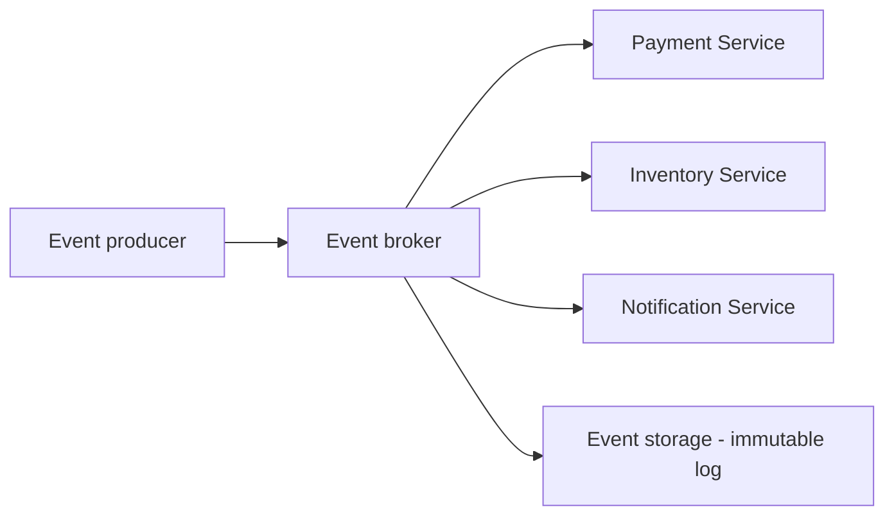

# 🔔 Event-Driven Architecture — thiết kế hệ thống quanh những gì đã xảy ra

> Nguồn: `027-Event-Driven-Architecture.txt` · [Udemy](https://ua.udemy.com/course/mastering-system-design-from-basics-to-cracking-interviews/learn/lecture/49456801)

Bài này mình và các bạn sẽ khám phá **event-driven architecture (kiến trúc hướng sự kiện — EDA)** — một trong những architectural style quan trọng nhất để xây hệ thống phân tán có khả năng mở rộng, phản hồi nhanh và **loose coupling (liên kết lỏng)**. Chúng ta sẽ đi từ vì sao EDA ra đời, phân biệt các mô hình giao tiếp, cho tới những thách thức và best practice mà kiến trúc sư phải xử lý.

---

### 💡 Event-driven architecture — giao tiếp qua sự kiện

EDA ra đời vì **giao tiếp trực tiếp giữa các service bắt đầu trở thành nút thắt khi hệ thống lớn lên**. Khi mọi thành phần đều phụ thuộc vào việc thành phần khác phải phản hồi ngay lập tức, scalability, resilience và flexibility trở nên khó đạt được.

Thay vào đó, EDA cho phép các thành phần giao tiếp qua **event (sự kiện)** — những tín hiệu rằng "đã có chuyện gì đó xảy ra" — mà **không cần biết ai sẽ phản ứng với tín hiệu đó**. Hai đặc tính cốt lõi:

* **Asynchronous processing (xử lý bất đồng bộ):** thay vì chờ response, một service có thể **publish event rồi tiếp tục công việc**, trong khi các thành phần khác xử lý event đó độc lập. Điều này giảm thời gian chờ và cải thiện độ phản hồi tổng thể.
* **Loose coupling:** producer và consumer của event được tách rời nhau, nên đội ngũ có thể sửa, triển khai hoặc scale từng service độc lập mà không tạo ra phụ thuộc chặt. Điều này cực kỳ giá trị trong hệ phân tán lớn, nơi thay đổi là chuyện thường trực.

EDA cũng mang lại **scalability và flexibility** tuyệt vời: **consumer mới có thể subscribe vào event đã có mà không cần sửa service gốc**, giúp mở rộng business workflow dễ dàng theo thời gian. Vì vậy EDA rất phổ biến trong **real-time notification, giao dịch tài chính, xử lý đơn hàng, nền tảng IoT** và những hệ thống mà nhiều thành phần cần phản ứng với sự kiện ngay khi chúng xảy ra. *Điểm cốt lõi: hệ event-driven được thiết kế để phản hồi nhanh, scale tốt và thích nghi cao — một architectural style mạnh mẽ cho ứng dụng phân tán hiện đại.*

---

### 🔄 Sync vs async, pub-sub vs event streaming

Nhiều quyết định kiến trúc rốt cuộc xoay quanh câu hỏi: các thành phần giao tiếp **đồng bộ hay bất đồng bộ**?

**Synchronous system (hệ đồng bộ)** theo mô hình **request-response**: một thành phần gửi request rồi **chờ đến khi nhận response** mới đi tiếp. Mô hình này đơn giản, trực quan — đó là lý do các **HTTP API truyền thống** hoạt động như vậy. Nhưng việc chờ đợi tạo ra **sự phụ thuộc**: nếu service phía sau chậm, quá tải hoặc không sẵn sàng, bên gọi cũng bị ảnh hưởng. Khi hệ thống lớn lên và nhiều service phụ thuộc lẫn nhau, những tương tác blocking này có thể tạo ra **nút thắt latency** và giảm resilience.

**Asynchronous system (hệ bất đồng bộ)** làm ngược lại: một service publish event hoặc message rồi tiếp tục công việc; các thành phần khác xử lý khi chúng sẵn sàng. Mô hình **non-blocking** này loại bỏ nhu cầu phối hợp trực tiếp giữa các service và tạo nên kiến trúc loose coupling hơn hẳn. Các công nghệ như **Kafka, RabbitMQ** và **cloud event broker** hiện thực điều này bằng cách đóng vai trò **trung gian giữa producer và consumer**. Nhờ được tách rời, các service có thể **scale độc lập, phục hồi sau lỗi nhẹ nhàng hơn và tiến hóa mà ít ảnh hưởng lẫn nhau**.

*Trade-off cốt lõi ở đây là **simplicity đổi lấy scalability**: synchronous thường dễ thiết kế và dễ suy luận hơn, còn asynchronous mang thêm độ phức tạp vận hành nhưng đem lại flexibility, resilience và scalability mà nhiều hệ phân tán hiện đại cần.*

Khi nói về hệ event-driven, hai pattern được nhắc đến liên tục là **pub-sub (publish-subscribe)** và **event streaming**. Cả hai đều là mô hình giao tiếp dựa trên event, nhưng giải quyết bài toán khác nhau:

| Tiêu chí | Pub-sub | Event streaming |
|---|---|---|
| Cách hoạt động | Producer broadcast event, mọi subscriber quan tâm đều nhận | Event được lưu trong ordered durable log |
| Lưu trữ & replay | Thường không giữ lâu dài để replay | Đọc lại, replay lịch sử, xử lý lại cùng stream |
| Công nghệ | RabbitMQ, AWS SNS | Kafka, AWS Kinesis |
| Phù hợp | Fan-out: notification, alert, trigger downstream workload | Analytics, auditing, monitoring, data pipeline |

* **Pub-sub** rất decoupled và lý tưởng cho các tình huống **fan-out** như thông báo, cảnh báo hay kích hoạt workload phía sau. Sau khi event được giao, nó thường **không được giữ lại để replay lâu dài**, nên subscriber phải xử lý khi event đến.
* **Event streaming** đẩy ý tưởng đi xa hơn: event không còn là message tạm thời mà là **nguồn sự thật bền vững (permanent source of truth)**, có thể được tiêu thụ, replay và phân tích **rất lâu sau khi được sinh ra**.

*Chọn giữa hai mô hình phụ thuộc vào việc các bạn chỉ cần **giao event ngay lúc này**, hay còn cần **lưu giữ và xử lý lịch sử event theo thời gian**.*

---

### 🧩 Các thành phần của một hệ event-driven

Hãy hình dung hệ event-driven như một **pipeline** nơi event liên tục được tạo ra, vận chuyển, xử lý và thường được lưu trữ. Mỗi thành phần có trách nhiệm riêng, và cùng nhau chúng tạo nên hệ thống loosely coupled, scale tốt.

1. **Event producer** — thành phần phát hiện một sự việc có ý nghĩa đã xảy ra và **publish event**: khách đặt hàng, thanh toán hoàn tất, cảm biến báo nhiệt độ, hay một microservice cập nhật dữ liệu nghiệp vụ. Trách nhiệm của producer **kết thúc khi event được publish** — nó không cần biết ai sẽ tiêu thụ.
2. **Event broker** — **hệ thần kinh trung ương** của kiến trúc. Các broker như **Kafka, RabbitMQ hay AWS EventBridge** nhận event, **route (định tuyến)** tới consumer phù hợp, và trong một số trường hợp **lưu lại để tiêu thụ sau**. Lớp trung gian này giữ producer và consumer độc lập, cải thiện đáng kể flexibility và scalability.
3. **Event consumer** — các service subscribe vào event và thực hiện hành động nghiệp vụ để phản hồi. **Một event có thể kích hoạt nhiều consumer cùng lúc**: event order-placed có thể khởi động payment, cập nhật inventory, quy trình shipping và notification — tất cả mà order service không hề gọi trực tiếp hệ thống nào.
4. **Event storage** — thay vì coi event là message tạm thời, nhiều nền tảng lưu event trong **immutable log (nhật ký bất biến)**. Điều này cho phép **replay event, phục hồi sau lỗi, phân tích lịch sử và duy trì audit trail (dấu vết kiểm toán) đầy đủ**. Ở hệ thống quy mô lớn, khả năng này nhiều khi **quý giá ngang với xử lý thời gian thực**.

*Insight kiến trúc quan trọng: mỗi thành phần chỉ có **một trách nhiệm** — producer tạo event, broker phân phối, consumer phản ứng, storage lưu giữ. Chính separation of concern này khiến hệ event-driven scale tốt, bền bỉ và thích nghi khi lớn lên.*

---

### ⚠️ Thách thức, best practices và ứng dụng thực tế

Mọi architectural style đều mang trade-off, và EDA cũng không ngoại lệ. Đây là những thách thức kiến trúc sư phải **chủ động thiết kế để xử lý**:

* **Eventual consistency:** vì các service giao tiếp bất đồng bộ, cập nhật dữ liệu **không hiển thị đồng thời ở mọi nơi**. Event có thể được publish ngay nhưng hệ thống phía sau xử lý vài giây sau đó. Sự "tạm thời không nhất quán" này thường chấp nhận được, nhưng đòi hỏi tư duy khác với hệ giao dịch truyền thống. Các kỹ thuật thường dùng: **idempotent consumer (consumer xử lý lặp an toàn)**, **compensating action (hành động bù trừ)** và business workflow được thiết kế cẩn thận.
* **Event ordering (thứ tự sự kiện):** trong môi trường phân tán, event có thể đến **sai thứ tự** hoặc bị xử lý đồng thời bởi nhiều consumer. Hãy tưởng tượng xử lý event **payment-completed trước event order-created** — nếu không có kiểm soát phù hợp, hệ thống có thể rơi vào trạng thái không hợp lệ. Vì vậy các nền tảng như **Kafka cung cấp đảm bảo thứ tự theo partition**, và nhiều hệ thống dùng **sequence number** hoặc chiến lược **versioning**.
* **Fault tolerance:** network lỗi, service crash, consumer không sẵn sàng — hệ event-driven được thiết kế tốt phải **giả định lỗi sẽ xảy ra** và đảm bảo event không bị mất. **Retry mechanism, dead-letter queue và event replay** là những công cụ thiết yếu.
* **Debugging và observability:** trong hệ đồng bộ, truy vết một request thường khá đơn giản; trong EDA, một giao dịch nghiệp vụ có thể kích hoạt **hàng tá event** qua nhiều service và nhiều đội ngũ. Hiểu chuyện gì đã xảy ra đòi hỏi **distributed tracing, structured logging, correlation ID** và thực hành monitoring nghiêm túc.

*Tóm lại: EDA **dịch chuyển độ phức tạp** từ phụ thuộc trực tiếp giữa các service sang các lĩnh vực consistency, ordering, reliability và observability.*

Vậy làm sao để xây hệ event-driven bền vững? Đây là những **best practice** quan trọng:

1. **Idempotent event processing:** trong hệ phân tán, việc event bị giao trùng **không phải bug mà là thực tế tất yếu** — retry, network gián đoạn và broker lỗi đều có thể khiến cùng một event được giao nhiều lần. Consumer cần được thiết kế sao cho **xử lý nhiều lần cho cùng kết quả như xử lý một lần**, tránh thanh toán trùng, đơn hàng trùng hay thông báo lặp.
2. **Dead-letter queue (DLQ — hàng đợi thư chết):** không phải lỗi nào cũng giải quyết được bằng retry. Có message **malformed (sai định dạng)**, chứa dữ liệu không hợp lệ hoặc liên tục fail business validation. Thay vì chặn cả pipeline, event lỗi nên được **tách riêng vào DLQ** để kiểm tra, phân tích và xử lý độc lập — cải thiện độ tin cậy và khả năng quan sát vận hành.
3. **Chọn event broker phù hợp:** **Kafka** xuất sắc ở **event streaming throughput cao và lưu trữ dài hạn**; **RabbitMQ** thường được ưu tiên cho **message queuing truyền thống**; còn **AWS EventBridge** giúp đơn giản hóa **event routing cloud-native**. Hãy đánh giá theo throughput, durability, yêu cầu ordering, độ phức tạp vận hành và nhu cầu tích hợp.
4. **Event versioning để sẵn sàng cho thay đổi:** event schema rồi sẽ tiến hóa khi yêu cầu kinh doanh đổi — thêm field, mở rộng cấu trúc, thêm consumer. Không có chiến lược versioning, một thay đổi schema đơn giản có thể **phá vỡ các service phía sau**. Thiết kế event với **backward compatibility (tương thích ngược)** giúp producer và consumer tiến hóa độc lập.

*Giá trị thật của EDA thể hiện rõ qua các hệ thống thực tế — nơi event đại diện cho **hành động nghiệp vụ**, và nhiều hệ thống có thể phản ứng với hành động đó một cách scale tốt, bền bỉ và loosely coupled:*

* **Logging và auditing:** mọi hành động quan trọng — người dùng cập nhật hồ sơ, thanh toán hoàn tất, admin đổi quyền — đều sinh event, tạo **hồ sơ lịch sử** phục vụ compliance, troubleshooting, điều tra bảo mật và phân tích **mà không ảnh hưởng hiệu năng ứng dụng chính**.
* **Real-time notification:** chat, social feed, hệ thống giao dịch, dashboard trực tiếp đều cần cập nhật tức thì. Khi event xảy ra — tin nhắn mới, giá cổ phiếu thay đổi — consumer quan tâm phản ứng ngay và thông báo cho người dùng **mà không cần polling liên tục**.
* **Tích hợp microservices:** thay vì tạo mạng lưới phụ thuộc service-to-service, các service giao tiếp qua event; service mới có thể subscribe vào event sẵn có **mà không cần sửa hệ thống tạo ra chúng**.
* **IoT:** hàng triệu thiết bị liên tục sinh dữ liệu cảm biến; hệ event-driven có thể ingest, xử lý và phản ứng với dòng dữ liệu khối lượng lớn theo thời gian thực — phù hợp cho **smart home, giám sát công nghiệp, xe kết nối và thiết bị y tế**.
* **Xử lý đơn hàng thương mại điện tử:** người dùng đặt hàng → order service publish event → kích hoạt payment → thanh toán thành công sinh event cập nhật inventory → khởi động shipping → gửi notification. Mỗi service vận hành độc lập, nhưng cùng nhau tạo nên **một workflow nghiệp vụ hoàn chỉnh**.

*Chủ đề chung của mọi ví dụ: event đại diện cho hành động nghiệp vụ, và EDA cho phép nhiều hệ thống phản ứng với hành động đó theo cách **scale tốt, bền bỉ và loosely coupled**.*

---

### 🎯 Tự kiểm tra nhanh

**Câu 1:** Event-driven architecture ra đời để giải quyết vấn đề gì?

<b>Xem đáp án</b>

**Đáp án:** Giao tiếp trực tiếp service-to-service trở thành nút thắt khi hệ thống lớn lên — phụ thuộc vào phản hồi tức thì làm scalability, resilience và flexibility khó đạt.

Giải thích: Event cho phép các thành phần giao tiếp mà không cần biết ai sẽ phản ứng.

Tham chiếu: Mục Event-driven architecture — giao tiếp qua sự kiện.

**Câu 2:** Trade-off cốt lõi giữa synchronous và asynchronous communication là gì?

<b>Xem đáp án</b>

**Đáp án:** Đánh đổi simplicity lấy scalability — synchronous dễ thiết kế và suy luận hơn; asynchronous thêm phức tạp vận hành nhưng mang lại flexibility, resilience và scalability.

Giải thích: Synchronous chờ response nên phụ thuộc vào service phía sau.

Tham chiếu: Mục Sync vs async, pub-sub vs event streaming.

**Câu 3:** Pub-sub khác event streaming ở điểm nào?

<b>Xem đáp án</b>

**Đáp án:** Pub-sub phân phối event theo thời gian thực cho subscriber quan tâm, thường không giữ lâu để replay; event streaming lưu event trong ordered durable log, cho phép replay và xử lý lại.

Giải thích: Pub-sub hợp với fan-out như notification; streaming hợp với analytics, auditing, data pipeline.

Tham chiếu: Mục Sync vs async, pub-sub vs event streaming.

**Câu 4:** Vì sao duplicate event delivery không phải bug, và consumer nên được thiết kế thế nào?

<b>Xem đáp án</b>

**Đáp án:** Vì retry, network gián đoạn và broker lỗi đều có thể khiến event được giao nhiều lần; consumer cần **idempotent** — xử lý nhiều lần cho cùng kết quả như một lần.

Giải thích: Điều này tránh thanh toán trùng, đơn hàng trùng hay thông báo lặp.

Tham chiếu: Mục Thách thức, best practices và ứng dụng thực tế.

**Câu 5:** Dead-letter queue được dùng khi nào?

<b>Xem đáp án</b>

**Đáp án:** Khi message malformed, chứa dữ liệu không hợp lệ hoặc liên tục fail business validation mà retry không giải quyết được — event lỗi bị tách riêng thay vì chặn cả pipeline.

Giải thích: DLQ giúp kiểm tra, phân tích và xử lý riêng, cải thiện độ tin cậy và khả năng quan sát.

Tham chiếu: Mục Thách thức, best practices và ứng dụng thực tế.

---

Vậy là các bạn đã nắm trọn event-driven architecture: từ vì sao EDA ra đời, sync vs async, pub-sub vs event streaming, các thành phần cốt lõi, cho tới thách thức và best practice. *Hãy nhớ: EDA không chỉ là một mô hình messaging — nó là cách thiết kế hệ thống quanh các sự kiện nghiệp vụ.* Ở bài tiếp theo, chúng ta sẽ tổng kết chuyên đề bằng cách so sánh các architectural pattern đã học. Hẹn gặp lại các bạn! 🚀
