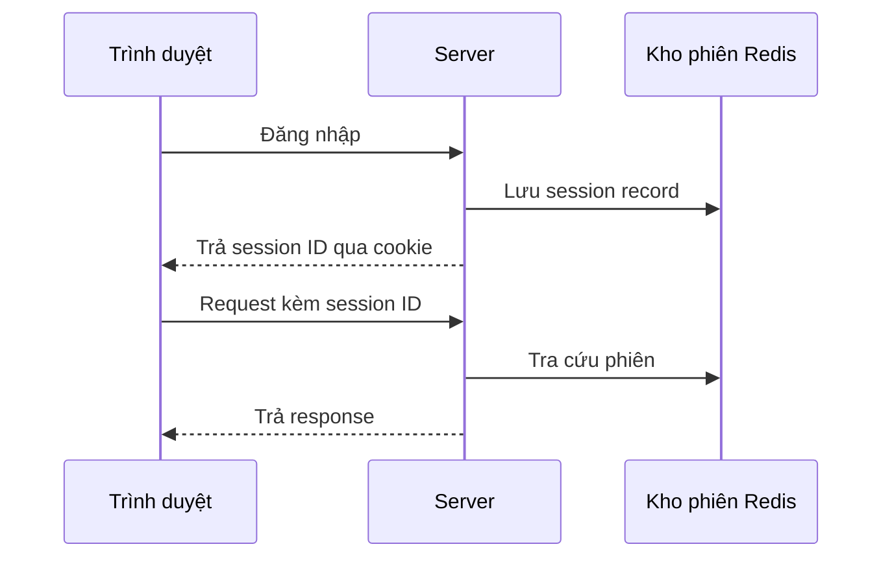

# 🍪 Web Sessions — Cách ứng dụng "nhớ" bạn khi HTTP không hề có bộ nhớ

> Nguồn: `030-Web-Sessions-Managing-State-in-Web-Applications.txt` · [Udemy](https://ua.udemy.com/course/mastering-system-design-from-basics-to-cracking-interviews/learn/lecture/49522133)

Các bạn có bao giờ tự hỏi vì sao một website nhớ được rằng bạn đã đăng nhập, giữ nguyên giỏ hàng hay lưu sở thích của bạn khi di chuyển từ trang này sang trang khác? Đó chính là nhờ **web sessions** — cơ chế quản lý trạng thái mà mọi ứng dụng web hiện đại đều phải có. Trong bài này, mình sẽ đi từ gốc rễ là **HTTP stateless**, qua hai hướng tiếp cận chính, rồi tới những bài toán bảo mật và mở rộng mà kiến trúc sư cần giải quyết.

---

### 🌐 HTTP stateless và bài toán ghi nhớ người dùng

**HTTP là stateless (không lưu trạng thái)**: mỗi request đến server là một tương tác độc lập, **không có bộ nhớ sẵn** về những request trước đó.

Nếu không có cơ chế duy trì trạng thái, hậu quả sẽ rất rõ:

* Người dùng phải **xác thực lại liên tục** ở từng trang.
* **Giỏ hàng biến mất** ngay khi chuyển trang.
* Mỗi request cảm giác như đến từ một **vị khách hoàn toàn mới**.

Chính vì vậy **session management** ra đời: nó gắn nhiều request khác nhau về **cùng một người dùng** và giữ mạch ngữ cảnh xuyên suốt phiên tương tác. Điểm thú vị là tính stateless cũng là một lý do khiến web **scale hiệu quả** — nhưng bù lại, vì server không thể giả vờ rằng nó "nhớ" bạn, mọi request phải tự mang theo ngữ cảnh cần thiết: thông tin xác thực, **session identifier (mã phiên)**, hoặc dữ liệu riêng của người dùng.

---

### 🍪 Session-based authentication — server giữ trạng thái

Đây là hướng tiếp cận **lâu đời và phổ biến nhất**: server chịu trách nhiệm lưu thông tin phiên, còn client chỉ giữ một **tham chiếu** tới phiên đó.

Cách hoạt động:

1. Người dùng đăng nhập thành công, server tạo một **session record** chứa danh tính, quyền hạn và các trạng thái liên quan.
2. Server sinh một **session ID duy nhất** rồi gửi về browser, thường thông qua **cookie**.
3. Từ đó, mọi request tự động kèm theo cookie chứa session ID; server dùng ID này để tra cứu dữ liệu phiên và biết bạn là ai — **không cần đăng nhập lại**.

Có thể hình dung cookie như một **tấm vé gửi xe**, còn thông tin phiên thật sự vẫn được lưu an toàn trên server.

Mô hình này hoạt động rất tốt với ứng dụng web truyền thống nhờ server **kiểm soát hoàn toàn** việc quản lý phiên. Nhưng khi ứng dụng chạy trên nhiều server, lưu session trở thành bài toán kiến trúc: người ta phải dùng **sticky sessions (phiên gắn cố định)**, **session replication (nhân bản phiên)** hoặc **centralized session store (kho phiên tập trung)** như Redis. Hiểu các trade-off này rất quan trọng, vì quyết định quản lý session ảnh hưởng trực tiếp đến scalability, reliability và độ phức tạp vận hành.

---

### 🔑 Token-based authentication — mang ngữ cảnh trong token

Hướng tiếp cận thứ hai đảo ngược vị trí: thay vì lưu thông tin phiên trên server, **ngữ cảnh người dùng được đóng gói vào một token tự thân** (self-contained) và đi kèm mỗi request.

* Sau khi xác thực, server sinh token — thường là **JWT (JSON Web Token)** — chứa danh tính, vai trò và quyền hạn.
* Client lưu token và gửi lại trong các request tiếp theo, thường qua **authorization header (header xác thực)**.
* Server **xác minh token và trích xuất thông tin cần thiết**, không phải tra cứu session state ở phía server.

Lợi thế lớn nhất là **scalability**: vì server không giữ trạng thái phiên, bất kỳ instance nào trong hệ phân tán cũng xử lý được request mà không phụ thuộc kho phiên dùng chung. Điều này khiến token-based đặc biệt hấp dẫn với **API, microservices, ứng dụng mobile và kiến trúc cloud-native**.

Đánh đổi của statelessness: khi token đã phát hành, việc **quản lý hết hạn, thu hồi và bảo mật** phức tạp hơn nhiều so với chỉ cần xóa session phía server. Vì vậy, bảo mật token, chính sách hết hạn và xác minh đúng cách trở thành phần thiết yếu của thiết kế xác thực.

| Tiêu chí | Session-based | Token-based |
|---|---|---|
| Nơi lưu trạng thái | Server | Trong token, client giữ |
| Client lưu gì | Chỉ session ID trong cookie | Token tự thân, thường trong header |
| Điểm mạnh | Kiểm soát phiên tốt | Scale ngang dễ dàng |
| Thách thức | Đồng bộ session giữa nhiều server | Hết hạn, thu hồi, bảo mật token |

Cả hai đều **không có lựa chọn nào tốt hơn tuyệt đối**. Kiến trúc sư cân nhắc dựa trên yêu cầu scalability, bảo mật, độ phức tạp hạ tầng và hướng phát triển của ứng dụng.

---

### 🛡️ Bảo mật và mở rộng session

**Session management không chỉ là giữ trạng thái — nó là một ranh giới bảo mật.** Nếu kẻ tấn công chiếm được phiên của người dùng, chúng có thể vượt qua xác thực và hành động như chính người đó.

* **Session hijacking (cướp phiên)** — cướp một session ID hợp lệ để mạo danh người dùng, qua nghe lén trên kết nối không an toàn hoặc lỗ hổng phía client như **XSS**. Giảm thiểu bằng **HTTPS**, **xoay session ID sau khi xác thực** và **giới hạn thời gian sống của phiên**.
* **CSRF (Cross-Site Request Forgery)** — site độc hại lừa browser gửi request đã xác thực đến ứng dụng mà người dùng đang đăng nhập; vì cookie được gửi tự động nên request trông "hợp lệ". Phòng thủ bằng **CSRF token**, **same-site cookies** và xác minh bổ sung cho các hành động nhạy cảm.
* **Bảo vệ cookie** — cookie thường mang thông tin xác thực, nên các cờ bảo mật **Secure**, **HTTP-only** và **SameSite** giảm mạnh nguy cơ bị chặn bắt, bị truy cập bằng script và bị lạm dụng cross-site.

Khi lưu lượng tăng và hệ thống chuyển sang môi trường phân tán, quản lý session trở thành **bài toán scale**:

1. **Sticky sessions** — load balancer luôn đẩy request của một người dùng về cùng một server. Dễ triển khai, nhưng gây **tải không đều** và ảnh hưởng availability nếu server đó gặp sự cố.
2. **Distributed session management (quản lý phiên phân tán)** — đặt session trong kho dùng chung mà mọi server truy cập được, nhờ đó request đi đến bất kỳ instance nào cũng xử lý được, tăng cả scalability lẫn fault tolerance. **Redis** và **Memcached** thường được chọn vì là **in-memory data store (kho dữ liệu trong bộ nhớ)**, tra cứu cực nhanh; Redis còn có persistence, replication và high availability.
3. **Stateless authentication với JWT** — đỉnh cao scalability: server không cần tra cứu session, giảm phụ thuộc hạ tầng, rất hợp với microservices, cloud-native và hệ thống hướng API.

Bài học lớn: **session management tiến hóa cùng quy mô** — ứng dụng nhỏ bắt đầu với session cục bộ, hệ thống đang lớn dần chuyển sang session store phân tán, và nền tảng phân tán cao thường chọn xác thực stateless để giảm độ phức tạp vận hành.

---

### 🎯 Tự kiểm tra nhanh

**Câu 1:** Vì sao HTTP stateless lại tạo ra nhu cầu về session management?

<b>Xem đáp án</b>

**Đáp án:** Vì mỗi request là một tương tác độc lập, server không nhớ request trước, nên cần cơ chế gắn các request về cùng một người dùng.

Giải thích: Không có session, người dùng phải xác thực lại liên tục và giỏ hàng biến mất giữa các trang.

Tham chiếu: Mục HTTP stateless và bài toán ghi nhớ người dùng.

**Câu 2:** Trong session-based authentication, trạng thái phiên được lưu ở đâu?

<b>Xem đáp án</b>

**Đáp án:** Trên server; client chỉ giữ session ID, thường trong cookie.

Giải thích: Cookie giống như tấm vé, còn dữ liệu phiên thật vẫn nằm trên server.

Tham chiếu: Mục Session-based authentication — server giữ trạng thái.

**Câu 3:** Vì sao token-based authentication dễ scale ngang hơn?

<b>Xem đáp án</b>

**Đáp án:** Vì server không giữ session state — bất kỳ instance nào cũng xác minh token và xử lý request.

Giải thích: Kiến trúc trở nên stateless, không phụ thuộc kho phiên dùng chung, rất hợp với microservices và cloud-native.

Tham chiếu: Mục Token-based authentication — mang ngữ cảnh trong token.

**Câu 4:** Session hijacking và CSRF khác nhau thế nào?

<b>Xem đáp án</b>

**Đáp án:** Hijacking là cướp session ID để mạo danh người dùng; CSRF là lừa browser gửi request đã xác thực đến ứng dụng người dùng đang đăng nhập.

Giải thích: Hijacking phòng bằng HTTPS, xoay session ID và giới hạn thời gian sống; CSRF phòng bằng CSRF token, same-site cookies và xác minh bổ sung.

Tham chiếu: Mục Bảo mật và mở rộng session.

**Câu 5:** Sticky sessions có đánh đổi gì?

<b>Xem đáp án</b>

**Đáp án:** Dễ triển khai nhưng gây tải không đều và ảnh hưởng availability nếu server đó gặp sự cố.

Giải thích: Vì mọi request của một người dùng dồn về một server, thiết kế phân tán với kho phiên chung thường scalable hơn.

Tham chiếu: Mục Bảo mật và mở rộng session.

---

Vậy là chúng ta đã đi hết vòng đời của một session: từ bài toán stateless, hai hướng tiếp cận, tới bảo mật và mở rộng. *Điểm cần nhớ nhất: không có lựa chọn nào hoàn hảo — session-based cho kiểm soát, token-based cho scalability, và mọi quyết định đều là trade-off.*

Ở bài tiếp theo, chúng ta chuyển sang **serialization** — cách dữ liệu được cấu trúc, mã hóa và truyền đi giữa các hệ thống. Hẹn gặp lại các bạn! 🚀
