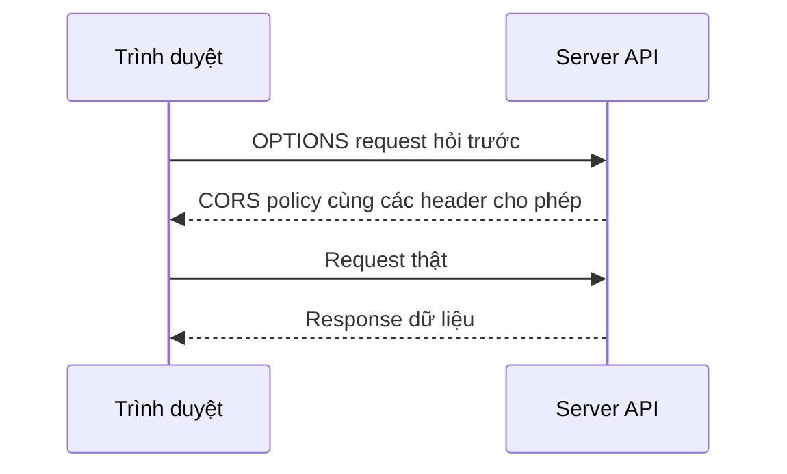

# 🔐 CORS — Cách trình duyệt cân bằng giữa bảo mật và kết nối

> Nguồn: `032-CORS-Cross-Origin-Resource-Sharing-Web-Security.txt` · [Udemy](https://ua.udemy.com/course/mastering-system-design-from-basics-to-cracking-interviews/learn/lecture/49522139)

Hãy tưởng tượng front-end của các bạn chạy trên `app.com` và cần gọi API đặt tại `api.com`. Về mặt kỹ thuật, request này rất đơn giản — nhưng trình duyệt lại chặn nó. Lý do nằm ở **same-origin policy (chính sách cùng nguồn gốc)**, một trong những lớp bảo vệ quan trọng nhất của web. Bài này mình sẽ giải thích vì sao có sự chặn đó, **CORS (Cross-Origin Resource Sharing — chia sẻ tài nguyên khác nguồn)** giải quyết ra sao, và những cạm bẫy cấu hình mà kiến trúc sư phải tránh.

---

### 🎯 Same-origin policy — lá chắn mặc định của trình duyệt

Trình duyệt **thực thi same-origin policy**, và nếu không có nó, một website độc hại có thể **gửi request thay mặt người dùng** tới những site mà người dùng đang đăng nhập. Đó là lý do mặc định browser **từ chối** các request cross-origin.

Nhưng kiến trúc hiện đại hiếm khi gom mọi thứ về một domain:

* **Front-end, API, dịch vụ xác thực** và các **tích hợp bên thứ ba** thường nằm rải rác trên nhiều origin khác nhau.
* Vì vậy, trong khi same-origin policy tăng cường bảo mật, nó cũng có thể **chặn giao tiếp hợp pháp** giữa các hệ thống đáng tin cậy.

**CORS ra đời như giải pháp kiến trúc cho chính vấn đề này.** Thay vì gỡ bỏ lớp bảo vệ của browser, CORS cho phép **server tường minh khai báo origin nào được phép truy cập tài nguyên của mình**. Nói cách khác: mặc định của browser là **từ chối**, còn CORS mở ra cách **cấp quyền có kiểm soát** cho một số domain nhất định.

---

### 🧩 CORS hoạt động thế nào?

Điểm cần nhớ trước tiên: CORS **trông như tính năng của browser, nhưng thực chất do server kiểm soát** — browser chỉ thi hành luật. Khi có request cross-origin, server phải nói rõ cho browser biết request đó có được phép hay không.

* **Simple requests (request đơn giản)** — với thao tác đơn giản như đọc dữ liệu bằng `GET` hay gửi `POST` cơ bản, browser gửi request **trực tiếp**.
* **Preflight check (kiểm tra trước)** — với thao tác có thể sửa đổi tài nguyên như `PUT`, `DELETE`, hoặc khi có **custom header**, browser trở nên thận trọng hơn: nó gửi trước một request `OPTIONS` để hỏi *"Nếu tôi gửi request này, bạn có cho phép không?"*. Server trả về **CORS policy** của mình, và chỉ khi policy cho phép, browser mới gửi request thật.

Quyết định cho phép được điều khiển bằng một nhóm **response header**:

* `Access-Control-Allow-Origin` — chỉ định **domain nào được tin tưởng**.
* `Access-Control-Allow-Methods` — quy định **HTTP method nào được phép**.
* `Access-Control-Allow-Headers` — quy định **custom header nào được gửi kèm**.

Cùng nhau, các header này tạo thành **một khế ước giữa browser và server**, cho phép giao tiếp cross-origin an toàn mà không làm suy yếu mô hình bảo mật của browser. Chính vì vai trò then chốt đó, **một cấu hình sai có thể vừa phá vỡ lưu lượng hợp lệ, vừa vô tình phơi API cho những người dùng không mong muốn** — CORS chỉ an toàn bằng chính cách nó được cấu hình.

---

### ⚠️ Những cạm bẫy cấu hình CORS

Trong hệ thống production, rủi ro lớn nhất thường **không đến từ CORS mà đến từ các policy quá dễ dãi** được thêm vào cho tiện rồi không bao giờ siết lại.

1. **Đặt `Access-Control-Allow-Origin` thành `*`** — cách làm "cho nhanh" khi phát triển, nhưng nó nói với browser rằng **bất kỳ website nào cũng truy cập được API của bạn**. Với tài nguyên công khai, điều này có thể chấp nhận được; với API phục vụ dữ liệu người dùng hoặc dữ liệu nhạy cảm, đây là **rủi ro bảo mật nghiêm trọng**.
2. **Kết hợp credentials với quy tắc truy cập quá rộng** — khi có authentication token, cookie hay session người dùng, quyền truy cập **phải được giới hạn ở các origin tin cậy tường minh**, nếu không nguy cơ truy cập trái phép và lộ dữ liệu sẽ tăng lên.
3. **Dùng chung một policy cho mọi API** — khi hệ thống lớn lên, **public endpoint, partner API và internal service không nên chia sẻ cùng CORS policy** vì yêu cầu bảo mật khác nhau.

Kinh nghiệm của các kiến trúc sư dày dạn là coi CORS như **một phần trong chiến lược bảo mật API tổng thể**, áp dụng **nguyên tắc least privilege (đặc quyền tối thiểu)** và chỉ cấp đúng quyền cần thiết. Cách làm an toàn nhất: duy trì **whitelist các origin tin cậy**, áp policy riêng theo từng endpoint khi cần, và **tập trung hóa việc thực thi qua reverse proxy hoặc API gateway** — nhờ đó vừa tăng bảo mật, vừa dễ quản lý CORS hơn hẳn khi kiến trúc tiến hóa.

---

### 🏗️ CORS với REST, GraphQL và vai trò của API gateway

CORS **không gắn với một phong cách API cụ thể** — đây là yêu cầu bảo mật của browser, áp dụng mỗi khi web client giao tiếp cross-origin. Dù bạn xây REST endpoint hay GraphQL service, browser vẫn chờ server khai báo tường minh cross-origin access được phép.

* **Với REST** — CORS cực kỳ phổ biến vì front-end và API thường triển khai độc lập: một ứng dụng React chạy ở domain này, REST API chạy ở domain khác. Các framework như **ExpressJS, Spring Boot, Django** đều có sẵn cơ chế định nghĩa trusted origin, allowed method và permitted header, biến cấu hình CORS thành phần chuẩn khi deploy API.
* **Với GraphQL** — cũng chạy trên HTTP nên gặp đúng thách thức tương tự. Dù GraphQL thường chỉ phơi **một endpoint duy nhất**, request hay kèm authentication header, custom metadata hoặc các mutation phức tạp — những thứ **thường xuyên kích hoạt preflight**. Vì vậy GraphQL server cũng phải được cấu hình cẩn thận ngang REST API.

Ở quy mô lớn, các kiến trúc sư có kinh nghiệm thường giải bài toán ở **tầng cao hơn** thay vì chỉ dựa vào cấu hình CORS mức ứng dụng:

* **Reverse proxy (proxy ngược)** đặt trước backend: mọi request đi qua **một điểm vào duy nhất**, nên với browser tất cả tưởng như đến từ cùng origin và nhiều vấn đề CORS biến mất. Đây là lý do **Nginx** được dùng rộng rãi.
* **API gateway** trở thành **điểm thực thi CORS tập trung** khi hệ thống có hàng chục đến hàng trăm service: định nghĩa trusted origin, allowed method, yêu cầu xác thực và quy tắc bảo mật nhất quán cho toàn nền tảng, thay vì cấu hình từng service.

Cả hai hướng đều mang lại lợi ích vận hành: reverse proxy giảm độ phức tạp cho team front-end, còn API gateway cải thiện **governance (quản trị), observability (khả năng quan sát) và security**. Chúng cũng có thể tối ưu cách xử lý preflight, giảm lưu lượng mạng không cần thiết và cải thiện độ phản hồi tổng thể. Bài học kiến trúc: **CORS không chỉ là bài toán cấu hình browser — trong hệ thống lớn, nó là mối quan tâm hạ tầng được tập trung hóa.**

---

### 🎯 Tự kiểm tra nhanh

**Câu 1:** Same-origin policy bảo vệ người dùng khỏi điều gì?

<b>Xem đáp án</b>

**Đáp án:** Ngăn website độc hại gửi request thay mặt người dùng tới các site mà họ đang đăng nhập.

Giải thích: Mặc định browser từ chối request cross-origin; CORS mở quyền có kiểm soát cho origin được tin cậy.

Tham chiếu: Mục Same-origin policy — lá chắn mặc định của trình duyệt.

**Câu 2:** Khi nào browser thực hiện preflight request?

<b>Xem đáp án</b>

**Đáp án:** Với thao tác có thể sửa đổi tài nguyên như PUT, DELETE, hoặc khi request có custom header.

Giải thích: Browser gửi OPTIONS để hỏi server trước, chỉ gửi request thật nếu policy cho phép.

Tham chiếu: Mục CORS hoạt động thế nào.

**Câu 3:** Header nào cho biết origin nào được phép truy cập?

<b>Xem đáp án</b>

**Đáp án:** `Access-Control-Allow-Origin`.

Giải thích: Hai header còn lại là `Access-Control-Allow-Methods` và `Access-Control-Allow-Headers`.

Tham chiếu: Mục CORS hoạt động thế nào.

**Câu 4:** Vì sao đặt `Access-Control-Allow-Origin` thành `*` là nguy hiểm?

<b>Xem đáp án</b>

**Đáp án:** Vì nó cho phép mọi website truy cập API — với API phục vụ dữ liệu người dùng hoặc nhạy cảm là rủi ro nghiêm trọng.

Giải thích: Kết hợp credentials với quy tắc quá rộng càng nguy hiểm; cần whitelist origin tin cậy và least privilege.

Tham chiếu: Mục Những cạm bẫy cấu hình CORS.

**Câu 5:** Reverse proxy và API gateway giúp gì cho CORS ở quy mô lớn?

<b>Xem đáp án</b>

**Đáp án:** Tập trung hóa việc thực thi CORS — browser thấy mọi request từ cùng một origin, policy được quản lý nhất quán cho toàn nền tảng.

Giải thích: Giảm độ phức tạp cho front-end, cải thiện governance, observability, security và tối ưu xử lý preflight.

Tham chiếu: Mục CORS với REST, GraphQL và vai trò của API gateway.

---

Vậy là chúng ta đã đi hết CORS: từ same-origin policy, cơ chế preflight, những cạm bẫy cấu hình, tới cách xử lý ở tầng reverse proxy và API gateway. *Thách thức cốt lõi không nằm ở CORS, mà ở việc cân bằng giữa bảo mật và kết nối — và điều đó luôn là một trade-off.*

Ở bài tiếp theo, chúng ta sẽ tổng kết section Web Concepts và nối tất cả vào các tình huống system design thực tế. Hẹn gặp lại các bạn! 🚀
