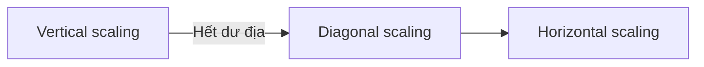

# ⚖️ Scaling Strategies — Vertical, Horizontal và Diagonal

> Nguồn: `035-Scaling-Strategies-Horizontal-Vertical-Diagonal.txt` · [Udemy](https://ua.udemy.com/course/mastering-system-design-from-basics-to-cracking-interviews/learn/lecture/49550717)

Khi hệ thống lớn lên, thách thức không chỉ là chịu thêm lưu lượng, mà là **quyết định tăng năng lực như thế nào mà không tạo ra điểm nghẽn mới**. Đó là lúc ba mô hình scaling — **vertical, horizontal và diagonal** — bước vào cuộc chơi. Trong bài này, mình sẽ phân tích từng cách, trade-off thực tế và cả ví dụ về cách các công ty thật chọn chiến lược theo giai đoạn phát triển.

---

### 🧩 Ba mô hình scaling

**Vertical scaling** đi theo con đường đơn giản nhất: **làm một máy duy nhất mạnh hơn** bằng cách thêm CPU, bộ nhớ hoặc storage. Đây thường là cách nhanh nhất để tăng năng lực vì **kiến trúc ứng dụng gần như không thay đổi**. Đánh đổi nằm ở chỗ: mỗi lần nâng cấp, bạn tiến gần hơn tới **giới hạn phần cứng**, và toàn bộ hệ thống vẫn **phụ thuộc vào một máy** còn khỏe mạnh.

**Horizontal scaling** chọn hướng khác: thay vì xây server to hơn, bạn **thêm nhiều server và phân phối workload** lên chúng. Cách này mở ra **quy mô lớn hơn nhiều** và **tăng resilience**, nhưng nó **thay đổi kiến trúc**: bạn cần **load balancing (cân bằng tải)**, **data synchronization (đồng bộ dữ liệu)**, **replication strategy (chiến lược nhân bản)** và thiết kế giảm phụ thuộc vào bất kỳ node nào.

**Diagonal scaling** là sự kết hợp của cả hai. Nhiều hệ thống thành công bắt đầu với vertical vì đơn giản và hiệu quả chi phí; khi nhu cầu tăng và **lợi ích của máy to dần cạn**, chúng chuyển sang horizontal. Chính sự tiến hóa dần dần này khiến diagonal trở nên phổ biến trong môi trường **cloud-native** — nó cân bằng **đơn giản ngắn hạn** với **scalability dài hạn**.

Có thể nhớ nôm na: **vertical mua thời gian, horizontal mở ra tăng trưởng lớn, còn diagonal là lộ trình thực tế nối hai điều đó**. Lựa chọn đúng không chỉ phụ thuộc lưu lượng, mà còn vào **ngân sách, độ phức tạp vận hành và kỳ vọng tăng trưởng tương lai** của hệ thống.

| Tiêu chí | Vertical | Horizontal | Diagonal |
|---|---|---|---|
| Cách tăng năng lực | Nâng cấp một máy mạnh hơn | Thêm nhiều máy, chia tải | Bắt đầu vertical, chuyển dần horizontal |
| Ưu điểm | Đơn giản, nhanh có kết quả | Scale lớn, tăng resilience | Cân bằng ngắn hạn và dài hạn |
| Đánh đổi | Chạm giới hạn phần cứng, phụ thuộc một máy | Phức tạp phân tán, cần thiết kế hệ thống | Cần lộ trình chuyển đổi rõ ràng |
| Hợp với | MVP, hệ thống đang lớn | Nền tảng quy mô lớn | Môi trường cloud-native |

---

### ⚖️ Trade-off: Cost vs Complexity vs Performance

Chọn chiến lược scaling hiếm khi là chuyện tìm giải pháp nhanh nhất — nó **luôn là bài toán cân bằng giữa các ưu tiên cạnh tranh nhau**. Mọi quyết định kiến trúc đều nằm đâu đó giữa **cost (chi phí), complexity (độ phức tạp)** và **performance (hiệu năng)**, và cải thiện một chiều thường ảnh hưởng đến các chiều còn lại.

* **Vertical scaling** hấp dẫn vì giữ **cả kiến trúc lẫn vận hành đơn giản**. Khi hệ thống còn đang lớn, nâng cấp server có thể mang lại **hiệu năng tức thì với nỗ lực kỹ thuật tối thiểu**. Thách thức: **phần cứng không scale vô hạn**, và chi phí máy càng lớn càng **tăng nhanh** khi tiến về phân khúc cao cấp.
* **Horizontal scaling** chuyển bài toán từ **giới hạn phần cứng** sang **thiết kế hệ thống**. Thêm máy giúp bạn có năng lực, resilience và phục vụ được nhiều người dùng hơn — nhưng kèm theo **độ phức tạp kiến trúc**: load balancing, data replication, consistency, coordination và observability, tất cả đều đòi hỏi đầu tư kỹ thuật.

Vì vậy, kiến trúc sư có kinh nghiệm **không hỏi "cách scaling nào là tốt nhất"**, mà hỏi **"trade-off nào phù hợp với giai đoạn hiện tại của chúng ta"**. Ứng dụng giai đoạn đầu có thể ưu tiên đơn giản và tiết kiệm; một nền tảng trưởng thành phục vụ hàng triệu request có thể sẵn lòng chấp nhận độ phức tạp lớn hơn để đổi lấy scale và độ tin cậy. Bài học then chốt: **scalability không chỉ là quyết định kỹ thuật — nó là quyết định kinh doanh**. Kiến trúc hiệu quả nhất không phải là kiến trúc tối đa hóa hiệu năng bằng mọi giá, mà là kiến trúc đạt **điểm cân bằng đúng** giữa hiệu năng, độ phức tạp vận hành và kinh tế dài hạn.

---

### 🏢 Thực tế: chọn gì ở từng giai đoạn?

Các hệ thống thực tế hiếm khi chọn một chiến lược scaling rồi giữ nguyên mãi mãi — khi lưu lượng, yêu cầu kinh doanh và độ trưởng thành vận hành thay đổi, cách scale cũng tiến hóa theo.

* **Twitter** là ví dụ điển hình. Thời kỳ đầu, kiến trúc **monolith (khối đơn)** là đủ vì quy mô còn quản lý được. Khi tăng trưởng người dùng tăng tốc, nền tảng cần thêm năng lực, resilience và khả năng tiến hóa service độc lập — điều đó tự nhiên đẩy kiến trúc sang **horizontal scaling**, với workload trải trên nhiều service và nhiều máy.
* **Startup và MVP** ở thái cực ngược lại: hầu hết không có bài toán scaling, mà có **bài toán sản phẩm và tăng trưởng**. Với MVP, **sự đơn giản thường giá trị hơn scalability lý thuyết**: một application server và một database, scale vertical khi cần, thường là con đường **nhanh nhất ra thị trường với gánh nặng vận hành thấp nhất**.
* **Ứng dụng cloud-native hiện đại** thường đi con đường giữa: service chạy trên **serverless**, **container** hoặc **auto-scaling group** theo mô hình **diagonal** — khởi đầu nhỏ để kiểm soát chi phí, rồi tự động thêm năng lực khi nhu cầu tăng, mang lại sự linh hoạt mà không cần đầu tư hạ tầng lớn từ đầu.

Bài học quan trọng: **chiến lược scaling phải khớp với giai đoạn của doanh nghiệp**. Sản phẩm sớm tối ưu cho đơn giản; nền tảng đang lớn tối ưu cho năng lực và resilience; hệ thống cloud-native tối ưu cho khả năng thích ứng. Kiến trúc sư giỏi **tránh cả hai thái cực**: không over-engineer cho lưu lượng có thể không bao giờ đến, nhưng cũng nhận ra lúc tăng trưởng đòi hỏi phải chuyển sang kiến trúc scalable hơn.

---

### 🎯 Tự kiểm tra nhanh

**Câu 1:** Vertical scaling và horizontal scaling khác nhau ở điểm cốt lõi nào?

<b>Xem đáp án</b>

**Đáp án:** Vertical là làm một máy mạnh hơn; horizontal là thêm nhiều máy và phân phối workload.

Giải thích: Vertical đơn giản nhưng chạm giới hạn phần cứng; horizontal mở rộng lớn hơn nhưng thay đổi kiến trúc.

Tham chiếu: Mục Ba mô hình scaling.

**Câu 2:** Diagonal scaling thực chất là gì?

<b>Xem đáp án</b>

**Đáp án:** Sự kết hợp — bắt đầu với vertical cho đơn giản, rồi chuyển dần sang horizontal khi nhu cầu tăng.

Giải thích: Đây là lộ trình thực tế rất phổ biến trong môi trường cloud-native.

Tham chiếu: Mục Ba mô hình scaling.

**Câu 3:** Vì sao horizontal scaling tăng resilience nhưng cũng tăng độ phức tạp?

<b>Xem đáp án</b>

**Đáp án:** Nhiều máy giúp chịu lỗi tốt hơn, nhưng kéo theo load balancing, data replication, consistency, coordination và observability.

Giải thích: Bài toán chuyển từ giới hạn phần cứng sang thiết kế hệ thống phân tán.

Tham chiếu: Mục Trade-off: Cost vs Complexity vs Performance.

**Câu 4:** Câu chuyện Twitter minh họa điều gì về scaling strategy?

<b>Xem đáp án</b>

**Đáp án:** Chiến lược scaling tiến hóa theo giai đoạn — monolith đủ lúc đầu, rồi chuyển sang horizontal khi tăng trưởng tăng tốc.

Giải thích: Nhu cầu về năng lực, resilience và tiến hóa service độc lập đẩy kiến trúc thay đổi.

Tham chiếu: Mục Thực tế: chọn gì ở từng giai đoạn.

**Câu 5:** Vì sao nói scalability là một quyết định kinh doanh?

<b>Xem đáp án</b>

**Đáp án:** Vì nó phụ thuộc ngân sách, độ phức tạp vận hành và kỳ vọng tăng trưởng — cần cân bằng cost, complexity và performance.

Giải thích: Kiến trúc hiệu quả nhất không tối đa hóa hiệu năng bằng mọi giá mà đạt điểm cân bằng đúng cho giai đoạn hiện tại.

Tham chiếu: Mục Trade-off: Cost vs Complexity vs Performance.

---

Vậy là các bạn đã nắm trọn ba mô hình scaling cùng trade-off của chúng. *Không có cách nào đúng cho mọi trường hợp — chỉ có cách phù hợp với giai đoạn sản phẩm của bạn, và mọi lựa chọn đều là trade-off.*

Ở bài tiếp theo, chúng ta sẽ tìm hiểu **load balancer** — viên gạch quan trọng nhất giúp horizontal và diagonal scaling trở nên khả thi. Hẹn gặp lại các bạn! 🚀
