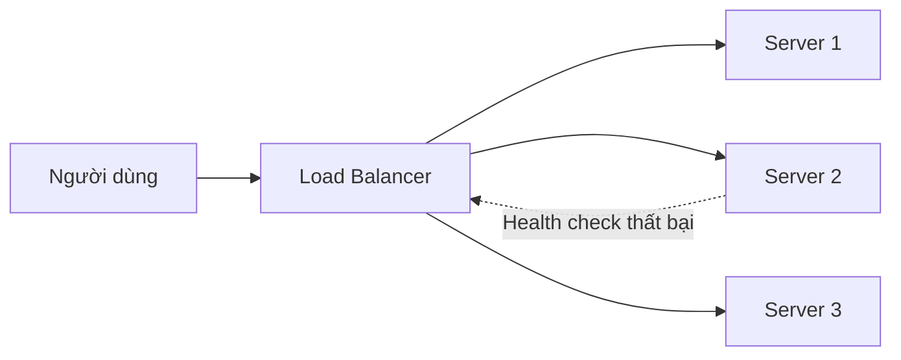

# 🎯 Load Balancer — Trái tim của kiến trúc mở rộng và sẵn sàng cao

> Nguồn: `036-Understanding-Load-Balancers-Types-Algorithms-Cloud-Solution.txt` · [Udemy](https://ua.udemy.com/course/mastering-system-design-from-basics-to-cracking-interviews/learn/lecture/49550719)

Khi hệ thống lớn lên, thách thức không còn là "phục vụ request" mà là **phục vụ chúng một cách đáng tin cậy dưới lưu lượng khó đoán**. Một server đơn lẻ có thể chạy tốt lúc đầu, nhưng rốt cuộc sẽ vừa là **điểm nghẽn hiệu năng** vừa là **single point of failure (điểm hỏng đơn lẻ)**. **Load balancer (bộ cân bằng tải)** ra đời để giải quyết đúng bài toán đó — và trong bài này, mình sẽ đi từ lý do cần có nó, các loại, thuật toán, tới cách chọn cho đúng.

---

### 🎯 Vì sao cần load balancing?

Load balancing giải bài toán trên bằng cách thêm **một tầng phân phối lưu lượng thông minh** nằm giữa người dùng và các application server. Thay vì để một máy ôm hết, request được **trải đều qua nhiều server**, giúp tận dụng tài nguyên tốt hơn và tránh quá tải. Kết quả là **thời gian phản hồi tốt hơn, throughput (thông lượng) cao hơn và trải nghiệm người dùng ổn định hơn**.

Quan trọng không kém, load balancing còn **tăng resilience**: trong production, server hỏng, deploy lỗi và sự cố hạ tầng là chuyện bình thường. Load balancer **liên tục kiểm tra sức khỏe của server** và tự động **chuyển lưu lượng khỏi những instance không khỏe**, giúp hệ thống duy trì hoạt động khi có sự cố.

Cuối cùng, nó là **yếu tố then chốt giúp scale**: khi nhu cầu tăng, ta có thể **thêm server phía sau load balancer mà người dùng không hề thay đổi cách truy cập ứng dụng**, cho phép năng lực tăng dần thay vì phụ thuộc một máy lớn hơn. Hãy hình dung một sàn thương mại điện tử lớn trong đợt flash sale: hàng triệu request đổ về trong vài phút. Không có load balancing, vài server sẽ nhanh chóng gục ngã; có load balancer, lưu lượng được chia ra cả "đội quân" server, đảm bảo nền tảng vẫn nhanh, vẫn available và chịu được đỉnh tải.

---

### 🧩 Phân loại load balancer: Layer 4 vs Layer 7 và mô hình triển khai

Khi hệ thống scale, không phải load balancer nào cũng giải bài toán giống nhau. Lựa chọn đúng phụ thuộc hai câu hỏi: **cần "soi" lưu lượng sâu đến đâu?** và **triển khai ở đâu?**

* **Layer 4** hoạt động ở tầng **TCP và UDP**: chỉ nhìn **địa chỉ IP và port** để định tuyến, **không kiểm tra nội dung request**. Vì xử lý ít thông tin nên nó **cực nhanh**, thường dùng cho workload **throughput cao, latency thấp**.
* **Layer 7** hoạt động ở **application layer** và hiểu các protocol như **HTTP, HTTPS**. Nó có thể xem **URL, header, cookie** và các thuộc tính khác của request để đưa ra quyết định định tuyến thông minh hơn — ví dụ request tới `/checkout` được đưa tới **transaction service chuyên trách**, còn request tới `/product` đi tới một server khác. Sự linh hoạt này đi kèm **chi phí xử lý cao hơn**.

Về mô hình triển khai, load balancer cũng chia làm ba nhóm:

* **Hardware** — thiết bị chuyên dụng, thường thấy trong **data center doanh nghiệp lớn**, nơi cần hiệu năng tối đa và tính năng mạng chuyên biệt.
* **Software** — các giải pháp chạy trên server hoặc container tiêu chuẩn như **Nginx, HAProxy, Envoy**. Nhờ linh hoạt, chi phí thấp và hợp với cloud-native, chúng đã trở thành **lựa chọn mặc định** của nhiều kiến trúc hiện đại.
* **Cloud-managed** — dịch vụ được quản lý hoàn toàn như **AWS Elastic Load Balancer, Google Cloud Load Balancing, Azure Load Balancer**, tự động xử lý scale, health check và phân phối lưu lượng, giảm mạnh gánh nặng vận hành.

| Tiêu chí | Layer 4 | Layer 7 |
|---|---|---|
| Tầng hoạt động | TCP và UDP | Application layer, hiểu HTTP và HTTPS |
| Dữ liệu dùng để route | IP address và port | URL, header, cookie |
| Ưu điểm | Cực nhanh, throughput cao, latency thấp | Định tuyến thông minh, hiểu request |
| Đánh đổi | Không nhìn vào nội dung request | Tốn thêm chi phí xử lý |

Chốt lại: **Layer 4 vs Layer 7 quyết định cách lưu lượng được định tuyến**, còn **hardware, software hay cloud** quyết định nơi và cách load balancer được triển khai. Kiến trúc sư chọn tổ hợp cân bằng tốt nhất giữa hiệu năng, linh hoạt, độ phức tạp vận hành và chi phí.

---

### 🔁 Các chiến lược phân phối lưu lượng

Khi lưu lượng đã đến được nhiều server, câu hỏi tiếp theo là: **server nào xử lý request này?** Quyết định đó do **load balancing strategy (chiến lược cân bằng tải)** điều khiển.

Nhóm **rule-based (theo quy tắc cố định)** — đơn giản, dễ vận hành:

* **Round Robin** — chia request theo **thứ tự cố định** lần lượt qua các server; hợp khi server cùng năng lực và workload dễ đoán.
* **Least Connection** — xét **số kết nối đang hoạt động**, phù hợp hơn khi một số request xử lý lâu hơn hẳn.
* **IP Hashing** — đảm bảo **cùng client luôn về cùng backend server**, hữu ích cho **session persistence (duy trì phiên)** và **sticky sessions**.

Thách thức của nhóm này: chúng **giả định trạng thái hệ thống tương đối ổn định** — điều hiếm khi đúng trong production, nơi mô hình lưu lượng thay đổi, các server chịu tải khác nhau và hạ tầng biến động liên tục. Đó là lúc **dynamic load balancing** phát huy giá trị: thay vì theo quy tắc định trước, nó quyết định dựa trên **điều kiện thời gian thực**.

* **Least Response Time** — ưu tiên server đang **phản hồi nhanh nhất**.
* **Adaptive Load Balancing** — xét sâu hơn: **CPU utilization, memory pressure, server health và traffic pattern**.
* **Weighted Load Balancing** — cho **server mạnh hơn nhận tỉ lệ request lớn hơn**, tận dụng hiệu quả năng lực hạ tầng.

| Thuật toán | Cách hoạt động | Hợp với |
|---|---|---|
| Round Robin | Chia request theo thứ tự cố định | Server cùng cấu hình, tải dễ đoán |
| Least Connection | Ưu tiên server ít kết nối đang hoạt động | Request xử lý lâu, độ dài khác nhau |
| IP Hashing | Cùng client về cùng server | Session persistence, sticky sessions |
| Least Response Time | Chọn server phản hồi nhanh nhất | Cần tối ưu độ trễ thời gian thực |
| Adaptive | Dựa trên CPU, memory, health, traffic pattern | Hệ thống lớn, điều kiện biến động |
| Weighted | Server mạnh nhận tỉ lệ request lớn hơn | Cụm server không đồng đều |

Mục tiêu của kiến trúc sư **không phải tìm thuật toán tốt nhất, mà là thuật toán phù hợp nhất với workload hiện tại**. Chiến lược đơn giản dễ vận hành và thường đủ ở quy mô nhỏ; chiến lược động cho khả năng tận dụng tài nguyên và resilience tốt hơn khi hệ thống lớn và khó đoán. **Lưu lượng và hạ tầng càng biến động, intelligent load balancing càng đáng giá.**

---

### 🏗️ Load balancer trong thực tế và cách chọn

Hãy ghép mọi thứ lại bằng một luồng request đơn giản: người dùng gửi request tới **public endpoint** của ứng dụng; **load balancer nhận request trước tiên** và trở thành **điểm vào duy nhất** của hệ thống. Dựa trên thuật toán đã cấu hình — round-robin, least connection hay chiến lược động tiên tiến hơn — nó chọn backend server phù hợp.

Từ góc nhìn người dùng, toàn bộ quá trình này **vô hình**: họ tương tác với một endpoint duy nhất, còn load balancer lo phân phối lưu lượng, health check và failover phía sau. Chính **sự trừu tượng hóa** này khiến load balancer quý giá: nó **tách client khỏi từng server riêng lẻ**, cho phép hạ tầng scale, phục hồi sau lỗi và tiến hóa mà không ảnh hưởng người dùng.

Vậy nên **không có load balancer tốt nhất cho mọi hệ thống — chỉ có lựa chọn đúng cho hệ thống cụ thể**. Cân nhắc theo thứ tự:

1. **Mức độ "thông minh" cần thiết trong định tuyến** — chỉ cần phân phối TCP/UDP hiệu quả thì Layer 4 thường đúng; nếu quyết định dựa trên URL, header, cookie hay quy tắc ứng dụng thì cần Layer 7.
2. **Quy mô và độ phức tạp vận hành** — với nhiều ứng dụng, software load balancer như Nginx hay HAProxy cân bằng xuất sắc giữa linh hoạt, hiệu năng và chi phí; khi chuyển sang cloud-native, dịch vụ managed trở nên hấp dẫn vì tự xử lý scale, health check và hạ tầng.
3. **Bảo mật** — trong nhiều kiến trúc, load balancer là **tuyến phòng thủ đầu tiên**: **SSL termination (kết thúc SSL)**, quản lý certificate tập trung, tích hợp **DDoS protection (chống tấn công từ chối dịch vụ)** và **WAF (Web Application Firewall — tường lửa ứng dụng web)**, cùng dịch vụ lọc lưu lượng.

Quy tắc thực dụng: **bắt đầu với giải pháp đơn giản nhất đáp ứng yêu cầu hiện tại**. Dùng software khi cần linh hoạt và kiểm soát; dùng cloud-managed khi muốn đơn giản vận hành và scale đàn hồi; chỉ dùng thiết bị hardware chuyên dụng khi yêu cầu về hiệu năng, compliance hoặc mạng doanh nghiệp biện minh được cho chi phí và độ phức tạp thêm vào.

---

### 🎯 Tự kiểm tra nhanh

**Câu 1:** Load balancer giải quyết hai vấn đề gì của một server đơn lẻ?

<b>Xem đáp án</b>

**Đáp án:** Điểm nghẽn hiệu năng và single point of failure.

Giải thích: Nó phân phối request qua nhiều server và chuyển lưu lượng khỏi instance không khỏe.

Tham chiếu: Mục Vì sao cần load balancing.

**Câu 2:** Layer 4 và Layer 7 khác nhau ở điểm nào?

<b>Xem đáp án</b>

**Đáp án:** Layer 4 định tuyến theo IP và port ở tầng TCP/UDP; Layer 7 hiểu HTTP/HTTPS và định tuyến theo URL, header, cookie.

Giải thích: Layer 4 nhanh hơn, Layer 7 thông minh hơn nhưng tốn chi phí xử lý.

Tham chiếu: Mục Phân loại load balancer.

**Câu 3:** Round Robin phù hợp nhất khi nào?

<b>Xem đáp án</b>

**Đáp án:** Khi các server có năng lực tương đương và workload dễ đoán.

Giải thích: Nó chỉ chia request theo thứ tự cố định, không xét trạng thái thời gian thực.

Tham chiếu: Mục Các chiến lược phân phối lưu lượng.

**Câu 4:** IP Hashing được dùng cho mục đích gì?

<b>Xem đáp án</b>

**Đáp án:** Session persistence — cùng một client luôn được định tuyến về cùng backend server.

Giải thích: Điều này hữu ích cho sticky sessions, nhưng vẫn là chiến lược rule-based.

Tham chiếu: Mục Các chiến lược phân phối lưu lượng.

**Câu 5:** Vì sao load balancer thường là "tuyến phòng thủ đầu tiên" của hệ thống?

<b>Xem đáp án</b>

**Đáp án:** Vì nó thường đảm nhận SSL termination, quản lý certificate tập trung và tích hợp DDoS protection, WAF, lọc lưu lượng.

Giải thích: Đây là một trong các tiêu chí quan trọng khi chọn load balancer, bên cạnh mức độ thông minh và độ phức tạp vận hành.

Tham chiếu: Mục Load balancer trong thực tế và cách chọn.

---

Vậy là các bạn đã nắm được load balancer từ A đến Z: vì sao cần, các loại, thuật toán, và cách chọn theo trade-off. *Nhớ nhé — chọn load balancer hiếm khi chỉ là quyết định mạng, mà là bài toán cân bằng giữa hiệu năng, scalability, bảo mật và chi phí vận hành.*

Ở bài tiếp theo, chúng ta sẽ khám phá **auto-scaling** — cách các nền tảng cloud tự động thêm hoặc bớt tài nguyên theo nhu cầu. Hẹn gặp lại các bạn! 🚀
