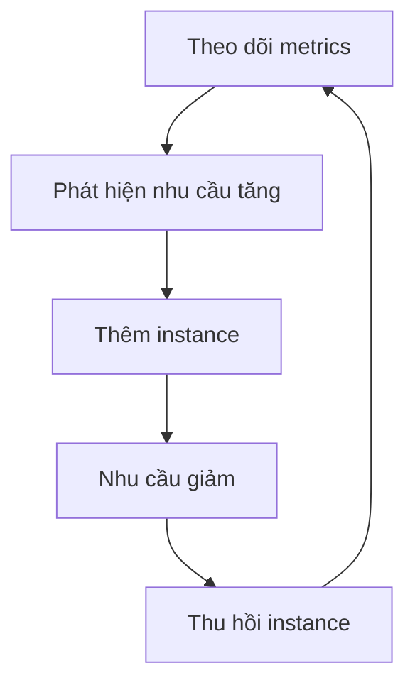

# 🔁 Auto-scaling — Tự động co giãn hạ tầng theo nhu cầu

> Nguồn: `037-Autoscaling-Best-Practices-in-Cloud-Environments.txt` · [Udemy](https://ua.udemy.com/course/mastering-system-design-from-basics-to-cracking-interviews/learn/lecture/49550721)

Khi hệ thống đối mặt với lưu lượng khó đoán, việc **thêm hay bớt server bằng tay** đơn giản là không thể theo kịp. Đó là lúc **auto-scaling (tự động mở rộng)** trở thành người bạn đồng hành: nó liên tục theo dõi nhu cầu và tự điều chỉnh năng lực tính toán. Trong bài này, mình sẽ giải thích cơ chế phản hồi đằng sau auto-scaling, các loại scaling policy, vai trò của observability, và những chiến lược tối ưu chi phí mà kiến trúc sư nên nằm lòng.

---

### 🎯 Auto-scaling là gì?

Auto-scaling **liên tục giám sát nhu cầu và tự động điều chỉnh compute capacity** — thêm instance khi lưu lượng bùng nổ, và gỡ bỏ chúng khi nhu cầu hạ xuống. Mục tiêu không chỉ là phục vụ nhiều người dùng hơn, mà là **giữ đúng điểm cân bằng giữa performance, availability và cost**.

Điều này đặc biệt quan trọng với các kiến trúc hiện đại như **microservices, cloud-native application và event-driven system**, nơi workload có thể thay đổi **chỉ trong vài phút**. Auto-scaling cho phép hạ tầng phản ứng theo thời gian thực, đảm bảo người dùng có trải nghiệm ổn định — mà không phải trả tiền thường trực cho tài nguyên **nằm không phần lớn thời gian trong ngày**.

---

### 🔁 Cách auto-scaling hoạt động

Về bản chất, auto-scaling là một **vòng lặp phản hồi (feedback loop)**. Nền tảng liên tục theo dõi các **tín hiệu chính**: **CPU utilization, memory usage, request volume** hoặc **queue depth (độ sâu hàng đợi)** để hiểu workload hiện tại. Khi các metric cho thấy nhu cầu tăng, hệ thống quyết định **scale theo chiều ngang** (thêm instance) hoặc **theo chiều dọc** (nâng cấp tài nguyên của instance hiện có).

Mảnh ghép tiếp theo là **scaling policy (chính sách mở rộng)** — logic quyết định **khi nào cần hành động**:

* **Reactive policy (phản ứng)** — đáp ứng điều kiện thời gian thực, ví dụ **CPU vượt ngưỡng định trước**. Cách này đơn giản và được dùng rộng rãi, nhưng nó **chỉ phản ứng sau khi tải đã tăng**.
* **Predictive policy (dự đoán)** — đi xa hơn một bước: **phân tích mô hình lịch sử và dự báo nhu cầu tương lai**, cho phép thêm năng lực **trước cả khi đỉnh lưu lượng xảy ra**.

Trong hệ thống production, sự kết hợp của **metrics, cơ chế scaling và policy thông minh** giúp hạ tầng tự thích ứng với workload thay đổi, mang lại hiệu năng ổn định mà tránh được những chi phí tài nguyên không cần thiết.

---

### 📊 Metrics, observability và các nền tảng cloud

Auto-scaling đã trở thành **năng lực tiêu chuẩn trên mọi nền tảng cloud lớn**, nghĩa là kiến trúc sư hiếm khi phải tự xây cơ chế scaling từ đầu. Trọng tâm chuyển sang **định nghĩa đúng metric, threshold và policy**, còn nền tảng lo phần vận hành việc thêm/bớt năng lực. Dù dùng **AWS, Azure hay GCP**, nguyên lý cốt lõi vẫn giống nhau — **giám sát workload, ra quyết định scale và cấp phát tài nguyên tự động**; điều khác biệt chỉ là service và tooling cụ thể. Có service như **serverless** scale gần như tức thì với cấu hình tối thiểu, trong khi **VM và container** thường cần scaling policy tường minh hơn. Vì vậy, auto-scaling **không còn là tính năng đặc thù của một nền tảng — nó là nguyên lý thiết kế cloud-native**. Kỹ năng thật sự không nằm ở việc nhớ tên service, mà ở việc **thiết kế ứng dụng có thể scale an toàn, hiệu quả và dễ dự đoán trên bất kỳ nhà cung cấp cloud nào**.

**Auto-scaling chỉ tốt bằng chính những tín hiệu nó nhận được.** Nếu theo dõi sai metric, hệ thống có thể scale **quá muộn, quá sớm hoặc vì lý do sai**. Vì thế, kiến trúc sư trưởng thành nhìn xa hơn các metric hạ tầng như CPU, memory, network utilization để theo dõi cả **application-level indicator**: queue depth, active users, orders per minute hay các **KPI (Key Performance Indicator — chỉ số hiệu suất chính)** đặc thù nghiệp vụ.

Khi đã có metric ý nghĩa, các bạn có thể chuyển từ **reactive sang proactive**:

* **Predictive scaling** — phân tích xu hướng lịch sử và pattern sử dụng để **đón đầu nhu cầu**.
* **Scheduled scaling** — rất hợp với workload có **chu kỳ lưu lượng biết trước**: giờ làm việc, chiến dịch marketing, sự kiện theo mùa.

Hệ sinh thái tooling hiện đã trưởng thành ở cả cloud-native lẫn open-source: **CloudWatch, Azure Monitor, GCP** cung cấp monitoring tích hợp, còn **Prometheus và Grafana** mang lại **observability (khả năng quan sát)** linh hoạt, không phụ thuộc nhà cung cấp. Bài học kiến trúc then chốt: **scaling hiệu quả bắt đầu từ observability** — khi đo chính xác nhu cầu, bạn có thể scale trước nó thay vì liên tục chạy theo xử lý sự cố hiệu năng.

---

### 💰 Tối ưu chi phí khi auto-scaling

Với auto-scaling trên cloud, **tối ưu chi phí quan trọng ngang với hiệu năng**. Mục tiêu không chỉ là scale, mà là **scale hiệu quả**. Các best practice chính:

1. **Tránh over-provisioning** — scale vừa đủ để đáp ứng nhu cầu, không giữ năng lực dư thừa chạy mãi và đội chi phí lên.
2. **Dùng spot instances (AWS) hoặc preemptible VMs (GCP)** cho workload không trọng yếu như **batch processing (xử lý theo lô)** hay background job — chúng tiết kiệm đáng kể **với điều kiện workload chịu được gián đoạn**.
3. **Đặt resource limit và quota** — những "lan can" này ngăn việc scale mất kiểm soát và hóa đơn cloud bất ngờ, đặc biệt ở môi trường **development và staging**.
4. **Right-sizing** — định kỳ rà soát mức sử dụng tài nguyên thực tế và **điều chỉnh kích thước instance**, thay vì tiếp tục trả tiền cho hạ tầng quá khổ.
5. **Tận dụng auto-pausing và scale to zero** — với service có thời gian dài nhàn rỗi, đặc biệt trên **serverless và container platform**, điều này giảm chi phí rất mạnh.

Chốt lại: auto-scaling thành công không chỉ là duy trì hiệu năng và availability, mà là **cung cấp chúng theo cách tiết kiệm chi phí nhất có thể**.

---

### 🎯 Tự kiểm tra nhanh

**Câu 1:** Auto-scaling cân bằng giữa những yếu tố nào?

<b>Xem đáp án</b>

**Đáp án:** Performance, availability và cost.

Giải thích: Nó thêm instance khi nhu cầu tăng và gỡ bỏ khi nhu cầu giảm, tránh trả tiền cho tài nguyên nhàn rỗi.

Tham chiếu: Mục Auto-scaling là gì.

**Câu 2:** Reactive và predictive policy khác nhau thế nào?

<b>Xem đáp án</b>

**Đáp án:** Reactive phản ứng sau khi tải đã tăng (ví dụ CPU vượt ngưỡng); predictive phân tích lịch sử để thêm năng lực trước khi đỉnh lưu lượng xảy ra.

Giải thích: Predictive giúp chủ động hơn, còn reactive đơn giản và phổ biến nhưng luôn chậm hơn một nhịp.

Tham chiếu: Mục Cách auto-scaling hoạt động.

**Câu 3:** Vì sao observability là nền tảng của scaling hiệu quả?

<b>Xem đáp án</b>

**Đáp án:** Vì hệ thống chỉ scale tốt bằng tín hiệu nó nhận được; metric sai khiến nó scale quá muộn, quá sớm hoặc vì lý do sai.

Giải thích: Cần theo dõi cả metric hạ tầng lẫn application-level như queue depth, active users, orders per minute.

Tham chiếu: Mục Metrics, observability và các nền tảng cloud.

**Câu 4:** Khi nào nên dùng spot instances hoặc preemptible VMs?

<b>Xem đáp án</b>

**Đáp án:** Với workload không trọng yếu như batch processing hay background job — miễn là chịu được gián đoạn.

Giải thích: Chúng tiết kiệm chi phí đáng kể nhưng có thể bị thu hồi bất ngờ.

Tham chiếu: Mục Tối ưu chi phí khi auto-scaling.

**Câu 5:** Scale to zero và auto-pausing phù hợp với loại service nào?

<b>Xem đáp án</b>

**Đáp án:** Service có thời gian nhàn rỗi dài, đặc biệt trên serverless và container platform.

Giải thích: Khi không có nhu cầu, tài nguyên được thu về hoàn toàn, giảm chi phí rất mạnh.

Tham chiếu: Mục Tối ưu chi phí khi auto-scaling.

---

Vậy là các bạn đã nắm trọn auto-scaling: cơ chế feedback loop, các loại policy, vai trò của observability và bộ best practice tối ưu chi phí. *Nhớ nhé — scale không chỉ là kỹ thuật, mà còn là bài toán kinh doanh: hiệu quả nhất là khi tài nguyên có mặt đúng lúc cần và không tiêu tốn đồng nào khi không cần.*

Ở bài tiếp theo, chúng ta sẽ tổng kết section Scalability và nhìn lại toàn bộ hành trình. Hẹn gặp lại các bạn! 🚀
