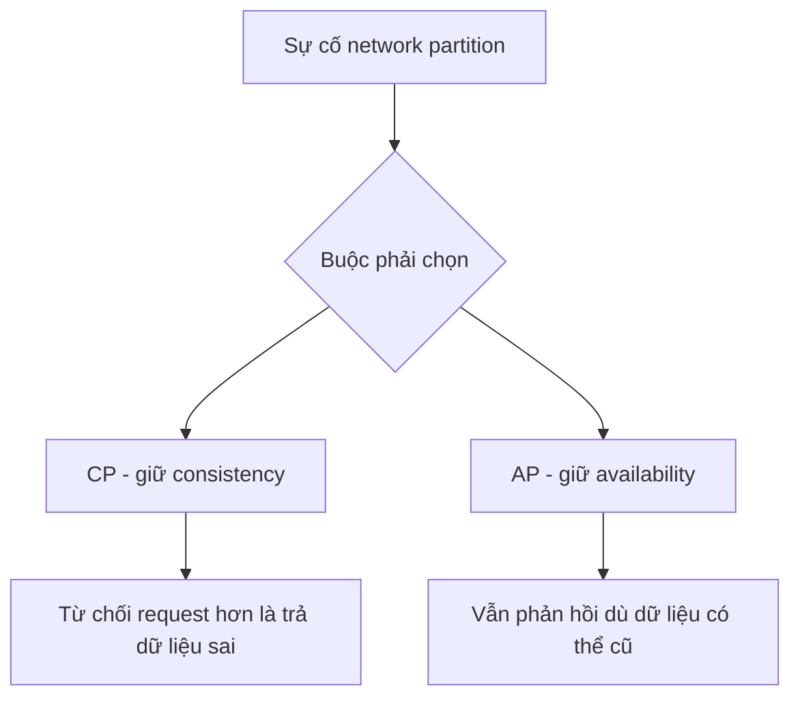

# 🗄️ Storage và CAP Theorem — nền móng dữ liệu của mọi hệ thống lớn

> Nguồn: `039-Introduction-to-Storage-in-System-Design-CAP-Theorem.txt` · [Udemy](https://ua.udemy.com/course/mastering-system-design-from-basics-to-cracking-interviews/learn/lecture/49554347)

Chào mừng các bạn đến với section mới về **database và storage** — nơi chúng ta tìm hiểu cách hệ thống hiện đại lưu trữ, quản lý và mở rộng dữ liệu, nền tảng của mọi ứng dụng bền vững. Mở màn, mình sẽ cùng các bạn đi qua những khái niệm storage căn bản nhất, rồi chạm vào **CAP theorem** — bộ trade-off định hình mọi hệ phân tán thực tế.

---

### 🎯 Vì sao storage quan trọng trong system design?

Mọi hệ thống scale được, suy cho cùng, đều xoay quanh **dữ liệu**: người dùng tạo ra nó, service xử lý nó, doanh nghiệp sống còn nhờ giữ được nó. Khoảnh khắc dữ liệu cần tồn tại lâu hơn một request hay một lần restart server, storage trở thành **quyết định kiến trúc nền tảng**, không còn là chi tiết triển khai.

Điều đáng chú ý: storage ảnh hưởng **nhiều chiều cùng lúc** — response time, độ tin cậy, chi phí vận hành, giới hạn scalability, và cả trải nghiệm người dùng:

* Ứng dụng nhanh nhưng chạy trên storage chậm rồi sẽ bị **nghẽn cổ chai**.
* Storage không đáng tin cậy có thể biến một lỗi nhỏ thành **mất dữ liệu vĩnh viễn**.
* Những tính năng quen thuộc — profile, preference, giỏ hàng, lịch sử tìm kiếm, recommendation, analytics, audit log — đều dựa vào **persistent storage (lưu trữ bền vững)**.

Để chọn đúng, trước tiên phải hiểu mình đang xử lý **loại dữ liệu nào**:

* **Structured data (dữ liệu có cấu trúc)** — tổ chức chặt chẽ theo **schema định trước**: tài khoản người dùng, đơn hàng, thanh toán, tồn kho. Mọi hàng cùng một định dạng nên truy vấn, lọc và join cực kỳ hiệu quả — đây là lý do relational database rất mạnh cho hệ giao dịch.
* **Unstructured data (dữ liệu phi cấu trúc)** — ảnh, video, tài liệu, log, file âm thanh... không nằm gọn trong hàng cột. Định dạng linh hoạt, nhưng kéo theo thách thức lưu trữ và truy xuất khác; thường được đặt trong **object storage** và truy cập qua metadata hoặc cơ chế indexing chuyên biệt.

Trong kiến trúc thực tế, các bạn gần như **luôn dùng cả hai**: một sàn thương mại điện tử lưu khách hàng và đơn hàng trong relational database, còn ảnh sản phẩm, hóa đơn và nội dung người dùng tạo ra nằm ở object storage. Hiểu bản chất dữ liệu là bước đầu tiên để chọn đúng công nghệ, tối ưu hiệu năng và thiết kế hệ thống scale tốt.

---

### 📦 Các nhóm storage và tư duy polyglot

Storage hiện đại không phải một công nghệ duy nhất, mà là **nhiều nhóm**, mỗi nhóm sinh ra cho một kiểu access pattern, yêu cầu hiệu năng và mục tiêu scale khác nhau:

* **Databases** — xương sống của phần lớn ứng dụng doanh nghiệp: relational database cho giao dịch, NoSQL cho workload phân tán quy mô lớn.
* **Object storage** — lưu **object** thay vì bảng hay file system, scale tới hàng tỷ mục; là lựa chọn ưu tiên cho ảnh, video, tài liệu, backup, log archive — nơi **durability và khả năng scale khổng lồ** quan trọng hơn cập nhật độ trễ thấp.
* **File storage** — mô hình thư mục, file quen thuộc mà hệ điều hành và ứng dụng legacy mong đợi; hữu ích khi nhiều server hoặc ứng dụng cần **chia sẻ truy cập cùng file** qua giao diện file system chuẩn.
* **Block storage** — tầng thấp nhất, storage được trình bày dưới dạng **raw disk block**; cho ứng dụng kiểm soát trực tiếp cách tổ chức dữ liệu, mang lại hiệu năng cao và độ trễ thấp cho database, máy ảo, workload I/O intensive.

**Bài học kiến trúc:** hệ thống lớn hiếm khi chỉ dựa vào một loại storage — phần lớn **kết hợp** cả bốn nhóm, đặt mỗi loại ở nơi thế mạnh của nó phát huy giá trị nhất. Vài ví dụ thực tế:

* **E-commerce** — sản phẩm, tồn kho, giá và đơn hàng có cấu trúc cao, cần truy vấn hiệu quả và đảm bảo giao dịch → databases; ảnh, video, tài nguyên tải về là object phi cấu trúc lớn → object storage. Dùng chung một giải pháp cho cả hai sẽ vừa kém hiệu quả vừa tốn kém.
* **Streaming platform** — phim, nhạc, thumbnail nằm trong object storage scale cao cho file lớn và phân phối toàn cầu; còn user profile, lịch sử xem, recommendation, session data lưu riêng, thường trong NoSQL database tối ưu cho đọc ghi khối lượng lớn.
* **Log aggregation và observability** — log gần đây nằm trong time series hoặc column database chuyên biệt để tìm kiếm, phân tích nhanh; log cũ được chuyển sang object storage để lưu dài hạn với chi phí thấp hơn nhiều.

Điểm chung: chọn storage phải **đi theo workload**. Kiểu dữ liệu khác nhau có access pattern, yêu cầu scale và chi phí khác nhau; hệ thống thành công theo đuổi **polyglot storage (đa lưu trữ)** — dùng đúng công nghệ cho đúng việc, thay vì ép mọi thứ vào một giải pháp.

---

### 📊 Bốn thuộc tính vàng và các trade-off nền tảng

Khi đánh giá một storage system, kiến trúc sư quan tâm ít hơn đến "dữ liệu nằm ở đâu" và nhiều hơn đến **những bảo đảm (guarantees)** mà nó cung cấp — vì chúng quyết định hệ thống hành xử thế nào khi gặp sự cố, tải cao hay triển khai phân tán:

1. **Durability (độ bền dữ liệu)** — dữ liệu đã ghi thành công phải sống sót qua crash, hỏng phần cứng và restart. Mất tài liệu người dùng vừa upload hay giao dịch vừa hoàn tất thường là điều không thể chấp nhận. Để đạt durability cần các kỹ thuật như `replication`, backup và persistent disk.
2. **Availability (độ sẵn sàng)** — khả năng truy cập dữ liệu bất cứ khi nào cần; hệ thống vẫn phục vụ request dù từng server, ổ đĩa hay cả node gặp sự cố. Với ứng dụng hướng khách hàng, availability ảnh hưởng trực tiếp tới trải nghiệm và doanh thu.
3. **Consistency (tính nhất quán)** — sau một write, read tiếp theo phải trả về giá trị mới nhất, không phải dữ liệu cũ. Trong hệ phân tán, giữ `strong consistency` rất khó vì dữ liệu có thể nằm trên nhiều replica ở những vị trí khác nhau.
4. **Atomicity (tính nguyên tử)** — nhiều thay đổi phải **cùng thành công hoặc cùng thất bại**: chuyển tiền giữa hai tài khoản cần cả ghi nợ lẫn ghi có hoàn tất như một đơn vị; nếu một phần lỗi, toàn bộ phải rollback để hệ thống vẫn ở trạng thái hợp lệ.

Ở tầm cao, kiến trúc sư liên tục cân ba mục tiêu **thường kéo về các hướng khác nhau**: **Scalability (khả năng mở rộng)** — xử lý tăng trưởng về dữ liệu, người dùng và traffic; **Reliability (độ tin cậy)** — dữ liệu an toàn, hệ thống vẫn chạy dù lỗi phần cứng, sự cố mạng hay outage; **Performance (hiệu năng)** — đọc ghi nhanh với độ trễ tối thiểu.

`Replication` dữ liệu qua nhiều server tăng reliability nhưng có thể thêm `latency` và giảm hiệu năng ghi. Tối ưu truy cập cực nhanh có thể cần đặt dữ liệu gần người dùng, nhưng điều đó làm consistency và reliability khó giữ hơn khi scale. Vì thế, kiến trúc sư giỏi không hỏi *"giải pháp storage tốt nhất là gì?"* mà hỏi *"mình đang tối ưu cho bài toán nào?"* — hệ ngân hàng ưu tiên reliability và consistency hơn hiệu năng thô; feed mạng xã hội ưu tiên scalability và độ phản hồi.

*Giá trị của người thiết kế hệ thống không nằm ở việc loại bỏ trade-off, mà ở việc chọn đúng trade-off theo mục tiêu kinh doanh và yêu cầu kỹ thuật.*

---

### 🌐 CAP Theorem — khi mạng đứt, bạn chọn gì?

**CAP theorem** là một trong những ý tưởng nền tảng của hệ phân tán, vì nó giải thích vì sao các storage system đưa ra những lựa chọn kiến trúc khác nhau khi scale qua nhiều server và region. Khi hệ phân tán gặp **network partition (phân vùng mạng)** — một số node không còn liên lạc tin cậy được — bạn **không thể đồng thời** đảm bảo consistency hoàn hảo và availability đầy đủ. Ngay lúc đó, phải chọn.

Ba thuộc tính trong CAP: **Consistency** — mọi người dùng nhìn thấy dữ liệu đã commit mới nhất, bất kể kết nối tới node nào; **Availability** — mọi request đều nhận được phản hồi, kể cả khi một phần hệ thống đang gặp vấn đề; **Partition tolerance** — hệ thống vẫn vận hành dù mạng giữa các node lỗi.

**Insight then chốt:** partition tolerance thực ra **không phải lựa chọn tùy ý** trong hệ phân tán quy mô lớn — mạng sẽ lỗi, đường truyền sẽ đứt, region sẽ tạm thời bị cô lập. Vì `partition` là điều tất yếu, hệ thống thực tế **đang chọn giữa consistency và availability** trong những lúc lỗi đó. Ví dụ: hệ thống ngân hàng có thể thiên về consistency — thà từ chối request còn hơn mạo hiểm hiển thị số dư sai; còn feed mạng xã hội thiên về availability — cho người dùng tiếp tục tương tác dù một phần dữ liệu tạm thời cũ.

Một lỗi phổ biến khi phỏng vấn là nghĩ CAP là **lựa chọn vĩnh viễn**. Không phải vậy — trong điều kiện bình thường, nhiều hệ thống cung cấp cả consistency lẫn availability; trade-off chỉ **lộ ra khi network partition xảy ra**. CAP thực chất nói về cách hệ thống hành xử **khi hỏng**, chứ không phải khi mọi thứ hoàn hảo.

Dựa trên trade-off đó, hệ thống thực tế định vị mình thành ba kiểu:

| Kiểu hệ thống | Ưu tiên | Khi partition xảy ra | Phù hợp với |
|---|---|---|---|
| **CP** | Consistency + partition tolerance | Có thể từ chối đọc/ghi để không trả dữ liệu sai; người dùng thấy hệ thống như tạm "không sẵn sàng" nhưng dữ liệu nhận được đảm bảo đúng | Banking, giao dịch tài chính, quản lý tồn kho |
| **AP** | Availability + partition tolerance | Vẫn hoạt động khi một phần mạng không liên lạc được; một số phản hồi có thể chứa dữ liệu cũ cho tới khi replica đồng bộ | Social feed, product catalog, recommendation, content platform |
| **CA** | Consistency + availability | Chỉ đúng khi **không bao giờ** có partition | Trên thực tế chỉ tồn tại ở triển khai single-node hoặc tightly-coupled |

**Bài học quan trọng không phải** là học thuộc database nào thuộc nhóm nào, mà là hiểu **tác động kinh doanh của từng lựa chọn**. Khi thiết kế hệ thống, các bạn thực chất đang trả lời câu hỏi: *Nếu mạng lỗi, mình muốn từ chối request hay phục vụ dữ liệu có thể đã cũ?* — câu trả lời thường quyết định CP hay AP phù hợp hơn với hệ thống của các bạn.

---

### 🎯 Tự kiểm tra nhanh

**Câu 1:** Storage ảnh hưởng đến những phương diện nào của hệ thống?

<b>Xem đáp án</b>

**Đáp án:** Response time, độ tin cậy, chi phí vận hành, giới hạn scalability và trải nghiệm người dùng.

Giải thích: Một ứng dụng nhanh chạy trên storage chậm sẽ bị nghẽn cổ chai, còn storage không đáng tin cậy có thể gây mất dữ liệu vĩnh viễn.

Tham chiếu: Mục Vì sao storage quan trọng trong system design.

**Câu 2:** Vì sao hệ thống production hiếm khi chỉ dùng một loại storage?

<b>Xem đáp án</b>

**Đáp án:** Vì structured và unstructured data có access pattern, yêu cầu scale và chi phí rất khác nhau.

Giải thích: Hệ thống lớn thường kết hợp database, object storage, file storage và block storage theo tư duy polyglot storage.

Tham chiếu: Mục Các nhóm storage và tư duy polyglot.

**Câu 3:** Durability đảm bảo điều gì và thường đạt được nhờ những kỹ thuật nào?

<b>Xem đáp án</b>

**Đáp án:** Dữ liệu ghi thành công phải sống sót qua crash, hỏng phần cứng và restart; nhờ replication, backup và persistent disk.

Giải thích: Mất dữ liệu người dùng vừa upload hay giao dịch vừa hoàn tất thường là điều không thể chấp nhận.

Tham chiếu: Mục Bốn thuộc tính vàng và các trade-off nền tảng.

**Câu 4:** Khi xảy ra network partition, CAP theorem buộc hệ thống phải chọn giữa điều gì?

<b>Xem đáp án</b>

**Đáp án:** Giữa consistency hoàn hảo và availability đầy đủ — không thể đồng thời có cả hai.

Giải thích: Hệ CP có thể từ chối request để không trả dữ liệu sai; hệ AP vẫn phản hồi dù dữ liệu có thể tạm thời cũ.

Tham chiếu: Mục CAP Theorem — khi mạng đứt, bạn chọn gì.

**Câu 5:** Vì sao hệ CA thực tế chỉ tồn tại ở triển khai single-node?

<b>Xem đáp án</b>

**Đáp án:** Vì partition là điều tất yếu trong môi trường phân tán — CA chỉ đúng khi không bao giờ có network partition.

Giải thích: Hệ phân tán quy mô lớn buộc phải chấp nhận partition tolerance, nên thực chất chỉ chọn giữa C và A.

Tham chiếu: Mục CAP Theorem — khi mạng đứt, bạn chọn gì.

---

Vậy là chúng ta đã có bức tranh tổng quan: storage là quyết định kiến trúc nền tảng, mọi lựa chọn đều xoay quanh trade-off, và CAP theorem là lăng kính để hiểu cách hệ thống hành xử khi mạng đứt. Ở bài tiếp theo, chúng ta sẽ đi vào quyết định storage quan trọng bậc nhất: **chọn SQL hay NoSQL**. Hẹn gặp lại các bạn! 🚀
