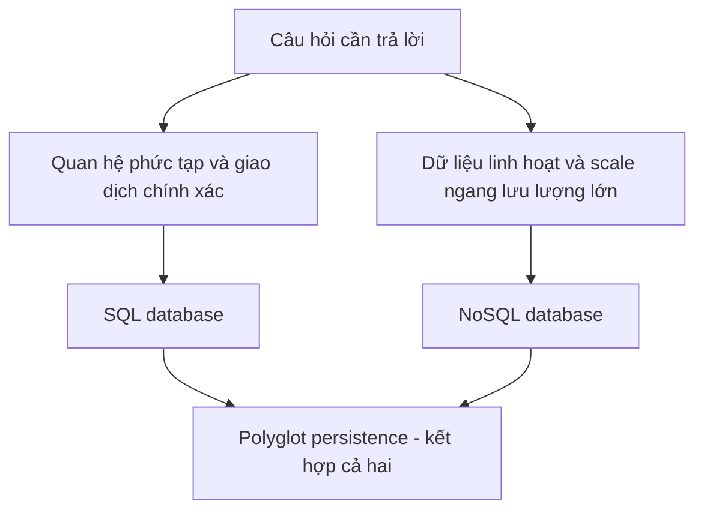

# 🗃️ SQL vs NoSQL — hai triết lý database và cách chọn đúng cho hệ thống

> Nguồn: `040-Understanding-Database-Models-SQL-vs-NoSQL.txt` · [Udemy](https://ua.udemy.com/course/mastering-system-design-from-basics-to-cracking-interviews/learn/lecture/49554351)

Trong bài này, mình và các bạn sẽ mổ xẻ hai paradigm database thống trị thế giới phần mềm: **SQL** và **NoSQL** — chúng được thiết kế để giải quyết những bài toán khác nhau. Chúng ta sẽ đi từ triết lý thiết kế, thế mạnh, giới hạn cho tới cách kiến trúc sư ra quyết định dựa trên consistency, scalability và yêu cầu thực tế.

---

### 🎯 Database — lớp lưu trữ bền vững ở trung tâm hệ thống

Khi nói về system design, database là nền tảng vì gần như mọi ứng dụng có ý nghĩa đều cần dữ liệu **tồn tại lâu hơn một request hay một lần restart server**. Database cung cấp lớp **persistent (bền vững)** đó, giúp lưu thông tin đáng tin cậy và truy xuất hiệu quả khi ứng dụng cần.

Nhưng database không chỉ là nơi chứa dữ liệu. Nó cho phép **query, filter, update và quản lý dữ liệu có cấu trúc** — điều càng quan trọng khi ứng dụng lớn lên. Dù bạn đang lấy profile người dùng, xử lý một đơn hàng hay theo dõi hàng triệu giao dịch, database thường nằm ở **trung tâm của workflow**. Từ dự án cá nhân nhỏ tới nền tảng phân tán toàn cầu, database đóng vai trò **source of truth (nguồn sự thật)** của hệ thống.

Các công nghệ database khác nhau đưa ra những trade-off khác nhau về **performance, scalability, consistency và reliability** — đó chính là nội dung xuyên suốt bài học này.

---

### 🗄️ Relational databases — schema-first, joins và ACID

Relational database là xương sống của ứng dụng doanh nghiệp suốt nhiều thập kỷ, vì nó quản lý dữ liệu theo cách **có cấu trúc cao và dễ dự đoán**: dữ liệu được tổ chức thành **bảng gồm hàng và cột**, khiến quan hệ giữa các mảnh dữ liệu trở nên tường minh và dễ quản lý.

Sức mạnh của SQL database đến từ ba ý tưởng nền tảng — **structure, relationship và transactional reliability**:

1. **Schema-first** — trước khi lưu dữ liệu, ta định nghĩa cấu trúc: có trường nào, kiểu dữ liệu gì, ràng buộc nào. Sự kỷ luật này tạo thành **hợp đồng** về hình dạng dữ liệu, giúp giữ chất lượng và tính nhất quán khi hệ thống lớn lên, nhiều team cùng làm việc trên một database.
2. **Joins** — dữ liệu thực tế hiếm khi nằm trong một bảng: user, order, payment, product sống riêng; join nối chúng lại khi trả lời câu hỏi nghiệp vụ. Khả năng mô hình hóa và truy vấn quan hệ là **đặc trưng định hình** của relational database.
3. **ACID transactions** — đảm bảo giao dịch luôn đáng tin cậy kể cả khi lỗi hoặc concurrency cao: **Atomicity** (hoàn tất trọn vẹn hoặc không làm gì), **Consistency** (dữ liệu luôn hợp lệ theo luật đã định), **Isolation** (giao dịch đồng thời không phá hỏng nhau), **Durability** (thay đổi đã commit sống sót qua crash và lỗi hệ thống).

Sức mạnh truy vấn cũng là điểm cộng lớn: bằng `SQL`, kỹ sư có thể filter, aggregate, sort và kết hợp dữ liệu qua nhiều bảng với độ linh hoạt cao. Đó là lý do **MySQL, PostgreSQL, Oracle** vẫn giữ vai trò quan trọng ở nơi đề cao **data integrity, business rules phức tạp và độ chính xác giao dịch** — ngân hàng, thương mại điện tử, hệ thống doanh nghiệp. Nói ngắn gọn: schema, joins và ACID khiến relational database là lựa chọn ưu tiên khi **tính đúng đắn là điều không thể thương lượng** — banking, payment, healthcare, inventory management.

Tuy nhiên, mọi lựa chọn kiến trúc đều có trade-off. Khi hệ thống tăng scale và độ phức tạp, chính thế mạnh của relational database có thể thành **giới hạn**:

* **Data model thay đổi nhanh** — vì phụ thuộc schema định trước, thêm field hay đổi cấu trúc thường xuyên đòi hỏi migration, phối hợp và lập kế hoạch kỹ; sự "cứng" này có thể làm chậm phát triển.
* **Horizontal scalability** — relational database xuất sắc trên một server mạnh, nhưng phân tán dữ liệu qua nhiều máy kéo theo phức tạp về `sharding`, `replication` và `consistency`; ở scale internet, việc scale SQL truyền thống ngày càng khó và đắt đỏ về vận hành.
* **Dữ liệu linh hoạt hoặc lồng sâu** — document, event payload, metadata người dùng tạo, cấu trúc JSON... không nằm gọn trong hàng cột; dù SQL có hỗ trợ JSON, mô hình quan hệ không phải lúc nào cũng trực quan nhất cho các workload này.

Những giới hạn này **không** khiến relational database lỗi thời — chúng chỉ cho thấy bài toán khác nhau cần storage model khác nhau. Và đó chính là lý do **NoSQL** ra đời.

---

### 📦 NoSQL — cả một họ mô hình, không phải một công nghệ

Khi ứng dụng bắt đầu xử lý lượng dữ liệu khổng lồ và phục vụ hàng triệu người dùng, kỹ sư nhận ra mô hình quan hệ truyền thống không phải lúc nào cũng phù hợp nhất. NoSQL ra đời để giải quyết các thách thức đó, ưu tiên **flexibility, scalability và performance** cho những kiểu workload cụ thể.

Khác biệt then chốt: nhiều NoSQL database cho phép cấu trúc dữ liệu **tiến hóa mà không cần định nghĩa schema cứng ngắc từ đầu** — phù hợp với ứng dụng thay đổi nhanh, nội dung người dùng tạo, event data và những nơi hình dạng dữ liệu khó đoán trước.

Điều rất quan trọng: **NoSQL không phải một công nghệ duy nhất**, mà là một **gia đình các database model**, mỗi loại tối ưu cho một bài toán:

| Mô hình | Ví dụ | Đặc điểm | Phù hợp với |
|---|---|---|---|
| **Document** | MongoDB | Lưu cấu trúc JSON-like giàu thông tin, dữ liệu liên quan nằm chung một document | User profile, product catalog, CMS, dữ liệu phân cấp tự nhiên |
| **Key-value** | Redis, DynamoDB | Cho key, trả value với tốc độ cực nhanh, độ trễ thấp | Caching, session management, leaderboard, lookup throughput cao |
| **Columnar** | — | Tổ chức dữ liệu khác hệ thống row-based, xử lý khối lượng write lớn và dataset khổng lồ phân tán | Time-series, event stream, telemetry, analytics quy mô lớn |
| **Graph** | Neo4j | Tối ưu cho **quan hệ** thay vì record hay document | Friends of friends, recommendation path, mạng phát hiện gian lận |

Một kiến trúc sư kinh nghiệm không chọn NoSQL vì nó "mới hơn" hay "scale hơn", mà chọn **đúng mô hình NoSQL khớp với access pattern, cấu trúc dữ liệu và yêu cầu scale** của ứng dụng. Database đúng hiếm khi là chuyện phổ biến của công nghệ — đó là chuyện **khớp storage model với bài toán cần giải**. Trước khi chọn, hãy hỏi: *ứng dụng sẽ đọc và ghi dữ liệu như thế nào?*

Khi database phân tán qua nhiều server và nhiều region, kỹ sư đối mặt thách thức cơ bản: giữ consistency hoàn hảo ở mọi nơi có thể **giảm mạnh availability và scalability**. Nhiều hệ NoSQL giải quyết bằng cách theo đuổi **mô hình BASE**:

* Trong hệ phân tán quy mô lớn, **được phục vụ người dùng** thường quan trọng hơn việc mọi node phản ánh cập nhật mới nhất ngay lập tức.
* Vì dữ liệu được replicate qua nhiều node, các replica có thể **tạm thời giữ giá trị khác nhau** — gọi là **soft state (trạng thái mềm)**; hệ thống liên tục tiến về một góc nhìn đồng bộ.
* Theo thời gian, cập nhật lan truyền qua cluster và mọi replica **cuối cùng đồng ý trên cùng giá trị** — đây là **eventual consistency (nhất quán sau cùng)**.

Trade-off này phổ biến ở social feed, product catalog, caching layer và ứng dụng web quy mô lớn — nơi phục vụ hàng triệu người dùng đáng tin cậy quan trọng hơn đảm bảo nhất quán tức thời cho mọi read. **BASE không tốt hơn hay kém hơn ACID** — nó chỉ ưu tiên một bộ trade-off khác để đạt scalability và availability cao hơn trong hệ phân tán.

---

### 🔍 CAP theorem nhìn lại và khi nào chọn gì?

**CAP theorem** là một trong những mental model quan trọng nhất của system design, vì nó giải thích vì sao các database phân tán đưa ra lựa chọn kiến trúc khác nhau. Khi dữ liệu nằm trên nhiều server, network failure không còn là giả thuyết — nó là **điều tất yếu**.

Trong một network partition, hệ thống đối mặt quyết định khó: ưu tiên **consistency** (người dùng luôn thấy dữ liệu mới nhất, đúng nhất) hay ưu tiên **availability** (mọi request đều nhận phản hồi). Làm cả hai cùng lúc trong lúc partition là **không thể**. Vì thế:

* Hệ **SQL phân tán truyền thống** thường nghiêng về consistency — thà từ chối request còn hơn mạo hiểm trả dữ liệu sai; phổ biến ở banking, payment, inventory management.
* Nhiều hệ **NoSQL** chọn ngược lại — ưu tiên availability, vẫn phục vụ request kể cả khi một số node chưa nhận cập nhật mới nhất; cái giá là tạm thời inconsistent, được giải quyết sau bằng cơ chế eventual consistency.

Một nuance quan trọng: CAP **không phải lựa chọn CP hay AP một lần rồi mãi mãi**. Database hiện đại thường cho phép tinh chỉnh trade-off theo workload và yêu cầu kinh doanh. Bài học thật sự: mọi hệ phân tán đều phải quyết định điều gì quan trọng nhất **khi lỗi xảy ra** — và quyết định đó phải xuất phát từ **nhu cầu kinh doanh**, không phải sở thích công nghệ.

Vậy khi nào chọn gì? SQL và NoSQL hiếm khi là câu hỏi "cái nào tốt hơn" — câu hỏi thật là **cái nào khớp nhất với yêu cầu hệ thống đang xây**:

| Tiêu chí | SQL | NoSQL |
|---|---|---|
| Thế mạnh | Consistency, toàn vẹn giao dịch, quan hệ phức tạp | Flexibility, horizontal scalability, workload phân tán hiệu năng cao |
| Scale | Chủ yếu scale dọc, phân tán phức tạp | Sinh ra để scale ngang qua nhiều máy |
| Phù hợp với | Banking, ERP, inventory, order management — nơi quan hệ và tính đúng đắn là tối quan trọng | IoT, recommendation engine, activity feed, caching layer, logging quy mô lớn |

Một bài học kiến trúc quan trọng: hệ thống hiện đại hiếm khi chọn **độc quyền một bên**. Pattern phổ biến là **polyglot persistence (đa lưu trữ)** — dùng database khác nhau cho workload khác nhau. Ví dụ, một sàn thương mại điện tử có thể dùng **relational database cho đơn hàng và thanh toán**, **document database cho product catalog**, và **Redis cho caching**. Phần lớn kiến trúc sư chọn đúng storage model cho từng bài toán, thay vì ép mọi workload vào một công nghệ duy nhất.

---

### 🎯 Tự kiểm tra nhanh

**Câu 1:** Cách tiếp cận schema-first của relational database mang lại lợi ích gì?

<b>Xem đáp án</b>

**Đáp án:** Tạo hợp đồng về hình dạng dữ liệu, giúp giữ chất lượng và tính nhất quán khi hệ thống lớn lên.

Giải thích: Schema định trước quy định field, kiểu dữ liệu và ràng buộc — hữu ích khi nhiều team cùng làm việc trên một database.

Tham chiếu: Mục Relational databases — schema-first, joins và ACID.

**Câu 2:** ACID là viết tắt của những gì?

<b>Xem đáp án</b>

**Đáp án:** Atomicity, Consistency, Isolation, Durability.

Giải thích: Bốn đảm bảo này giữ giao dịch đáng tin cậy kể cả khi lỗi hoặc concurrency cao.

Tham chiếu: Mục Relational databases — schema-first, joins và ACID.

**Câu 3:** Vì sao relational database gặp khó khi scale ngang ở quy mô internet?

<b>Xem đáp án</b>

**Đáp án:** Phân tán dữ liệu qua nhiều máy kéo theo phức tạp về sharding, replication và consistency, kèm chi phí vận hành cao.

Giải thích: Relational database xuất sắc trên một server mạnh nhưng phân tán thì ngày càng khó và đắt.

Tham chiếu: Mục Relational databases — schema-first, joins và ACID.

**Câu 4:** Soft state và eventual consistency trong mô hình BASE nghĩa là gì?

<b>Xem đáp án</b>

**Đáp án:** Các replica có thể tạm thời giữ giá trị khác nhau, rồi cuối cùng đồng bộ về cùng một giá trị.

Giải thích: Hệ thống ưu tiên vẫn phục vụ người dùng, chấp nhận dữ liệu tạm cũ thay vì chờ nhất quán tức thời.

Tham chiếu: Mục NoSQL — cả một họ mô hình, không phải một công nghệ.

**Câu 5:** Polyglot persistence là gì, và trade-off của nó?

<b>Xem đáp án</b>

**Đáp án:** Dùng nhiều loại database cho nhiều workload khác nhau; cái giá là tăng độ phức tạp vận hành.

Giải thích: Ví dụ e-commerce dùng relational cho đơn hàng, document cho catalog, Redis cho caching — nhưng phải quản lý, giám sát, backup nhiều công nghệ hơn.

Tham chiếu: Mục CAP theorem nhìn lại và khi nào chọn gì.

---

Vậy là chúng ta đã có bức tranh đầy đủ: SQL và NoSQL được thiết kế cho những bài toán khác nhau, và hiểu trade-off là điều **tách biệt quyết định kiến trúc với việc chỉ chọn một công nghệ**. Ở bài tiếp theo, chúng ta sẽ đi vào các kỹ thuật giúp database vận hành ở quy mô lớn: `sharding`, `replication` và polyglot persistence. Hẹn gặp lại các bạn! 🚀
