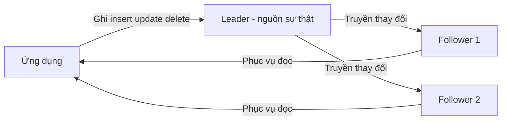
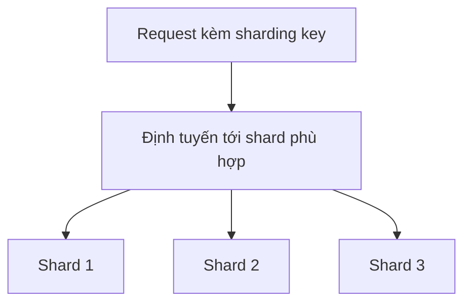

# 🧩 Sharding, Replication và Polyglot Persistence — bộ ba giúp database scale

> Nguồn: `041-Advanced-Database-Topics-Sharding-Replication-Polyglot-Persi.txt` · [Udemy](https://ua.udemy.com/course/mastering-system-design-from-basics-to-cracking-interviews/learn/lecture/49554355)

Chúng ta đã hiểu SQL và NoSQL khác nhau ở đâu; giờ là lúc trả lời câu hỏi tiếp theo: **làm sao để database chịu được quy mô lớn?** Bài này, mình và các bạn sẽ đi qua ba kỹ thuật nâng cao vận hành các hệ thống lớn — `replication` để chống lỗi, `sharding` để scale ngang, và **polyglot persistence** để chọn đúng database cho từng workload.

---

### 🎯 Scale dọc hay scale ngang — lựa chọn nền tảng

Một trong những khác biệt kiến trúc quan trọng nhất giữa SQL và NoSQL là **cách chúng scale khi nhu cầu tăng**:

* **SQL truyền thống scale dọc (vertical scaling)** — khi database thành nút thắt, cách xử lý quen thuộc là làm server to hơn: nhiều CPU hơn, nhiều memory hơn, storage nhanh hơn. Cách này giữ kiến trúc tương đối đơn giản và vẫn hưởng lợi từ **đảm bảo ACID mạnh** cùng consistency dễ dự đoán. Nhưng mọi máy đều có **trần**: tới lúc chạm giới hạn phần cứng, nâng cấp ngày càng đắt, và database trở thành **single point of failure** của cả hệ thống.
* **NoSQL scale ngang (horizontal scaling)** — thay vì xây máy to hơn, chúng **phân tán dữ liệu và traffic qua nhiều máy**. Mô hình này cho phép hệ thống lớn gần như **tăng dần từng bước** khi nhu cầu lên — phù hợp tự nhiên với ứng dụng scale internet, workload toàn cầu, dataset khổng lồ. Nó cũng tăng resilience vì hệ thống vẫn chạy khi từng node lỗi.

Cái giá của scale ngang là **độ phức tạp**: dữ liệu nằm trên nhiều node kéo theo partitioning, replication, synchronization và consistency trở thành một phần của kiến trúc. Đó là lý do nhiều hệ NoSQL **nới lỏng đảm bảo consistency nghiêm ngặt** và chấp nhận `eventual consistency` để đạt availability và scalability cao hơn.

**Bài học kiến trúc:** đây không đơn thuần là quyết định SQL vs NoSQL, mà là trade-off giữa **đơn giản và scale phân tán**. Nếu consistency và toàn vẹn giao dịch chi phối yêu cầu, scale dọc với SQL thường là đủ; nếu thách thức chính là tăng trưởng người dùng, traffic hay dữ liệu, scale ngang là con đường thực tế hơn.

---

### 🔁 Replication — bản sao để chống lỗi và mở rộng đọc

`Replication` ra đời vì database dần trở nên quá quan trọng để phụ thuộc vào một máy duy nhất. Nếu máy đó lỗi, quá tải, hay mất kết nối, toàn bộ ứng dụng gặp nguy. Replication duy trì **các bản sao của cùng dữ liệu trên nhiều database node**, mang lại hai lợi ích lớn:

* **Resilience** — nếu một node không khả dụng, replica khác tiếp tục phục vụ request, cải thiện đáng kể fault tolerance và availability.
* **Scale cho đọc** — ở nhiều ứng dụng, read traffic vượt xa write traffic; phân tán read qua nhiều replica giúp tăng throughput mà không phải liên tục nâng cấp một server.

Tuy nhiên, replication mang theo trade-off nền tảng của hệ phân tán — **consistency so với availability**. Khoảnh khắc dữ liệu tồn tại trên nhiều node, giữ mọi bản sao đồng bộ hoàn hảo trở nên khó khăn, đặc biệt khi mạng lỗi hoặc partition. Nhiều hệ thống thực tế chọn ưu tiên availability, chấp nhận replica tạm thời lệch nhau, dẫn tới eventual consistency. Câu hỏi đúng cho kiến trúc sư không phải *"có dùng replication không?"* mà là *"business cần mức đảm bảo consistency nào?"* — banking ưu tiên consistency; social media, e-commerce, content platform thường chấp nhận độ trễ replication nhỏ để đổi lấy availability và scalability tốt hơn.

**Leader-Follower Replication** là kiến trúc được dùng rộng rãi nhất vì nó **tách trách nhiệm ghi và đọc**: leader là **nguồn sự thật duy nhất** — mọi write (insert, update, delete) đều commit vào leader trước, sau đó thay đổi được lan truyền tới một hoặc nhiều follower, vốn chủ yếu phục vụ read request. Khi nhu cầu đọc tăng, ta thêm follower và phân tán query qua chúng. Nhưng vì phần lớn hệ production dùng replication **bất đồng bộ (asynchronous)** để không làm chậm write, tồn tại một khoảng trễ nhỏ giữa lúc thay đổi commit trên leader và lúc nó xuất hiện trên follower — trong khoảng đó, người dùng đọc từ follower có thể thấy **dữ liệu cũ**. Đây là trade-off kinh điển: đổi scalability, performance và availability lấy nhất quán tức thời. Kiến trúc sư phải quyết định liệu ứng dụng chịu được read hơi cũ, hay một số thao tác luôn phải đọc trực tiếp từ leader.

**Read replicas** là cách đơn giản và hiệu quả nhất để scale database khi nút thắt là **read traffic** chứ không phải write. Ở nhiều hệ thực tế — trang tin, e-commerce, social feed, nền tảng streaming — số read có thể lớn hơn số write **hàng trăm hay hàng nghìn lần**. Read replica tạo thêm các bản sao phục vụ read độc lập; mọi write vẫn đi vào primary database, replica đồng bộ với nó và phục vụ query. Lợi thế lớn là **linh hoạt vận hành**: khi traffic tăng vọt, có thể thêm replica với rất ít thay đổi ở ứng dụng. Trade-off vẫn là consistency — vì replica thường cập nhật bất đồng bộ, các thao tác quan trọng như xem số dư hay trạng thái đơn hàng vừa thay đổi có thể vẫn phải đọc từ primary. Read replica là **công cụ scale có mục tiêu**: không giải quyết write bottleneck, nhưng thường là cách nhanh và tiết kiệm nhất để tăng dung lượng database khi read chiếm ưu thế.

---

### 🧩 Sharding — vượt giới hạn của một node

`Sharding` là thứ các tổ chức chuyển sang khi database **không còn được scale hiệu quả bằng replication hay phần cứng to hơn**. Tới một điểm, thách thức không chỉ là phục vụ nhiều request hơn, mà là khối lượng dữ liệu và write traffic vượt xa khả năng của một node.

Ý tưởng cốt lõi rất đơn giản: thay vì lưu toàn bộ dữ liệu trong một database, ta **partition (phân vùng) dữ liệu** qua nhiều database độc lập gọi là **shard**. Mỗi shard sở hữu một phần dataset và chỉ xử lý request liên quan tới phần đó. Phân tán cả storage lẫn workload giúp hệ thống tiếp tục lớn lên bằng cách thêm shard.

Hai cách tiếp cận chính:

* **Horizontal sharding (phân mảnh ngang)** — các hàng được phân bố qua shard dựa trên **sharding key** (user ID, customer ID, hoặc region). Cả storage lẫn write throughput scale theo dataset — lựa chọn phổ biến của ứng dụng scale internet.
* **Vertical sharding (phân mảnh dọc)** — không chia hàng, mà tách dữ liệu theo **business function hoặc access pattern**: user profile, billing data, analytics data nằm ở database riêng. Hữu ích khi các phần của ứng dụng có yêu cầu hiệu năng hoặc tốc độ tăng trưởng rất khác nhau.

Nhưng sharding **không phải bản nâng cấp scale miễn phí**. Khi dữ liệu đã phân tán, hệ thống phải xác định dữ liệu nằm đâu, định tuyến request tới đúng shard, và xử lý các thao tác **xuyên nhiều shard** — độ phức tạp kiến trúc tăng đáng kể. Vì thế, sharding thường được coi là **chiến lược scale giai đoạn sau**: kỹ thuật cho phép vượt giới hạn của một database node về storage capacity và write throughput.

Chọn đúng chiến lược sharding quan trọng không kém việc quyết định shard:

| Chiến lược | Cách chia | Ưu điểm | Đánh đổi |
|---|---|---|---|
| **Range-based** | Theo dải giá trị | Dễ hiểu, dễ triển khai; range query hiệu quả vì bản ghi liên quan nằm cạnh nhau | Tăng trưởng không đều có thể khiến một shard quá tải — tạo hotspot |
| **Hash-based** | Dùng hàm hash để rải dữ liệu | Phân phối tải đều hơn, tránh một shard thành bottleneck | Mất thứ tự tự nhiên; range query phức tạp, thường phải hỏi nhiều shard |
| **Consistent hashing** | Băm có giảm thiểu di chuyển dữ liệu | Thêm/bớt node ít gây xáo trộn; scale mượt và phục hồi sau node failure ít gián đoạn | Là kỹ thuật phức tạp hơn, cần triển khai cẩn thận |
| **Geo-based** | Theo vị trí hoặc region của người dùng | Tối ưu latency, tuân thủ quy định, trải nghiệm người dùng và data residency | Dữ liệu phân mảnh theo địa lý, có thể không đều |

Một hạn chế lớn của hashing truyền thống xuất hiện khi cluster lớn lên: thêm hoặc bỏ node làm thay đổi phân phối hash, buộc **lượng lớn dữ liệu phải phân bố lại**. **Consistent hashing** sinh ra để giải quyết đúng vấn đề này — giảm thiểu dữ liệu phải di chuyển khi topology thay đổi, giúp hệ thống scale duyên dáng hơn và phục hồi sau node failure ít gián đoạn hơn. Đây là một trong những kỹ thuật then chốt đằng sau các distributed database có độ co giãn cao.

**Bài học kiến trúc:** không có chiến lược sharding tốt nhất cho mọi trường hợp — hash-based tối ưu phân phối, range-based tối ưu query locality, consistent hashing tối ưu độ co giãn, geo-based tối ưu locality. Hệ phân tán trưởng thành thường **kết hợp nhiều cách** để cân bằng performance, scalability và tính đơn giản vận hành.

---

### 💡 Polyglot persistence — đúng công cụ cho đúng workload

**Polyglot persistence** là một tư duy kiến trúc thừa nhận một thực tế đơn giản: **các bài toán dữ liệu khác nhau thường cần giải pháp database khác nhau**. Ở ứng dụng nhỏ, việc lưu tất cả trong một database là bình thường; nhưng khi hệ thống lớn lên, workload trở nên đa dạng — database giỏi xử lý giao dịch có thể không phải lựa chọn tốt nhất cho full-text search, analytics, caching hay lưu event khối lượng lớn. Cố ép một database làm mọi việc thường dẫn tới **nghẽn hiệu năng và thỏa hiệp kiến trúc**.

Polyglot persistence cho phép mỗi service hoặc component dùng database khớp nhất với yêu cầu của nó:

* **Relational database** quản lý dữ liệu giao dịch nghiệp vụ.
* **Search engine** phục vụ product discovery.
* **Document database** lưu schema linh hoạt.
* **Analytics platform** xử lý workload báo cáo quy mô lớn.

Lợi thế then chốt là **tối ưu hóa**: thay vì chấp nhận giải pháp một-cỡ-cho-tất-cả, mỗi workload hưởng lợi từ cấu trúc lưu trữ, chiến lược indexing và khả năng truy vấn thiết kế riêng cho nó — dẫn tới hiệu năng tốt hơn, scalability tốt hơn và sử dụng tài nguyên hiệu quả hơn. Còn trade-off, dĩ nhiên, là **độ phức tạp vận hành tăng**: nhiều database nghĩa là nhiều công nghệ phải quản lý, giám sát, bảo mật, backup và bảo trì. Vì vậy đừng áp dụng polyglot persistence chỉ vì nó phổ biến — mục tiêu **không phải dùng thật nhiều database**, mà là giải quyết từng bài toán dữ liệu bằng công nghệ phù hợp nhất.

*Quy tắc ngón tay cái: hãy bắt đầu đơn giản với một database khi có thể, và chỉ thêm data store mới khi một yêu cầu rõ ràng về scalability, performance hoặc business biện minh cho độ phức tạp tăng thêm.* Đó là cách polyglot persistence trở thành **quyết định kiến trúc chiến lược** thay vì một lựa chọn công nghệ theo trào lưu.

---

### 🎯 Tự kiểm tra nhanh

**Câu 1:** Vì sao scale dọc bằng SQL có giới hạn?

<b>Xem đáp án</b>

**Đáp án:** Mọi máy đều có trần phần cứng — nâng cấp ngày càng đắt và database trở thành single point of failure.

Giải thích: Scale dọc giữ kiến trúc đơn giản và đảm bảo ACID mạnh, nhưng không thể mở rộng mãi.

Tham chiếu: Mục Scale dọc hay scale ngang — lựa chọn nền tảng.

**Câu 2:** Trong leader-follower replication, write và read được phân công thế nào?

<b>Xem đáp án</b>

**Đáp án:** Mọi write commit vào leader — nguồn sự thật duy nhất; follower chủ yếu phục vụ read.

Giải thích: Khi nhu cầu đọc tăng, thêm follower để phân tán query, nhưng replication bất đồng bộ có thể gây đọc dữ liệu cũ trong khoảng trễ nhỏ.

Tham chiếu: Mục Replication — bản sao để chống lỗi và mở rộng đọc.

**Câu 3:** Read replicas giải quyết vấn đề gì và không giải quyết vấn đề gì?

<b>Xem đáp án</b>

**Đáp án:** Giải quyết read bottleneck; không giải quyết write bottleneck.

Giải thích: Mọi write vẫn đi vào primary database, replica chỉ phục vụ query đọc.

Tham chiếu: Mục Replication — bản sao để chống lỗi và mở rộng đọc.

**Câu 4:** Đánh đổi chính giữa range-based và hash-based sharding là gì?

<b>Xem đáp án</b>

**Đáp án:** Range-based giữ bản ghi liên quan cạnh nhau, range query hiệu quả nhưng dễ hotspot; hash-based phân phối đều hơn nhưng mất thứ tự tự nhiên, range query phức tạp.

Giải thích: Range-based có thể khiến một shard quá tải nếu dữ liệu mới liên tục rơi vào cùng một dải.

Tham chiếu: Mục Sharding — vượt giới hạn của một node.

**Câu 5:** Consistent hashing giải quyết vấn đề gì của hashing truyền thống?

<b>Xem đáp án</b>

**Đáp án:** Giảm thiểu lượng dữ liệu phải phân bố lại khi thêm hoặc bỏ node khỏi cluster.

Giải thích: Nhờ đó hệ thống scale mượt hơn và phục hồi sau node failure ít gián đoạn hơn — nền tảng của các distributed database co giãn cao.

Tham chiếu: Mục Sharding — vượt giới hạn của một node.

---

Vậy là các bạn đã nắm trọn bộ ba kỹ thuật: `replication` cho availability và read scale, `sharding` cho storage capacity và write throughput, polyglot persistence cho việc chọn đúng công cụ. Điểm chung của tất cả: **không có kiến trúc database vạn năng — chỉ có trade-off được chọn đúng**. Ở bài tiếp theo, chúng ta sẽ bước ra khỏi thế giới database để khám phá **object storage** — trụ cột của kiến trúc cloud hiện đại. Hẹn gặp lại các bạn! 🚀
