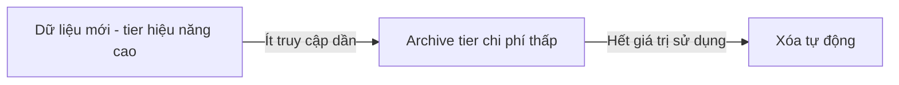

# 📦 Object Storage — trụ cột lưu trữ phi cấu trúc của cloud hiện đại

> Nguồn: `042-Object-Storage-in-Modern-Systems.txt` · [Udemy](https://ua.udemy.com/course/mastering-system-design-from-basics-to-cracking-interviews/learn/lecture/49554357)

Trong bài này, mình và các bạn sẽ khám phá **object storage** — nền tảng của mọi cloud data platform hiện đại. Chúng ta sẽ hiểu vì sao các dịch vụ như **S3, Blob Storage và Google Cloud Storage** trở thành lựa chọn mặc định để lưu dữ liệu ở quy mô khổng lồ, cùng những trade-off mà kiến trúc sư cần nắm trước khi dùng.

---

### 🎯 Object storage là gì?

Ý tưởng cốt lõi: dữ liệu được lưu thành những **object tự chứa (self-contained)** thay vì file nằm trong thư mục hay block gắn vào ổ đĩa. Mỗi object kết hợp ba thành phần:

* **Dữ liệu thực tế** của object.
* **Định danh duy nhất (unique identifier)** dùng để truy xuất.
* **Metadata phong phú** mô tả object và cách nó nên được quản lý.

Thiết kế này trở nên cực kỳ mạnh mẽ ở quy mô lớn vì hệ thống lưu trữ **không còn phụ thuộc cấu trúc thư mục truyền thống hay volume cố định**. Thay vào đó, object sống trong một **flat namespace (không gian tên phẳng)** và có thể được phân tán minh bạch qua hàng nghìn server.

Đó là lý do object storage trở thành lựa chọn mặc định cho khối lượng lớn **unstructured data (dữ liệu phi cấu trúc)**: hình ảnh, video, tài liệu, backup, log và nội dung data lake. Các dịch vụ như **Amazon S3** thể hiện mô hình này ở quy mô khổng lồ — cho phép tổ chức lưu **hàng tỷ object** trong khi vẫn giữ durability, availability cao và khả năng tăng trưởng gần như vô hạn.

---

### 📦 Object, bucket và metadata — ba khái niệm cốt lõi

Để làm việc hiệu quả với object storage, kiến trúc sư cần nắm ba khái niệm:

1. **Object** — đơn vị xây dựng cơ bản. Khác hệ thống lưu trữ truyền thống tách dữ liệu khỏi thuộc tính, object là **gói tự chứa**: dữ liệu đi cùng định danh và metadata. Nhờ đó object **di động, độc lập và dễ quản lý** ở quy mô khổng lồ.
2. **Bucket** — vùng chứa logic để tổ chức object. Trên cloud như Amazon S3, mọi object đều thuộc một bucket, và một bucket đơn lẻ có thể chứa số lượng object khổng lồ — nhóm và quản lý dữ liệu liên quan mà không cần cấu trúc thư mục sâu nhiều tầng.
3. **Metadata** — yếu tố thật sự tạo khác biệt. Ngoài thông tin cơ bản như **content type, kích thước, timestamp**, metadata có thể chứa thuộc tính riêng của ứng dụng: **quyền sở hữu, thông tin dự án, retention policy (chính sách lưu giữ), phân loại truy cập**. Chính ngữ cảnh bổ sung này cho phép ứng dụng tìm kiếm, tự động hóa, bảo vệ và quản lý dữ liệu thông minh hơn nhiều.

Cùng nhau, bộ ba object — bucket — metadata tạo nên nền tảng giúp object storage **scale hiệu quả mà vẫn linh hoạt, dễ vận hành**.

---

### 🌐 Các nền tảng phổ biến và use case thực tế

Khi object storage trở thành xương sống của ứng dụng cloud-native, nhiều nền tảng xuất hiện, mỗi cái tối ưu cho một hệ sinh thái và nhu cầu vận hành khác nhau:

| Nền tảng | Đặc điểm nổi bật | Phù hợp với |
|---|---|---|
| **Amazon S3** | Được xem là chuẩn mực của ngành; định hình nhiều pattern và API mà nền tảng khác noi theo | Backup, media, analytics, data lake — gần như mọi ngành |
| **Google Cloud Storage** | Tập trung vào đơn giản và tích hợp sâu với hệ sinh thái dữ liệu, AI của Google | Tổ chức đầu tư mạnh vào analytics, machine learning, big data pipeline |
| **Azure Blob Storage** | Hấp dẫn với môi trường Microsoft-centric | Ứng dụng dùng Azure, .NET, enterprise tooling của Microsoft; governance và bảo mật mạnh |
| **MinIO, Ceph** | Mang object storage vào private data center và môi trường hybrid; API tương thích S3 | Nơi cần kiểm soát hạ tầng và data residency thay vì dồn hết dữ liệu lên public cloud |

**Bài học cho kiến trúc sư:** các khái niệm cốt lõi của object storage **gần như giống nhau giữa mọi nền tảng** — yếu tố quyết định thật sự là mức độ khớp hệ sinh thái, yêu cầu vận hành, yêu cầu tuân thủ và mức độ tích hợp với phần còn lại của kiến trúc.

Vậy object storage được dùng ở đâu trong hệ production?

* **Media content** — ứng dụng xử lý ảnh, video, tài liệu hay nội dung người dùng upload cần storage lớn gần như vô hạn mà không phải lập kế hoạch dung lượng phức tạp.
* **Backup và archival** — vì durability được ưu tiên hơn truy cập độ trễ thấp, tổ chức có thể lưu nhiều năm backup, hồ sơ tuân thủ và dữ liệu disaster recovery với chi phí tương đối thấp.
* **Data lake cho analytics** — thay vì nạp dữ liệu trực tiếp vào database, doanh nghiệp lưu raw dataset trong object storage trước, để nền tảng analytics, data warehouse và hệ thống AI xử lý khi cần.
* **Static website hosting** — object storage phục vụ file trực tiếp qua `HTTP`, trở thành cách đơn giản, tiết kiệm để host front-end, tài liệu, landing page, content portal mà không cần quản lý web server.
* **IoT và machine learning pipeline** — từ cảm biến của hàng triệu thiết bị tới hàng terabyte dữ liệu huấn luyện AI, object storage là **vùng hạ cánh scale được** để hấp thụ khối lượng dữ liệu khổng lồ và nuôi các hệ thống xử lý phía sau.

*Quy tắc ngón tay cái: khi xử lý dữ liệu phi cấu trúc quy mô lớn cần durability, scalability và hiệu quả chi phí, object storage thường là lựa chọn đầu tiên kiến trúc sư cân nhắc.*

---

### ⚠️ Những cân nhắc quan trọng trước khi dùng

Object storage được tối ưu cho **scalability và durability, không phải mọi workload**. Dùng nó hiệu quả nghĩa là hiểu cả thế mạnh lẫn trade-off:

* **Performance** — truy cập dữ liệu thường qua **network call và API**, nên latency tự nhiên cao hơn block hay file storage. Điều này hoàn toàn ổn với media file, backup, dataset analytics — nhưng **không phù hợp cho database hay ứng dụng nhạy latency**.
* **Throughput và scale** — đây là nơi object storage tỏa sáng: thiết kế để xử lý lượng lớn truy cập song song từ hàng nghìn client — lý do nó hợp với data lake, content delivery và pipeline xử lý quy mô lớn.
* **Consistency** — dù các nền tảng hiện đại đã cải thiện nhiều, kiến trúc sư vẫn phải hiểu **mức đảm bảo consistency** mà nhà cung cấp đưa ra và thiết kế ứng dụng tương ứng, vì storage semantics ảnh hưởng tới tốc độ dữ liệu mới ghi trở nên nhìn thấy được trong hệ phân tán.
* **Access pattern** — object storage hoạt động tốt nhất khi dữ liệu **ghi một lần, đọc nhiều lần**. Cập nhật thường xuyên, sửa đổi ngẫu nhiên hay workload ghi nối liên tục thường phù hợp hơn với file hoặc block storage.
* **Chi phí** — nhà cung cấp cloud có nhiều **storage class** từ tier hiệu năng cao cho dữ liệu đang hoạt động tới tier archive cho lưu giữ dài hạn; ghép dữ liệu với đúng class có thể **giảm chi phí đáng kể**. Nhưng hãy nhớ chi phí cloud không chỉ là dung lượng: **phí request, phí truy xuất dữ liệu và phí network egress** đôi khi còn vượt cả chi phí lưu trữ nếu workload không được thiết kế cẩn thận.

Vì vậy, một best practice phổ biến là **tự động hóa lifecycle management**: khi dữ liệu già đi và access pattern thay đổi, object được tự động chuyển từ standard storage sang tier archive rẻ hơn, hoặc xóa khi không còn cần.

Kết hợp lifecycle management với giám sát thường xuyên và phân tích mức sử dụng sẽ giữ object storage **hiệu quả vận hành lẫn chi phí ở quy mô lớn**. Tóm lại: object storage scale rất tốt, nhưng kiến trúc thành công tối ưu không chỉ cho dung lượng, mà còn cho **access pattern, yêu cầu consistency và quản lý chi phí dài hạn**.

---

### 🎯 Tự kiểm tra nhanh

**Câu 1:** Một object trong object storage gồm những thành phần nào?

<b>Xem đáp án</b>

**Đáp án:** Dữ liệu thực tế, định danh duy nhất và metadata.

Giải thích: Object là gói tự chứa — dữ liệu đi cùng định danh và ngữ cảnh quản lý, khiến nó di động và độc lập.

Tham chiếu: Mục Object, bucket và metadata — ba khái niệm cốt lõi.

**Câu 2:** Metadata của object storage khác gì so với thông tin file thông thường?

<b>Xem đáp án</b>

**Đáp án:** Ngoài content type, kích thước, timestamp, metadata còn chứa thuộc tính riêng của ứng dụng như quyền sở hữu, dự án, retention policy, phân loại truy cập.

Giải thích: Chính ngữ cảnh bổ sung này cho phép tìm kiếm, tự động hóa, bảo vệ và quản lý dữ liệu thông minh hơn.

Tham chiếu: Mục Object, bucket và metadata — ba khái niệm cốt lõi.

**Câu 3:** Vì sao object storage thường không phù hợp cho database?

<b>Xem đáp án</b>

**Đáp án:** Vì truy cập qua network call và API nên latency cao hơn block hay file storage.

Giải thích: Latency cao chấp nhận được với media, backup, dataset analytics nhưng không hợp với workload nhạy độ trễ.

Tham chiếu: Mục Những cân nhắc quan trọng trước khi dùng.

**Câu 4:** Access pattern nào là lý tưởng cho object storage?

<b>Xem đáp án</b>

**Đáp án:** Ghi một lần, đọc nhiều lần.

Giải thích: Cập nhật thường xuyên, sửa đổi ngẫu nhiên hay ghi nối liên tục phù hợp hơn với file hoặc block storage.

Tham chiếu: Mục Những cân nhắc quan trọng trước khi dùng.

**Câu 5:** Ngoài dung lượng, chi phí cloud storage còn đến từ đâu?

<b>Xem đáp án</b>

**Đáp án:** Phí request, phí truy xuất dữ liệu và phí network egress — đôi khi vượt cả chi phí lưu trữ.

Giải thích: Vì thế cần tự động hóa lifecycle management để chuyển dữ liệu sang archive tier hoặc xóa khi không cần.

Tham chiếu: Mục Những cân nhắc quan trọng trước khi dùng.

---

Vậy là các bạn đã hiểu vì sao object storage trở thành **khối xây dựng nền tảng của cloud hiện đại**: nó giải quyết bài toán lưu và quản lý dữ liệu phi cấu trúc ở quy mô gần như vô hạn. Câu hỏi quan trọng nhất không phải object storage tốt hay xấu, mà là **nó có khớp với workload, access pattern, yêu cầu latency, kỳ vọng consistency và chi phí của bạn không**. Hiểu được nó hợp ở đâu — và không hợp ở đâu — là kỹ năng thiết yếu của system design. Ở bài tiếp theo, chúng ta sẽ chuyển sang **file system và distributed storage**. Hẹn gặp lại các bạn! 🚀
