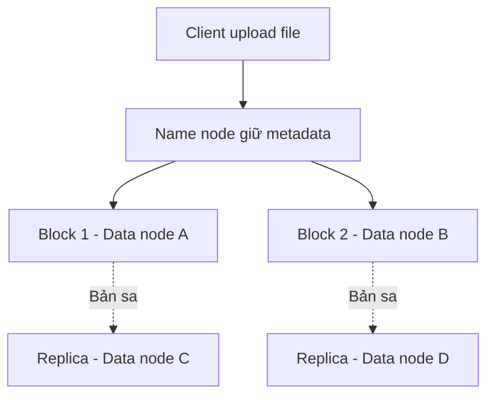

# 🗂️ File Systems và Distributed Storage — từ một máy đến cả cluster

> Nguồn: `043-File-Systems-and-Distributed-Storage.txt` · [Udemy](https://ua.udemy.com/course/mastering-system-design-from-basics-to-cracking-interviews/learn/lecture/49554359)

Trong bài này, mình và các bạn sẽ theo dõi hành trình của storage: từ **file system truyền thống** trên một máy, tới **distributed storage** — kiến trúc đang vận hành các hệ thống dữ liệu chuyên sâu ở quy mô lớn. Đây là nền tảng để hiểu vì sao big data, analytics và machine learning trở thành hiện thực.

---

### 🎯 File system — lớp mang cấu trúc cho storage thô

**File system** là lớp đưa cấu trúc lên storage thô. Không có nó, một ổ đĩa chỉ là tập hợp các block mà không hề biết gì về file, thư mục, quyền sở hữu hay phân quyền.

Hãy nghĩ về file system như **người tổ chức của hệ điều hành**. Nó:

* Theo dõi dữ liệu nằm ở đâu trên đĩa.
* Quản lý metadata như tên file, timestamp.
* Duy trì cấu trúc thư mục phân cấp.
* Thực thi kiểm soát truy cập.

Nhờ đó, ứng dụng lưu và truy xuất dữ liệu đáng tin cậy mà **không cần quan tâm bố cục vật lý** của thiết bị lưu trữ.

Các file system khác nhau được tối ưu cho môi trường khác nhau:

* **ext4** — lựa chọn phổ biến trên Linux.
* **NTFS** — chuẩn của Windows.
* **XFS** — thường dùng cho workload hiệu năng cao và quy mô lớn.

Những lựa chọn thiết kế này ảnh hưởng trực tiếp tới **performance, reliability, scalability và khả năng phục hồi** của hệ thống. Hiểu file system rất quan trọng vì nhiều giải pháp lưu trữ tầng cao hơn — từ network file share tới distributed storage platform — đều được xây trên chính những khái niệm nền tảng này.

---

### ⚠️ Giới hạn của file system truyền thống

File system truyền thống được thiết kế cho một thế giới đơn giản hơn: **một máy, một hệ thống lưu trữ**, số người dùng và ứng dụng tương đối ít.

Thế mạnh lớn nhất là **sự đơn giản** — dữ liệu tổ chức theo cấu trúc thư mục và file quen thuộc, dễ điều hướng và quản lý cho cả người dùng lẫn ứng dụng. Mô hình này hoạt động cực tốt trên desktop, laptop và server nhỏ, nơi storage tập trung một chỗ.

Thách thức xuất hiện khi hệ thống bắt đầu lớn lên — vì **file system sống trên một máy duy nhất**:

* Cả dung lượng lẫn hiệu năng đều bị giới hạn bởi tài nguyên của máy đó.
* Khi server hết dung lượng đĩa, CPU hay I/O throughput, việc scale trở nên rất khó — thường phải **nâng cấp phần cứng** thay vì phân tán workload.
* Các hệ thống cần hàng petabyte dữ liệu, hàng nghìn người dùng đồng thời và tính sẵn sàng cao sẽ gặp **nút thắt cổ chai**.

Chính những yêu cầu đó dẫn tới sự ra đời của **distributed file system (hệ thống file phân tán)** — mở rộng storage vượt qua giới hạn của một node.

---

### 🌐 Distributed file system — một hệ thống logic, nhiều máy

**Distributed file system (DFS)** ra đời để giải quyết giới hạn cơ bản của storage truyền thống: một máy chỉ lưu và phục vụ được bao nhiêu dữ liệu trước khi thành nút thắt.

Thay vì giữ tất cả file trên một server, DFS **trải dữ liệu qua nhiều node** trong khi vẫn trình bày mọi thứ như **một file system logic duy nhất**. Với ứng dụng và người dùng, nó trông như một nền tảng lưu trữ; nhưng phía sau, dữ liệu có thể nằm rải rác trên hàng chục hay hàng nghìn máy.

Kiến trúc này mang lại hai lợi thế lớn:

1. **Scalability** — dung lượng và throughput tăng lên chỉ bằng cách **thêm node**.
2. **Reliability** — file được **replicate qua nhiều máy**, nên hệ thống vẫn tiếp tục hoạt động khi từng server lỗi.

Ví dụ nổi tiếng nhất là **HDFS** — nền tảng lưu trữ của hệ sinh thái Hadoop, nơi dataset khổng lồ được phân tán qua cluster và xử lý song song. Cùng nguyên lý đó cũng được dùng trong nền tảng storage doanh nghiệp, môi trường tính toán khoa học, hệ thống media quy mô lớn và hạ tầng backup — nơi khối lượng dữ liệu và yêu cầu sẵn sàng vượt xa khả năng của một server.

Điểm chuyển dịch kiến trúc then chốt: từ **storage trên một máy** sang **storage như một dịch vụ phân tán** — nhờ đó hệ thống vừa scale vừa giữ được resilience khi dữ liệu và nhu cầu tiếp tục tăng.

| Tiêu chí | File system truyền thống | Distributed file system |
|---|---|---|
| Phạm vi | Một máy duy nhất | Nhiều node, hiển thị như một hệ thống logic |
| Scale | Nâng cấp phần cứng của máy đó | Thêm node vào cluster |
| Độ sẵn sàng | Server lỗi là điểm chết | File được replicate, node lỗi vẫn phục vụ được |
| Phù hợp với | Desktop, laptop, server nhỏ | Petabyte dữ liệu, analytics, media, backup quy mô lớn |

---

### 🔁 Kiến trúc DFS và cách replication vận hành

DFS không chỉ trải dữ liệu qua nhiều máy — nó còn cần cách **theo dõi dữ liệu nằm ở đâu** và **phục hồi duyên dáng khi lỗi xảy ra**. Vì thế, kiến trúc DFS thường **tách quản lý metadata khỏi lưu trữ dữ liệu thực tế**.

Trong HDFS:

* **Name node** chịu trách nhiệm metadata: nó biết cấu trúc thư mục, phân quyền và ánh xạ giữa file với các block dữ liệu bên dưới.
* **Data node** giữ nội dung thực tế của file — các block dữ liệu vật lý.

Khi một file được upload, nó bị **chia thành các block lớn** và phân tán qua cluster. Thay vì lưu cả file trên một máy, hệ thống rải các block qua nhiều node, cho phép **đọc ghi song song**. Kích thước block và cách phân bố block đóng vai trò quan trọng vì chúng giúp phân tán workload hiệu quả và cải thiện throughput cho dataset lớn.

Sức mạnh thật sự của DFS đến từ **replication**. Mỗi block được lưu trên nhiều data node theo **replication factor** cấu hình trước. Ví dụ, HDFS dùng **replication factor mặc định là 3** — mỗi block tồn tại trên ba máy riêng biệt. Nếu một data node lỗi, hệ thống tự động phục vụ dữ liệu từ replica khác, thường **không ai nhận ra đã có sự cố**. Chính sự kết hợp giữa metadata tập trung, block dữ liệu phân tán và replication mang lại cho DFS ba phẩm chất cốt lõi: **horizontal scalability, high availability và khả năng chống chịu lỗi phần cứng** — những yêu cầu thiết yếu khi quản lý storage qua hàng trăm hay hàng nghìn server.

Về **scalability và fault tolerance**, triết lý thiết kế của DFS rất rõ ràng: **scale ngang** — thay vì nâng cấp phần cứng to hơn, bạn mở rộng cluster bằng cách thêm node, mỗi node mới đóng góp dung lượng và băng thông xử lý, và các nền tảng DFS hiện đại còn **tự động tái cân bằng dữ liệu** khi node được thêm hoặc bỏ, tránh hotspot và giữ hiệu năng ổn định. Và **failure là giả định thiết kế** — trong cluster hàng nghìn server, lỗi phần cứng là chuyện **được mong đợi, không phải ngoại lệ**; DFS liên tục giám sát sức khỏe node và dùng replication để tự phục hồi, replica trên node khỏe mạnh tiếp tục phục vụ request trong khi hệ thống khôi phục mức replication mong muốn ở hậu cảnh.

Kết quả là một nền tảng vừa scale vừa resilient: dung lượng và throughput tăng liền mạch khi nhu cầu lớn lên, và khi lỗi xảy ra, hệ thống được thiết kế để **hấp thụ mà không ảnh hưởng availability**. Đó là lý do distributed file system trở thành khối xây dựng nền tảng cho big data, analytics, machine learning và các workload throughput cao khác.

---

### 🎯 Tự kiểm tra nhanh

**Câu 1:** File system làm gì cho storage thô?

<b>Xem đáp án</b>

**Đáp án:** Đưa cấu trúc lên storage — quản lý metadata, cấu trúc thư mục, kiểm soát truy cập và theo dõi dữ liệu nằm ở đâu.

Giải thích: Nhờ đó ứng dụng lưu và truy xuất dữ liệu mà không cần quan tâm bố cục vật lý của thiết bị.

Tham chiếu: Mục File system — lớp mang cấu trúc cho storage thô.

**Câu 2:** Giới hạn lớn nhất của file system truyền thống là gì?

<b>Xem đáp án</b>

**Đáp án:** Nó sống trên một máy duy nhất — dung lượng và hiệu năng bị giới hạn bởi tài nguyên máy đó.

Giải thích: Khi hết đĩa, CPU hay I/O throughput, cách duy nhất thường là nâng cấp phần cứng thay vì phân tán workload.

Tham chiếu: Mục Giới hạn của file system truyền thống.

**Câu 3:** DFS mang lại hai lợi thế chính nào?

<b>Xem đáp án</b>

**Đáp án:** Scalability — thêm node để tăng dung lượng và throughput; reliability — replicate file qua nhiều máy để chịu được server lỗi.

Giải thích: Với ứng dụng, DFS trông như một file system logic duy nhất dù dữ liệu nằm trên nhiều máy.

Tham chiếu: Mục Distributed file system — một hệ thống logic, nhiều máy.

**Câu 4:** Name node và data node trong HDFS khác nhau thế nào?

<b>Xem đáp án</b>

**Đáp án:** Name node quản lý metadata — cấu trúc thư mục, phân quyền, ánh xạ file với block; data node giữ các block dữ liệu vật lý.

Giải thích: Kiến trúc DFS tách quản lý metadata khỏi lưu trữ dữ liệu thực tế.

Tham chiếu: Mục Kiến trúc DFS và cách replication vận hành.

**Câu 5:** Replication factor mặc định của HDFS là bao nhiêu và mang lại điều gì?

<b>Xem đáp án</b>

**Đáp án:** Là 3 — mỗi block tồn tại trên ba máy riêng biệt.

Giải thích: Khi một data node lỗi, hệ thống tự phục vụ dữ liệu từ replica khác, thường không gây gián đoạn cho người dùng.

Tham chiếu: Mục Kiến trúc DFS và cách replication vận hành.

---

Vậy là các bạn đã thấy storage tiến hóa thế nào: file system là nền tảng của mọi thứ, nhưng khi dữ liệu vượt giới hạn một máy, **distributed file system** tiếp nhận vai trò — mang lại scalability, availability và fault tolerance mà hệ thống lớn yêu cầu. Và như mọi quyết định kiến trúc khác, **không có lựa chọn tốt nhất vạn năng** — chỉ có sự cân bằng phù hợp giữa performance, độ phức tạp vận hành, scalability và resilience. Ở bài tiếp theo, chúng ta sẽ đi vào **big data fundamentals** và những thách thức khi xử lý dữ liệu ở quy mô khổng lồ. Hẹn gặp lại các bạn! 🚀
