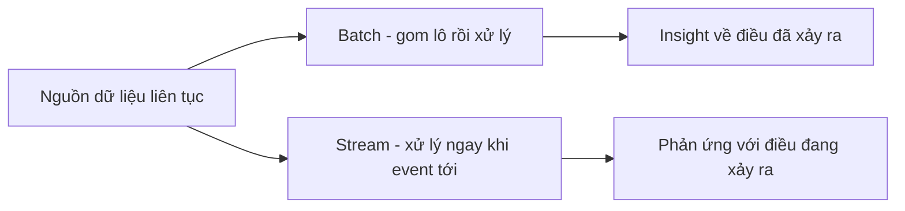

# 📊 Big Data Fundamentals — khi dữ liệu vượt khỏi tầm với của hệ thống truyền thống

> Nguồn: `044-Big-Data-Fundamentals.txt` · [Udemy](https://ua.udemy.com/course/mastering-system-design-from-basics-to-cracking-interviews/learn/lecture/49554363)

Gần như mọi hệ thống hiện đại đều **sinh dữ liệu liên tục** — mỗi cú click, request API, cảm biến, dòng log hay video upload đều tạo ra dữ liệu cần lưu và phân tích. Trong bài này, mình và các bạn sẽ tìm hiểu **big data là gì**, vì sao hệ thống truyền thống chật vật ở quy mô lớn, và những nguyên lý kiến trúc giúp lưu trữ, xử lý dataset khổng lồ hiệu quả.

---

### 🎯 Big Data là gì và vì sao storage truyền thống thất thế?

**Big Data** là những tập dữ liệu **quá lớn, di chuyển quá nhanh và quá phức tạp** đến mức các cách xử lý dữ liệu thông thường trở nên không đủ. Sự dịch chuyển này được thúc đẩy bởi web platform, ứng dụng mobile, thiết bị IoT, log sinh tự động và các hệ thống kết nối sản sinh dữ liệu **suốt ngày đêm**. Ở một quy mô nhất định, vấn đề không còn là lưu dữ liệu, mà là **xử lý nó hiệu quả, rút ra insight và làm điều đó với chi phí hợp lý** — chính vì thế ngành công nghiệp chuyển sang distributed storage, xử lý song song và các framework analytics chuyên biệt.

Hiểu vì sao storage truyền thống thất bại cũng quan trọng như hiểu big data, vì nó giải thích lý do cả hệ sinh thái big data phải ra đời:

1. **Scalability** — nhiều năm trời, scale storage rất đơn giản: mua server to hơn, thêm đĩa, thêm memory, thêm sức xử lý. Cách đó hiệu quả tới một điểm, nhưng khi dataset tăng từ gigabyte lên terabyte rồi petabyte, việc liên tục nâng cấp một máy **không còn thực tế cũng không bền vững** — cần khả năng trải dữ liệu qua nhiều máy.
2. **Performance** — kiến trúc truyền thống không được thiết kế cho **hàng nghìn lượt đọc ghi đồng thời** trên workload phân tán lớn. Khi nhu cầu tăng, **contention (tranh chấp) tăng**, latency leo thang và throughput trở thành giới hạn.
3. **Cost** — phần cứng doanh nghiệp cao cấp cực kỳ đắt, và mỗi lần nâng cấp lại lớn hơn, tốn kém hơn lần trước — tạo ra **lợi suất giảm dần** khi hệ thống lớn lên.
4. **Reliability** — trong môi trường quy mô lớn, lỗi phần cứng **không phải ngoại lệ mà là điều được mong đợi**. Storage truyền thống thường đối xử với lỗi như tình huống khẩn cấp, trong khi hệ phân tán hiện đại được thiết kế với **replication và tự động phục hồi ngay từ đầu**.

Đó là lý do các nền tảng big data chuyển sang kiến trúc **scale ngang**, chịu lỗi duyên dáng và đạt hiệu năng nhờ nhiều máy cùng làm việc — thay vì một server ngày càng mạnh.

---

### 📊 Sáu chữ V — lăng kính đánh giá dữ liệu lớn

Khi kỹ sư nói về big data, họ không chỉ nói tới **kích thước**. Thách thức thật sự đến từ nhiều chiều phức tạp, và ngành công nghiệp đúc kết thành **khung 6V**:

| Chữ V | Ý nghĩa | Hàm ý kiến trúc |
|---|---|---|
| **Volume** | Khối lượng dữ liệu khổng lồ được tạo ra | Cần phân tán thay vì dồn một máy |
| **Velocity** | Dữ liệu đến liên tục, cần xử lý gần thời gian thực — giao dịch chứng khoán, activity stream, telemetry IoT | Xử lý chậm làm giảm giá trị kinh doanh |
| **Variety** | Nhiều định dạng cùng lúc — bản ghi giao dịch, JSON event, ảnh, video, log | Vượt khỏi mô hình relational truyền thống, cần storage linh hoạt hơn |
| **Veracity** | Chất lượng dữ liệu — field thiếu, trùng lặp, cảm biến nhiễu, bản ghi không nhất quán | Làm sạch dữ liệu thường khó hơn phân tích |
| **Value** | Giá trị kinh doanh — insight tốt hơn, quyết định tốt hơn, kết quả đo lường được | Không có value, hàng petabyte chỉ là gánh nặng đắt đỏ |
| **Variability** | Dữ liệu hiếm khi tĩnh — hành vi người dùng đổi, ngôn ngữ tiến hóa, traffic dao động, ý nghĩa dữ liệu dịch chuyển | Hệ thống phải thích ứng, không giả định input dễ đoán |

Sáu chiều này là **lăng kính hữu ích để đánh giá hệ thống dữ liệu**: chúng giải thích vì sao big data cần storage, xử lý và analytics chuyên biệt thay vì cách tiếp cận truyền thống. Đặc biệt, **Veracity** nhắc ta rằng dữ liệu tồn tại chưa chắc đáng tin, còn **Value** nhắc rằng mục tiêu cuối cùng là insight và kết quả kinh doanh — chứ không phải thu thập thật nhiều dữ liệu.

---

### 💼 Những workload big data phổ biến

Big data không chỉ là chuyện lưu thông tin khối lượng lớn; nó tồn tại vì ứng dụng hiện đại sinh dữ liệu liên tục trong vận hành hằng ngày. Các workload điển hình:

* **Logs và events** — mọi service, API, database, server đều tạo dữ liệu vận hành dùng cho monitoring, troubleshooting, phân tích bảo mật và observability. Ở quy mô lớn, một nền tảng cỡ trung bình cũng có thể sinh **hàng triệu log event mỗi ngày**.
* **Clickstream** — mỗi lượt xem trang, tìm kiếm, click và tương tác tạo nên **dấu vết số**. Doanh nghiệp phân tích để hiểu hành vi người dùng, cải thiện trải nghiệm khách hàng, tối ưu hóa và thúc đẩy các recommendation engine.
* **IoT** — cảm biến, thiết bị thông minh, xe cộ và thiết bị công nghiệp tạo ra **dòng telemetry liên tục**. Giá trị thường đến từ việc xử lý đủ nhanh để **phát hiện bất thường, kích hoạt cảnh báo và ra quyết định thời gian thực**.
* **Machine learning** — huấn luyện model cần dataset lịch sử lớn, còn feature engineering, thử nghiệm và model versioning sinh thêm yêu cầu lưu trữ lẫn xử lý. Ở nhiều tổ chức, ML đã trở thành một trong những **khách hàng tiêu thụ hạ tầng big data lớn nhất**.

Tuy khác nhau về hình thức, các workload này chia sẻ một đặc điểm chung: **tạo dữ liệu liên tục, ở quy mô lớn, và thường cần hệ thống lưu trữ, xử lý phân tán** để biến dữ liệu thành giá trị.

---

### ⚡ Batch và stream — hai cách biến dữ liệu thành insight

Thu thập và lưu trữ dữ liệu mới chỉ tạo ra **tiềm năng**. Tổ chức chỉ hưởng lợi khi dữ liệu được xử lý thành insight có thể hành động — và câu hỏi trở thành: *bạn cần insight nhanh tới mức nào?* Điều đó dẫn tới hai mô hình xử lý nền tảng:

* **Batch processing (xử lý theo lô)** — hoạt động trên dataset **tích lũy**: dữ liệu được thu thập qua một khoảng thời gian rồi xử lý như một **job lớn**. Cực kỳ hiệu quả với khối lượng dữ liệu lịch sử khổng lồ; lý tưởng cho **ETL pipeline, báo cáo kinh doanh, analytics và aggregation quy mô lớn**. Trade-off là **latency**: có thể phải chờ vài phút, vài giờ, thậm chí cả ngày mới có kết quả.
* **Stream processing (xử lý luồng)** — ngược lại, xử lý event **liên tục ngay khi chúng đến**, cho insight gần thời gian thực. Cần thiết cho **phát hiện gian lận, giám sát vận hành, recommendation engine và IoT analytics**. Thách thức là độ phức tạp kiến trúc tăng, vì hệ thống phải xử lý dòng dữ liệu liên tục với độ trễ rất thấp.

| Tiêu chí | Batch | Stream |
|---|---|---|
| Cách xử lý | Gom dữ liệu một khoảng thời gian, chạy job lớn | Xử lý từng event ngay khi đến |
| Độ trễ | Phút, giờ, có thể cả ngày | Gần thời gian thực |
| Phù hợp với | ETL, báo cáo, analytics lịch sử, aggregation quy mô lớn | Fraud detection, monitoring, recommendation, IoT analytics |
| Thách thức | Chờ kết quả lâu | Kiến trúc phức tạp, đòi hỏi độ trễ rất thấp |

Cách nhớ đơn giản: **batch trả lời câu hỏi "điều gì đã xảy ra", stream giúp phản ứng với "điều gì đang xảy ra ngay lúc này"**. Trong thực tế, phần lớn hệ thống quy mô lớn **dùng cả hai**: phân tích ban đầu và biến đổi lớn chạy theo batch, còn các quyết định nhạy thời gian dựa vào stream processing. Quyết định kiến trúc quan trọng không phải chọn cái này bỏ cái kia, mà là **hiểu yêu cầu latency của business và chọn mô hình xử lý đúng cho công việc hiện tại**.

---

### 🎯 Tự kiểm tra nhanh

**Câu 1:** Big Data được định nghĩa dựa trên điều gì?

<b>Xem đáp án</b>

**Đáp án:** Những dataset quá lớn, di chuyển quá nhanh và quá phức tạp đến mức cách xử lý dữ liệu thông thường trở nên không đủ.

Giải thích: Định nghĩa không chỉ dựa vào kích thước, mà còn nhiều chiều phức tạp khác.

Tham chiếu: Mục Big Data là gì và vì sao storage truyền thống thất thế.

**Câu 2:** Kể tên sáu chữ V của Big Data.

<b>Xem đáp án</b>

**Đáp án:** Volume, Velocity, Variety, Veracity, Value, Variability.

Giải thích: Sáu chiều này giải thích vì sao big data cần storage, xử lý và analytics chuyên biệt.

Tham chiếu: Mục Sáu chữ V — lăng kính đánh giá dữ liệu lớn.

**Câu 3:** Vì sao nâng cấp một server mãi không phải cách scale bền vững cho big data?

<b>Xem đáp án</b>

**Đáp án:** Khi dữ liệu lên tới terabyte, petabyte, nâng cấp liên tục không thực tế, cực kỳ tốn kém và tạo lợi suất giảm dần; lỗi phần cứng cũng là chuyện được mong đợi.

Giải thích: Cần trải dữ liệu qua nhiều máy với replication và tự động phục hồi thay vì dựa vào một máy ngày càng mạnh.

Tham chiếu: Mục Big Data là gì và vì sao storage truyền thống thất thế.

**Câu 4:** Batch processing và stream processing khác nhau ở điểm cốt lõi nào?

<b>Xem đáp án</b>

**Đáp án:** Batch gom dữ liệu rồi xử lý theo lô lớn với độ trễ phút tới ngày; stream xử lý liên tục ngay khi event đến để có insight gần thời gian thực.

Giải thích: Batch trả lời "điều gì đã xảy ra", stream giúp phản ứng với "điều gì đang xảy ra".

Tham chiếu: Mục Batch và stream — hai cách biến dữ liệu thành insight.

**Câu 5:** Vì sao Veracity và Value quan trọng trong big data?

<b>Xem đáp án</b>

**Đáp án:** Veracity nhắc rằng dữ liệu có thể thiếu, trùng, nhiễu và làm sạch thường khó hơn phân tích; Value nhắc rằng mục tiêu là insight và kết quả kinh doanh, không phải thu thập thật nhiều dữ liệu.

Giải thích: Không có value, hàng petabyte dữ liệu chỉ là gánh nặng đắt đỏ.

Tham chiếu: Mục Sáu chữ V — lăng kính đánh giá dữ liệu lớn.

---

Vậy là các bạn đã có nền tảng big data vững vàng: hiểu vì sao hệ thống truyền thống chật vật, sáu chữ V định hình bài toán, các workload điển hình, và khi nào dùng batch hay stream. **Big data không phải một công nghệ đơn lẻ** — nó là tập hợp các thách thức kiến trúc đòi hỏi storage scale được, xử lý phân tán và những trade-off được suy nghĩ kỹ. Ở bài cuối của section, chúng ta sẽ tổng kết toàn bộ và trả lời câu hỏi lớn: **chọn storage solution nào cho từng bối cảnh kiến trúc?** Hẹn gặp lại các bạn! 🚀
