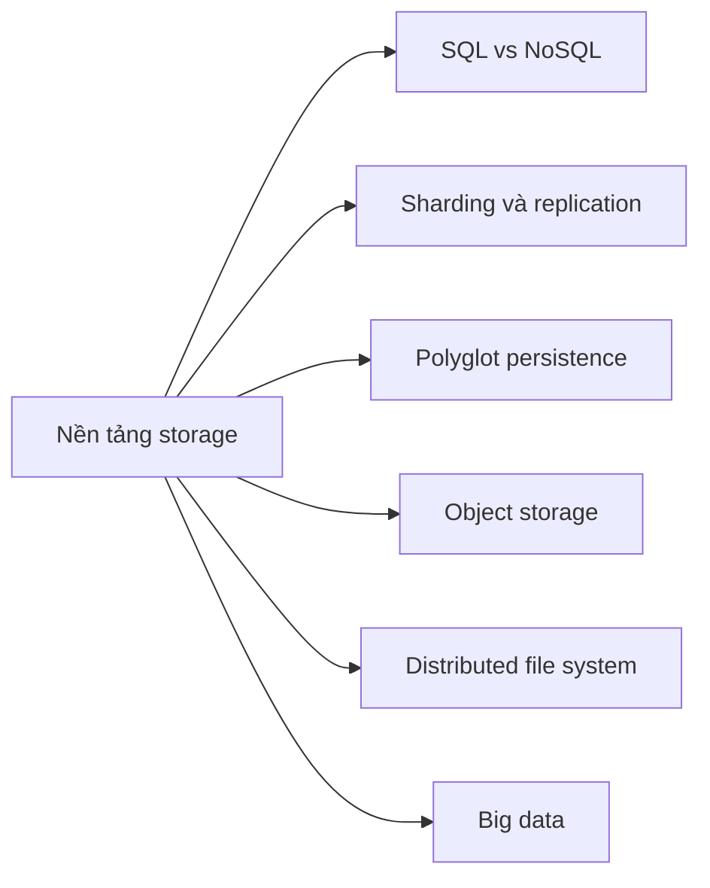

# 🎓 Tổng kết Storage — tư duy chọn đúng giải pháp lưu trữ

> Nguồn: `045-Summary-and-Key-Takeaways---Choosing-the-Right-Storage-Solut.txt` · [Udemy](https://ua.udemy.com/course/mastering-system-design-from-basics-to-cracking-interviews/learn/lecture/49554365)

Chúng ta vừa đi hết một chặng đường dài: từ bản chất dữ liệu, SQL vs NoSQL, các kỹ thuật scale database, cho tới object storage, distributed file system và big data. Bài tổng kết này, mình sẽ cùng các bạn nhìn lại bức tranh lớn — cách **suy nghĩ như một system designer về dữ liệu**.

---

### 🗄️ Từ bản chất dữ liệu đến quyết định storage

Section này thực chất là học cách **nhìn dữ liệu bằng con mắt thiết kế hệ thống**. Chúng ta bắt đầu bằng việc xem storage là **quyết định kiến trúc nền tảng** — nơi lựa chọn phụ thuộc vào bản chất dữ liệu, cách dữ liệu được truy cập và yêu cầu độ tin cậy của hệ thống.

Tiếp đó là quyết định **SQL vs NoSQL**. Thay vì coi chúng là hai công nghệ đối đầu, điểm mấu chốt là **hiểu trade-off**:

* **SQL** tỏa sáng khi consistency và quan hệ phức tạp là điều quan trọng.
* **NoSQL** tỏa sáng khi flexibility, horizontal scalability và vận hành phân tán trở thành ưu tiên.

---

### 🔁 Các kỹ thuật scale database trong production

Rồi chúng ta đi vào những kỹ thuật giúp database scale trong môi trường production: `sharding`, `replication` và **polyglot persistence**. Điểm cần nhớ: đây **không phải tính năng dùng ngay từ ngày đầu**, mà là **phản ứng kiến trúc** trước tăng trưởng, traffic leo thang và yêu cầu hệ thống thay đổi theo thời gian.

Vượt ra khỏi database, chúng ta mở rộng góc nhìn storage:

* **Object storage** trở thành lựa chọn tự nhiên cho khối lượng lớn dữ liệu phi cấu trúc.
* **Distributed storage** giải quyết bài toán lưu và xử lý dữ liệu qua nhiều máy một cách đáng tin cậy và hiệu quả.

---

### 🌐 Nhìn lại toàn cảnh và bước tiếp theo

Cuối cùng, chúng ta chạm vào **big data fundamentals** và thấy vì sao cách tiếp cận truyền thống chật vật khi volume, velocity và variety chạm tới quy mô internet — đây là lúc distributed storage và processing platform trở thành khối xây dựng thiết yếu.

Cùng nhau, những khái niệm này tạo thành **nền móng storage của system design hiện đại**. Và nếu phải gói lại thành một câu: **không có lựa chọn storage đúng cho mọi hệ thống — chỉ có lựa chọn đúng cho từng workload, từng giai đoạn tăng trưởng**. Hiểu trade-off vẫn luôn quan trọng hơn ghi nhớ tên công nghệ.

Ở section tiếp theo, chúng ta sẽ xây tiếp trên nền móng này và tập trung vào **performance** — cách đo lường, phân tích và tối ưu hệ thống để luôn mang lại trải nghiệm nhanh và đáng tin cậy khi scale. Hẹn gặp lại các bạn! 🚀
