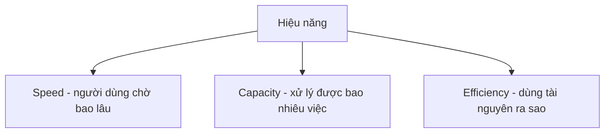

# 🚀 Hiệu năng hệ thống: Khi "chạy được" là chưa đủ

> Nguồn: `046-Introduction-to-System-Performance.txt` · [Udemy](https://ua.udemy.com/course/mastering-system-design-from-basics-to-cracking-interviews/learn/lecture/49601077)

Chào mừng các bạn đến với section mới về **performance (hiệu năng)**. Trong section này, chúng ta sẽ học cách **đo lường, phân tích, kiểm thử, giám sát và tối ưu** hiệu năng — kỹ năng phân biệt hệ thống "chạy được" với hệ thống "mở rộng mượt mà dưới tải thực tế". Trước tiên, hãy cùng trả lời câu hỏi nền tảng: hiệu năng trong system design thực sự là gì?

---

### 🎯 Hiệu năng không chỉ là "chạy nhanh"

Trong system design, **performance** rộng hơn nhiều so với việc làm hệ thống nhanh. Một hệ thống có thể phản hồi nhanh với vài người dùng nhưng vẫn gục ngã trước lưu lượng thực tế. Điều các kiến trúc sư quan tâm là: **hệ thống còn phục vụ chức năng hiệu quả đến đâu khi nhu cầu tăng lên**. Hãy nhìn hiệu năng qua **ba lăng kính**:

* **Speed (tốc độ)** — người dùng phải chờ bao lâu để nhận phản hồi.
* **Capacity (năng lực xử lý)** — hệ thống xử lý được bao nhiêu việc: request mỗi giây, transaction, hay người dùng đồng thời.
* **Efficiency (hiệu quả)** — hệ thống dùng CPU, memory, storage và network bandwidth hiệu quả ra sao khi xử lý workload.

Điểm mấu chốt: ba chiều này **thường cạnh tranh lẫn nhau**. Bạn có thể tăng tốc bằng cách dùng nhiều tài nguyên hơn, hoặc tăng capacity với cái giá là **độ phức tạp**. Vì thế, hiệu năng **không phải một metric tối ưu một lần rồi quên** — nó là bài toán cân bằng liên tục giữa **responsiveness, scalability và resource utilization**. *Mục tiêu của kiến trúc sư không chỉ là xây hệ thống nhanh, mà là xây hệ thống nhanh một cách có thể dự đoán, hiệu quả và đáng tin cậy khi tải tăng lên* — tư duy đó sẽ dẫn dắt mọi quyết định hiệu năng trong suốt section này.

---

### ⚖️ Những cặp khái niệm luôn phải cân bằng

**Latency (độ trễ)** và **throughput (thông lượng)** hay được nhắc cùng nhau, nhưng trả lời hai câu hỏi rất khác:

* **Latency** hỏi *"một request mất bao lâu?"* — thời gian chờ giữa lúc bấm nút, tải trang hay gọi API và lúc nhận phản hồi. Nó quyết định **responsiveness (khả năng đáp ứng)** dưới góc nhìn người dùng.
* **Throughput** hỏi *"hệ thống xử lý được bao nhiêu việc trong một khoảng thời gian?"* — số request hoặc transaction mỗi giây, chỉ báo then chốt của **scalability**.

Sai lầm phổ biến là nghĩ cải thiện cái này sẽ tự động cải thiện cái kia. Thực tế, chúng gắn với những trade-off khác nhau: hệ thống có thể cho **latency rất thấp với ít người dùng** nhưng đuối sức khi traffic tăng; ngược lại, hệ thống tối ưu cho **throughput khổng lồ** xử lý được lượng request rất lớn nhưng từng request mất nhiều thời gian hơn.

Các ứng dụng **real-time** như game online, hội nghị truyền hình hay hệ thống giao dịch ưu tiên **latency thấp**, vì từng mili-giây đều quan trọng. Các nền tảng **analytics và batch processing** quy mô lớn thường tập trung tối đa hóa **throughput**. Cặp thứ hai là **scalability (khả năng mở rộng)** và **responsiveness**. Scalability là về **tăng trưởng**: khi traffic tăng, người dùng nhân lên, dữ liệu phình to — hệ thống còn vận hành hiệu quả mà không thành **bottleneck (điểm nghẽn)** không? Ta thường đạt được qua:

1. **Vertical scaling (mở rộng dọc)** — thêm tài nguyên cho một máy.
2. **Horizontal scaling (mở rộng ngang)** — phân tán công việc ra nhiều máy.

Responsiveness là về **trải nghiệm người dùng**: dù hệ thống lớn đến đâu, người dùng vẫn mong request hoàn tất nhanh — gắn chặt với latency.

Điểm kiến trúc quan trọng: **scalability không tự động bảo đảm responsiveness**. Một hệ thống có thể phục vụ hàng triệu request mỗi ngày nhưng vẫn mang lại trải nghiệm tệ nếu mỗi request mất vài giây — dưới góc nhìn người dùng, nó vẫn **chậm**, dù về mặt kỹ thuật là "mở rộng được". Vì vậy, system design trưởng thành tập trung giữ responsiveness khi hệ thống lớn lên, nhờ **load balancer (bộ cân bằng tải)**, caching, tối ưu database, xử lý bất đồng bộ và kiến trúc phân tán. *Mục tiêu cuối cùng: hệ thống vẫn cảm giác nhanh ngay cả khi workload tăng lên nhiều bậc độ lớn.*

---

### 📏 Đo lường: SLA, SLO, SLI và percentiles

Khi hệ thống phức tạp lên, hiệu năng **không thể quản lý bằng trực giác hay kiểm thử ngẫu nhiên** — nó cần được đo liên tục bằng những metric rõ ràng, được thống nhất. Đó là lý do **SLA, SLO và SLI** xuất hiện, như ba lăng kính nhìn vào cùng một mục tiêu:

* **SLA (Service Level Agreement)** — cam kết dành cho khách hàng, định nghĩa mức dịch vụ doanh nghiệp hứa cung cấp, thường gắn với **nghĩa vụ hợp đồng**.
* **SLO (Service Level Objective)** — nằm bên trong tổ chức kỹ thuật, dịch kỳ vọng kinh doanh thành **mục tiêu vận hành cụ thể**: thời gian phản hồi, availability (độ khả dụng), tỷ lệ lỗi.
* **SLI (Service Level Indicator)** — **số đo thực tế** thu thập từ hệ thống, cho biết chuyện gì đang diễn ra trên production ngay lúc này; so SLI với SLO, kỹ sư biết ngay hệ thống đang đạt kỳ vọng hay trôi về phía có vấn đề.

Ví dụ: công ty hứa **99.9% uptime** qua SLA, đặt SLO nội bộ rằng **95% request phải hoàn tất trong 300ms**, rồi theo dõi SLI để xem hiệu năng thực tế có đạt mục tiêu không. Cách nhớ gọn: **SLA là lời hứa, SLO là mục tiêu, SLI là thực tế** — kỹ thuật hiệu năng hiệu quả là giữ ba thứ này luôn khớp nhau.

Về latency, khi mới đo, kỹ sư thường nhìn **thời gian phản hồi trung bình**. Vấn đề: **trung bình có thể che giấu lỗi nghiêm trọng** — nếu đa số request nhanh nhưng một tỷ lệ nhỏ cực chậm, con số trung bình vẫn "khỏe" trong khi người dùng đang chịu trải nghiệm tệ. Vì thế, hệ thống quy mô lớn dựa nhiều vào **percentiles (phân vị)**, cho thấy latency phân bố trên toàn bộ request chứ không chỉ trung bình cộng:

* **P50 (median)** — trải nghiệm của người dùng điển hình: một nửa request nhanh hơn giá trị này, một nửa chậm hơn.
* **P95** — cho thấy các request chậm đang hành xử ra sao.
* **P99** — **tail latency (độ trễ đuôi)**: 1% request chậm nhất, nơi thường lộ ra bottleneck, tranh chấp tài nguyên, độ trễ mạng hay dependency bị quá tải.

Dưới góc nhìn kiến trúc, **tail latency thường quan trọng hơn latency trung bình**: người dùng không nhớ đa số request nhanh, họ nhớ vài request chậm đến mức khó chịu. Trong hệ phân tán, một request có thể phụ thuộc nhiều service, database và network call nên tail latency **cộng dồn rất nhanh**. Hệ thống production vì thế thường theo dõi **P95 và P99 song song với trung bình**. *Muốn hiểu trải nghiệm thật, đừng chỉ hỏi "request trung bình nhanh cỡ nào" — hãy hỏi "các request chậm nhất tệ đến mức nào".*

---

### 🧪 Kiểm thử và giám sát: vì sao hiệu năng quan trọng

Người dùng **hiếm khi để ý khi ứng dụng nhanh, nhưng nhận ra ngay khi nó chậm**. Trong thế giới mobile, cloud và real-time, kỳ vọng được đo bằng **mili-giây, không phải giây**. Ứng dụng chậm dẫn đến **giỏ hàng bị bỏ dở, engagement giảm, conversion rate thấp, bounce rate cao** — và kể cả khi chức năng đúng, người dùng vẫn cảm thấy nó **thiếu tin cậy**. Về phía kỹ thuật, hiệu năng kém là **dấu hiệu cảnh báo**: hệ thống ngốn thêm CPU, memory, storage, network — chi phí hạ tầng tăng trong khi độ ổn định giảm. Một vấn đề latency nhỏ có thể tiến triển thành vấn đề scalability, outage hay sự cố reliability. Vì vậy, kiến trúc sư kinh nghiệm coi hiệu năng là **yêu cầu thiết kế ngay từ đầu**, không phải bài tập tinh chỉnh về sau.

**Performance testing (kiểm thử hiệu năng)** tồn tại vì hệ thống hiếm khi sập trong điều kiện lý tưởng — chúng sập khi traffic tăng, cách dùng đổi thay hoặc tài nguyên bị siết. Mỗi loại test trả lời một câu hỏi kiến trúc khác nhau:

| Loại test | Trả lời câu hỏi gì |
|---|---|
| **Load testing** | Hệ thống chịu được workload kỳ vọng và vẫn đạt mục tiêu hiệu năng không? |
| **Stress testing** | Đẩy vượt năng lực thiết kế để lộ điểm gãy và cách hệ thống thất bại |
| **Spike testing** | Kiến trúc xử lý cú nhảy traffic đột ngột ra sao — quan trọng với ra mắt sản phẩm, flash sale, traffic viral |
| **Endurance testing** | Chạy nhiều giờ/ngày để lộ memory leak, cạn kiệt tài nguyên, suy giảm hiệu năng |

Giá trị thật của kiểm thử không phải tạo traffic, mà là **tìm ra bottleneck**: query chậm, service quá tải, memory leak hay ràng buộc mạng có thể vô hình lúc thường nhưng nghiêm trọng dưới tải. *Mục tiêu không chỉ là chứng minh hệ thống chạy được, mà là hiểu nó đuối ở đâu, thất bại thế nào và còn chịu được mức tăng trưởng bao nhiêu trước khi hiệu năng thành vấn đề.*

**Performance monitoring (giám sát hiệu năng)** cho biết hệ thống hành xử thế nào **sau khi người dùng thật bắt đầu sử dụng** — thứ mang lại tầm nhìn liên tục vào sức khỏe hệ thống đang chạy. Không có monitoring, các vấn đề thường **vô hình cho đến khi người dùng phàn nàn**. Các công cụ quan trọng:

* **APM (Application Performance Monitoring)** như **New Relic** hay **Datadog** — trace request xuyên các service, nhanh chóng chỉ ra bottleneck.
* Nền tảng metrics như **Prometheus** và **Grafana** — tầm nhìn real-time về hành vi hệ thống.
* **Centralized logging (log tập trung)** — điều tra sự cố, hiểu chuyện gì đã xảy ra.

Những tín hiệu cần giám sát không ngừng nghỉ: **latency** và **throughput** cho biết hệ thống đang hoạt động thế nào; **error rate (tỷ lệ lỗi)** cho biết người dùng có đang gặp lỗi; các **resource metrics** như CPU, memory, network utilization và hoạt động database giúp phát hiện giới hạn năng lực **trước khi** thành outage. *Monitoring không phải về thu thập dữ liệu, mà là phát hiện vấn đề sớm* — đưa đội ngũ từ chữa cháy bị động sang vận hành chủ động.

---

### 🎯 Tự kiểm tra nhanh

**Câu 1:** Ba lăng kính để nhìn hiệu năng hệ thống là gì?

<b>Xem đáp án</b>

**Đáp án:** Speed, capacity và efficiency.

Giải thích: Tốc độ là người dùng chờ bao lâu, capacity là xử lý được bao nhiêu việc, efficiency là dùng tài nguyên hiệu quả ra sao.

Tham chiếu: Mục Hiệu năng không chỉ là chạy nhanh.

**Câu 2:** Latency và throughput khác nhau ở điểm nào?

<b>Xem đáp án</b>

**Đáp án:** Latency đo một request mất bao lâu; throughput đo hệ thống xử lý được bao nhiêu việc trong một khoảng thời gian.

Giải thích: Hai câu hỏi khác nhau và thường gắn với những trade-off khác nhau.

Tham chiếu: Mục Những cặp khái niệm luôn phải cân bằng.

**Câu 3:** Vì sao một hệ thống có thể vẫn "cảm giác chậm" dù mở rộng tốt?

<b>Xem đáp án</b>

**Đáp án:** Vì scalability không tự động bảo đảm responsiveness — hệ thống có thể phục vụ hàng triệu request mỗi ngày nhưng mỗi request mất vài giây.

Giải thích: Dưới góc nhìn người dùng, tốc độ từng request mới là trải nghiệm.

Tham chiếu: Mục Những cặp khái niệm luôn phải cân bằng.

**Câu 4:** SLA, SLO và SLI tương ứng với điều gì?

<b>Xem đáp án</b>

**Đáp án:** SLA là lời hứa với khách hàng, SLO là mục tiêu nội bộ, SLI là số đo thực tế.

Giải thích: So SLI với SLO để biết hệ thống đang đạt kỳ vọng hay không.

Tham chiếu: Mục Đo lường SLA, SLO, SLI và percentiles.

**Câu 5:** Vì sao P99 thường được theo dõi quan trọng hơn latency trung bình?

<b>Xem đáp án</b>

**Đáp án:** Vì P99 là tail latency — 1% request chậm nhất, nơi lộ ra bottleneck và là thứ người dùng thật sự ghi nhớ.

Giải thích: Trong hệ phân tán, tail latency cộng dồn rất nhanh khi một request phụ thuộc nhiều service.

Tham chiếu: Mục Đo lường SLA, SLO, SLI và percentiles.

---

Vậy là chúng ta đã có bức tranh tổng quan về hiệu năng: **hiệu năng không phải một metric, mà là khả năng tổng hợp của hệ thống để vẫn nhanh, hiệu quả và mở rộng được khi workload tăng** — cần được tính đến ngay khi thiết kế, kiểm chứng bằng kiểm thử và giám sát liên tục trên production. Ở bài tiếp theo, chúng ta sẽ đến với một trong những kỹ thuật tối ưu mạnh mẽ nhất: **caching (bộ đệm)** — và cách nó giảm latency, tăng scalability. Hẹn gặp lại các bạn! 🚀
