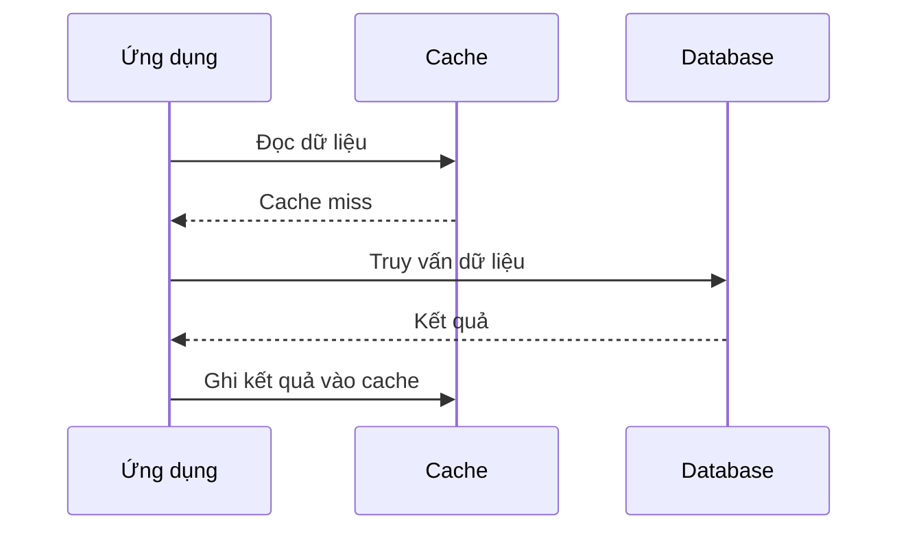

# ⚡ Caching: Bí quyết giúp hệ thống nhanh hơn và database "thở phào"

> Nguồn: `047-Caching-for-Speed-Optimization.txt` · [Udemy](https://ua.udemy.com/course/mastering-system-design-from-basics-to-cracking-interviews/learn/lecture/49601083)

Chào mừng các bạn quay lại với section **Performance**. Hệ thống hiện đại không tự nhiên mà nhanh — **caching (bộ đệm)** là một trong những kỹ thuật kiến trúc then chốt giúp giảm latency, bảo vệ backend và mở rộng hiệu quả dưới lưu lượng lớn. Cùng mình đi vào chi tiết nhé.

---

### 🎯 Vì sao caching quan trọng?

Caching trở nên quan trọng ngay khi hệ thống **lặp lại cùng một công việc đắt đỏ** nhiều lần. Mỗi lần gọi database, gọi API hay tính toán đều cộng thêm latency — và ở quy mô lớn, những mili-giây đó cộng dồn thành trải nghiệm tệ.

* **Cache là đường tắt tốc độ cao**: thay vì lấy dữ liệu từ backend chậm mỗi lần, dữ liệu hay được truy cập sẽ được phục vụ trực tiếp từ memory. Nhờ đó, **search suggestions, news feed mạng xã hội, product catalog hay user profile** thường có cảm giác tức thì.
* **Bảo vệ hạ tầng**: database thường là thành phần đắt đỏ và khó mở rộng nhất. Phục vụ phần lớn request từ cache giúp **giảm tải database, tăng throughput và trì hoãn các đợt mở rộng tốn kém**.
* **Đổi phương trình scalability**: hệ thống xử lý **10,000 request mỗi giây** khi không có cache có thể phục vụ gấp nhiều lần khi cache hit rate cao. Trong nhiều kiến trúc lớn, cache hấp thụ **phần lớn read traffic**, backend chỉ xử lý cache miss.

Đó là lý do caching có mặt khắp nơi — từ browser cache, CDN, đến các cụm Redis đứng trước database. Với kiến trúc sư, đây thường là một trong những tối ưu **hiệu quả nhất**: cải thiện latency, scalability và hiệu quả hạ tầng cùng lúc.

---

### 🧅 Các tầng caching — những rào chắn bảo vệ backend

Khi hệ thống lớn lên, một cache duy nhất hiếm khi đủ. Ứng dụng hiện đại dùng **nhiều tầng cache**, mỗi tầng chặn request không cho đi sâu hơn vào hệ thống:

1. **Client (trình duyệt)** — lưu dữ liệu, assets và cả trải nghiệm ứng dụng bằng `local storage` và `service workers`. Nếu dữ liệu đã nằm trên thiết bị người dùng, **request nhanh nhất là request không bao giờ rời khỏi browser**.
2. **Application tier** — in-memory cache như **Redis** phục vụ dữ liệu hay dùng mà không cần hỏi database. Đây là nơi cache **session, dữ liệu xác thực, user profile và các phép tính đắt đỏ**.
3. **CDN** — với người dùng phân tán toàn cầu, cache static assets (và đôi khi cả API response) tại **network edge gần người dùng**, giảm cả latency lẫn traffic về origin server. Nhờ đó, website lớn vẫn nhanh bất kể địa lý.
4. **Database caching** — tập trung giảm chi phí thực thi query: **result-set caching** và **materialized views** cho phép phục vụ dữ liệu hay dùng hoặc dữ liệu tính toán nặng mà không phải join, aggregate hay chạy analytics lặp lại.

Hãy nghĩ về các tầng này như **một chuỗi rào chắn bảo vệ**: mỗi cache hit giữ một request khỏi tầng chậm và đắt hơn phía sau.

---

### ⚙️ Chiến lược caching: chọn theo workload, không chọn theo "tốt nhất"

Caching không chỉ là **cache ở đâu**, mà còn là **dữ liệu di chuyển thế nào giữa cache và source of truth**. Mỗi chiến lược tối ưu cho một mục tiêu khác nhau — latency thấp hơn, nhất quán mạnh hơn, hay throughput cao hơn:

| Chiến lược | Cách hoạt động | Đánh đổi chính |
|---|---|---|
| **Write-through** | Ghi cả cache lẫn database trước khi hoạt động hoàn tất | Cache luôn mới, read đơn giản; nhưng write chậm hơn |
| **Write-back / write-behind** | Ghi cache trước, báo thành công ngay, database cập nhật nền | Write cực nhanh, hợp hệ thống throughput cao; rủi ro mất dữ liệu nếu cache hỏng trước khi persist |
| **Cache-aside / lazy loading** | Kiểm tra cache trước, miss thì lấy từ database rồi lưu vào cache | Chỉ cache dữ liệu thật sự được truy cập — hiệu quả, tiết kiệm |
| **Explicit caching** | Lập trình viên quyết định cache gì, refresh khi nào, evict khi nào | Kiểm soát tối đa, nhưng đẩy độ phức tạp về phía team ứng dụng |

Lựa chọn chiến lược phụ thuộc vào workload: hệ thống **read-heavy** thiên về cache-aside; hệ thống **ghi nhiều** hưởng lợi từ write-back; ứng dụng cần **nhất quán mạnh** thường chọn write-through dù phải chịu latency cao hơn.

**Khi cache đầy, chuyện gì xảy ra?** Cache luôn là tài nguyên hữu hạn, và hệ thống phải quyết định dữ liệu nào ở lại, dữ liệu nào bị loại — quyết định này ảnh hưởng lớn đến hiệu năng:

* **LRU (Least Recently Used)** — giả định dữ liệu vừa được truy cập có khả năng được truy cập lại. Là lựa chọn mặc định mạnh vì khớp với hành vi người dùng phổ biến.
* **LFU (Least Frequently Used)** — quan tâm **độ phổ biến dài hạn** thay vì hoạt động gần đây; hiệu quả khi một nhóm nhỏ dữ liệu (sản phẩm hot, nội dung trending, dữ liệu tham chiếu hay được query) nhận phần lớn request.
* **FIFO (First-In-First-Out)** — loại bỏ theo thứ tự được thêm vào, bất kể mẫu truy cập; dễ triển khai, rẻ, nhưng có thể xóa dữ liệu giá trị chỉ vì nó "sống lâu" trong cache.
* **TTL (Time-to-Live)** — đặt **thời gian hết hạn** cho dữ liệu; phù hợp khi độ mới quan trọng hơn độ phổ biến — như API response, session data hay thông tin kinh doanh thay đổi nhanh.

Thực tế, các hệ thống cache hiện đại thường **kết hợp** chúng: TTL để bảo đảm độ mới, LRU để quản lý áp lực bộ nhớ. *Bài học: eviction policy nên phản ánh đúng mẫu truy cập — policy tốt nhất là policy giữ được dữ liệu giá trị nhất trong memory, đồng thời loại bỏ dữ liệu không còn đem lại lợi ích hiệu năng.*

---

### 🧰 Redis và caching trong thế giới thực

**Redis** trở nên phổ biến vì giải quyết một bài toán đắt đỏ của hệ phân tán: truy cập dữ liệu thật nhanh ở quy mô lớn. Nếu database tối ưu cho **độ bền vững và query phức tạp**, Redis tối ưu cho **tốc độ** — giữ dữ liệu trong memory và phục vụ request trong **micro giây**.

Điểm mạnh là Redis **không chỉ là cache**:

* **TTL** cho phép dữ liệu tự hết hạn — hoàn hảo cho caching và quản lý session.
* **PubSub** hỗ trợ giao tiếp hướng sự kiện nhẹ nhàng giữa các service.
* **Tùy chọn persistent** cân bằng giữa tốc độ và độ bền khi dữ liệu cần tồn tại qua restart.

Vì vậy, Redis thường xuất hiện ở nhiều vị trí trong cùng một kiến trúc: cache trước database, **session store** cho web app, nền tảng cho **background job queue**, hay duy trì **counter và leaderboard real-time**. Redis còn được ưa chuộng nhờ **sự đơn giản**: mô hình lập trình dễ hiểu, vận hành nhẹ, và gần như mọi cloud lớn đều có dịch vụ Redis managed. *Quy tắc dễ nhớ: nếu dữ liệu cần truy cập cực nhanh và không cần đầy đủ khả năng của database truyền thống, Redis thường là lựa chọn tuyệt vời.*

Vài ví dụ caching quen thuộc:

* **Website tải trong browser** — ảnh, JavaScript, stylesheet thường được phục vụ từ CDN, giúp latency giảm mạnh và backend tránh hàng triệu request không cần thiết.
* **Thương mại điện tử** — dữ liệu sản phẩm hot có thể được xem hàng nghìn lần mỗi phút nhưng ít khi thay đổi; cache giúp database không phải chạy lại cùng một query đọc.
* **User session** — xác thực request cần truy cập session nhanh; lưu trong memory giúp validate người dùng mà không hỏi database liên tục.
* **Search** — một số ít từ khóa chiếm phần lớn traffic; cache kết quả tìm kiếm giúp tránh lặp lại các thao tác indexing và ranking đắt đỏ.
* **Microservices** — nếu một service liên tục hỏi cùng một thông tin từ service khác, cache API response loại bỏ network call và tính toán dư thừa, tránh downstream thành bottleneck.

Mẫu chung đằng sau tất cả: **xác định các thao tác đắt đỏ bị lặp lại thường xuyên, rồi đưa kết quả đến gần nơi cần dùng hơn**. Đó là bản chất của caching hiệu quả.

---

### 🎯 Tự kiểm tra nhanh

**Câu 1:** Vì sao cache giúp ích cả latency, scalability lẫn chi phí hạ tầng?

<b>Xem đáp án</b>

**Đáp án:** Vì cache phục vụ dữ liệu từ memory, giảm thời gian chờ và giảm tải cho database — thành phần đắt đỏ, khó mở rộng nhất.

Giải thích: Cache hấp thụ phần lớn read traffic, backend chỉ xử lý cache miss.

Tham chiếu: Mục Vì sao caching quan trọng.

**Câu 2:** Cache-aside (lazy loading) hoạt động thế nào?

<b>Xem đáp án</b>

**Đáp án:** Ứng dụng kiểm tra cache trước; nếu miss thì lấy dữ liệu từ database và lưu vào cache cho các request sau.

Giải thích: Cách này chỉ cache dữ liệu thật sự được truy cập nên hiệu quả và tiết kiệm.

Tham chiếu: Mục Chiến lược caching.

**Câu 3:** Write-through và write-back khác nhau ở điểm nào?

<b>Xem đáp án</b>

**Đáp án:** Write-through ghi cả cache lẫn database trước khi hoàn tất (nhất quán hơn, write chậm hơn); write-back ghi cache trước, báo thành công ngay, database cập nhật nền (write nhanh, có rủi ro mất dữ liệu).

Giải thích: Đây là đánh đổi giữa độ nhất quán và hiệu năng ghi.

Tham chiếu: Mục Chiến lược caching.

**Câu 4:** LRU và LFU khác nhau ở triết lý loại bỏ dữ liệu nào?

<b>Xem đáp án</b>

**Đáp án:** LRU loại dữ liệu lâu không được truy cập (recency); LFU loại dữ liệu ít được truy cập (frequency).

Giải thích: LRU hợp hành vi phổ biến; LFU hiệu quả khi một nhóm nhỏ dữ liệu nhận phần lớn request.

Tham chiếu: Mục Chiến lược caching.

**Câu 5:** Khi nào nên ưu tiên TTL?

<b>Xem đáp án</b>

**Đáp án:** Khi độ mới của dữ liệu quan trọng hơn độ phổ biến — ví dụ API response, session data, thông tin kinh doanh thay đổi nhanh.

Giải thích: TTL đặt thời gian hết hạn thay vì quyết định evict dựa trên mức sử dụng.

Tham chiếu: Mục Chiến lược caching.

---

Vậy là chúng ta đã đi qua toàn bộ bức tranh caching: **cache ở đâu, dữ liệu chảy thế nào, và điều gì xảy ra khi memory đầy** — cùng Redis, công cụ được dùng rộng rãi bậc nhất trong kiến trúc hiện đại. *Caching hiếm khi là tính năng thêm vào cuối dự án; ở hệ thống quy mô lớn, nó là một tầng kiến trúc nền tảng.* Ở bài tiếp theo, chúng ta sẽ chuyển từ tối ưu hiệu năng sang **decoupling (tách rời)** hệ thống với **messaging và queues**. Hẹn gặp lại các bạn! 🚀
