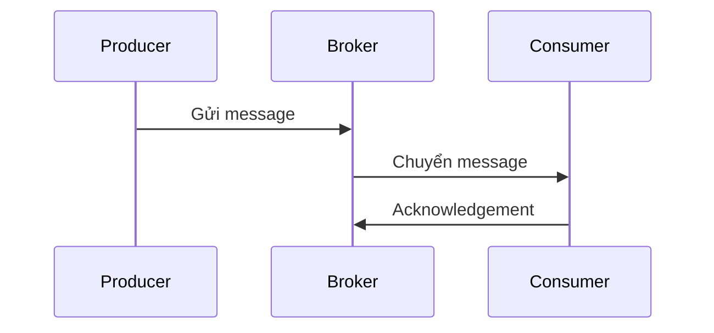

# 📨 Messaging & Queues: Tách rời dịch vụ để mở rộng và chống chịu tốt hơn

> Nguồn: `048-Messaging-Queues-for-Decoupling.txt` · [Udemy](https://ua.udemy.com/course/mastering-system-design-from-basics-to-cracking-interviews/learn/lecture/49601085)

Trong bài này, chúng ta sẽ khám phá cách **message queue (hàng đợi thông điệp)** cho phép các service giao tiếp **bất đồng bộ (asynchronously)**, từ đó tạo nên kiến trúc mở rộng được, chống chịu tốt và **tách rời lỏng lẻo (loosely coupled)** — nơi các service có thể tiến hóa độc lập. Cùng bắt đầu nhé.

---

### 🎯 Vì sao nên dùng asynchronous messaging?

Khi hệ thống lớn lên, giao tiếp trực tiếp giữa các service thường trở thành **bottleneck**. Producer có thể nhanh, nhưng nếu nó phải chờ từng consumer xử lý xong thì **throughput tổng thể bị kéo xuống**.

**Asynchronous messaging** giải quyết điều này bằng cách đặt một **buffer** giữa producer và consumer: producer chỉ việc publish message rồi tiếp tục công việc, còn consumer xử lý độc lập. Điều này tạo ra **loose coupling (tách rời lỏng lẻo)** — giúp hệ thống dễ tiến hóa, dễ bảo trì và dễ mở rộng theo thời gian. Ba lợi ích lớn:

* **Resilience (khả năng chống chịu)** — nếu consumer tạm thời không khả dụng, message vẫn nằm trong queue và được xử lý sau, thay vì bị mất.
* **Flexibility (linh hoạt)** — khi yêu cầu kinh doanh tăng, ta thêm consumer mới cho analytics, notification, auditing... mà **không cần thay đổi producer**.
* **Nền tảng của event-driven architecture** — nhờ đó, async messaging trở thành pattern nền tảng của hệ phân tán hiện đại.

---

### 🧩 Giải phẫu một messaging system

Một messaging system trông đơn giản nhưng dựa trên vài thành phần cốt lõi phối hợp với nhau:

1. **Message (thông điệp)** — đơn vị dữ liệu đại diện cho một sự kiện, câu lệnh hay mẩu thông tin cần được xử lý ở nơi khác.
2. **Producer** — tạo ra message, và quan trọng hơn: **không cần biết message sẽ được xử lý thế nào hay khi nào**.
3. **Broker** — trung gian **lưu trữ, định tuyến và chuyển message** qua các kênh logic như **queue** hoặc **topic**. Chính sự tách biệt này tạo nên loose coupling và khả năng scale độc lập giữa các service.
4. **Consumer** — đăng ký các kênh đó, xử lý message đến, và gửi **acknowledgement (xác nhận)** lại broker khi hoàn tất.

Acknowledgement rất quan trọng: nó xác nhận xử lý thành công, giúp **chống mất message** và hỗ trợ **retry khi có lỗi**. Cùng nhau, các thành phần này tạo nên mô hình giao tiếp đáng tin cậy, cho phép hệ phân tán trao đổi công việc bất đồng bộ ở quy mô lớn.

---

### 🏗️ Kiến trúc decoupled và khi nào nên dùng queue

Hãy tưởng tượng **catalog service** đổi giá sản phẩm. Sau khi cập nhật database của mình, nó publish sự kiện **price-updated** lên **event bus** — và thế là xong. Nó không cần biết ai quan tâm sự kiện đó hay họ sẽ làm gì:

* **Basket service** cập nhật giỏ hàng.
* **Analytics service** theo dõi xu hướng giá.
* **Notification service** thông báo cho khách hàng.

Tất cả đều **không cần thay đổi catalog service**. Kiến trúc này tạo loose coupling vì các service giao tiếp qua **sự kiện** thay vì gọi API trực tiếp; đồng thời tăng resilience: subscriber tạm thời "off" thì message vẫn nằm ở broker và được xử lý khi service hồi phục. Khi hệ thống lớn lên, ta thêm năng lực mới chỉ bằng cách giới thiệu consumer mới — đó là lý do các event bus như **RabbitMQ, Kafka hay Azure Service Bus** là building block nền tảng của kiến trúc event-driven hiện đại.

Message queue **không phải thứ nên thêm vào mọi hệ thống mặc định** — nó giải quyết những bài toán scaling và reliability cụ thể:

* **Xử lý traffic bùng nổ** — request có thể đến trong vài giây nhưng xử lý mất vài phút; queue hấp thụ cú tăng vọt và để hệ thống xử lý ở tốc độ bền vững thay vì làm nghẽn downstream.
* **Service vận hành độc lập** — thay vì chuỗi API call đồng bộ, công việc được chuyển giao qua message để mỗi service xử lý theo nhịp riêng.
* **Background work không cần phản hồi ngay** — gửi email, tạo báo cáo, xử lý ảnh, export dữ liệu diễn ra bất đồng bộ để người dùng không phải chờ.
* **Bảo vệ tài nguyên đắt đỏ hoặc bị giới hạn tốc độ** — queue điều tiết tốc độ xử lý, tránh quá tải và quản lý truy cập API bên ngoài hay tác vụ tính toán nặng.

*Quy tắc thực tế: khi công việc có thể được **trì hoãn, retry hoặc xử lý độc lập**, queue thường là cách đơn giản nhất để tăng scalability, resilience và độ ổn định.*

Các use case quen thuộc: **order processing** (inventory, payment, shipping, notification, analytics xử lý độc lập), **logging & monitoring** (log stream qua messaging thay vì ghi thẳng vào analytics platform — xử lý tập trung quy mô lớn mà không ảnh hưởng hiệu năng ứng dụng), **traffic shaping** khi có spike, **notification system** (email/SMS/push), và **real-time ETL / stream processing với Apache Kafka** (fraud detection, real-time analytics). Mẫu chung: **queue tách nhịp công việc đến khỏi nhịp công việc được xử lý** — một trong những kỹ thuật scaling mạnh mẽ nhất của hệ phân tán. Còn về công nghệ, **RabbitMQ** rất hợp phân phối task và xử lý message đáng tin cậy, trong khi **Kafka** sinh ra cho event streaming throughput cao và data pipeline quy mô lớn.

---

### 🛡️ Delivery guarantees và best practices

**Delivery guarantee** định nghĩa messaging system hứa gì khi có lỗi xảy ra — và mọi lựa chọn đều có trade-off:

| Mô hình | Cách hoạt động | Đánh đổi |
|---|---|---|
| **At-least-once** | Broker không nhận acknowledgement thành công thì retry | Giảm mạnh nguy cơ mất message, nhưng có thể **trùng lặp** |
| **At-most-once** | Gửi đúng một lần, không retry | Đơn giản, overhead thấp; nếu lỗi khi xử lý, message **mất vĩnh viễn** |
| **Exactly-once** | Loại bỏ cả trùng lặp lẫn mất mát | Cần coordination, quản lý state và overhead xử lý — **phức tạp hơn nhiều** so với kỳ vọng |

Câu hỏi của kiến trúc sư không phải "guarantee nào tốt nhất" mà là **"failure mode nào chấp nhận được"**. Hầu hết hệ thống quy mô lớn chọn **at-least-once** kèm **idempotent consumer (consumer xử lý lặp an toàn)** — cân bằng thực dụng giữa reliability, scalability và độ phức tạp vận hành.

Các best practice khi thiết kế:

* **Giả định message có thể được giao hơn một lần** — network failure, consumer crash và retry là chuyện bình thường; xử lý trùng không bao giờ được tạo kết quả kinh doanh sai.
* **Dùng dead-letter queue (hàng đợi thư chết)** cho message không xử lý được, thay vì retry vô hạn — tránh một message lỗi chặn cả hệ thống.
* **Đo lường vận hành**: queue depth, message age, throughput, processing latency — backlog tăng là **tín hiệu cảnh báo sớm** consumer đuối hơn nhu cầu.
* **Retry cẩn thận**: exponential back-off, giới hạn số lần retry và circuit breaker ngăn "bão lỗi" nhấn chìm downstream.
* **Khớp guarantee với yêu cầu kinh doanh** và **bảo mật broker** như mọi hạ tầng trọng yếu: authentication, authorization, encryption, access control — vì messaging thường mang dữ liệu nhạy cảm.

*Quy tắc vàng: thiết kế cho trùng lặp, lỗi, độ trễ và bảo mật ngay từ ngày đầu. Nếu hệ thống queue chạy tốt trong điều kiện lỗi, nó sẽ chạy tốt trong điều kiện bình thường.*

---

### 🎯 Tự kiểm tra nhanh

**Câu 1:** Asynchronous messaging giải quyết bottleneck gì?

<b>Xem đáp án</b>

**Đáp án:** Producer phải chờ consumer xử lý xong, khiến throughput tổng thể bị kéo xuống.

Giải thích: Buffer giữa producer và consumer cho phép producer publish rồi tiếp tục công việc ngay.

Tham chiếu: Mục Vì sao nên dùng asynchronous messaging.

**Câu 2:** Broker và acknowledgement đóng vai trò gì trong messaging system?

<b>Xem đáp án</b>

**Đáp án:** Broker lưu trữ, định tuyến và chuyển message qua queue/topic; acknowledgement xác nhận xử lý thành công, chống mất message và hỗ trợ retry.

Giải thích: Đây là các thành phần tạo nên mô hình giao tiếp đáng tin cậy.

Tham chiếu: Mục Giải phẫu một messaging system.

**Câu 3:** Khi nào một queue là lựa chọn phù hợp?

<b>Xem đáp án</b>

**Đáp án:** Khi công việc có thể được trì hoãn, retry hoặc xử lý độc lập — ví dụ traffic bùng nổ, background work, hoặc bảo vệ tài nguyên bị giới hạn tốc độ.

Giải thích: Queue tách nhịp công việc đến khỏi nhịp công việc được xử lý.

Tham chiếu: Mục Kiến trúc decoupled và khi nào nên dùng queue.

**Câu 4:** Vì sao hầu hết hệ thống lớn chọn at-least-once thay vì exactly-once?

<b>Xem đáp án</b>

**Đáp án:** Vì at-least-once kết hợp với idempotent consumer cân bằng thực dụng giữa reliability, scalability và độ phức tạp; exactly-once đòi hỏi coordination và state management phức tạp hơn nhiều.

Giải thích: At-least-once chấp nhận khả năng trùng lặp, miễn là consumer xử lý lặp an toàn.

Tham chiếu: Mục Delivery guarantees và best practices.

**Câu 5:** Dead-letter queue dùng để làm gì?

<b>Xem đáp án</b>

**Đáp án:** Chứa các message không xử lý thành công để điều tra, thay vì retry vô hạn — tránh một message lỗi chặn cả hệ thống.

Giải thích: Đây là một trong những best practice thiết kế queue cho tình huống lỗi.

Tham chiếu: Mục Delivery guarantees và best practices.

---

Vậy là chúng ta đã có bức tranh đầy đủ về **messaging và queues**: từ vì sao cần bất đồng bộ, giải phẫu hệ thống, kiến trúc decoupled, đến delivery guarantees và best practices. *Điểm cốt lõi: messaging bất đồng bộ là về việc **tách công việc khỏi luồng xử lý request** — để mỗi thành phần vận hành độc lập, giúp hệ thống mở rộng, chống chịu và tiến hóa dễ dàng hơn.* Ở bài tiếp theo, chúng ta sẽ tiếp tục với **concurrency và parallelism (xử lý đồng thời và song song)** — hai kỹ thuật tăng throughput và dùng tài nguyên hệ thống hiệu quả hơn. Hẹn gặp lại các bạn! 🚀
