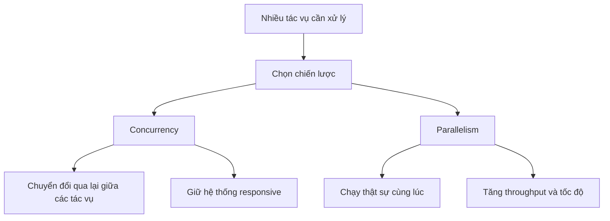

# 🧵 Concurrency và Parallelism: Hai khái niệm "sinh đôi" giải quyết hai bài toán khác nhau

> Nguồn: `049-Concurrency-Parallelism.txt` · [Udemy](https://ua.udemy.com/course/mastering-system-design-from-basics-to-cracking-interviews/learn/lecture/49601091)

Trong bài này, chúng ta sẽ cùng khám phá cách các hệ thống hiện đại xử lý nhiều tác vụ một cách hiệu quả qua **concurrency (đồng thời)** và **parallelism (song song)** — hai khái niệm nền tảng tiếp sức cho scalability, responsiveness và các ứng dụng hiệu năng cao. Hai từ này thường bị dùng thay thế cho nhau, nhưng với vai trò architect, các bạn cần phân biệt rạch ròi: chúng **giải quyết những bài toán khác nhau**. Hãy cùng mổ xẻ từng khái niệm rồi ghép lại thành bức tranh hoàn chỉnh.

---

### 🎯 Concurrency vs Parallelism — quản lý tác vụ và thực thi tác vụ

**Concurrency** chủ yếu là về **quản lý nhiều tác vụ một cách hiệu quả**, ngay cả khi chỉ có **một CPU core**. Hệ thống vẫn tạo được tiến triển trên nhiều tác vụ bằng cách **chuyển đổi qua lại** giữa chúng. Mục tiêu ở đây không phải chạy mọi thứ cùng lúc, mà là **giữ hệ thống responsive**.

* Ví dụ: web server xử lý hàng nghìn request đến bằng **asynchronous IO (IO bất đồng bộ)** — khi một request đang chờ database hay network call, server xử lý request khác thay vì ngồi không.

**Parallelism** là câu chuyện về **thực thi**. Nhiều tác vụ **chạy thật sự cùng lúc** trên các **CPU core khác nhau**. Mục tiêu không phải responsiveness mà là **throughput (thông lượng) và tốc độ**.

* Parallelism phát huy sức mạnh khi xử lý dataset lớn, render đồ họa, huấn luyện mô hình machine learning hay tính toán ma trận — chia nhỏ công việc và thực thi các phần đồng thời.

Cách tư duy hữu ích: **concurrency giúp hệ thống xử lý nhiều thứ một lúc, parallelism giúp hệ thống làm nhiều thứ một lúc** — một bên tập trung vào **quản lý tác vụ**, bên kia vào **thực thi tác vụ**. Trong hệ thống thực tế, cả hai thường **kết hợp với nhau**: web application dùng concurrency để xử lý hàng nghìn client request, đồng thời dùng parallelism phía sau cho các workload nặng CPU. Hiểu phân biệt này rất quan trọng, vì **scalability không chỉ là thêm phần cứng** — mà là biết khi nào cần điều phối tác vụ tốt hơn, khi nào cần thêm sức tính toán, và khi nào cần cả hai.

---

### 🧵 Từ Process đến Thread pool — đánh đổi giữa isolation và efficiency

**Process (tiến trình)** là một ứng dụng **tự chứa**, có **không gian bộ nhớ và tài nguyên riêng**. Nhờ cô lập, process tạo **ranh giới lỗi vững chắc**: nếu một process crash, hệ điều hành có thể kết thúc nó mà **không kéo sập các process khác**. Sự cô lập này tăng **reliability (độ tin cậy)** và bảo mật — nên database, trình duyệt và hệ điều hành thường tách các thành phần quan trọng thành nhiều process. Cái giá phải trả là **chi phí**: tạo process, cấp phát bộ nhớ và **chuyển đổi ngữ cảnh (context switching)** giữa các process tương đối đắt.

**Thread (luồng)** đi hướng ngược lại: nhiều thread sống **trong cùng một process** và **chia sẻ không gian bộ nhớ**. Nhờ chia sẻ tài nguyên, việc tạo và chuyển đổi thread **nhanh hơn nhiều**, rất hợp để xử lý công việc đồng thời — đó là lý do application server, web server và backend service thường dùng thread. Nhưng bộ nhớ chia sẻ kéo theo phức tạp: khi nhiều thread cùng truy cập một vùng dữ liệu, các vấn đề như **race condition (tranh chấp dữ liệu)**, **deadlock (khóa chết)** và **data corruption (hỏng dữ liệu)** có thể xuất hiện — và những bug này **rất khó tái hiện, càng khó debug** trên production.

| Tiêu chí | Process | Thread |
|---|---|---|
| Bộ nhớ | Riêng, cô lập | Chia sẻ trong cùng process |
| Cô lập lỗi | Cao — fault boundary vững chắc | Thấp hơn |
| Chi phí tạo và chuyển đổi | Đắt | Nhanh, rẻ hơn nhiều |
| Điểm mạnh | An toàn, tin cậy | Hiệu năng, hiệu quả tài nguyên |

Với architect, đây **hiếm khi là câu hỏi "cái nào tốt hơn"**: process tối ưu cho **cô lập và an toàn**, thread tối ưu cho **hiệu năng và hiệu quả tài nguyên**. Hệ thống hiện đại thường dùng **cả hai** — process riêng để tạo ranh giới tin cậy, nhiều thread trong mỗi process để tối đa concurrency và throughput.

Việc tạo thread cũng **đắt một cách đáng ngạc nhiên**: mỗi thread mới cần cấp phát bộ nhớ, được hệ điều hành lập lịch và cuối cùng là dọn dẹp. Ở quy mô nhỏ, chi phí này không đáng kể; nhưng dưới tải nặng, **tạo và hủy thread liên tục** có thể trở thành nút cổ chai. Đó là lý do các nền tảng hiện đại dùng **thread pool (bể thread)**: giữ sẵn một pool thread **tạo trước và tái sử dụng**. Task đến → thread rảnh nhận việc, thực thi rồi quay về pool chờ task tiếp theo — giảm mạnh overhead và xử lý được nhiều việc hơn với cùng tài nguyên.

Song song đó, **worker model** giải quyết việc phân phối công việc: thay vì gán việc trực tiếp cho từng thread, task được đặt vào **hàng đợi chung (shared queue)**, các worker rảnh **kéo task** về xử lý — tạo **cân bằng tải tự nhiên**, giữ CPU luôn bận và giúp hệ thống scale mượt khi workload tăng. Mô hình này có mặt khắp nơi, từ web server, hệ thống xử lý message đến background job framework; **ASP.NET Core** chẳng hạn xử lý request đến bằng **.NET thread pool**, phục vụ hàng nghìn request đồng thời mà không cần tạo thread mới liên tục.

Bài học kiến trúc rất đơn giản: **thread pool tối ưu việc dùng tài nguyên, worker model tối ưu việc phân phối công việc** — cùng nhau tạo nền móng cho hệ thống throughput cao và khả năng mở rộng.

---

### 🔁 Asynchronous processing và sự tiến hóa của web server

Một trong những "sát thủ hiệu năng" lớn nhất của hệ thống hiện đại là **chờ đợi**. Phần lớn ứng dụng dành nhiều thời gian chờ database, API, file hay network call hơn là thực thi thật trên CPU — nếu thread cứ ngồi không trong mỗi thao tác IO, các bạn đang **lãng phí tài nguyên quý giá**.

**Asynchronous processing (xử lý bất đồng bộ)** cho phép task **tạm dừng khi chờ IO** và **giải phóng thread** để làm việc hữu ích khác; khi thao tác hoàn tất, việc thực thi tiếp tục từ chỗ dừng. Kết quả là throughput cao hơn, tài nguyên được dùng tốt hơn và hệ thống phục vụ được nhiều request đồng thời hơn **mà không cần thêm thread**.

* Trong **C# và JavaScript**, `async/await` khiến code bất đồng bộ trông gần như code tuần tự nhưng bên dưới vẫn **non-blocking**.
* **Promises và futures** đại diện cho công việc sẽ hoàn thành sau, cho phép ứng dụng tiếp tục xử lý mà không chờ kết quả ngay.
* Với việc chạy dài và không gấp, hệ thống thường vượt ra khỏi async trong bộ nhớ và dùng **message queue (hàng đợi thông điệp)** như **RabbitMQ** hay **Kafka**: ứng dụng đặt message lên queue, background worker xử lý độc lập — tăng responsiveness, tăng resilience và **hấp thụ các đợt traffic tăng vọt**.

*Điểm cần nhớ: asynchronous processing không phải để code chạy nhanh hơn, mà để **dùng tài nguyên hiệu quả hơn**.*

Sự tiến hóa của web server là ví dụ tuyệt vời cho việc lựa chọn kiến trúc thay đổi ra sao khi hệ thống scale:

1. **Thời kỳ đầu**: mỗi request nhận **một thread hoặc một process riêng** — dễ triển khai vì request có tài nguyên riêng và xử lý độc lập.
2. **Khi traffic tăng**: hàng nghìn request đồng thời nghĩa là hàng nghìn thread → **tốn bộ nhớ, context switching quá mức**, hiệu năng đi xuống.
3. **Web server hiện đại**: dùng **async non-blocking IO** — khi request chờ database query, file hay API bên ngoài, thread **lập tức được tái sử dụng** cho việc khác.

Các nền tảng triển khai theo cách riêng: **Node.js** dựa trên **event loop** điều phối lượng lớn thao tác IO với số ít thread; **ASP.NET Core** dùng mô hình lập trình bất đồng bộ với **thread pool** phía sau; còn **Nginx** dùng **kiến trúc hướng sự kiện (event-driven)** tối ưu cho lượng lớn kết nối đồng thời. Insight then chốt: **web server hiện đại không scale bằng cách tạo thêm thread, mà bằng cách giảm chờ đợi** — chuyển từ **blocking sang non-blocking** là một trong những lý do quan trọng nhất giúp nền tảng web ngày nay vận hành ở quy mô internet.

---

### ⚠️ Cạm bẫy concurrency và cách thiết kế cho đúng đắn

Khi hệ thống ngày càng đồng thời, vấn đề lớn nhất thường **không phải hiệu năng — mà là tính đúng đắn (correctness)**. Nhiều sự cố production không đến từ lỗi phần cứng, mà từ những bug concurrency tinh vi, cực khó tái hiện và chẩn đoán.

* **Race condition**: nhiều thread cùng truy cập và thay đổi dữ liệu chia sẻ, kết quả cuối phụ thuộc **thời điểm thực thi**. Nguy hiểm ở chỗ ứng dụng có thể chạy hoàn hảo khi test nhưng chỉ lỗi dưới workload production cụ thể — các bạn có thể thấy **mất update, dữ liệu không nhất quán** hoặc hành vi trông rất ngẫu nhiên.
* **Deadlock**: hai hay nhiều thread giữ tài nguyên mà thread khác đang cần, tạo **phụ thuộc vòng** khiến không ai tiến được. Các thread **không tiêu tốn CPU — chúng chờ mãi mãi**, và ứng dụng trông như **đông cứng** dù vẫn đang chạy.

Kinh nghiệm phòng tránh:

1. **Acquire tài nguyên theo một thứ tự nhất quán**.
2. **Giữ lock trong thời gian ngắn nhất có thể**.
3. **Giảm state mutable chia sẻ**, hoặc đồng bộ hóa bằng locks, mutexes, atomic operations.
4. **Dùng timeout** để phát hiện và phục hồi khỏi việc chờ vô hạn.

Với **IO-bound work** — database query, API call, file operation — hãy mặc định dùng **async và non-blocking IO**; tránh tạo thread thô, ưu tiên **thread pool**. Và hiệu năng **không bao giờ được đánh đổi lấy độ tin cậy**: một hệ thống nhanh nhưng thỉnh thoảng hỏng dữ liệu hoặc khóa cứng thì **không phải hệ thống đáng tin cậy**.

*Bài học lớn nhất: concurrency và parallelism không phải công nghệ — chúng là **chiến lược thiết kế**. Architect giỏi chọn đúng tổ hợp async processing, worker model, quản lý thread và thực thi song song tùy theo bản chất workload.*

---

### 🎯 Tự kiểm tra nhanh

**Câu 1:** Concurrency và parallelism khác nhau ở mục tiêu như thế nào?

<b>Xem đáp án</b>

**Đáp án:** Concurrency quản lý nhiều tác vụ để giữ hệ thống responsive; parallelism thực thi nhiều tác vụ cùng lúc để tăng throughput và tốc độ.

Giải thích: Concurrency có thể chỉ cần một CPU core nhờ chuyển đổi qua lại; parallelism cần nhiều core để chạy thật sự đồng thời.

Tham chiếu: Mục Concurrency vs Parallelism.

**Câu 2:** Vì sao process an toàn hơn nhưng cũng đắt hơn thread?

<b>Xem đáp án</b>

**Đáp án:** Process có không gian bộ nhớ riêng nên cô lập lỗi tốt, nhưng tạo và chuyển đổi process tốn kém; thread chia sẻ bộ nhớ nên nhanh hơn nhưng dễ phát sinh race condition, deadlock.

Giải thích: Process tối ưu cho isolation và safety, thread tối ưu cho performance và resource efficiency.

Tham chiếu: Mục Từ Process đến Thread pool.

**Câu 3:** Thread pool và worker model giải quyết vấn đề gì?

<b>Xem đáp án</b>

**Đáp án:** Thread pool tối ưu việc dùng tài nguyên bằng cách tái sử dụng thread; worker model tối ưu phân phối công việc qua hàng đợi chung cho các worker rảnh kéo về xử lý.

Giải thích: Tạo và hủy thread liên tục dưới tải nặng có thể trở thành nút cổ chai.

Tham chiếu: Mục Từ Process đến Thread pool.

**Câu 4:** Asynchronous processing có làm code chạy nhanh hơn không?

<b>Xem đáp án</b>

**Đáp án:** Không — nó giúp dùng tài nguyên hiệu quả hơn bằng cách giải phóng thread trong lúc chờ IO.

Giải thích: Task tạm dừng khi chờ database, API, file hay network call, thread được tái sử dụng cho việc khác.

Tham chiếu: Mục Asynchronous processing và sự tiến hóa của web server.

**Câu 5:** Race condition và deadlock khác nhau ra sao?

<b>Xem đáp án</b>

**Đáp án:** Race condition là nhiều thread cùng sửa dữ liệu chia sẻ khiến kết quả phụ thuộc thời điểm; deadlock là các thread giữ tài nguyên của nhau thành vòng tròn và chờ mãi mãi.

Giải thích: Cả hai đều rất khó tái hiện; phòng tránh bằng lock đúng cách, thứ tự acquire tài nguyên nhất quán, giảm state chia sẻ và dùng timeout.

Tham chiếu: Mục Cạm bẫy concurrency và cách thiết kế cho đúng đắn.

---

Vậy là chúng ta đã đi hết concurrency và parallelism — từ phân biệt hai khái niệm, process vs thread, thread pool, worker model, async processing đến những cạm bẫy cần tránh. Rahul có kèm một **PDF tham khảo với đáp án chi tiết** cho các câu hỏi phỏng vấn của bài này, các bạn nhớ xem lại khi ôn tập nhé. Ở bài tiếp theo, chúng ta chuyển từ tầng application sang **tầng dữ liệu**: vì sao database trở thành nút cổ chai và những kỹ thuật tối ưu hiệu năng database. Hẹn gặp lại! 🚀
