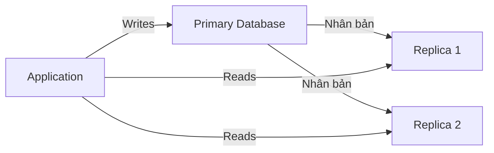

# ⚡ Tối ưu hiệu năng database: Bộ kỹ thuật architect cần nắm để hệ thống scale bền vững

> Nguồn: `050-Database-Performance-Optimization-Techniques.txt` · [Udemy](https://ua.udemy.com/course/mastering-system-design-from-basics-to-cracking-interviews/learn/lecture/49601093)

Trong bài này, chúng ta chuyển từ tầng application sang **tầng dữ liệu** — nơi database thường trở thành nút cổ chai đầu tiên khi data volume và traffic tiếp tục tăng. Mình sẽ cùng các bạn đi qua những kỹ thuật mà architect dùng để giữ hệ thống **nhanh, scale tốt và hiệu quả**: replication, sharding, partitioning, CAP theorem, indexes, normalization, connection pooling, query optimization, materialized views, batching và pagination. Mỗi kỹ thuật đều có cái giá của nó — và nhiệm vụ của architect là chọn đúng công cụ cho đúng workload.

---

### 🔁 Replication, sharding và partitioning — nền tảng mở rộng tầng dữ liệu

**Replication (nhân bản)** trở nên quan trọng ngay khi một database duy nhất không còn đáp ứng đủ yêu cầu về availability, scalability hay recovery. Cốt lõi của nó rất đơn giản: **giữ bản sao của cùng một dữ liệu trên nhiều database server** — nhưng giá trị thật nằm ở những gì các bản sao mang lại về mặt kiến trúc:

* **High availability (tính sẵn sàng cao)**: nếu primary database gặp sự cố, một replica có thể tiếp quản — giảm downtime và tăng resilience.
* **Load balancing**: read traffic được phân tán qua nhiều server thay vì dồn hết vào một database.
* **Disaster recovery**: bản sao ở nhiều vị trí khác nhau tạo "lưới an toàn" khi hạ tầng lỗi hoặc cả region gặp sự cố.

Hai mô hình phổ biến:

* **Master-slave**: mọi writes đi vào **một primary duy nhất**, các replica phục vụ reads — tương đối đơn giản và hợp với ứng dụng read-heavy.
* **Master-master**: nhiều database cùng nhận writes, tăng redundancy và geographic distribution — nhưng phức tạp hơn ở **conflict resolution** và **data consistency**.

Khi hệ thống scale, replication chuyển từ chỗ là một tối ưu đơn lẻ thành **building block nền tảng** cho reliability, performance và fault tolerance.

Khi dữ liệu lớn dần, việc chỉ thêm CPU hay RAM cho một server **đến lúc không còn đủ**. Lúc đó ta cần để **chính dữ liệu scale**, và đó là lúc **sharding** và **partitioning** xuất hiện:

* **Sharding** là kỹ thuật **horizontal scaling (mở rộng ngang)**: chia dataset lớn ra nhiều database server, mỗi shard sở hữu một tập con dữ liệu. Ví dụ quen thuộc là **geographic sharding** — người dùng ở các khu vực khác nhau được lưu trên server khác nhau. Lợi ích: cả **storage lẫn traffic đều được phân tán**, cho phép vượt giới hạn của một máy. Trade-off: **tăng độ phức tạp vận hành**, đặc biệt khi query cần dữ liệu từ nhiều shard.
* **Partitioning** giải bài toán tương tự nhưng **trong một database instance**: thay vì trải dữ liệu qua nhiều server, ta tổ chức nó thành các **logical partition** nhỏ hơn. Query nhanh hơn vì database chỉ quét partition liên quan thay vì toàn bộ dataset. Hai cách phổ biến:
  * **Range partitioning**: gom record theo khoảng giá trị như ngày tháng — rất hợp với time series hoặc dữ liệu lịch sử.
  * **Hash partitioning**: dùng hàm băm để phân phối record đều qua các partition, giúp **tránh hotspot** và cân bằng workload.

| Tiêu chí | Partitioning | Sharding |
|---|---|---|
| Phạm vi | Trong một database instance | Nhiều database server |
| Cách chia | Các logical partition | Mỗi shard giữ một tập con dữ liệu |
| Mục tiêu | Quản lý dataset lớn hiệu quả hơn | Scale vượt giới hạn một server |
| Trade-off | Chủ yếu là lợi về query | Tăng độ phức tạp vận hành |

Điểm khác biệt then chốt: **partitioning giúp một database quản lý dataset lớn hiệu quả trên một server, còn sharding giúp hệ thống vượt qua giới hạn một server**. Trên thực tế, architect thường **bắt đầu với partitioning** và chỉ chuyển sang sharding khi tăng trưởng đòi hỏi horizontal scale thật sự.

---

### ⚖️ CAP theorem — không thể tối ưu mọi thứ cùng lúc

Một trong những bài học quan trọng nhất của hệ phân tán: **bạn không thể tối ưu mọi thứ đồng thời**. **CAP theorem** cho ta một khung để hiểu các trade-off đó qua ba thuộc tính:

* **Consistency (nhất quán)**: mọi node đều thấy cùng dữ liệu sau một update.
* **Availability (sẵn sàng)**: hệ thống vẫn phản hồi request kể cả khi một phần hệ thống gặp sự cố.
* **Partition tolerance (chịu phân vùng)**: hệ thống vẫn vận hành dù network lỗi hoặc các node mất liên lạc.

Insight quan trọng: **network partition không phải chuyện lý thuyết — chúng là điều tất yếu** trong hệ phân tán lớn. Khi partition xảy ra, architect buộc phải chọn giữa **duy trì strict consistency** hoặc **duy trì availability** — không thể đảm bảo trọn vẹn cả hai.

Từ góc nhìn hiệu năng, nhiều hệ thống quy mô lớn **ưu tiên availability và partition tolerance**: thay vì block request để chờ mọi node đồng bộ, chúng tiếp tục phục vụ người dùng và để dữ liệu **hội tụ (converge) sau**. Cách này giảm latency, tăng responsiveness và giữ hệ thống hoạt động khi có sự cố. Đổi lại, người dùng có thể **thỉnh thoảng thấy dữ liệu hơi cũ (stale)** — đó là lý do nhiều nền tảng internet-scale dùng **eventual consistency (nhất quán sau cùng)** cho các thao tác không quan trọng, và dành **strong consistency (nhất quán mạnh)** cho nơi tính đúng đắn quan trọng hơn hiệu năng.

*CAP không phải bài toán chọn thuộc tính "tốt nhất", mà là **ra quyết định trade-off có hiểu biết**: đâu là nơi consistency là thiết yếu, đâu là nơi availability và performance mang lại giá trị lớn hơn cho business.*

---

### 📊 Indexes và mô hình dữ liệu — tốc độ đọc đổi lấy cái gì

**Index (chỉ mục)** là một trong những công cụ tối ưu hiệu năng mạnh nhất của database. Khi dữ liệu tăng từ hàng nghìn lên hàng triệu dòng, việc quét toàn bộ bảng cho mỗi query ngày càng đắt đỏ. Index tạo ra một cấu trúc cho phép database **định vị dữ liệu hiệu quả hơn** — giống như dùng mục lục của một cuốn sách thay vì đọc từng trang để tìm một chủ đề.

| Loại index | Mạnh nhất cho | Ghi chú |
|---|---|---|
| B-tree | Exact lookup và range query | Lựa chọn mặc định ở hầu hết database |
| Hash | Equality search | Cực nhanh khi tìm khớp chính xác |
| Full-text | Nội dung văn bản lớn | Hợp cho search feature, ứng dụng nhiều tài liệu |
| Bitmap | Cột ít giá trị | Status flag, thuộc tính phân loại |

Nhưng index **không miễn phí**: mỗi index tăng hiệu năng đọc nhưng **tốn thêm storage** và **thêm overhead khi ghi**, vì index phải được cập nhật mỗi khi dữ liệu thay đổi. Đó là lý do các hệ thống giao dịch nặng cần **thiết kế index cẩn thận**. Một sai lầm phổ biến là đánh index cho **mọi cột xuất hiện trong query**; architect giàu kinh nghiệm tập trung vào **những query quan trọng nhất**, đo lường tác động và cân bằng read performance với write cost. Mục tiêu không phải tối đa số lượng index, mà là tối đa **hiệu năng tổng thể của hệ thống**.

Về mô hình dữ liệu, **normalization** và **denormalization** là một trong những trade-off phổ biến nhất: **data integrity (toàn vẹn dữ liệu) đối đầu read performance**. Không có lựa chọn nào tốt hơn tuyệt đối — tất cả phụ thuộc vào workload mà bạn đang tối ưu:

* **Normalization**: tổ chức dữ liệu thành các bảng riêng biệt, có cấu trúc tốt để **loại bỏ trùng lặp**. Mỗi thông tin chỉ nằm ở một chỗ → giảm storage và tránh inconsistency khi dữ liệu thay đổi; rất giá trị trong **transactional system** nơi correctness và data integrity là tối quan trọng. Trade-off: truy xuất dữ liệu thường cần **nhiều join**, và chi phí này tăng lên khi dataset cùng độ phức tạp query lớn dần.
* **Denormalization**: đi hướng ngược lại — **cố ý nhân bản dữ liệu** để giảm số join cần thiết khi query. Nhờ đó thông tin hay được truy cập có thể lấy nhanh hơn nhiều, nên denormalization thường xuất hiện ở **reporting platform, analytic system và ứng dụng read-heavy**. Cái giá: dữ liệu trùng lặp tốn storage hơn và khiến update phức tạp hơn vì cùng một thông tin tồn tại ở nhiều nơi — phải **đồng bộ liên tục**.

Trong thực tế, phần lớn hệ thống lớn dùng **cách kết hợp (hybrid)**: database giao dịch được giữ **normalized** để bảo toàn integrity, còn **denormalized view, read model hoặc reporting database** được thêm vào để tối ưu hiệu năng query. Mục tiêu của architect không phải chọn một triết lý duy nhất, mà **áp dụng mỗi cách ở nơi nó mang lại giá trị lớn nhất**.

---

### ⚡ Bộ kỹ thuật tối ưu thực chiến — connection, query, view và batching

* **Connection pooling**: một trong những nút cổ chai bị bỏ sót nhiều nhất không phải bản thân query, mà là **chi phí mở và đóng connection** — cần network communication, authentication và cấp phát tài nguyên, tất cả đều tăng latency và tiêu tốn tài nguyên database. Connection pool giữ sẵn các connection đã thiết lập để ứng dụng **mượn và trả** khi cần, thay vì tạo mới cho từng request → giảm đáng kể response time và mức tiêu thụ tài nguyên. Điều này đặc biệt quan trọng với web application và microservices nơi hàng nghìn request có thể đến cùng lúc. Pool **quá nhỏ** → bottleneck và request bị xếp hàng; **quá lớn** → có thể làm quá tải database; cần cân bằng theo traffic pattern và capacity của database.
* **Query optimization**: thường là nơi mang lại bước nhảy hiệu năng lớn nhất. Trong nhiều hệ thống production, vấn đề không phải database quá nhỏ, mà là **query đang bắt database làm nhiều việc hơn mức cần thiết**. Mục tiêu: giảm lượng dữ liệu bị quét, giảm thao tác thừa và giúp query engine tìm được **execution path** hiệu quả nhất — chỉ một cải thiện nhỏ ở query chạy thường xuyên cũng có thể tác động rất lớn. Bên cạnh proper indexing, **N+1 query problem** rất hay gặp: ứng dụng lấy một collection record rồi query thêm cho **từng record một**, tạo ra hàng trăm đến hàng nghìn round trip thừa; cách xử lý là dùng **joins, eager loading hoặc batching**. Bản thân join cũng cần cân nhắc kỹ: join quá phức tạp trên bảng lớn rất đắt — hãy tối ưu join condition, index các cột join và giảm tổ hợp bảng không cần thiết. *Trước khi scale hạ tầng, hãy soi lại query: hiệu năng database hiếm khi được giải quyết chỉ bằng phần cứng.*
* **Materialized views**: ví dụ kinh điển của việc **đánh đổi storage và độ "tươi" của dữ liệu để lấy tốc độ**. Khi một query có join lớn, aggregation hay tính toán mà bị chạy lặp đi lặp lại, ta có thể tính một lần rồi **lưu kết quả lại dùng về sau**. Materialized view bản chất là **dataset được tính trước (pre-computed) và lưu trong database**; khác với regular view (chạy query bên dưới mỗi lần truy cập), nó **lưu chính kết quả query** — nhờ đó truy xuất dữ liệu tổng hợp gần như tức thì. Rất hợp cho reporting system, dashboard, BI platform và data warehouse — nơi ưu tiên phản hồi nhanh hơn độ chính xác real-time. Trade-off: dữ liệu có thể **cũ (stale) cho đến khi materialized view được refresh**, nên architect phải cân giữa yêu cầu freshness và lợi ích hiệu năng, đồng thời chọn **chiến lược refresh** phù hợp.
* **Batching và pagination**: hai kỹ thuật đơn giản nhưng thường mang lại cải thiện đáng kể vì giảm việc làm thừa. **Batching** xử lý cách ghi: mọi database call, API request hay transaction đều có overhead — chèn 10.000 record từng cái một nghĩa là bạn **trả overhead 10.000 lần**. Batching **gộp nhiều thao tác vào một request**, giúp giảm network traffic, giảm số round trip và tăng throughput; vì vậy bulk insert, bulk update, event processing pipeline và data migration thường dựa rất nhiều vào batching. **Pagination** xử lý cách đọc: load hàng triệu record trong một query hiếm khi thực tế — dễ tốn bộ nhớ, phản hồi chậm và timeout. Pagination chia dataset lớn thành các chunk nhỏ, tải dần từng phần — đặc biệt quan trọng với ứng dụng user-facing như product catalog, search result hay activity feed, nơi người dùng chỉ cần một phần nhỏ dữ liệu mỗi lần, đồng thời giảm tải cho cả database lẫn network.

*Điểm chốt: batching tối ưu cách dữ liệu được **ghi**, còn pagination tối ưu cách dữ liệu được **đọc**.*

---

### 🎯 Tự kiểm tra nhanh

**Câu 1:** Master-slave và master-master replication khác nhau thế nào?

<b>Xem đáp án</b>

**Đáp án:** Master-slave chỉ có một primary nhận writes, replica phục vụ reads; master-master cho nhiều database nhận writes nhưng phức tạp hơn về conflict resolution và consistency.

Giải thích: Master-slave đơn giản, hợp ứng dụng read-heavy; master-master tăng redundancy và geographic distribution.

Tham chiếu: Mục Replication, sharding và partitioning.

**Câu 2:** Partitioning và sharding khác nhau ở điểm cốt lõi nào?

<b>Xem đáp án</b>

**Đáp án:** Partitioning chia dữ liệu thành các phần logic trong một database instance; sharding trải dữ liệu qua nhiều database server.

Giải thích: Partitioning giúp một server quản lý dataset lớn hiệu quả; sharding giúp vượt qua giới hạn một server.

Tham chiếu: Mục Replication, sharding và partitioning.

**Câu 3:** Khi network partition xảy ra, CAP theorem buộc architect chọn gì?

<b>Xem đáp án</b>

**Đáp án:** Chọn giữa strict consistency hoặc availability — không thể đảm bảo trọn vẹn cả hai.

Giải thích: Nhiều hệ thống lớn ưu tiên availability và partition tolerance, chấp nhận eventual consistency cho thao tác không quan trọng.

Tham chiếu: Mục CAP theorem.

**Câu 4:** Vì sao index không miễn phí?

<b>Xem đáp án</b>

**Đáp án:** Mỗi index tăng hiệu năng đọc nhưng tốn thêm storage và tạo overhead khi ghi, vì index phải cập nhật mỗi khi dữ liệu thay đổi.

Giải thích: Cần chọn index cho những query quan trọng nhất thay vì đánh index mọi cột.

Tham chiếu: Mục Indexes và mô hình dữ liệu.

**Câu 5:** N+1 query problem là gì và cách giải quyết?

<b>Xem đáp án</b>

**Đáp án:** Là việc ứng dụng lấy một collection record rồi query thêm cho từng record, tạo ra hàng trăm đến hàng nghìn round trip thừa; giải bằng joins, eager loading hoặc batching.

Giải thích: Đây là lỗi hiệu năng rất phổ biến trong production và thường được xử lý ở tầng query optimization.

Tham chiếu: Mục Bộ kỹ thuật tối ưu thực chiến.

---

Vậy là chúng ta đã đi qua gần trọn bộ kỹ thuật tối ưu database: từ replication, sharding, partitioning, CAP theorem, indexes, normalization/denormalization đến connection pooling, query optimization, materialized views, batching và pagination. Rahul có kèm một **PDF tham khảo với đáp án chi tiết** cho các câu hỏi phỏng vấn của bài này — các bạn nhớ xem lại khi ôn tập nhé. *Bài học xuyên suốt rất rõ ràng: không có một tối ưu nào giải quyết mọi vấn đề hiệu năng — điều quan trọng là hiểu workload của mình, xác định đúng nút cổ chai và kết hợp đúng kỹ thuật.* Ở bài tiếp theo, chúng ta sẽ cùng nhìn lại toàn bộ section Performance để ghép mọi mảnh ghép thành một tư duy performance engineering hoàn chỉnh. Hẹn gặp lại! 🚀
