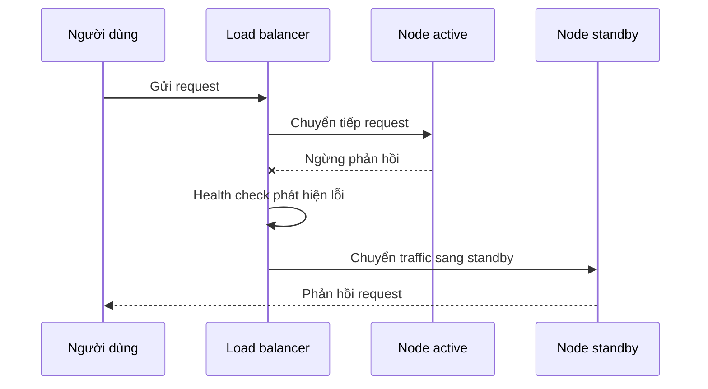

# ⚙️ High Availability, Fault Tolerance & Failover — bộ ba giữ hệ thống luôn "sống"

> Nguồn: `053-High-Availability-Fault-Tolerance-Failover.txt` · [Udemy](https://ua.udemy.com/course/mastering-system-design-from-basics-to-cracking-interviews/learn/lecture/49632063)

Trong bài này, chúng ta sẽ cùng tìm hiểu cách các hệ thống hiện đại **vẫn sẵn sàng bất chấp lỗi** nhờ **high availability (tính sẵn sàng cao)**, **fault tolerance (khả năng chịu lỗi)**, **redundancy (dư thừa)** và những chiến lược **failover (chuyển đổi dự phòng)** thông minh. Đây là bộ công cụ để các bạn xây dựng kiến trúc production-ready thực sự kiên cường.

---

### 🔁 Redundancy — nguyên tắc nền tảng của mọi hệ thống reliable

Redundancy là một trong những kỹ thuật nền tảng nhất để xây hệ thống đáng tin cậy. Ý tưởng rất đơn giản: **không bao giờ để một thành phần đơn lẻ gặp lỗi có thể hạ gục cả ứng dụng**. Nếu mọi phần quan trọng đều có bản dự phòng sẵn sàng tiếp quản, hệ thống của các bạn trở nên kiên cường hơn hẳn.

Redundancy có thể tồn tại ở nhiều tầng:

* **Tầng hạ tầng** — hardware redundancy: chạy nhiều server hoặc storage device để lỗi phần cứng không làm gián đoạn dịch vụ.
* **Tầng mạng** — nhiều network path, router hoặc availability zone để duy trì kết nối khi một phần mạng không khả dụng.
* **Tầng ứng dụng** — service redundancy: chạy nhiều instance của microservices hoặc các database được nhân bản, để request vẫn được phục vụ khi từng instance lỗi.

Tuy nhiên, **chỉ nhân bản các thành phần là chưa đủ**. Hệ thống dư thừa phải luôn **khỏe mạnh, đồng bộ và sẵn sàng tiếp quản tự động** khi lỗi xảy ra — nếu không, bản backup của bạn chỉ là một thành phần khác có thể lỗi đúng vào lúc bạn cần nó nhất.

Và đây là trade-off quan trọng: **mỗi tầng redundancy cải thiện availability nhưng cũng mang thêm chi phí, độ phức tạp vận hành và thách thức đồng bộ** mà kiến trúc sư phải cân bằng rất cẩn thận.

---

### 🧩 Ba chiến lược redundancy: N+1, active-active và active-passive

Khi hệ thống ngày càng trọng yếu, chỉ thêm thành phần dư thừa là chưa đủ — các bạn còn cần **chiến lược sử dụng** những thành phần đó khi lỗi xảy ra. Ba mô hình phổ biến nhất, mỗi mô hình tối ưu cho một kiểu trade-off khác nhau:

* **N+1** — luôn giữ **một instance dư thừa ngoài mức tối thiểu cần thiết**. Nếu ứng dụng cần 2 server để xử lý traffic đỉnh, bạn triển khai 3. Instance dư đó **không phải để tăng hiệu năng**, mà để **hấp thụ lỗi mà không ảnh hưởng người dùng**. Cách này phổ biến trong hạ tầng, database và cả thiết bị mạng.
* **Active-active** — nhiều node **cùng phục vụ request đồng thời**, load balancer phân phối traffic qua chúng. Nếu một node lỗi, traffic được chuyển sang các node khỏe mạnh còn lại, người dùng thường không hề nhận ra. Trade-off là **độ phức tạp vận hành lớn hơn**, vì dữ liệu, session và state cần được đồng bộ giữa nhiều instance active.
* **Active-passive** — chỉ **một node phục vụ traffic**, node còn lại chờ ở chế độ standby. Nếu node active lỗi, node standby được **promote** lên và bắt đầu phục vụ. Mô hình này **đơn giản hơn khi vận hành** và được dùng rộng rãi cho disaster recovery và database. Đổi lại, **năng lực của node standby gần như bị bỏ không**, và failover thường kéo theo một **độ trễ phục hồi nhỏ**.

| Chiến lược | Cách hoạt động | Ưu điểm | Đánh đổi |
|---|---|---|---|
| N+1 | Thêm 1 instance ngoài mức tối thiểu | Hấp thụ lỗi, đơn giản | Tốn thêm tài nguyên dự phòng |
| Active-active | Nhiều node phục vụ đồng thời | Availability và tận dụng tài nguyên cao | Đồng bộ data, session, state phức tạp |
| Active-passive | 1 node chạy, 1 node chờ | Vận hành đơn giản | Standby nhàn rỗi, failover có độ trễ nhỏ |

Không có chiến lược nào tốt nhất phổ quát: **active-active tối đa hóa availability và hiệu quả sử dụng tài nguyên, active-passive ưu tiên sự đơn giản, còn N+1 đảm bảo hệ thống có đủ năng lực dự phòng để sống sót qua lỗi**. Chọn chiến lược nào là một **quyết định kiến trúc** dựa trên yêu cầu availability, ràng buộc chi phí và mức độ phức tạp vận hành mà bạn chấp nhận được.

---

### 🪜 Graceful degradation — lỗi không nhất thiết là downtime

Lỗi không phải lúc nào cũng dẫn đến downtime. Trong nhiều hệ thống production, chiến lược tốt hơn là **giữ cho chức năng quan trọng nhất tiếp tục chạy, trong khi tạm thời hy sinh những tính năng ít quan trọng hơn**. Nguyên tắc thiết kế này được gọi là **graceful degradation (suy giảm mềm)**.

Hãy xét một sàn thương mại điện tử trong ngày Black Friday. Giả sử **recommendation service (dịch vụ gợi ý)** bị quá tải hoặc ngừng hoạt động. Thay vì để lỗi đó ảnh hưởng đến toàn bộ website, ứng dụng chỉ **ẩn phần gợi ý**, trong khi **duyệt sản phẩm, giỏ hàng và thanh toán vẫn hoạt động đầy đủ**. Từ góc nhìn kinh doanh, đó chính xác là trade-off đúng: **bạn bảo vệ con đường tạo doanh thu, tạm tắt tính năng không thiết yếu**.

Graceful degradation cũng **cải thiện niềm tin của người dùng**: một ứng dụng hoạt động một phần gần như luôn tốt hơn một ứng dụng không dùng được gì cả. Để làm được điều này, kiến trúc sư phải xác định rõ **tính năng nào là mission-critical và tính năng nào có thể tắt an toàn khi lỗi**. Trong hệ phân tán hiện đại, graceful degradation không phải là suy nghĩ thêm sau — nó được **thiết kế vào kiến trúc ngay từ đầu**. Mục tiêu không phải làm cho lỗi trở nên vô hình, mà là đảm bảo chúng có **ảnh hưởng nhỏ nhất có thể** trong khi hệ thống vẫn tiếp tục mang lại giá trị cốt lõi.

---

### 🌐 Ba pattern HA, thiết kế redundancy và self-healing

High availability không đạt được bằng một công nghệ đơn lẻ — đó là kết quả của **nhiều pattern kiến trúc phối hợp để loại bỏ single point of failure**. Ba pattern nền tảng nhất:

1. **Load balancing** — phân phối request đến nhiều instance khỏe mạnh, ngăn bất kỳ server nào trở thành bottleneck. Quan trọng không kém: load balancer **liên tục giám sát sức khỏe** các instance; server không khả dụng sẽ bị **tự động loại khỏi pool** và traffic được chuyển sang node khỏe mạnh. Đây là building block then chốt của kiến trúc active-active.
2. **Replication** — hạ tầng có thể thay thế, nhưng **dữ liệu quý giá hơn nhiều**. Duy trì nhiều bản sao dữ liệu trên các node — thậm chí nhiều region — giúp hệ thống tiếp tục phục vụ khi phần cứng hỏng hoặc data center gặp sự cố. Replication **synchronous hay asynchronous** phụ thuộc vào cân bằng mong muốn giữa **consistency, latency và availability**.
3. **Failover** — replication đảm bảo có bản dự phòng, còn failover đảm bảo bản dự phòng **thực sự được dùng khi cần**. Health check phát hiện lỗi, traffic hoặc workload được **tự động chuyển sang instance standby** với can thiệp thủ công tối thiểu. Quá trình này càng nhanh và đáng tin, ảnh hưởng lên người dùng càng nhỏ.

Trong thực tế, các pattern này **hiếm khi hoạt động đơn lẻ**. Một hệ thống production sẵn sàng cao thường kết hợp load balancing để phân phối traffic, replication để bảo vệ dữ liệu, và automated failover để phục hồi nhanh — cùng nhau tạo nên nền móng cho hệ thống tiếp tục vận hành khi các thành phần đơn lẻ lỗi, và chúng **chắc chắn sẽ lỗi**.

**Thiết kế redundancy** cũng không phải việc thêm thành phần dự phòng vào cuối dự án — nó là việc **giả định lỗi sẽ xảy ra** và đảm bảo hệ thống tiếp tục chạy khi đó. Các kiến trúc sư giàu kinh nghiệm thiết kế cho lỗi **từ ngày đầu tiên**, chứ không phải sau outage đầu tiên:

1. **Thành phần dư thừa** — mọi phần quan trọng của kiến trúc (web server, database, cache, message broker) đều nên có nhiều instance, loại bỏ single point of failure.
2. **Dư thừa địa lý** — nhiều server trong cùng một data center bảo vệ bạn khỏi lỗi phần cứng, nhưng **không bảo vệ khỏi sự cố toàn vùng**. Triển khai ứng dụng và nhân bản dữ liệu qua nhiều cloud region hoặc data center giúp bạn sống sót qua các sự cố quy mô lớn như mất điện, gián đoạn mạng hay thiên tai — đây là **nền tảng của disaster recovery planning**.
3. **Failover tự động** — redundancy chỉ hiệu quả nếu quá trình phục hồi diễn ra tự động. Automated failover dùng health check và monitoring để phát hiện lỗi và ngay lập tức chuyển traffic, promote tài nguyên standby **không cần chờ con người can thiệp**. Hệ thống phục hồi càng nhanh, ảnh hưởng lên người dùng càng thấp.

Khi kết hợp dư thừa địa lý với failover tự động, **lỗi trở thành sự kiện vận hành thường ngày thay vì outage nghiêm trọng của doanh nghiệp** — đó chính là tư duy đằng sau thiết kế hệ thống kiên cường, chuẩn production.

Xây hệ thống dư thừa mới chỉ là nửa thách thức. Các bạn còn cần **biết khi nào có thứ gì đó lỗi** và phục hồi càng nhanh càng tốt. Vì vậy, **health monitoring** và **self-healing (tự phục hồi)** đã trở thành năng lực thiết yếu của hệ phân tán hiện đại.

**Health monitoring** liên tục đánh giá tình trạng hạ tầng và dịch vụ. Thay vì chờ người dùng báo lỗi, hệ thống theo dõi các chỉ số như **response time, error rate, mức sử dụng tài nguyên và service availability**. Khi các chỉ số vượt ngưỡng định trước, **alert** được tạo ra để vấn đề được điều tra **trước khi trở thành outage lớn**. Trong production, monitoring hiệu quả thường là **dấu hiệu đầu tiên** cho biết có gì đó đang không ổn.

**Self-healing** là bước tiếp theo: thay vì phụ thuộc kỹ sư khôi phục thủ công, nền tảng **tự động thực hiện hành động khắc phục** — restart container lỗi, thay thế virtual machine không khỏe mạnh, hoặc chuyển hướng traffic khỏi node có vấn đề. Các nền tảng như **Kubernetes** và những nhà cung cấp cloud thực hiện nhiều hành động phục hồi này **tự động**, qua đó **giảm mạnh thời gian phục hồi**.

Điều này phản ánh một thay đổi quan trọng trong kiến trúc hiện đại: chúng ta không còn giả định hạ tầng luôn đáng tin cậy. Thay vào đó, chúng ta **chờ đợi lỗi xảy ra** và xây hệ thống có thể **phát hiện, cô lập và phục hồi với can thiệp thủ công tối thiểu**. Kết hợp health monitoring và self-healing đưa reliability từ một quy trình **bị động** thành quy trình **chủ động**: monitoring cho biết khi hệ thống không khỏe, còn self-healing đảm bảo nhiều lỗi được xử lý tự động **trước khi người dùng kịp nhận ra**.

---

### 🎯 Tự kiểm tra nhanh

**Câu 1:** Redundancy ở tầng ứng dụng nghĩa là gì?

<b>Xem đáp án</b>

**Đáp án:** Chạy nhiều instance của microservices hoặc các database được nhân bản để request vẫn được phục vụ khi từng instance lỗi.

Giải thích: Đây là một trong ba tầng redundancy, bên cạnh tầng hạ tầng và tầng mạng.

Tham chiếu: Mục Redundancy — nguyên tắc nền tảng của mọi hệ thống reliable.

**Câu 2:** Trong mô hình N+1, instance dư thừa tồn tại để làm gì?

<b>Xem đáp án</b>

**Đáp án:** Để hấp thụ lỗi mà không ảnh hưởng người dùng — không phải để tăng hiệu năng.

Giải thích: Ví dụ ứng dụng cần 2 server cho traffic đỉnh thì triển khai 3.

Tham chiếu: Mục Ba chiến lược redundancy.

**Câu 3:** Trade-off lớn nhất của kiến trúc active-active là gì?

<b>Xem đáp án</b>

**Đáp án:** Độ phức tạp vận hành cao hơn vì dữ liệu, session và state phải được đồng bộ giữa nhiều instance active.

Giải thích: Đổi lại, active-active tối đa hóa availability và hiệu quả sử dụng tài nguyên.

Tham chiếu: Mục Ba chiến lược redundancy.

**Câu 4:** Graceful degradation được áp dụng thế nào trong ví dụ Black Friday?

<b>Xem đáp án</b>

**Đáp án:** Ẩn phần gợi ý sản phẩm khi recommendation service quá tải, giữ duyệt sản phẩm, giỏ hàng và thanh toán hoạt động bình thường.

Giải thích: Đây là trade-off đúng từ góc nhìn kinh doanh: bảo vệ con đường tạo doanh thu, tạm tắt tính năng không thiết yếu.

Tham chiếu: Mục Graceful degradation — lỗi không nhất thiết là downtime.

**Câu 5:** Health monitoring và self-healing khác nhau thế nào?

<b>Xem đáp án</b>

**Đáp án:** Monitoring theo dõi chỉ số và tạo alert khi vượt ngưỡng; self-healing tự động khắc phục — restart container, thay thế VM, chuyển hướng traffic.

Giải thích: Kết hợp cả hai đưa reliability từ bị động thành chủ động, xử lý lỗi trước khi người dùng nhận ra.

Tham chiếu: Mục Ba pattern HA, thiết kế redundancy và self-healing.

---

Vậy là chúng ta đã đi qua những nguyên tắc kiến trúc giữ hệ thống hiện đại luôn sẵn sàng: **high availability** loại bỏ single point of failure bằng redundancy, load balancing và automated failover; **fault tolerance** tiến thêm một bước khi đảm bảo hệ thống vẫn cung cấp chức năng cốt lõi bất chấp lỗi cục bộ; và **graceful degradation** giúp ưu tiên những tính năng thiết yếu khi tài nguyên bị siết lại. Bài học lớn nhất: **hệ thống reliable không được xây bằng cách ngăn mọi lỗi, mà bằng cách chờ đợi lỗi, cô lập ảnh hưởng và phục hồi nhanh, tự động**.

Ở bài tiếp theo, chúng ta sẽ chuyển trọng tâm từ việc **giữ hệ thống chạy** sang việc **bảo vệ dữ liệu và phục hồi sau thảm họa** với các chiến lược backup & recovery. Hẹn gặp lại các bạn! 🚀
