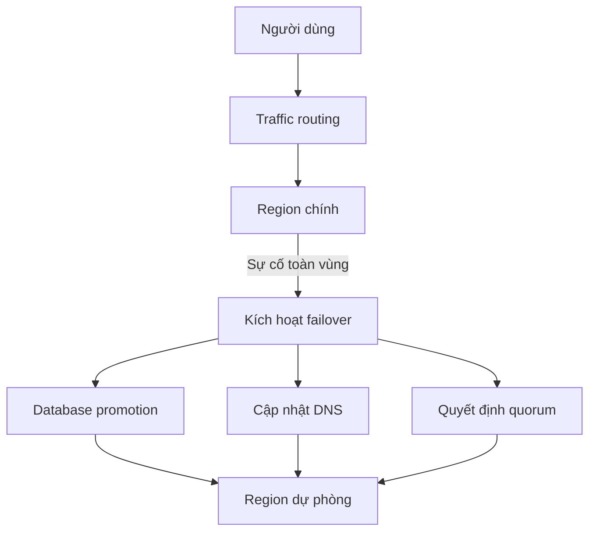

# 🌍 Disaster Recovery in Practice — khi cả một vùng hạ tầng "gục ngã"

> Nguồn: `055-Disaster-Recovery-in-Practice.txt` · [Udemy](https://ua.udemy.com/course/mastering-system-design-from-basics-to-cracking-interviews/learn/lecture/49632067)

Trong bài này, chúng ta sẽ xem **disaster recovery (khôi phục sau thảm họa)** được triển khai thực tế như thế nào trong các hệ phân tán: những pattern kiến trúc và thực hành vận hành giữ cho ứng dụng mission-critical tiếp tục chạy xuyên qua sự cố. Nếu backup là lưới an toàn cho dữ liệu, thì disaster recovery là **kế hoạch giữ doanh nghiệp tiếp tục hoạt động**.

---

### 🎯 Vì sao disaster recovery quan trọng — và DR khác backup ở đâu

Disaster recovery đảm bảo **doanh nghiệp có thể tiếp tục vận hành khi có sự cố nghiêm trọng**, chứ không chỉ là khôi phục dữ liệu đã mất. Backup giúp mang thông tin trở lại, nhưng **không đảm bảo ứng dụng, hạ tầng và dịch vụ của bạn hoạt động trở lại nhanh chóng**.

Với hệ thống mission-critical, ngay cả một outage ngắn cũng có thể dẫn đến **tổn thất tài chính đáng kể, gián đoạn vận hành và tổn hại niềm tin khách hàng**. Vì vậy, kế hoạch DR được thiết kế để xử lý **các sự kiện quy mô lớn**: sự cố toàn vùng, hỏng hạ tầng, tấn công ransomware, hoặc những gián đoạn nghiêm trọng khác.

Cách nhìn quan trọng nhất: **DR là phần mở rộng tự nhiên của chiến lược backup**.

* Backup trả lời câu hỏi: *"Tôi có thể khôi phục dữ liệu của mình không?"*
* DR đi xa hơn: *"Tôi có thể khôi phục **toàn bộ hệ thống** và **tiếp tục hoạt động kinh doanh** nhanh đến mức nào?"*

Với nhiều ngành được quản lý chặt như **tài chính và y tế**, có một chiến lược DR đã được kiểm thử không chỉ là kỹ thuật tốt — đó là **yêu cầu tuân thủ (compliance requirement)**. Trong hệ phân tán hiện đại, DR là một phần cơ bản của kiến trúc kiên cường, sẵn sàng production.

---

### 🏗️ DR cho hệ mission-critical: RTO/RPO nghiêm ngặt và automation

Disaster recovery trở nên khắt khe hơn hẳn khi bạn thiết kế hệ mission-critical, bởi doanh nghiệp **không thể chịu đựng outage kéo dài hay mất mát dữ liệu lớn**. Những ứng dụng này được thiết kế quanh các mục tiêu **RTO và RPO nghiêm ngặt**, định nghĩa dịch vụ phải phục hồi nhanh đến đâu và mất bao nhiêu dữ liệu là chấp nhận được.

Để đạt được những mục tiêu đó, hệ thống cần **khả năng kiên cường ở mọi tầng của stack** — không chỉ database được nhân bản, mà còn **compute, storage, networking dư thừa**, và thường là **nhiều availability zone hoặc region**. Chỉ một **single point of failure** ở bất kỳ đâu trong hạ tầng cũng có thể **đe dọa toàn bộ chiến lược phục hồi**.

Trong một thảm họa thật, **khôi phục thủ công thường quá chậm và dễ sai sót**. Vì vậy:

1. **Automated failover** kết hợp với **quy trình phục hồi được kiểm thử thường xuyên** đảm bảo hệ thống chuyển sang môi trường khỏe mạnh với gián đoạn tối thiểu.
2. **Ngân hàng, y tế và các nền tảng e-commerce lớn** đầu tư rất mạnh vào disaster recovery.
3. Với họ, DR **không phải một quy trình vận hành tách rời** — nó là **năng lực kiến trúc cốt lõi**, được thiết kế, kiểm thử và xác thực liên tục.

---

### 🧪 Failover + backup = kiên cường thực sự, và bài học "chưa test thì coi như chưa có"

Một trong những hiểu lầm lớn nhất về disaster recovery là nghĩ rằng **chỉ backup là đủ để tạo resilience** — không phải vậy:

* Backup **thiết yếu để khôi phục dữ liệu** sau khi xóa nhầm, hỏng dữ liệu hoặc ransomware, nhưng **không giữ ứng dụng của bạn chạy trong lúc hạ tầng gặp sự cố**.
* **Failover** mới là thứ chuyển traffic sang môi trường khỏe mạnh khi server, data center hoặc cả region trở nên không khả dụng, giúp người dùng tiếp tục sử dụng dịch vụ gần như không gián đoạn.

Hai năng lực này giải quyết hai bài toán khác nhau nhưng **bổ trợ cho nhau**: backup bảo vệ dữ liệu, failover bảo vệ availability của ứng dụng. Một chiến lược DR trưởng thành **kết hợp cả hai**, đảm bảo bạn phục hồi được từ mọi thứ — từ một database hỏng đơn lẻ đến sự cố toàn vùng — và phục hồi một cách tự tin.

Và đây là nguyên tắc bạn sẽ gặp ở mọi đội production: **một kế hoạch DR chỉ tốt bằng lần kiểm thử thành công gần nhất**. Bạn có thể ghi lại từng bước khôi phục, nhưng nếu chưa từng **xác thực nó trong điều kiện thực tế**, không có gì đảm bảo nó sẽ hoạt động khi sự cố thật xảy ra. Vì thế câu nói *"if you have not tested it, you don't have it"* — **chưa kiểm thử thì coi như chưa có** — được dùng rộng rãi trong production engineering.

Automation giữ vai trò then chốt ở đây:

* **Failover diễn ra với can thiệp thủ công tối thiểu**.
* **Dữ liệu khôi phục được tự động xác thực tính toàn vẹn**.
* **Mọi hành động phục hồi đều tạo notification và log**, để đội ngũ có đầy đủ khả năng quan sát quá trình.

Cuối cùng, tổ chức nên chạy **DR drills (diễn tập) định kỳ**, mô phỏng các kịch bản lỗi thực tế như sự cố toàn vùng hay database hỏng. Những bài tập này xác thực **không chỉ công nghệ, mà cả mức độ sẵn sàng vận hành của đội ngũ** — biến kế hoạch DR từ một tài liệu trên giấy thành **năng lực bạn thực sự tin dùng được trong production**.

---

### 🌐 Geo-redundancy, quorum và những thách thức của hệ geo-distributed

Hai nguyên tắc kiến trúc nền tảng cho hệ phân tán kiên cường là **geo-redundancy** và **thiết kế dựa trên quorum**:

* **Geo-redundancy** — triển khai ứng dụng và dữ liệu qua **nhiều vùng vật lý khác nhau**, để nếu cả data center hoặc region trở nên không khả dụng, một địa điểm khác vẫn tiếp tục phục vụ người dùng. Điều này **loại bỏ sự cố toàn vùng khỏi vai trò single point of failure**.
* **Quorum-based design** — trong hệ phân tán, một thao tác chỉ được coi là thành công sau khi được **một số node tối thiểu xác nhận** (gọi là quorum). Yêu cầu sự đồng thuận từ **đa số** ngăn các cập nhật xung đột và đảm bảo hệ thống tiếp tục đưa ra quyết định an toàn kể cả khi một số node không liên lạc được.

Kết hợp lại, hai khái niệm này mang đến **cả resilience lẫn correctness**: geo-redundancy giữ dịch vụ sẵn sàng qua các sự cố quy mô lớn, còn quyết định dựa trên quorum duy trì **tính nhất quán dữ liệu** và cho phép **failover an toàn mà không rơi vào tình huống split-brain (não phân liệt)**. Các database phân tán và hệ thống phối hợp hiện đại dựa vào cả hai nguyên tắc để đạt được disaster recovery đáng tin cậy ở quy mô lớn.

Tuy nhiên, geo-redundancy và kiến trúc geo-distributed cũng mang đến **những thách thức kỹ thuật mới** mà triển khai một region không có:

* **Cân bằng consistency và availability** là thách thức lớn nhất. Giữ dữ liệu đồng bộ giữa các region **không bao giờ tức thời**, nên kiến trúc sư phải quyết định **mức replication delay nào là chấp nhận được** cho ứng dụng của mình.
* **Failover latency** — replication và failover xuyên region chắc chắn thêm **độ trễ truyền thông**. Nếu kiến trúc không được thiết kế cẩn thận, quá trình phục hồi có thể **chậm hơn mong đợi đúng vào lúc tốc độ phục hồi quan trọng nhất**.
* **Yếu tố quy định pháp lý** — nhiều quốc gia yêu cầu một số loại dữ liệu khách hàng phải **nằm trong biên giới địa lý cụ thể**, điều này ảnh hưởng trực tiếp đến cách nhân bản dữ liệu và nơi đặt môi trường disaster recovery.
* **Điều phối multi-region failover** — bạn cần **traffic routing, database promotion, cập nhật DNS và quyết định quorum** cùng phối hợp nhịp nhàng để tránh split-brain hoặc phục vụ dữ liệu cũ (stale data).

Replication cải thiện resilience đáng kể, nhưng nó **chỉ thành công khi những trade-off vận hành và kiến trúc này được xử lý thấu đáo**.

---

### 🎯 Tự kiểm tra nhanh

**Câu 1:** Disaster recovery khác backup ở câu hỏi cốt lõi nào?

<b>Xem đáp án</b>

**Đáp án:** Backup hỏi "tôi có khôi phục được dữ liệu không?"; DR hỏi "tôi khôi phục toàn bộ hệ thống và tiếp tục kinh doanh nhanh đến mức nào?".

Giải thích: DR là phần mở rộng tự nhiên của chiến lược backup, hướng tới việc giữ doanh nghiệp vận hành.

Tham chiếu: Mục Vì sao disaster recovery quan trọng.

**Câu 2:** Vì sao backup một mình không tạo nên resilience?

<b>Xem đáp án</b>

**Đáp án:** Vì backup không giữ ứng dụng chạy khi hạ tầng gặp sự cố — cần failover để chuyển traffic sang môi trường khỏe mạnh.

Giải thích: Backup bảo vệ dữ liệu, failover bảo vệ availability; chiến lược DR trưởng thành cần cả hai.

Tham chiếu: Mục Failover + backup = kiên cường thực sự.

**Câu 3:** Câu nói "if you have not tested it, you don't have it" nhấn mạnh điều gì?

<b>Xem đáp án</b>

**Đáp án:** Một kế hoạch DR chưa được kiểm thử dưới điều kiện thực tế thì không thể tin dùng trong production.

Giải thích: Vì vậy cần DR drills định kỳ để xác thực cả công nghệ lẫn mức sẵn sàng vận hành của đội ngũ.

Tham chiếu: Mục Failover + backup = kiên cường thực sự.

**Câu 4:** Quorum-based design giúp gì trong disaster recovery?

<b>Xem đáp án</b>

**Đáp án:** Yêu cầu đa số node xác nhận trước khi coi thao tác là thành công, ngăn cập nhật xung đột và cho phép failover an toàn mà không split-brain.

Giải thích: Quorum duy trì tính nhất quán dữ liệu, bổ trợ cho geo-redundancy giữ dịch vụ sẵn sàng.

Tham chiếu: Mục Geo-redundancy, quorum và những thách thức của hệ geo-distributed.

**Câu 5:** Thách thức lớn nhất của kiến trúc geo-distributed là gì?

<b>Xem đáp án</b>

**Đáp án:** Cân bằng giữa consistency và availability, vì dữ liệu giữa các region không bao giờ đồng bộ tức thời.

Giải thích: Kèm theo đó là failover latency, yêu cầu pháp lý về vị trí dữ liệu và việc điều phối routing, promotion, DNS, quorum.

Tham chiếu: Mục Geo-redundancy, quorum và những thách thức của hệ geo-distributed.

---

Vậy là các bạn đã thấy disaster recovery trong thực tế: nó **không chỉ là khôi phục dữ liệu mà là giữ doanh nghiệp tiếp tục chạy khi lỗi xảy ra**. Kiến trúc kiên cường kết hợp **backup để khôi phục dữ liệu** với **failover để duy trì availability** qua các sự cố hạ tầng hoặc toàn vùng; và quan trọng không kém là **mức độ sẵn sàng vận hành** — quy trình phải được tự động hóa và xác thực bằng diễn tập định kỳ. Khi hệ thống mở rộng xuyên region, resilience phụ thuộc vào những quyết định kiến trúc thấu đáo như **geo-redundancy** và cơ chế nhất quán như **quorum**.

Ở bài tiếp theo, chúng ta sẽ **tổng kết toàn bộ section** và recap những nguyên tắc then chốt để thiết kế hệ phân tán reliable, sẵn sàng cao. Hẹn gặp lại các bạn! 🚀
