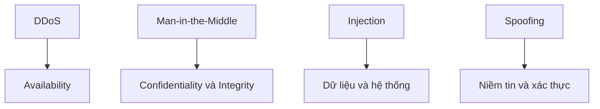

# 🔐 Security trong System Design — thiết kế an toàn ngay từ đầu, không phải vá sau

> Nguồn: `057-Introduction-to-Security-in-System-Design.txt` · [Udemy](https://ua.udemy.com/course/mastering-system-design-from-basics-to-cracking-interviews/learn/lecture/49632567)

Chào mừng các bạn đến với section mới: **Security in System Design**. Trong section này, chúng ta sẽ khám phá những **nguyên lý, thực hành và protocol** giúp thiết kế hệ thống **secure by design (an toàn theo thiết kế)** thay vì **secure by accident (an toàn nhờ may mắn)**. Bài mở đầu hôm nay dựng nền móng: vì sao security không thể xem nhẹ, vì sao hệ phân tán khó bảo vệ hơn, và kiến trúc sư dùng những khung tư duy nào để phòng thủ.

---

### 🔐 Vì sao security là yêu cầu nền tảng — và hệ phân tán khó hơn thế nào?

Security là một trong những loại yêu cầu **dễ bị đánh giá thấp nhất**, vì nó **không thêm tính năng mới**. Người dùng không đăng ký chỉ vì hệ thống của bạn an toàn — nhưng chắc chắn sẽ **rời đi nếu nó không an toàn**. Vì vậy, security được xem là **non-functional requirement (yêu cầu phi chức năng) nền tảng**.

* Suy cho cùng, security là **bảo vệ niềm tin**: người dùng giao cho bạn thông tin cá nhân, dữ liệu tài chính và tài sản sống còn của doanh nghiệp.
* Security gắn chặt với **reliability (độ tin cậy)**: một hệ thống bị **data breach (rò rỉ dữ liệu)**, ransomware hay **denial-of-service (tấn công từ chối dịch vụ)** có thể ngừng hoạt động, mất toàn vẹn dữ liệu hoặc **outage (gián đoạn) kéo dài**. Và lịch sử đã trả giá rất đắt: **vụ rò rỉ dữ liệu Equifax** cùng **sự cố lộ dữ liệu của Facebook** ảnh hưởng đến hàng triệu người dùng, kéo theo **thiệt hại tài chính khổng lồ, hình phạt pháp lý và tổn thất niềm tin** — uy tín đánh mất thường khó khôi phục hơn cả lỗi kỹ thuật.

Nhiệm vụ của kiến trúc sư **không phải "gắn" security vào hệ thống sau khi xây xong**, mà là **thiết kế với security ngay từ đầu**. Với hệ phân tán, điều này khó hơn hẳn:

* Khác với **monolith (khối đơn)** — nơi phần lớn giao tiếp diễn ra trong một tiến trình — hệ phân tán gồm nhiều service giao tiếp qua mạng. Mỗi service, API, **message queue (hàng đợi thông điệp)** và kết nối database là một **điểm vào tiềm năng cho kẻ tấn công**.
* **Encryption (mã hóa)** phải bảo vệ dữ liệu cả khi di chuyển giữa các service lẫn khi lưu trong database và object storage. **Authentication (xác thực)** kiểm chứng danh tính người dùng và service; **authorization (ủy quyền)** đảm bảo họ chỉ làm được những gì được phép — mọi lời gọi **service-to-service** phải bị coi là **chưa đáng tin cho đến khi được xác minh**.
* API công khai cần **input validation (kiểm tra đầu vào)**, **rate-limiting (giới hạn tần suất request)** và giao tiếp bảo mật — để một endpoint yếu không trở thành **cửa ngõ vào toàn bộ hệ thống**.
* Ở tầng hạ tầng, **node, container, máy ảo và mạng** phải được **harden (gia cố)** bằng **segmentation (phân vùng)**, firewall, giám sát liên tục và **patching (vá lỗ hổng) kịp thời**.

Nguyên lý then chốt là **defense in depth (phòng thủ nhiều tầng)**: thay vì tin vào một cơ chế duy nhất, ta xây **nhiều lớp bảo vệ** — nếu một lớp thất bại, những lớp còn lại vẫn che chắn hệ thống.

---

### 🧩 CIA triad — ba trụ cột của an toàn hệ thống

**CIA triad** là nền tảng của gần như mọi framework bảo mật. Khi đánh giá một hệ thống, kiến trúc sư thực chất hỏi ba câu: *Dữ liệu có được bảo vệ không? Có thể tin cậy được không? Và hệ thống có sẵn sàng khi người dùng cần không?*

* **Confidentiality (tính bí mật)** — ngăn chặn truy cập trái phép vào thông tin nhạy cảm. Chỉ người dùng đã xác thực và được ủy quyền mới truy cập được dữ liệu khách hàng, giao dịch tài chính hay dữ liệu nội bộ. Công cụ nền tảng: **encryption, access control, identity management**.
* **Integrity (tính toàn vẹn)** — dữ liệu **chính xác và không bị thay đổi, trừ khi được sửa bởi thực thể có thẩm quyền**. Nếu ai đó sửa số tiền thanh toán, đổi file cấu hình hay can thiệp thông điệp giữa các service, hệ thống phải **phát hiện được**. Công cụ: **hashing, checksum, digital signature (chữ ký số)**.
* **Availability (tính sẵn sàng)** — hệ thống và dữ liệu **vẫn truy cập được khi có lỗi hoặc bị tấn công**. High availability không chỉ là dự phòng phần cứng mà còn là thiết kế cho **failover (chuyển đổi dự phòng), replication (nhân bản), load balancing, backup** và chống **DDoS**.

Một hệ thống an toàn không phải hệ thống "chặn được hacker", mà là hệ thống **giữ kín thông tin, bảo toàn tính toàn vẹn và tiếp tục phục vụ người dùng hợp pháp đáng tin cậy — ngay cả trong điều kiện bất lợi**.

---

### 🗺️ Threat modeling và STRIDE — tư duy như kẻ tấn công

Security không chỉ là triển khai firewall hay bật encryption. Nó bắt đầu bằng việc **đoán trước cách kẻ tấn công suy nghĩ** — đó là mục đích của **threat modeling (mô hình hóa mối đe dọa)**. Trước khi xây phòng thủ, ta xác định **ai có thể tấn công, họ nhắm điều gì và họ hay ra tay ở đâu**:

1. **Attack surface (bề mặt tấn công)** — mọi nơi kẻ tấn công có thể tương tác với ứng dụng.
2. **Entry point (điểm vào)** — API, trang đăng nhập, tích hợp bên thứ ba, giao diện quản trị.
3. **Asset (tài sản cần bảo vệ)** — dữ liệu khách hàng, thông tin thanh toán, credential, hoạt động kinh doanh trọng yếu.

Để phân tích có hệ thống, kiến trúc sư dùng framework **STRIDE**, chia mối đe dọa thành **sáu nhóm**: **Spoofing** (giả mạo danh tính), **Tampering** (sửa đổi dữ liệu), **Repudiation** (chối bỏ hành vi đã làm), **Information disclosure** (tiết lộ thông tin nhạy cảm), **Denial of service** (từ chối phục vụ người dùng hợp pháp) và **Elevation of privilege** (leo thang đặc quyền vượt mức cho phép).

*Thay vì cố tưởng tượng mọi đòn tấn công có thể xảy ra, STRIDE là checklist có cấu trúc giúp bạn không bỏ sót các nhóm mối đe dọa phổ biến.*

Threat modeling **có giá trị nhất khi được làm sớm trong quá trình thiết kế**: sửa một lỗ hổng trên whiteboard dễ hơn — và rẻ hơn — rất nhiều so với phát hiện nó khi hệ thống đã lên production. Vì vậy, kiến trúc sư giàu kinh nghiệm coi threat modeling là **hoạt động thiết kế cốt lõi**, không phải buổi security audit làm ở cuối dự án.

---

### ⚔️ Attack vector và bốn đòn tấn công phổ biến

Hãy nghĩ theo góc nhìn kẻ tấn công: câu hỏi đầu tiên của họ không phải "làm sao phá hệ thống?" mà là **"đâu là đường vào dễ nhất?"** — đó là các **attack vector (vector tấn công)**:

* **Insecure API (API thiếu an toàn)** — xác thực yếu, kiểm tra đầu vào kém, thiếu rate limit, lộ dữ liệu quá mức. **Misconfigured infrastructure (hạ tầng cấu hình sai)** — storage để công khai, credential mặc định, quyền hạn quá rộng, server chưa vá; rất nhiều vụ breach thực tế đến từ **lỗi cấu hình** chứ không phải lỗ hổng phần mềm tinh vi.
* **Weak authentication (xác thực yếu)** — chính sách mật khẩu kém, quản lý session thiếu an toàn, thiếu **multi-factor authentication (MFA — xác thực đa yếu tố)**.
* **Cổng mở và service không cần thiết** — mỗi cổng mở làm tăng attack surface. Nguyên tắc **least exposure (phơi bày tối thiểu)**: service không cần thiết thì không được mở ra ngoài.

**Kẻ tấn công không cần đánh bại mọi lớp bảo vệ — chúng chỉ cần tìm ra một mắt xích yếu.** Bốn đòn điển hình, mỗi đòn nhắm vào một khía cạnh của CIA triad:

* **DDoS (Distributed Denial-of-Service)** — dội lượng traffic khổng lồ để làm cạn kiệt tài nguyên, nhắm vào **availability**. Phòng thủ: **rate-limiting**, dịch vụ **traffic-scrubbing (lọc lưu lượng)** như Cloudflare, cùng kiến trúc kiên cường với **auto-scaling, load balancing, failover**.
* **Man-in-the-Middle (MITM)** — bí mật chen vào giữa hai bên để đọc hoặc sửa dữ liệu, đe dọa cả **confidentiality lẫn integrity**. Phòng thủ: **HTTPS và TLS**, kiểm tra certificate, **certificate pinning** cho ứng dụng nhạy cảm và **VPN** khi giao tiếp trên mạng không tin cậy.
* **Injection attack (ví dụ SQL Injection)** — xảy ra khi ứng dụng **coi dữ liệu người dùng nhập là lệnh thực thi**; một câu query lỗi có thể phơi bày hoặc sửa cả database. Phòng thủ: **secure coding**, dùng **parameterized query** thay vì SQL động và **web application firewall (WAF)** trước ứng dụng công khai.
* **Spoofing** — giả danh người dùng, thiết bị hoặc service đáng tin qua IP giả, email giả hay phản hồi DNS bị thao túng. Phòng thủ: **MFA, token-based authentication** và giới hạn truy cập vào mạng tin cậy.

*Mục tiêu của các bạn không phải học thuộc các đòn tấn công, mà là nhận ra **quyết định thiết kế nào tạo ra — hoặc loại bỏ — cơ hội cho chúng thành công**.*

---

### 🔁 Security trong SDLC — shift-left và bộ best practices

Sai lầm lớn nhất là nghĩ security là thứ **thêm vào ngay trước khi release**. Thực tế ngược lại: **xử lý security càng sớm, chi phí càng thấp và hiệu quả càng cao**. Triết lý này gọi là **shift-left** — đưa security về đầu **software development lifecycle (SDLC — vòng đời phát triển phần mềm)**:

1. **Requirements** — threat modeling: bảo vệ cái gì, ai tấn công, rủi ro nào.
2. **Design** — đưa security vào kiến trúc: **least privilege (đặc quyền tối thiểu)**, defense in depth, segmentation, **trust boundary (ranh giới tin cậy)** rõ ràng.
3. **Development** — secure coding: kiểm tra input, dùng thư viện an toàn, quản lý dependency, tránh injection và **cross-site scripting (XSS)**.
4. **Testing** — vượt ra ngoài kiểm thử chức năng: **static analysis, dynamic testing, penetration testing, fuzzing**.
5. **Deployment** — bảo vệ **secret**: API key, credential database, certificate **không bao giờ được hardcode**, phải quản lý qua secret management.
6. **Maintenance** — giám sát liên tục, vá lỗ hổng mới, cập nhật dependency, ứng phó mối đe dọa mới. **Security là trách nhiệm vận hành thường trực, không phải dự án một lần.**

Cùng với đó là bộ **best practices** kiến trúc sư dựa vào: **security by design** (giả định lỗi và tấn công là chuyện sẽ xảy ra; quyết định về trust boundary, access control, cô lập mạng được đưa ra trong lúc thiết kế); **encryption mặc định** (TLS cho dữ liệu trên đường truyền, mã hóa at rest cho database, object storage, backup); **hạ tầng được harden** (firewall, VPN, segmentation, tối thiểu cổng mở, security group rõ ràng); **không bao giờ tin dữ liệu bên ngoài** (validate mọi request, sanitize mọi response khi cần); và **monitoring, logging** — vì không hệ thống nào an toàn tuyệt đối, **phát hiện nhanh quan trọng ngang phòng ngừa**.

**Security không phải một tính năng bật lên là xong — nó là một tư duy kỹ thuật.** Khi những thực hành này trở thành một phần văn hóa thiết kế và phát triển, hệ thống an toàn là **kết quả tự nhiên thay vì sự đối phó muộn màng**.

---

### 🎯 Tự kiểm tra nhanh

**Câu 1:** Vì sao security thường bị đánh giá thấp trong các dự án?

<b>Xem đáp án</b>

**Đáp án:** Vì nó không thêm tính năng mới — người dùng không đăng ký vì hệ thống an toàn, nhưng sẽ rời đi nếu nó không an toàn.

Giải thích: Security là non-functional requirement nền tảng, gắn với niềm tin và reliability.

Tham chiếu: Mục Vì sao security là yêu cầu nền tảng.

**Câu 2:** Ba trụ cột của CIA triad bảo vệ điều gì?

<b>Xem đáp án</b>

**Đáp án:** Confidentiality chống truy cập trái phép; Integrity giữ dữ liệu chính xác, chỉ bị sửa bởi thực thể có thẩm quyền; Availability giữ hệ thống truy cập được khi có lỗi hoặc tấn công.

Giải thích: Ba trụ cột này định hướng mọi quyết định kiến trúc về bảo mật.

Tham chiếu: Mục CIA triad — ba trụ cột của an toàn hệ thống.

**Câu 3:** Defense in depth nghĩa là gì?

<b>Xem đáp án</b>

**Đáp án:** Xây nhiều lớp bảo vệ thay vì dựa vào một cơ chế duy nhất — nếu một lớp thất bại, các lớp khác vẫn che chắn hệ thống.

Giải thích: Đây là nguyên lý thiết kế xuyên suốt của section security.

Tham chiếu: Mục Vì sao security là yêu cầu nền tảng.

**Câu 4:** Man-in-the-Middle tấn công vào khía cạnh nào của CIA triad và phòng thủ thế nào?

<b>Xem đáp án</b>

**Đáp án:** Đe dọa confidentiality và integrity; phòng thủ bằng HTTPS/TLS, kiểm tra certificate, certificate pinning và VPN.

Giải thích: MITM bí mật chen vào giữa hai bên để đọc hoặc sửa dữ liệu đang trao đổi.

Tham chiếu: Mục Attack vector và bốn đòn tấn công phổ biến.

**Câu 5:** Vì sao threat modeling nên làm sớm trong quá trình thiết kế?

<b>Xem đáp án</b>

**Đáp án:** Vì sửa lỗ hổng trên whiteboard dễ và rẻ hơn rất nhiều so với phát hiện khi hệ thống đã lên production.

Giải thích: Kiến trúc sư giàu kinh nghiệm coi threat modeling là hoạt động thiết kế cốt lõi, không phải audit cuối dự án.

Tham chiếu: Mục Threat modeling và STRIDE.

---

Vậy là chúng ta đã có nền móng: CIA triad, threat modeling với STRIDE, các attack vector và tư duy defense in depth xuyên suốt vòng đời phát triển. *Đừng lo nếu có nhiều thuật ngữ mới — chúng ta sẽ gặp lại và đào sâu từng khái niệm trong các bài sau.*

Ở bài tiếp theo, chúng ta sẽ đi vào **authentication và authorization** — hệ thống xác minh danh tính và kiểm soát quyền truy cập như thế nào. Hẹn gặp lại các bạn! 🚀
