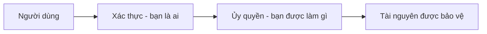

# 🔑 Authentication và Authorization — "bạn là ai" và "bạn được làm gì"

> Nguồn: `058-Authentication-Authorization.txt` · [Udemy](https://ua.udemy.com/course/mastering-system-design-from-basics-to-cracking-interviews/learn/lecture/49632571)

Trong bài này, chúng ta sẽ tìm hiểu cách các hệ thống hiện đại **xác minh danh tính người dùng**, **kiểm soát quyền truy cập tài nguyên** và triển khai những cơ chế authentication (xác thực) — authorization (ủy quyền) có thể mở rộng từ ứng dụng truyền thống đến kiến trúc cloud-native. Đây là nền móng của mọi hệ thống **identity and access management (quản lý danh tính và truy cập)**.

---

### 🎯 Authentication và Authorization — hai câu hỏi khác nhau

Hai khái niệm này thường được nhắc cùng nhau, nhưng chúng giải quyết **hai bài toán hoàn toàn khác nhau**:

* **Authentication** là quá trình **xác minh danh tính**, trả lời câu hỏi: *"Bạn là ai?"*. Khi bạn đăng nhập bằng mật khẩu, quét sinh trắc học hay MFA, hệ thống đang xác nhận bạn **đúng là người bạn khai báo**.
* **Authorization** là bước tiếp theo, trả lời câu hỏi: *"Bạn được phép làm gì?"*. Dựa trên **role (vai trò), permission (quyền) hoặc policy (chính sách)**, hệ thống quyết định bạn được truy cập tài nguyên nào và thực hiện hành động nào.

Ví dụ: hai người dùng có thể đăng nhập thành công như nhau, nhưng **chỉ quản trị viên mới vào được admin dashboard hoặc sửa dữ liệu nhạy cảm**. Cách nhớ dễ nhất: **authentication mở cửa trước, authorization quyết định bạn được vào những phòng nào**.

Trong mọi hệ thống an toàn, **authentication luôn đứng trước, authorization theo sau**. Biết người dùng là ai vẫn chưa đủ — bạn còn phải **thực thi những gì người đó được phép làm**. Cùng nhau, hai cơ chế này tạo thành nền tảng **access control (kiểm soát truy cập)** của mọi ứng dụng hiện đại.

---

### 🔑 Các phương thức xác thực phổ biến: Basic, OAuth2, OpenID Connect và JWT

Có nhiều cách xác thực người dùng, mỗi cách phù hợp với một loại ứng dụng và mức độ yêu cầu bảo mật khác nhau:

* **Basic authentication** — client gửi **username và password trong mọi request**. Dễ triển khai nhưng chỉ phù hợp với hệ thống đơn giản hoặc nội bộ, và **luôn phải dùng qua HTTPS** để bảo vệ credential trên đường truyền.
* **OAuth2** — ra đời để giải quyết bài toán khác: **delegated access (truy cập ủy quyền)**. Thay vì chia sẻ mật khẩu với ứng dụng bên thứ ba, bạn **ủy quyền cho nó truy cập một số tài nguyên nhất định thay mặt bạn**. Nhờ đó, các ứng dụng có thể kết nối Google hay GitHub mà **không bao giờ nhìn thấy credential của bạn**. Một điểm cực kỳ quan trọng: **OAuth2 chủ yếu là authorization framework, không phải authentication protocol**.
* **OpenID Connect** — xây thêm **tầng danh tính chuẩn hóa** lên trên OAuth2, cho phép ứng dụng **xác minh người dùng là ai** — tức bổ sung luôn khả năng authentication. Đây là nền tảng của **single sign-on (SSO — đăng nhập một lần)** hiện đại: xác thực một lần, truy cập nhiều ứng dụng liền mạch.
* **JWT (JSON Web Token)** — sau khi đăng nhập thành công, server phát hành một **token được ký số** chứa các **claim (thông tin khai báo) về người dùng**. Client gửi token này kèm mọi request sau đó, giúp API xác minh danh tính **mà không cần lưu session state phía server**. Vì vậy JWT đặc biệt hợp với **stateless application (ứng dụng không lưu trạng thái), microservices và REST API**.

Là kiến trúc sư, điều quan trọng là nhận ra: **không có giải pháp nào dùng tốt cho mọi trường hợp**. Cơ chế xác thực đúng phụ thuộc vào **yêu cầu bảo mật, nhu cầu mở rộng và trải nghiệm người dùng** của chính ứng dụng bạn.

---

### 🔁 Session-based và Token-based — chọn theo kiến trúc

Đây là hai cách tiếp cận xác thực thống trị trong các hệ thống thực tế:

| Tiêu chí | Session-based | Token-based |
|---|---|---|
| Trạng thái | Server lưu session trong memory hoặc session store dùng chung | Server **stateless**, không lưu session |
| Client giữ gì | Session ID, thường trong cookie | Token đã ký, thường là JWT |
| Cách xác minh | Server tra cứu session để nhận diện người dùng | Từng service tự xác minh chữ ký của token |
| Hợp với | Ứng dụng web server-rendered truyền thống | REST API, microservices, cloud-native |
| Đánh đổi | Cần sticky session hoặc session store tập trung như Redis — tăng độ phức tạp vận hành | Token là **credential có giá trị**, phải lưu trữ an toàn, có thời hạn hợp lý, chống đánh cắp |

Cụ thể hơn, trong **session-based authentication**, khi người dùng đăng nhập thành công, server **tạo session và lưu trạng thái** trong memory hoặc một **shared session store** như Redis. Client nhận **session ID** (thường lưu trong cookie) và gửi kèm mỗi request; server chỉ việc tra session để nhận diện người dùng. Cách này đơn giản và chạy rất tốt cho ứng dụng web truyền thống — nhưng khi ứng dụng mở rộng ra nhiều server, **mọi instance đều cần truy cập cùng dữ liệu session**, kéo theo nhu cầu sticky session hoặc session store tập trung.

Với **token-based authentication**, server phát hành **token đã ký** (thường là JWT) sau khi xác thực. Client gửi token kèm mỗi request, và **mỗi service tự xác minh token độc lập** mà không cần session state. Vì server **stateless**, mô hình này hợp tự nhiên với REST API, microservices và kiến trúc cloud-native — nơi request có thể được xử lý bởi bất kỳ instance nào. Đổi lại, token trở thành **credential giá trị cao**, phải được bảo vệ cẩn thận.

Quy tắc thực dụng: **session-based hợp với ứng dụng web truyền thống; token-based thường là lựa chọn ưu tiên cho hệ phân tán hiện đại**, nơi scalability và tính độc lập giữa các service là mục tiêu thiết kế.

---

### 🧩 Các mô hình access control: RBAC, ABAC, DAC và MAC

Sau khi đã xác thực, hệ thống vẫn phải trả lời câu hỏi: **người dùng này được truy cập tài nguyên nào?** Các mô hình phổ biến:

| Mô hình | Cách hoạt động | Hợp với |
|---|---|---|
| **RBAC** — Role-Based Access Control | Gán permission cho **role** (admin, manager, viewer); người dùng **thừa hưởng** quyền của role mình mang | Ứng dụng doanh nghiệp — dễ hiểu, dễ bảo trì, dễ mở rộng |
| **ABAC** — Attribute-Based Access Control | Quyết định dựa trên **thuộc tính**: phòng ban, dự án, vị trí, mức bảo mật, thậm chí thời điểm trong ngày | Chính sách **fine-grained (chi tiết)**, nhưng thiết kế và bảo trì phức tạp hơn nhiều |
| **DAC** — Discretionary Access Control | **Chủ sở hữu tài nguyên** quyết định ai được truy cập | Hệ thống file — người dùng chia sẻ file/thư mục cho người khác |
| **MAC** — Mandatory Access Control | **Cơ quan trung tâm** thực thi theo phân loại và chính sách định sẵn, không có quyền tùy nghi | Môi trường bảo mật cao: chính phủ, quốc phòng, quân đội |

**RBAC** là mô hình phổ biến nhất: thay vì gán quyền trực tiếp cho từng người, bạn gán quyền cho role và người dùng thừa hưởng. Hạn chế của nó là **có thể trở nên cứng nhắc khi cần ngoại lệ hoặc quyền rất cụ thể** — đó là lúc **ABAC** tỏa sáng với khả năng ra quyết định linh hoạt dựa trên thuộc tính.

Trong thực tế, kiến trúc sư hiếm khi chỉ dùng một mô hình. Các hệ thống bảo mật thường **kết hợp RBAC cho quản lý role tổng quát với ABAC cho những quyết định ủy quyền chi tiết** — tạo sự cân bằng giữa đơn giản, linh hoạt và an toàn.

---

### 🌐 SSO và Identity Federation — một lần đăng nhập, nhiều ứng dụng

Khi tổ chức lớn lên, người dùng phải truy cập nhiều ứng dụng mỗi ngày. Việc đăng nhập riêng lẻ vào từng ứng dụng gây **ma sát, mệt mỏi vì mật khẩu và khuyến khích thói quen bảo mật kém**. Đó là bài toán **SSO (Single Sign-On)** được sinh ra để giải quyết:

* Với SSO, người dùng **xác thực một lần** rồi truy cập nhiều ứng dụng tin cậy mà **không phải đăng nhập lại**.
* Thay vì mỗi ứng dụng tự quản lý đăng nhập, chúng dựa vào một **identity provider (nhà cung cấp danh tính) trung tâm** để xác minh người dùng.
* Lợi ích đôi bên: trải nghiệm người dùng mượt hơn và **quản lý danh tính đơn giản hơn cho tổ chức**.

**Identity Federation (liên hợp danh tính)** mở rộng ý tưởng này **vượt ra ngoài một tổ chức**. Thay vì xác thực từ kho danh tính của mình, ứng dụng có thể **tin tưởng các identity provider bên ngoài** như Google, Microsoft hay Facebook. Khi bạn bấm "Sign in with Google", ứng dụng của bạn **không tự kiểm tra mật khẩu** — nó tin Google đã xác thực bạn. Cách này giúp người dùng **không phải tạo thêm tài khoản mới**, đồng thời tổ chức tận dụng được **chính sách bảo mật và MFA sẵn có** của những nhà cung cấp danh tính đáng tin.

*Cách phân biệt nhanh: SSO cho phép truy cập nhiều ứng dụng bằng một lần đăng nhập, còn Identity Federation cho phép các tổ chức, nền tảng khác nhau cùng tin tưởng một identity provider.* Cùng nhau, chúng tạo nền tảng cho authentication doanh nghiệp và **cloud-based identity management** hiện đại.

---

### 🎯 Tự kiểm tra nhanh

**Câu 1:** Authentication và authorization trả lời hai câu hỏi nào?

<b>Xem đáp án</b>

**Đáp án:** Authentication trả lời "bạn là ai?"; authorization trả lời "bạn được phép làm gì?".

Giải thích: Authentication luôn diễn ra trước, authorization theo sau và thực thi quyền hạn.

Tham chiếu: Mục Authentication và Authorization — hai câu hỏi khác nhau.

**Câu 2:** OAuth2 khác OpenID Connect ở điểm nào?

<b>Xem đáp án</b>

**Đáp án:** OAuth2 chủ yếu là authorization framework; OpenID Connect xây thêm tầng danh tính chuẩn hóa lên trên để cung cấp cả authentication.

Giải thích: OpenID Connect là nền tảng của single sign-on hiện đại.

Tham chiếu: Mục Các phương thức xác thực phổ biến.

**Câu 3:** Vì sao token-based authentication hợp với microservices và cloud-native?

<b>Xem đáp án</b>

**Đáp án:** Vì server stateless — mỗi service tự xác minh token độc lập mà không cần session state dùng chung.

Giải thích: Đổi lại, token là credential giá trị cao, phải lưu trữ an toàn, có thời hạn và chống đánh cắp.

Tham chiếu: Mục Session-based và Token-based — chọn theo kiến trúc.

**Câu 4:** RBAC có hạn chế gì và mô hình nào bù đắp?

<b>Xem đáp án</b>

**Đáp án:** RBAC có thể cứng nhắc khi cần ngoại lệ hoặc quyền chi tiết; ABAC bù đắp nhờ ra quyết định dựa trên thuộc tính.

Giải thích: Thực tế thường kết hợp RBAC cho role tổng quát và ABAC cho ủy quyền fine-grained.

Tham chiếu: Mục Các mô hình access control.

**Câu 5:** SSO và Identity Federation khác nhau thế nào?

<b>Xem đáp án</b>

**Đáp án:** SSO cho phép truy cập nhiều ứng dụng bằng một lần đăng nhập; Identity Federation cho phép các tổ chức, nền tảng tin tưởng cùng một identity provider.

Giải thích: Federation mở rộng SSO vượt ra ngoài phạm vi một tổ chức.

Tham chiếu: Mục SSO và Identity Federation.

---

Vậy là các bạn đã nắm được nền tảng **identity and access management**: từ phân biệt authentication với authorization, các phương thức xác thực, hai mô hình session/token, bốn mô hình access control, đến SSO và Identity Federation. *Nhớ nhé — không có chiến lược danh tính nào dùng tốt cho mọi hệ thống; lựa chọn đúng là một quyết định thiết kế ảnh hưởng đến mọi tầng của kiến trúc.*

Ở bài tiếp theo, chúng ta sẽ đi vào **data protection và secure communication** — bảo vệ thông tin nhạy cảm cả khi truyền qua mạng lẫn khi lưu trong hệ thống. Hẹn gặp lại các bạn! 🚀
