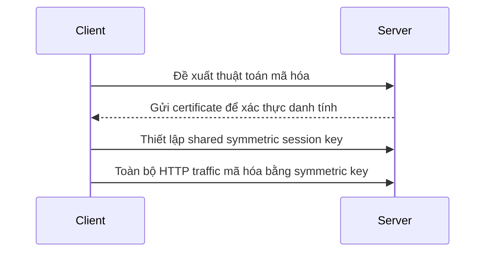

# 🛡️ Bảo vệ dữ liệu và giao tiếp an toàn — encryption, TLS và PKI

> Nguồn: `059-Data-Protection-Secure-Communication.txt` · [Udemy](https://ua.udemy.com/course/mastering-system-design-from-basics-to-cracking-interviews/learn/lecture/49632573)

Trong bài này, chúng ta sẽ tìm hiểu cách các hệ thống hiện đại **bảo vệ dữ liệu nhạy cảm** bằng **encryption (mã hóa), hashing, TLS, PKI** và giao tiếp API an toàn — để xây dựng những ứng dụng người dùng có thể tin tưởng. Đây là phần "hậu trường" của mọi hệ thống an toàn: phần lớn người dùng không nhìn thấy, nhưng mọi thứ đều phụ thuộc vào nó.

---

### 🛡️ Vì sao bảo vệ dữ liệu là nguyên tắc thiết kế

Mọi quyết định bảo mật trong hệ thống rốt cuộc đều quy về **bảo vệ dữ liệu**. Khi ứng dụng lớn lên và xử lý nhiều thông tin nhạy cảm hơn, chúng cũng trở thành **mục tiêu hấp dẫn hơn** với kẻ tấn công:

* Kẻ tấn công luôn tìm điểm yếu — có thể là **data breach (rò rỉ dữ liệu)**, **man-in-the-middle (kẻ đứng giữa)** hoặc **accidental leak (rò rỉ vô ý)**.
* Chỉ một lỗ hổng cũng đủ phơi bày **hồ sơ khách hàng, dữ liệu tài chính hoặc thông tin kinh doanh mật**.
* Security còn là **trách nhiệm pháp lý**: các chương trình như **GDPR** và **HIPAA** quy định tổ chức phải thu thập, lưu trữ, xử lý và bảo vệ dữ liệu nhạy cảm thế nào. Vi phạm không chỉ là vấn đề kỹ thuật — nó kéo theo **hình phạt tài chính lớn, hệ quả pháp lý và tổn hại danh tiếng**.
* Nhưng lý do lớn nhất vẫn là **niềm tin**: người dùng kỳ vọng dữ liệu của họ được xử lý có trách nhiệm, và **một khi niềm tin đã mất, rất khó lấy lại**.

Vì vậy, bảo vệ dữ liệu **không phải một tính năng bảo mật hay một ô đánh dấu tuân thủ** — nó là **nguyên tắc thiết kế nền tảng**. Mọi quyết định của kiến trúc sư đều nên hướng tới hệ thống **an toàn, đáng tin cậy và xứng đáng với niềm tin của người dùng**.

---

### 🔐 Encryption ở hai thời điểm — at rest và in transit

**Encryption** là một trong những viên gạch nền tảng nhất của bảo vệ dữ liệu. Mục đích rất đơn giản: biến dữ liệu đọc được (**plaintext — bản rõ**) thành dạng không đọc được (**ciphertext — bản mã**), để ai có chặn được cũng chỉ thấy dữ liệu vô nghĩa. Quá trình biến đổi do **cryptographic key (khóa mã hóa)** điều khiển — hãy nghĩ về key như "nguyên liệu bí mật" quyết định cách dữ liệu bị xáo trộn và **ai có thể đảo ngược quá trình**. Không có key đúng, việc khôi phục thông tin gốc phải là **bất khả thi về mặt tính toán**.

Khi thiết kế hệ thống an toàn, chỉ mã hóa thôi chưa đủ — bạn còn phải xác định **dữ liệu bị phơi bày khi nào**. Có hai thời điểm quan trọng trong vòng đời dữ liệu, mỗi thời điểm cần một chiến lược riêng:

* **Encryption at rest (mã hóa khi lưu trữ)** — bảo vệ dữ liệu nằm trên đĩa, trong database, backup hoặc cloud storage. Nếu thiết bị lưu trữ bị mất, bị đánh cắp hoặc có người truy cập trái phép hạ tầng bên dưới, dữ liệu **vẫn không đọc được nếu thiếu key**. Đây là lý do **full-disk encryption** và **database encryption** được dùng rộng rãi cho file người dùng, hồ sơ nhạy cảm và log ứng dụng.
* **Encryption in transit (mã hóa khi truyền)** — bảo vệ dữ liệu khi di chuyển qua mạng giữa client, server và các service. Mọi request đăng nhập, lời gọi API hay giao tiếp service-to-service đều **có thể bị chặn** nếu kênh truyền không được mã hóa. Các protocol như **TLS** bảo vệ những kết nối này, đảm bảo cả **confidentiality lẫn integrity** — đó là lý do **HTTPS** trở thành chuẩn mực.

Một kiến trúc sư giàu kinh nghiệm coi **cả hai là bắt buộc, không phải tùy chọn**. Chỉ mã hóa dữ liệu lưu trữ thì traffic trên mạng vẫn hở; chỉ mã hóa traffic thì storage bị xâm nhập vẫn mất dữ liệu. **Hai lớp này cùng nhau bảo vệ toàn diện vòng đời dữ liệu.**

---

### 🔁 Symmetric và asymmetric — hai bài toán, một giải pháp kết hợp

Các thuật toán mã hóa chia thành hai nhóm, giải hai bài toán khác nhau. Chọn đúng **không phải chuyện cái nào "tốt hơn"**, mà là hiểu mỗi loại phù hợp ở đâu:

| Tiêu chí | Symmetric | Asymmetric |
|---|---|---|
| Khóa | Một khóa dùng chung cho cả mã hóa và giải mã | Cặp khóa liên hệ toán học: **public key** ai cũng biết + **private key** chỉ chủ sở hữu giữ |
| Hiệu năng | Rất hiệu quả, hợp với **lượng dữ liệu lớn** | Chậm hơn, hợp với trao đổi khóa và xác minh danh tính |
| Thách thức | **Key distribution (phân phối khóa)** — hai bên phải chia sẻ cùng một secret key an toàn | Quản lý cặp khóa, hiệu năng thấp hơn cho dữ liệu lớn |
| Giải quyết | Hiệu năng cho giao tiếp hằng ngày | **Trao đổi khóa an toàn, xác minh danh tính, chữ ký số** |

* **Symmetric encryption** dùng **một khóa chia sẻ** cho cả hai chiều. Nhờ tính toán hiệu quả, nó lý tưởng để mã hóa file, database, backup hay traffic mạng. Vấn đề nằm ở chỗ **hai bên cần cùng một secret key** — bạn phải có cách chia sẻ khóa đó an toàn.
* **Asymmetric encryption** giải đúng bài toán đó bằng **cặp khóa**: public key công khai cho mọi người, private key chỉ chủ sở hữu nắm giữ. Nhờ vậy, ta có thể **trao đổi bí mật an toàn, xác minh danh tính và tạo chữ ký số mà không lộ private key**.

Trong hệ thống thực tế, hai cách này **gần như luôn được kết hợp** — ví dụ ngay trong **TLS handshake**: asymmetric cryptography dùng để **xác thực các bên và thiết lập shared symmetric session key**; khi kênh an toàn đã hình thành, toàn bộ giao tiếp về sau dùng **symmetric encryption** vì nhanh và hiệu quả hơn hẳn cho luồng dữ liệu liên tục.

Chốt lại: **asymmetric giải bài toán niềm tin và trao đổi khóa; symmetric cung cấp hiệu năng cho giao tiếp hằng ngày** — cùng nhau mang lại cả security lẫn scalability.

---

### 🧂 Hashing, salting và PKI — mật khẩu và niềm tin số

**Mật khẩu xứng đáng được đối xử đặc biệt**: khác với hầu hết dữ liệu, chúng **không cần khôi phục, chỉ cần xác minh**. Vì vậy hệ thống tốt **không mã hóa mật khẩu — họ hash chúng**:

* **Hashing** là biến đổi một chiều: khi người dùng tạo mật khẩu, ứng dụng tính hash và **lưu hash thay vì mật khẩu gốc**; khi đăng nhập, mật khẩu nhập vào được hash lại và so với giá trị đã lưu. Quá trình **không thể đảo ngược**, nên kẻ truy cập được database vẫn không khôi phục được mật khẩu thật.
* Nhưng hash đơn thuần **chưa đủ**: hai người dùng chọn cùng mật khẩu sẽ cho ra **cùng một hash**, giúp kẻ tấn công dùng **rainbow table (bảng tra trước)** để bẻ khóa các mật khẩu phổ biến.
* Vì vậy, mỗi mật khẩu được **kết hợp với một salt (muối) ngẫu nhiên, duy nhất** trước khi hash. Kết quả: hai mật khẩu giống nhau cho ra hash hoàn toàn khác — tấn công quy mô lớn trở nên **kém hiệu quả hơn rất nhiều**.
* Hệ thống hiện đại còn dùng **thuật toán hash dành riêng cho mật khẩu như bcrypt hoặc argon2**: chúng **tự động kèm salting** và **cố tình tốn tính toán** để brute-force chậm hẳn đi.

*Nguyên tắc vàng: không bao giờ lưu mật khẩu dạng plaintext, không dùng mã hóa đảo ngược cho mật khẩu, và luôn hash bằng thuật toán mạnh với salt riêng cho từng người dùng.*

Còn với bài toán **xác minh danh tính trên internet**, đó là vai trò của **PKI (Public Key Infrastructure — hạ tầng khóa công khai)** — framework niềm tin giúp giao tiếp an toàn trở nên khả thi ở quy mô toàn cầu:

* Trung tâm của PKI là **digital signature (chữ ký số)**, gắn **public key với danh tính** của website, tổ chức hoặc cá nhân.
* Vì ai cũng có thể tự tạo certificate, cần một **certifying authority (CA — tổ chức chứng thực)**: CA đáng tin **xác minh danh tính chủ sở hữu và ký số lên certificate**, để trình duyệt và hệ điều hành có thể tin tưởng.
* Khi kết nối tới website HTTPS, trình duyệt kiểm tra **chữ ký số, hạn dùng, tình trạng thu hồi và chuỗi certificate** — bắt đầu từ certificate của website, đi qua các intermediate certificate, đến **root certificate đã cài sẵn** trong máy bạn. Nếu mọi mắt xích hợp lệ, danh tính server được coi là đáng tin.
* PKI cũng cho phép **ký dữ liệu bằng private key** để bất kỳ ai có public key tương ứng kiểm tra được **danh tính người gửi và tính toàn vẹn dữ liệu**. Đây là nền tảng của HTTPS, email bảo mật, **code signing**, cập nhật phần mềm và nhiều hệ thống trọng yếu khác.

---

### 📡 Giao tiếp API an toàn — defense in depth trong thực tế

API là **cửa ngõ vào dữ liệu và business logic** của ứng dụng, nên là mục tiêu hấp dẫn bậc nhất với kẻ tấn công. Bảo vệ API **không nằm ở một cơ chế duy nhất** — nó là việc **xếp nhiều lớp kiểm soát** để nếu một lớp thủng, những lớp khác vẫn còn:

1. **HTTPS là bắt buộc** — mọi API đều phải giao tiếp qua HTTPS. TLS bảo vệ request/response khỏi nghe lén và sửa đổi, đồng thời xác minh danh tính server. **Phơi bày API production qua HTTP thuần không bao giờ là lựa chọn chấp nhận được.**
2. **Authentication và authorization** — thay vì username/password cho mọi request, API hiện đại dùng **access token** như **JWT hoặc OAuth token**. Mỗi request mang token đã ký; server xác minh trước khi quyết định client được phép truy cập gì.
3. **Rate-limiting** — kiểm soát khối lượng request để chống lạm dụng và **brute-force attack (tấn công dò mật khẩu)**.
4. **IP whitelisting** — giới hạn truy cập vào các dải mạng tin cậy khi phù hợp.
5. **Mutual TLS (mTLS)** — với giao tiếp nội bộ hoặc service-to-service nhạy cảm, **cả client lẫn server đều xác thực bằng certificate**, thêm một tầng tin cậy đáng kể.

Một kiến trúc bảo mật tốt **giả định rằng không lớp kiểm soát nào là đủ**. Bằng cách kết hợp **giao tiếp mã hóa, xác thực mạnh và nhiều tầng bảo vệ truy cập**, bạn xây được những API vẫn an toàn khi trở thành xương sống của hệ phân tán quy mô lớn. **Security không bao giờ đến từ một cơ chế duy nhất — nó đến từ chiến lược defense in depth.**

---

### 🎯 Tự kiểm tra nhanh

**Câu 1:** Encryption at rest và in transit khác nhau thế nào?

<b>Xem đáp án</b>

**Đáp án:** At rest bảo vệ dữ liệu lưu trên đĩa, database, backup, cloud storage; in transit bảo vệ dữ liệu khi di chuyển qua mạng.

Giải thích: Một kiến trúc sư giàu kinh nghiệm coi cả hai là bắt buộc — chỉ một trong hai vẫn để hở tấn công.

Tham chiếu: Mục Encryption ở hai thời điểm.

**Câu 2:** Vì sao TLS handshake cần cả asymmetric lẫn symmetric encryption?

<b>Xem đáp án</b>

**Đáp án:** Asymmetric dùng để xác thực các bên và thiết lập shared symmetric session key; symmetric đảm nhiệm mã hóa toàn bộ dữ liệu sau đó vì nhanh và hiệu quả hơn.

Giải thích: Asymmetric giải bài toán niềm tin và trao đổi khóa; symmetric cung cấp hiệu năng.

Tham chiếu: Mục Symmetric và asymmetric.

**Câu 3:** Vì sao không nên mã hóa mật khẩu mà phải hash?

<b>Xem đáp án</b>

**Đáp án:** Vì mật khẩu chỉ cần xác minh, không cần khôi phục — hashing là biến đổi một chiều nên kẻ có database vẫn không lấy lại được mật khẩu gốc.

Giải thích: Mật khẩu còn phải được hash kèm salt duy nhất và dùng thuật toán như bcrypt hoặc argon2.

Tham chiếu: Mục Hashing, salting và PKI.

**Câu 4:** Salt giải quyết vấn đề gì khi hash mật khẩu?

<b>Xem đáp án</b>

**Đáp án:** Nó khiến hai mật khẩu giống nhau cho ra hash khác nhau, vô hiệu hóa rainbow table và làm tấn công quy mô lớn kém hiệu quả.

Giải thích: Mỗi mật khẩu được kết hợp với một salt ngẫu nhiên, duy nhất trước khi hash.

Tham chiếu: Mục Hashing, salting và PKI.

**Câu 5:** CA đóng vai trò gì trong PKI?

<b>Xem đáp án</b>

**Đáp án:** CA xác minh danh tính chủ sở hữu certificate và ký số lên đó, để trình duyệt và hệ điều hành có thể tin tưởng.

Giải thích: Trình duyệt kiểm tra chữ ký, hạn dùng, thu hồi và chuỗi certificate dẫn tới root certificate đã cài sẵn.

Tham chiếu: Mục Hashing, salting và PKI.

---

Vậy là các bạn đã nắm trọn bức tranh bảo vệ dữ liệu: **encryption at rest và in transit, symmetric kết hợp asymmetric trong TLS, hashing kèm salt cho mật khẩu, PKI cho niềm tin số và các lớp bảo vệ API**. *Điểm cốt lõi cần nhớ: security không đến từ một cơ chế duy nhất — nó là chiến lược nhiều lớp.*

Ở bài tiếp theo, chúng ta sẽ mở rộng ra tầng hạ tầng: **network và infrastructure security** với firewall, VPC, VPN và bảo mật mạng cloud. Hẹn gặp lại các bạn! 🚀
