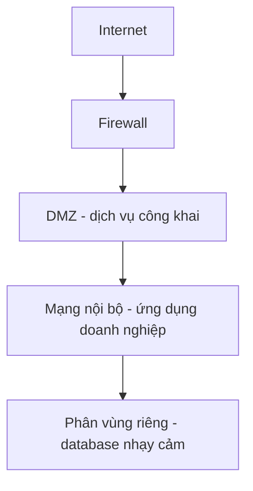

# 🌐 Network & Infrastructure Security — nhiều lớp phòng thủ cho hạ tầng hiện đại

> Nguồn: `060-Network-Infrastructure-Security.txt` · [Udemy](https://ua.udemy.com/course/mastering-system-design-from-basics-to-cracking-interviews/learn/lecture/49632577)

Trong bài này, chúng ta sẽ tìm hiểu những nguyên lý và best practices để bảo vệ **hạ tầng mạng, môi trường cloud và ứng dụng phân tán**. Network security không chỉ là "giữ kẻ tấn công ở ngoài" — đó còn là đảm bảo hệ thống **luôn sẵn sàng, đáng tin cậy và đáng tin tưởng ngay cả trong môi trường thù địch**. Cùng đi qua từng lớp phòng thủ nhé.

---

### 🌐 Vì sao network security quan trọng

Hãy nghĩ về những cách một hệ thống có thể bị xâm phạm. **Từ bên ngoài**, kẻ tấn công có thể phát động **DDoS** để làm quá tải service, thử xâm nhập để giành truy cập trái phép, hoặc dùng **IP spoofing (giả mạo địa chỉ IP)** để vượt qua các kiểm soát mạng. Bất kỳ cách nào cũng có thể **gián đoạn vận hành hoặc phơi bày dữ liệu nhạy cảm**.

Nhưng điều đáng chú ý là: **rất nhiều sự cố thực tế không bắt đầu từ đòn tấn công tinh vi bên ngoài**. Chúng khởi nguồn từ những điểm yếu nội bộ đơn giản:

* Một **cổng bị phơi bày** ngoài ý muốn, một **firewall rule quá dễ dãi** hay một **cloud resource cấu hình sai**.

Khi kẻ tấn công có được **foothold (chỗ đứng) ban đầu**, mục tiêu tiếp theo thường là **lateral movement (di chuyển ngang)** — đi xuyên qua các hệ thống để tiếp cận tài sản giá trị hơn. Vì vậy, security hiện đại không chỉ tập trung **phòng thủ vành đai**, mà còn **giới hạn phạm vi di chuyển bên trong mạng**.

Thách thức này càng quan trọng với **kiến trúc cloud-native**: thay vì bảo vệ vài server, ta đang bảo vệ **hàng trăm microservice, API, container và cloud resource** giao tiếp qua mạng — làm **attack surface (bề mặt tấn công) tăng lên đáng kể**. Suy cho cùng, network security mạnh là **yêu cầu kinh doanh chứ không chỉ yêu cầu kỹ thuật**: nó bảo vệ tính sẵn sàng, giữ niềm tin khách hàng và đảm bảo ứng dụng tiếp tục vận hành ổn định ngay cả khi bị tấn công.

---

### 🔥 Firewalls, reverse proxy và các lớp chống lạm dụng

**Firewall và reverse proxy thường được triển khai cùng nhau nhưng giải hai bài toán khác nhau**:

* **Firewall** là **tuyến phòng thủ đầu tiên**, quyết định traffic được phép hay bị chặn dựa trên **địa chỉ IP, port hoặc protocol**. Tùy vị trí triển khai, nó bảo vệ cả một mạng, một server đơn lẻ hoặc hạ tầng cloud. Nhiệm vụ chính: **giảm attack surface** bằng cách chặn traffic trái phép trước khi nó chạm tới ứng dụng.
* **Reverse proxy (proxy ngược)** hoạt động ở **tầng gần ứng dụng hơn**: mọi request đi qua proxy trước khi tới backend. Nó **che giấu danh tính backend service** khỏi public internet, đồng thời **thực thi thêm các kiểm soát bảo mật**. Ngoài security, reverse proxy còn cải thiện **hiệu năng và độ tin cậy**: phân phối request, **SSL termination (kết thúc SSL)**, cache response và **hấp thụ, giảm thiểu lượng lớn traffic độc hại** trước khi chúng tới ứng dụng. Đó là lý do những công nghệ như **Nginx** hay giải pháp cloud-native như **AWS Application Load Balancer** trở thành khối xây dựng quen thuộc.

*Cách nhớ nhanh: firewall quyết định traffic nào được phép vào mạng, còn reverse proxy quản lý an toàn cách traffic đã được duyệt đi tới ứng dụng.*

Bên cạnh đó, ngay cả API thiết kế tốt cũng có thể "gục" nếu bị dội quá nhiều traffic — dù nguyên nhân là tấn công, client lỗi hay người dùng hợp pháp tăng vọt. Ba kỹ thuật dưới đây bổ trợ cho nhau:

| Kỹ thuật | Cách hoạt động | Mục đích |
|---|---|---|
| **Rate Limiting** | Giới hạn cứng số request mỗi client trong một khoảng thời gian, theo user, API key hoặc IP | Chống brute-force, lạm dụng API, traffic flood; không client nào độc chiếm tài nguyên |
| **Throttling** | Cố tình **làm chậm** client khi hệ thống chịu áp lực, thay vì từ chối ngay | **Graceful degradation (suy giảm mềm)** — giữ ứng dụng phản hồi cho đa số người dùng thay vì sập hoàn toàn |
| **IP Filtering** | Cho phép dải IP tin cậy, chặn nguồn độc hại đã biết, giới hạn truy cập hệ thống nội bộ | Kiểm soát **ai được kết nối ngay từ đầu** |

Thực tế, chúng **hiệu quả nhất khi kết hợp**: IP Filtering kiểm soát ai được kết nối, Rate Limiting kiểm soát họ được "tiêu thụ" bao nhiêu, còn Throttling giữ hệ thống ổn định khi nhu cầu vượt năng lực hiện có.

---

### 🧱 Network segmentation và Zero Trust

Một trong những cách hiệu quả nhất để giảm tác động của breach là **giả định rằng breach sẽ xảy ra** và thiết kế mạng sao cho chúng **không lan rộng dễ dàng** — đó là mục đích của **network segmentation (phân vùng mạng)**. Thay vì đặt mọi server lên một mạng phẳng, ta chia hạ tầng thành **các vùng cô lập**:

* **Dịch vụ công khai** nằm trong **DMZ (Demilitarized Zone — vùng phi quân sự)**; **ứng dụng doanh nghiệp** trong mạng nội bộ; **database nhạy cảm** có phân vùng bảo vệ riêng.

Mỗi vùng có **quy tắc giao tiếp được định nghĩa rõ ràng**. Lợi ích lớn nhất: **giới hạn lateral movement**. Nếu kẻ tấn công chiếm được một web server, chúng **không thể truy cập thẳng vào application server hay database** — mỗi bước nhảy giữa các vùng đều phải qua thêm kiểm soát bảo mật.

Segmentation được thực thi bằng **firewall, subnet và private VLAN** ở các tầng mạng khác nhau. Trong môi trường cloud, nguyên lý tương tự áp dụng với **VPC (Virtual Private Cloud), security group và network ACL** để cô lập workload và định nghĩa **quyền truy cập mạng theo least privilege (đặc quyền tối thiểu)**. *Đừng thiết kế mạng như một vùng tin cậy khổng lồ — hãy thiết kế nó thành nhiều trust boundary nhỏ, nơi mọi kết nối đều có chủ đích, được kiểm soát và xác minh.*

Tư duy đó dẫn thẳng tới **Zero Trust Security Model**. Security mạng truyền thống từng giả định: hễ đã ở trong mạng nội bộ thì **có thể tin tưởng**. Giả định đó không còn đứng vững trong thời đại cloud, làm việc từ xa và microservices phân tán. Triết lý cốt lõi của Zero Trust: **"never trust, always verify — không bao giờ tin, luôn xác minh"**. Mọi request phải **chứng minh danh tính và quyền hạn**, bất kể đến từ internet công cộng hay từ một service trong cùng mạng. Trong microservices, các service không giao tiếp chỉ vì "ở chung mạng": chúng **xác thực lẫn nhau bằng mutual TLS**, thực thi chính sách ủy quyền chặt chẽ và vận hành theo least privilege — nếu một service bị chiếm, nó **không tự động có quyền truy cập phần còn lại của hệ thống**.

*Zero Trust không phải một công nghệ riêng cho cloud — nó là một tư duy bảo mật: dù on-premises, cloud hay hybrid, mọi người dùng, thiết bị và service đều được xác thực, ủy quyền và kiểm chứng liên tục trước khi được truy cập.*

---

### ☁️ Cloud, serverless, container và microservices

**Lên cloud không loại bỏ trách nhiệm bảo mật — nó chỉ thay đổi chúng.** Đó là ý tưởng của **Shared Responsibility Model (mô hình trách nhiệm chia sẻ)**: nhà cung cấp cloud bảo vệ hạ tầng bên dưới, còn bạn vẫn chịu trách nhiệm bảo vệ **ứng dụng, dữ liệu, danh tính và cấu hình** của mình:

* **Identity and Access Management (IAM)** là khu vực trọng yếu nhất. Phần lớn breach trên cloud **không đến từ tấn công tinh vi** mà từ **quyền hạn quá rộng, credential bị xâm phạm hoặc chính sách truy cập kém**. Least-privilege và MFA giảm mạnh rủi ro này.
* **Bảo vệ dữ liệu** cũng quan trọng tương tự: dù lưu file trên object storage, block volume hay managed database, hãy **bật encryption cả at rest lẫn in transit**.
* **Visibility (khả năng quan sát)** là trụ cột song song: các dịch vụ như **AWS CloudTrail** hay **Audit Logging của Google Cloud** ghi lại lời gọi API và hành động quản trị, giúp điều tra sự cố, phát hiện hành vi bất thường và đáp ứng yêu cầu tuân thủ. Vì môi trường cloud thay đổi rất nhanh, **Cloud Security Posture Management (CSPM)** liên tục quét tài nguyên, **phát hiện cấu hình thiếu an toàn** và cảnh báo trước khi điểm yếu thành sự cố production.

Với **serverless**, rủi ro lớn nhất là **quyền hạn quá rộng và thực thi không kiểm soát**. Mỗi function nên có **IAM role được giới hạn chặt**, chỉ truy cập đúng tài nguyên nó cần; đặt **execution timeout** hợp lý để function "chạy hoang" không ngốn tài nguyên vô hạn. Vì hầu hết ứng dụng serverless phơi ra qua **API gateway**, gateway trở thành **lớp bảo mật then chốt** — nơi thực thi authentication, authorization, rate-limiting và kiểm tra request.

Với **container**, mô hình khác vì workload chạy dài hạn. Security bắt đầu từ **container image**: image phải được **quét lỗ hổng định kỳ trước khi deploy**. Khi chạy, container nên chạy với **non-root user**, chỉ giữ **capability cần thiết** và vận hành với đặc quyền tối thiểu. Trong môi trường **Kubernetes**, những công cụ như **OPA** cho thực thi policy và **Falco** cho phát hiện mối đe dọa runtime bổ sung thêm các lớp bảo vệ.

Với **microservices**, thay vì bảo vệ một ứng dụng, bạn bảo vệ **giao tiếp giữa hàng chục đến hàng trăm service** — mọi lời gọi service-to-service phải được coi là **chưa đáng tin cho đến khi xác minh**. Tùy kiến trúc, các service có thể trao đổi **JWT** để xác thực hoặc dùng **mutual TLS** để vừa xác thực lẫn nhau vừa mã hóa giao tiếp. Ở rìa hệ thống, **API gateway** là **chốt kiểm soát chính** trước khi request chạm tới microservice: validate input, authenticate, authorize, chặn traffic độc hại — nhờ đó các service tập trung vào business logic. Khi số service tăng lên, quản lý bảo mật thủ công trở nên bất khả thi; **service mesh** như **Istio** hoặc **Linkerd** giải quyết bằng cách cung cấp **tầng hạ tầng chuyên trách cho giao tiếp an toàn**: tự động bật mutual TLS, thực thi chính sách truy cập chi tiết và áp dụng kiểm soát thống nhất toàn hệ sinh thái.

*Nguyên tắc kiến trúc rất đơn giản: security không nên được nhúng khác nhau vào từng service — nó phải được **chuẩn hóa và thực thi nhất quán trên toàn nền tảng**, giúp hệ thống vừa an toàn hơn vừa dễ vận hành hơn.*

---

### 📋 OWASP Top 10 — checklist bảo mật khi thiết kế

Không ứng dụng nào miễn nhiễm với lỗ hổng, và nhiều vụ breach lớn nhất thế giới đến từ **một nhóm nhỏ các điểm yếu đã biết**. Vì vậy **OWASP Top 10** là tài liệu tham chiếu quan trọng: nó điểm mặt **những rủi ro bảo mật ứng dụng phổ biến và có tác động lớn nhất**.

*Thay vì học thuộc từng mục, hãy nắm **các mẫu vấn đề phía sau chúng**:*

* **Injection attack** lợi dụng dữ liệu đầu vào không đáng tin; **broken authentication** cho phép kẻ tấn công mạo danh người dùng.
* **Sensitive data exposure** đến từ việc bảo vệ thông tin mật không đầy đủ; **security misconfiguration** khiến hệ thống hở chỉ vì được triển khai thiếu an toàn; các mối đe dọa khác như **XSS, CSRF, SSRF** nhắm vào những phần khác nhau của ứng dụng nhưng đều xuất phát từ **thiếu validation, thiếu tin cậy hoặc thiếu kiểm soát truy cập**.

Những rủi ro này áp dụng cho cả ứng dụng web truyền thống lẫn nền tảng microservices hiện đại. Hệ thống càng phân tán, số API, service và đường giao tiếp càng tăng — **cơ hội cho lỗ hổng xuất hiện càng nhiều nếu security không được tính đến từ đầu**. Điểm mấu chốt: **đừng học thuộc OWASP Top 10, hãy dùng nó như checklist bảo mật trong thiết kế, phát triển, kiểm thử và review code**. Xây hệ thống an toàn **dễ hơn nhiều** so với vá lỗ hổng sau khi chúng đã lên production.

---

### 🎯 Tự kiểm tra nhanh

**Câu 1:** Firewall và reverse proxy khác nhau ở điểm nào?

<b>Xem đáp án</b>

**Đáp án:** Firewall quyết định traffic nào được phép vào mạng dựa trên IP, port, protocol; reverse proxy quản lý an toàn cách traffic đã được duyệt đi tới ứng dụng.

Giải thích: Reverse proxy còn che giấu backend, phân phối request, SSL termination và hấp thụ traffic độc hại.

Tham chiếu: Mục Firewalls, reverse proxy và các lớp chống lạm dụng.

**Câu 2:** Rate limiting và throttling khác nhau thế nào?

<b>Xem đáp án</b>

**Đáp án:** Rate limiting giới hạn cứng số request trong một khoảng thời gian; throttling chủ động làm chậm client khi hệ thống chịu áp lực.

Giải thích: Throttling là graceful degradation — giữ ứng dụng phản hồi cho đa số người dùng thay vì sập hoàn toàn.

Tham chiếu: Mục Firewalls, reverse proxy và các lớp chống lạm dụng.

**Câu 3:** Triết lý cốt lõi của Zero Trust là gì?

<b>Xem đáp án</b>

**Đáp án:** "Never trust, always verify" — mọi request phải chứng minh danh tính và quyền hạn, bất kể đến từ đâu.

Giải thích: Service trong cùng mạng vẫn phải xác thực lẫn nhau bằng mutual TLS và chạy theo least privilege.

Tham chiếu: Mục Network segmentation và Zero Trust.

**Câu 4:** Shared Responsibility Model trong cloud nói điều gì?

<b>Xem đáp án</b>

**Đáp án:** Nhà cung cấp cloud bảo vệ hạ tầng bên dưới; bạn vẫn chịu trách nhiệm bảo vệ ứng dụng, dữ liệu, danh tính và cấu hình của mình.

Giải thích: Phần lớn breach trên cloud đến từ quyền hạn quá rộng, credential bị xâm phạm hoặc chính sách truy cập kém.

Tham chiếu: Mục Cloud, serverless, container và microservices.

**Câu 5:** Nên dùng OWASP Top 10 như thế nào?

<b>Xem đáp án</b>

**Đáp án:** Dùng như checklist bảo mật trong thiết kế, phát triển, kiểm thử và review code — không phải để học thuộc lòng.

Giải thích: Nó giúp nhận diện sớm các nhóm rủi ro phổ biến trước khi chúng thành sự cố production.

Tham chiếu: Mục OWASP Top 10 — checklist bảo mật khi thiết kế.

---

Vậy là chúng ta đã đi qua các lớp phòng thủ hạ tầng: **firewall, reverse proxy, rate limiting, throttling, IP filtering, network segmentation, Zero Trust**, cùng bảo mật **cloud, serverless, container, microservices** và checklist **OWASP Top 10**. *Bài học lớn nhất: security không phải tính năng thêm vào cuối dự án — nó là nguyên tắc kiến trúc ảnh hưởng đến từng quyết định thiết kế, từ network topology đến API và code ứng dụng.*

Ở bài tiếp theo, chúng ta sẽ khép section này bằng **bản tổng kết và recap** những nguyên tắc cốt lõi để thiết kế hệ phân tán an toàn. Hẹn gặp lại các bạn! 🚀
