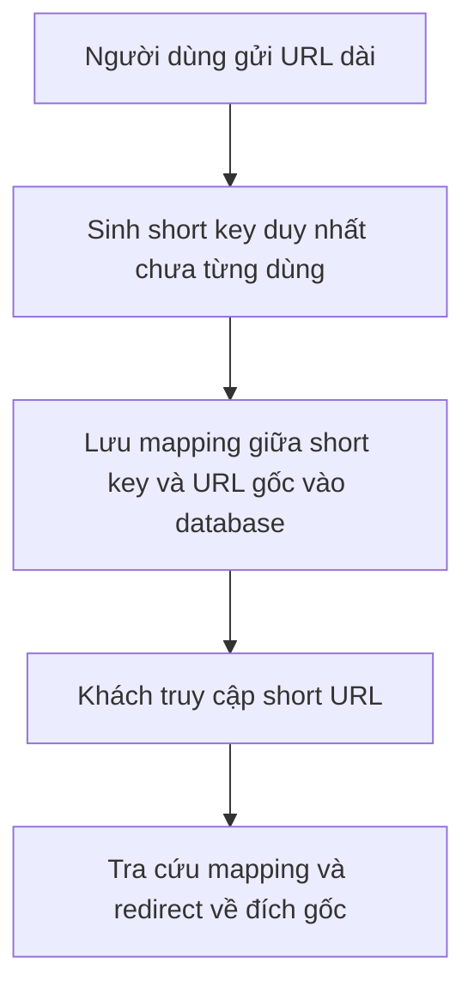

# 🔗 Thiết kế TinyURL (phần 1) — hiểu bài toán và chốt scope

> Nguồn: `063-Understanding-the-Problem-Defining-the-Scope.txt` · [Udemy](https://ua.udemy.com/course/mastering-system-design-from-basics-to-cracking-interviews/learn/lecture/49737243)

Bắt đầu từ bài này, chúng ta bước vào case study đầu tiên: **thiết kế dịch vụ rút gọn URL quy mô lớn kiểu TinyURL**, áp dụng quy trình system design hướng production. TinyURL là ví dụ tuyệt vời cho thấy **một ứng dụng trông đơn giản vẫn chứa đầy quyết định thiết kế thú vị**. Bài đầu tiên, chúng ta làm đúng bước 1 của blueprint: hiểu bài toán và định nghĩa scope.

---

### 🎯 TinyURL — dịch vụ tưởng đơn giản nhưng đầy quyết định

Ý tưởng cốt lõi rất dễ hiểu: thay vì bắt người dùng chia sẻ những URL dài, khó đọc, ta cung cấp một liên kết **ngắn hơn nhiều, dễ chia sẻ hơn**. Một URL dài với đủ thứ thư mục, tham số và định danh có thể được rút gọn thành `tinyurl.com/abc123` — **đích đến không đổi, chỉ cách truy cập thay đổi**.

Vậy vì sao nó hữu ích?

* **Tiện lợi** — link ngắn dễ copy, chia sẻ và ghi nhớ; đặc biệt giá trị trên nền tảng giới hạn ký tự như mạng xã hội, SMS hay ứng dụng nhắn tin. Kể cả không giới hạn ký tự, một link gọn gàng vẫn cho **trải nghiệm người dùng tốt hơn hẳn**.
* **Analytics (phân tích)** — vì mọi cú click đều đi qua dịch vụ trước khi tới đích, hệ thống đo được **số lần click, thời điểm truy cập và các chỉ số tương tác khác**. Dịch vụ trở nên có giá trị không chỉ để rút gọn link mà còn để **hiểu hiệu quả của chúng**.
* **Branding (thương hiệu)** — doanh nghiệp dùng **custom domain (tên miền riêng)** để tạo link ngắn dễ nhận diện, tăng độ hiển thị thương hiệu và **độ tin cậy trong mắt người dùng**.

Toàn bộ case study sẽ xoay quanh **bốn bước workflow** đơn giản sau:

Về mặt chức năng, TinyURL chỉ có vậy. Nhưng làm cho bốn bước này **hoạt động đáng tin cậy với hàng triệu đến hàng tỷ URL** lại mở ra những thách thức hấp dẫn về **scalability, performance, reliability và quản lý dữ liệu** — và đó chính là phần kiến trúc thú vị chúng ta sẽ cùng thiết kế, phân tích và tiến hóa dần.

---

### 📋 Functional requirements — hệ thống phải làm được gì?

Trước khi thiết kế bất kỳ hệ thống lớn nào, ta cần **tuyệt đối rõ hệ thống phải làm gì**. Mọi quyết định kiến trúc về sau đều phải phục vụ một hoặc nhiều yêu cầu dưới đây:

1. **URL shortening (rút gọn URL)** — người dùng gửi URL dài hợp lệ, hệ thống trả về URL ngắn hơn, **duy nhất và dễ chia sẻ**. Đây là mục đích chính của dịch vụ, nên sinh link nhanh và đáng tin cậy là điều kiện tiên quyết.
2. **URL redirection (chuyển hướng)** — tạo link ngắn mà không dẫn được người dùng tới đích thì vô nghĩa. Khi có người truy cập link ngắn, hệ thống phải **tra cứu URL dài tương ứng và chuyển hướng ngay lập tức** — từ góc nhìn người dùng, quá trình này gần như tức thời.
3. **Xử lý URL trùng lặp** — nếu hai người gửi **cùng một URL dài** nhiều lần, việc tạo link mới cho mỗi lần sẽ **lãng phí storage và kém hiệu quả**. Trừ khi người dùng yêu cầu **custom alias (bí danh tùy chỉnh)**, dịch vụ nên nhận ra URL đã tồn tại và **trả về đúng link ngắn cũ**, giữ hệ thống nhất quán.
4. **User authentication (xác thực người dùng)** — ai cũng có thể tạo link ngắn, nhưng **người dùng đã đăng ký có thêm khả năng**: quản lý link đã tạo, xem analytics của lượt click, cấu hình **ngày hết hạn**. Những tính năng này biến dịch vụ từ tiện ích đơn thuần thành **nền tảng mà người dùng chủ động quản lý và theo dõi**.

Các yêu cầu này chỉ tập trung vào **hệ thống làm gì**, chưa bàn **làm thế nào**. Câu hỏi kiểu "sinh key duy nhất ra sao, lưu mapping thế nào cho hiệu quả, xử lý hàng triệu redirect thế nào" là **quyết định kiến trúc** — để dành cho các bài sau.

---

### 📊 Non-functional requirements — phải làm tốt đến đâu?

Đã biết hệ thống **làm gì**, câu hỏi tiếp theo là **làm tốt đến mức nào**. Những yêu cầu phi chức năng này không thêm tính năng mới nhưng định nghĩa **chất lượng, hiệu năng và độ tin cậy** — và trong system design quy mô lớn, chúng thường **ảnh hưởng đến kiến trúc mạnh hơn cả tính năng**:

* **High availability (sẵn sàng cao)** — người ta click link ngắn bất kể lúc nào, ở bất kỳ đâu trên thế giới, nên dịch vụ phải hoạt động quanh năm với **uptime trên 99.9%**. Nếu dịch vụ "chết", **mọi link ngắn đồng loạt ngừng hoạt động** — ảnh hưởng tới website, chiến dịch marketing, giao tiếp doanh nghiệp và vô số tương tác người dùng.
* **Performance và low latency (độ trễ thấp)** — người dùng click link và kỳ vọng tới đích **gần như ngay lập tức**. Quá trình redirect chỉ nên mất **vài mili-giây**, vì mỗi mili-giây trễ đều trở thành một phần trải nghiệm duyệt web. Việc sinh link ngắn mới cũng phải **gần như tức thời**.
* **Scalability (khả năng mở rộng)** — tạo link là quan trọng, nhưng **đọc link diễn ra thường xuyên hơn nhiều**: một link phổ biến có thể được click hàng nghìn, thậm chí hàng triệu lần sau khi chỉ được tạo một lần. Hệ thống phải phục vụ **lượng lớn read request** trong khi vẫn xử lý đều đặn các request tạo mới. Khi số URL lưu trữ tăng từ **hàng triệu lên hàng tỷ**, kiến trúc vẫn phải chạy tốt **mà không cần thiết kế lại từ đầu**.
* **Reliability (độ tin cậy)** — link ngắn đã tạo thì người dùng kỳ vọng nó **mãi hoạt động**. Mất mapping giữa link ngắn và đích gốc đồng nghĩa **link gãy vĩnh viễn**. Vì vậy hệ thống phải dùng **durable storage (lưu trữ bền vững) và cơ chế backup phù hợp**, để dữ liệu an toàn kể cả khi một số server hay thành phần gặp sự cố.

Các bạn sẽ thấy những yêu cầu này **dẫn dắt trực tiếp kiến trúc**: high availability đẩy ta tới **redundancy (dự phòng)**, low latency đẩy ta tới **truy cập dữ liệu nhanh**, scalability quyết định **cách phân tán workload**, còn reliability định hình **cách lưu trữ và bảo vệ dữ liệu**.

---

### 🧩 Chiến lược sinh short key — vì sao chọn Base62

Sinh short key là **một trong những quyết định thiết kế quan trọng nhất** của dịch vụ rút gọn URL. Thoạt nhìn như chi tiết nhỏ, nhưng lựa chọn này ảnh hưởng trực tiếp đến **scalability, hiệu năng, độ đơn giản và cả trải nghiệm người dùng**. Cùng so sánh các hướng phổ biến:

| Cách tiếp cận | Ưu điểm | Nhược điểm |
|---|---|---|
| **Random string** — chuỗi ký tự ngẫu nhiên | URL khó đoán, không lộ pattern | **Collision (trùng lặp)** xảy ra sớm muộn, phải kiểm tra và sinh lại — càng nhiều URL càng phức tạp |
| **UUID** | **Duy nhất toàn cầu**, không lo collision, không cần phối hợp tập trung | **Quá dài** — thay định danh dài bằng định danh dài khác thì phản tác dụng |
| **Hashing URL gốc (kèm salt)** | Giá trị bảo mật, khó đoán; hữu ích cho ứng dụng cần security | Hash **dài hơn nhiều** so với mong muốn; vẫn phải lưu mapping; collision vẫn có thể xảy ra về lý thuyết |
| **Base62 encoding** | Short key **ngắn, thân thiện**, encode **cực nhanh**, kết quả **deterministic (xác định)** — cùng ID luôn ra cùng key | Trách nhiệm chính là **quản lý bộ đếm tăng dần** sao cho mọi URL nhận ID duy nhất |

**Base62** là cách chúng ta sẽ dùng xuyên suốt case study: bắt đầu từ **một numeric ID tăng dần** rồi encode bằng **62 ký tự** — gồm `0-9`, `a-z` và `A-Z`. Nhờ đó, ngay cả những con số tương đối nhỏ cũng biến thành **chuỗi rất ngắn, gọn gàng**.

Ở đây có một bài học quan trọng của system design: **hiếm khi có giải pháp tốt nhất cho mọi trường hợp — lựa chọn đúng phụ thuộc vào yêu cầu của hệ thống**. Với TinyURL, ưu tiên của chúng ta là **URL gọn, sinh nhanh, mở rộng tốt và đơn giản khi triển khai** — và Base62 cân bằng tốt nhất các yếu tố đó.

---

### 🎯 Tự kiểm tra nhanh

**Câu 1:** Bốn bước workflow cốt lõi của một dịch vụ rút gọn URL là gì?

<b>Xem đáp án</b>

**Đáp án:** Người dùng gửi URL dài → sinh short key duy nhất → lưu mapping vào database → khi có người truy cập, tra cứu và redirect về URL gốc.

Giải thích: Toàn bộ case study được xây trên bốn bước đơn giản này.

Tham chiếu: Mục TinyURL — dịch vụ tưởng đơn giản nhưng đầy quyết định.

**Câu 2:** Vì sao dịch vụ cần xử lý URL trùng lặp?

<b>Xem đáp án</b>

**Đáp án:** Vì tạo link mới cho mỗi lần gửi cùng một URL sẽ lãng phí storage và kém hiệu quả; dịch vụ nên trả về đúng link ngắn đã có (trừ khi người dùng yêu cầu custom alias).

Giải thích: Điều này giữ hệ thống nhất quán và tránh dữ liệu dư thừa.

Tham chiếu: Mục Functional requirements.

**Câu 3:** Vì sao uptime trên 99.9% là yêu cầu quan trọng với TinyURL?

<b>Xem đáp án</b>

**Đáp án:** Vì người ta click link ngắn bất kể lúc nào; dịch vụ "chết" nghĩa là mọi link ngắn đồng loạt ngừng hoạt động, ảnh hưởng website, marketing và giao tiếp doanh nghiệp.

Giải thích: Availability là một trong những ưu tiên cao nhất của hệ thống.

Tham chiếu: Mục Non-functional requirements.

**Câu 4:** Vì sao URL shortening là hệ thống read-heavy?

<b>Xem đáp án</b>

**Đáp án:** Vì mỗi link chỉ tạo một lần nhưng có thể được click hàng nghìn đến hàng triệu lần — read diễn ra thường xuyên hơn write rất nhiều.

Giải thích: Điều này định hình các quyết định về caching và tối ưu database sau này.

Tham chiếu: Mục Non-functional requirements.

**Câu 5:** Vì sao Base62 phù hợp hơn UUID và hashing trong bài toán này?

<b>Xem đáp án</b>

**Đáp án:** Base62 cho short key ngắn, thân thiện, encode cực nhanh và deterministic; UUID quá dài còn hash cũng dài và vẫn phải lưu mapping.

Giải thích: Với TinyURL, ưu tiên là URL gọn, sinh nhanh, mở rộng tốt và đơn giản — Base62 cân bằng tốt nhất các yếu tố đó.

Tham chiếu: Mục Chiến lược sinh short key.

---

Vậy là chúng ta đã hoàn thành **bước 1: hiểu bài toán và định nghĩa scope** cho TinyURL — từ giá trị thực tế, bốn bước workflow, các yêu cầu chức năng lẫn phi chức năng, đến quyết định chọn **Base62** để sinh short key. *Nếu các bạn thấy có nhiều thứ phải cân nhắc, đó là điều bình thường — chúng ta đang tư duy như một kiến trúc sư.*

Ở bài tiếp theo (bước 2), chúng ta sẽ **ước lượng scale và xác định điểm nghẽn** của hệ thống. Hẹn gặp lại các bạn! 🚀
