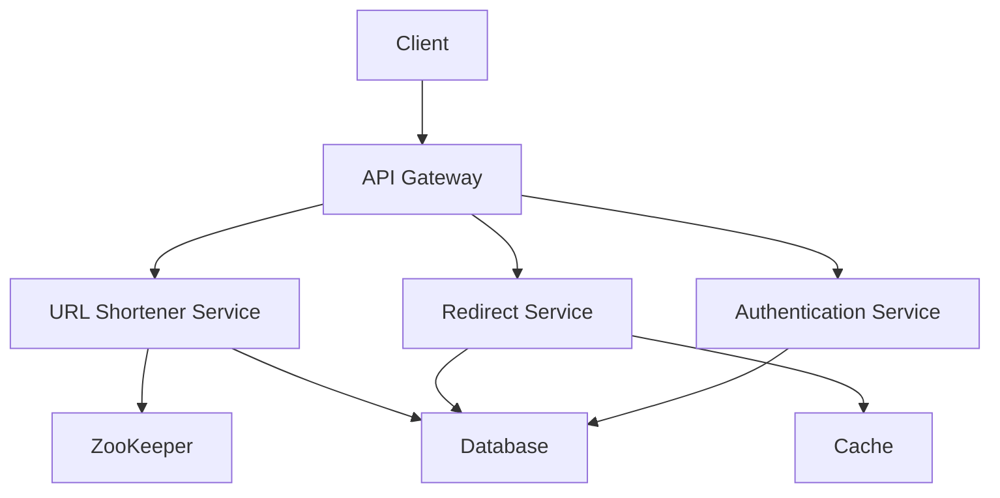

# 🏗️ Thiết kế TinyURL (phần 3) — API, service và giao tiếp

> Nguồn: `065-High-Level-Design-Services-APIs-Communication.txt` · [Udemy](https://ua.udemy.com/course/mastering-system-design-from-basics-to-cracking-interviews/learn/lecture/49737253)

Bước 3 của blueprint là **high-level design**: biến các yêu cầu đã chốt thành **API, service và cách chúng giao tiếp**. Trong bài này, chúng ta sẽ thiết kế bộ API cho TinyURL, dựng kiến trúc tổng thể theo **trách nhiệm của từng thành phần**, rồi giải bài toán hóc búa nhất: **sinh ID duy nhất khi service chạy trên nhiều instance**.

---

### 🎯 API tạo short URL — POST /api/shorten

Mục đích của API là tạo **contract (hợp đồng) rõ ràng** giữa client và dịch vụ, định nghĩa cách ứng dụng tương tác mà **không phơi bày chi tiết triển khai bên trong**. API đầu tiên phụ trách **tạo URL rút gọn**:

* Vì thao tác này **tạo tài nguyên mới**, ta phơi nó dưới dạng **`POST` request tới `/api/shorten`**, với request cố ý giữ đơn giản: client gửi **JSON payload** chứa URL dài cần rút gọn — từ góc nhìn API, đó là **thông tin duy nhất cần thiết** để bắt đầu.
* Khi request tới server, service sẽ **kiểm tra URL hợp lệ, sinh hoặc tra cứu short key phù hợp, lưu mapping nếu cần**, rồi trả về short URL cho client — response cũng tối giản, chỉ chứa **short URL vừa sinh** thay vì cả mapping hay chi tiết triển khai.

Điều đáng chú ý là **API che giấu toàn bộ độ phức tạp bên dưới**: client không cần biết short key được sinh thế nào, mapping lưu ở đâu, hay dịch vụ có kiểm tra URL trùng lặp hay không. Với client, nó chỉ gửi URL dài và nhận URL ngắn. *Đây là một nguyên lý quan trọng của thiết kế API: giao diện đơn giản, dễ hiểu — còn backend có thể tiến hóa thoải mái mà không ảnh hưởng người dùng API.*

---

### 🔁 API redirect và API xóa URL

**API redirect** là endpoint thứ hai. Tạo link ngắn quan trọng, nhưng **endpoint này nhận phần lớn traffic** vì mọi cú click đều đi qua nó:

* Client gửi **`GET` request với short key nằm trong URL** (ví dụ link rút gọn `tinyurl.com/abc123` thì ta chỉ cần trích ra `abc123`). Service **tra cứu URL dài tương ứng**; nếu tìm thấy, nó **không trả URL dưới dạng JSON** mà phản hồi bằng **HTTP 302 redirect**, chỉ thị trình duyệt tự động điều hướng đến đích gốc.
* Đây là **quyết định thiết kế quan trọng**: bằng cách trả về redirect thay vì bản thân URL, **trình duyệt tự xử lý điều hướng**, tạo trải nghiệm liền mạch — với người dùng, click link ngắn là trang đích mở ra ngay. Tuy chỉ là một `GET` đơn giản, đây vẫn là **endpoint nhạy cảm nhất về hiệu năng** của toàn hệ thống: mỗi redirect gồm một phép tra cứu và một phản hồi chuyển hướng, có thể thực thi **hàng triệu lần mỗi ngày** — chính vì vậy **low latency là cực kỳ then chốt**, và cũng giải thích vì sao chúng ta nhấn mạnh caching cùng truy cập dữ liệu nhanh ở bước ước lượng scale.

**API xóa URL** là phần tùy chọn — không bắt buộc cho chức năng lõi, nhưng quan trọng với người dùng muốn quản lý link mình đã tạo:

* Được phơi dưới dạng **`DELETE` request tới `/api/url/{shortkey}`**, nơi short key định danh URL cần xóa.
* Khác hai API trước, thao tác này **sửa đổi dữ liệu**, nên security trở thành ưu tiên hàng đầu — **không thể để bất kỳ ai trên internet xóa link tùy tiện**. Vì vậy endpoint này yêu cầu **bearer token (token truy cập)**: token xác thực người dùng và cho hệ thống biết **tài khoản nào đang gọi**.
* Authentication mới chỉ là bước đầu. Service còn phải **kiểm tra authorization**: kể cả xác thực thành công, người dùng **chỉ được xóa URL họ thực sự sở hữu**. Chỉ khi thỏa cả hai điều kiện, hệ thống mới xóa mapping; nếu không, request bị từ chối.

Phân biệt **authentication** (*"bạn là ai?"*) và **authorization** (*"bạn có được phép làm hành động này?"*) là một nguyên lý quan trọng của thiết kế API: **một API an toàn thường cần cả hai bước kiểm tra trước khi thực hiện thao tác nhạy cảm.**

---

### 🔐 API xác thực người dùng

Vì TinyURL cho phép người dùng quản lý link, xem analytics và thực hiện thao tác như xóa, ta cần cách **nhận diện người dùng một cách an toàn**:

1. **Đăng ký** — người dùng mới gửi **`POST` tới `/api/auth/register`** kèm thông tin như email, username, password. Nếu hợp lệ, hệ thống tạo tài khoản mới, mở quyền truy cập các tính năng yêu cầu xác thực.
2. **Đăng nhập** — người dùng gọi **`POST` tới `/api/auth/login`** với credential; sau khi xác thực thành công, hệ thống **trả về access token**. Token này trở thành **danh tính của người dùng cho mọi request sau đó**.

Thay vì gửi username/password mỗi lần gọi API, client chỉ cần đính kèm **token trong request header theo chuẩn `Authorization: Bearer`**. Cách này mang lại những lợi ích quan trọng:

* Credential của người dùng **chỉ được dùng lúc đăng nhập**, không phải truyền đi trong mọi request; mọi endpoint được bảo vệ đều có thể **xác minh token** để biết người dùng là ai trước khi cho phép truy cập.

Thiết kế này khớp tự nhiên với các API đã bàn: **thao tác công khai như redirect không cần authentication** (ai cũng phải truy cập được link được chia sẻ), còn **thao tác quản lý tài nguyên thuộc sở hữu người dùng như xóa link hay xem analytics riêng tư thì cần bearer token hợp lệ**. Tách bạch **public API** và **authenticated API** giúp giữ trải nghiệm đơn giản trong khi vẫn bảo vệ thao tác nhạy cảm — một pattern phổ biến trong hầu hết ứng dụng web và REST API hiện đại.

---

### 🏗️ Kiến trúc high-level — mỗi thành phần một trách nhiệm

Đến đây, thay vì nghĩ về từng server riêng lẻ, hãy nghĩ theo **trách nhiệm**. Thiết kế tốt tách các mối quan tâm vào những thành phần chuyên trách, mỗi thành phần có mục đích rõ ràng và **co giãn độc lập khi workload tăng**:

* **API gateway** — thành phần đầu tiên mọi request gặp. Nó là **điểm vào duy nhất cho mọi client**: nhận request, **route tới service phù hợp**, thực thi **rate limiting** và **xác thực cho các API được bảo vệ**. Tập trung những trách nhiệm cắt ngang này giúp các service còn lại tập trung vào business logic.
* **URL shortener service** — nơi sinh URL ngắn mới và **chứa business logic cốt lõi**: sinh key duy nhất, kiểm tra URL trùng lặp, kiểm tra custom alias khi được yêu cầu. Nhiệm vụ chính: đảm bảo mọi short URL tạo ra đều **duy nhất và hợp lệ**.
* **Redirect service** — trách nhiệm hoàn toàn khác: **phân giải short key thành URL dài nhanh nhất có thể**. Vì đảm nhiệm phần lớn traffic, service này được tối ưu cho **tra cứu cực nhanh và latency tối thiểu**.
* **Database** — **system of record (nguồn sự thật)**: lưu bền vững mapping giữa short URL và long URL, cùng thông tin người dùng và metadata liên quan. Dù kiến trúc tiến hóa thế nào, database vẫn là **nguồn dữ liệu có thẩm quyền**.
* **Cache** (thường là **Redis** hoặc **Memcached**) — để tránh truy vấn database cho mọi redirect, các mapping được truy cập thường xuyên được giữ trong bộ nhớ, giúp **redirect phổ biến nhanh hơn hẳn** và giảm mạnh tải cho database.
* **Authentication service** — quản lý đăng ký, đăng nhập và sinh token; đảm bảo mọi thao tác được bảo vệ đều gắn với **người dùng hợp lệ**.

*Mỗi thành phần một trách nhiệm rõ ràng: gateway quản lý traffic vào, shortener tạo link, redirect phân giải link, cache tăng tốc đọc, database lưu trữ bền vững, auth service bảo vệ thao tác người dùng.* Đây là nguyên lý nền tảng của thiết kế hệ thống có khả năng mở rộng: giữ mỗi thành phần tập trung vào một việc, kiến trúc sẽ **dễ scale, dễ bảo trì và dễ tiến hóa**.

---

### ⚙️ Sinh ID không trùng với ZooKeeper

Chúng ta đã chọn Base62 vì đơn giản, gọn và dễ mở rộng. Nhưng còn một câu hỏi quan trọng: **điều gì xảy ra khi URL shortener service không còn chạy trên một server duy nhất?**

Hãy hình dung có **nhiều instance service** chạy sau load balancer, mỗi instance **tự sinh short URL độc lập**. Thách thức mới xuất hiện: **làm sao đảm bảo mọi instance sinh ID duy nhất?** Nếu mỗi instance giữ **bộ đếm cục bộ**, collision là điều không tránh khỏi — hai server khác nhau có thể sinh **cùng numeric ID**, encode Base62 ra **cùng short key**, dẫn tới **hai URL dài tranh nhau một short key** và mapping sai lệch — điều hoàn toàn không thể chấp nhận.

Gốc rễ vấn đề là **thiếu phối hợp toàn cục**: mỗi instance quyết định độc lập, nhưng việc sinh ID đòi hỏi **cả hệ thống đồng thuận**. Đây là lúc **Apache ZooKeeper** xuất hiện:

* ZooKeeper là **distributed coordination service (dịch vụ phối hợp phân tán)**, giúp nhiều node phối hợp các thao tác dùng chung an toàn. Thay vì mỗi server tự sinh ID, các instance **hỏi ZooKeeper mỗi khi cần ID duy nhất mới**: nó duy trì **một bộ đếm toàn cục**, và khi có instance xin ID, ZooKeeper **tự tăng bộ đếm và trả về số tiếp theo**.
* Vì thao tác này là **atomic (nguyên tử)**, **không hai instance nào nhận cùng ID**, kể cả khi chúng gọi đúng cùng thời điểm.
* Bên trong, ZooKeeper lưu dữ liệu phối hợp bằng cấu trúc như **ZNode**, cho phép quản lý shared state toàn cluster; nó cũng hỗ trợ **distributed locking (khóa phân tán)** để những thao tác cần phối hợp — như tăng bộ đếm toàn cục — được thực hiện **an toàn và tuần tự**.
* Khi đã có numeric ID duy nhất, phần còn lại **giữ nguyên như cũ**: encode Base62 để tạo short key rồi lưu mapping vào database cho các lần tra cứu sau.

Lưu ý cách kiến trúc tiến hóa: **Base62 không đổi** — ta vẫn dùng nó vì tạo URL ngắn, thân thiện. Thứ duy nhất thay đổi là **cách lấy numeric ID duy nhất trước khi encode**. Ngay khi bước từ một server sang nhiều server, **phối hợp trở thành bắt buộc** — và ZooKeeper đảm nhiệm vai trò đó.

*Đây là một nguyên lý đáng nhớ của hệ phân tán: nhiều thuật toán chạy hoàn hảo trên một máy bỗng trở nên khó nhằn khi có nhiều máy tham gia. Vấn đề thật sự thường không phải "sinh ra một ID", mà là **đảm bảo mọi node trong hệ thống đồng ý rằng ID đó là duy nhất**.*

---

### 🎯 Tự kiểm tra nhanh

**Câu 1:** API tạo short URL nhận gì và trả về gì?

<b>Xem đáp án</b>

**Đáp án:** Nhận `POST` tới `/api/shorten` với JSON payload chứa URL dài; trả về short URL vừa sinh.

Giải thích: API che giấu chi tiết triển khai — client chỉ gửi URL dài và nhận URL ngắn.

Tham chiếu: Mục API tạo short URL.

**Câu 2:** Vì sao redirect API trả về HTTP 302 thay vì JSON chứa URL?

<b>Xem đáp án</b>

**Đáp án:** Để trình duyệt tự động điều hướng đến đích gốc, tạo trải nghiệm liền mạch cho người dùng.

Giải thích: Đây cũng là endpoint nhận phần lớn traffic và nhạy cảm nhất về hiệu năng.

Tham chiếu: Mục API redirect và API xóa URL.

**Câu 3:** Vì sao API xóa URL cần cả authentication lẫn authorization?

<b>Xem đáp án</b>

**Đáp án:** Vì không thể cho bất kỳ ai xóa link tùy tiện; user phải được xác thực và chỉ được xóa URL họ thực sự sở hữu.

Giải thích: Endpoint này sửa đổi dữ liệu nên yêu cầu bearer token và kiểm tra quyền sở hữu.

Tham chiếu: Mục API redirect và API xóa URL.

**Câu 4:** Sáu thành phần chính của kiến trúc high-level là gì?

<b>Xem đáp án</b>

**Đáp án:** API gateway, URL shortener service, redirect service, database, cache (Redis hoặc Memcached) và authentication service.

Giải thích: Mỗi thành phần có một trách nhiệm rõ ràng và có thể scale độc lập.

Tham chiếu: Mục Kiến trúc high-level.

**Câu 5:** Vì sao cần ZooKeeper khi chạy nhiều instance service?

<b>Xem đáp án</b>

**Đáp án:** Vì bộ đếm cục bộ trên từng instance sẽ gây collision; ZooKeeper giữ một bộ đếm toàn cục, cấp ID nguyên tử nên không hai instance nào nhận cùng ID.

Giải thích: ID sau đó được encode Base62 và lưu mapping vào database như bình thường.

Tham chiếu: Mục Sinh ID không trùng với ZooKeeper.

---

Vậy là bước 3 đã hoàn tất: chúng ta có **bộ API rõ ràng** (tạo, redirect, xóa, xác thực), **kiến trúc sáu thành phần** với trách nhiệm tách bạch, và cách **sinh ID an toàn trong môi trường phân tán** nhờ ZooKeeper. *Một lần nữa, các bạn thấy đấy — giải pháp cho vấn đề tưởng nhỏ như sinh ID lại phụ thuộc hoàn toàn vào bối cảnh phân tán.*

Ở bài tiếp theo (bước 4), chúng ta sẽ đưa ra **quyết định công nghệ và hạ tầng** cho TinyURL. Hẹn gặp lại các bạn! 🚀
