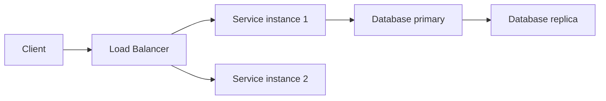

# ⚙️ Thiết kế TinyURL (phần 4) — quyết định công nghệ và hạ tầng

> Nguồn: `066-Making-Tech-Infra-Decisions.txt` · [Udemy](https://ua.udemy.com/course/mastering-system-design-from-basics-to-cracking-interviews/learn/lecture/49737257)

Đến đây, chúng ta bước vào **bước 4 của blueprint**: ra **quyết định công nghệ và hạ tầng chiến lược**. Nếu các bài trước trả lời "kiến trúc trông như thế nào", thì bài này trả lời "dùng công nghệ nào để hiện thực hóa nó, dựa trên chính những yêu cầu đã xác định". Mình sẽ đi qua từng quyết định lớn: database, caching, scalability và high availability.

---

### 🗄️ Database — Postgres và phương án DynamoDB

Cho **URL mapping chính và dữ liệu người dùng**, một **relational database (cơ sở dữ liệu quan hệ)** như **Postgres** là lựa chọn mạnh:

* Postgres hỗ trợ **auto-incrementing ID (ID tự tăng)** — khớp tự nhiên với chiến lược **Base62 encoding** của chúng ta, cho cách sinh định danh duy nhất **đơn giản và đáng tin cậy**.
* Nếu hệ thống cần mở rộng tới **tập dữ liệu cực lớn với lưu trữ phân tán**, **NoSQL** như **DynamoDB** là phương án thay thế với **khả năng mở rộng ngang xuất sắc**.

Điểm cần nhấn mạnh: *chúng ta không chọn công nghệ vì chúng phổ biến, mà vì chúng **khớp với các yêu cầu đã xác định** xuyên suốt case study.*

---

### ⚡ Caching — Redis hoặc Memcached

Caching là một quyết định chiến lược khác. Vì TinyURL là hệ thống **highly read-heavy**, việc **truy vấn database lặp đi lặp lại cho các URL phổ biến sẽ rất kém hiệu quả**.

* Đưa **Redis** hoặc **Memcached** vào làm **cache layer (tầng đệm)** giúp phục vụ **phần lớn redirect request thường xuyên trực tiếp từ bộ nhớ**.
* Kết quả kép: **giảm latency** cho người dùng, đồng thời **bảo vệ database khỏi tải không cần thiết**.

---

### 📈 Scale ngang thay vì máy to hơn

Khi traffic tăng, chúng ta **không muốn thay server bằng những cỗ máy ngày càng lớn hơn**. Thay vào đó:

* **Scale horizontally (mở rộng ngang)** bằng cách **thêm nhiều instance của URL generation service**.
* Cách này cho phép hệ thống xử lý khối lượng công việc tăng dần trong khi giữ kiến trúc **linh hoạt và tiết kiệm chi phí**.

---

### 🛡️ High availability — load balancer, replication và failover

Vì người dùng kỳ vọng short link **hoạt động bất kể lúc nào**, ta phải **loại bỏ single point of failure (điểm hỏng đơn lẻ) ở mọi nơi có thể**:

* **Load balancer** phân phối request đến nhiều service instance — traffic được chia đều và **sự cố của một instance không làm gián đoạn dịch vụ**.
* **Database replication (nhân bản)** đảm bảo **nhiều bản sao dữ liệu** cùng tồn tại. Nếu một instance database không khả dụng, **một replica khác tiếp tục phục vụ request** — cải thiện cả resilience lẫn availability.
* Để tăng cường hơn nữa, có thể dùng **cloud-managed database và service có failover sẵn có**: nếu instance bên dưới gặp sự cố, hạ tầng **tự động chuyển sang instance khỏe mạnh với gián đoạn tối thiểu**.

---

### 🎯 Bài học — requirement dẫn dắt công nghệ

Nếu nhìn lại toàn bộ case study, các bạn sẽ thấy một **pattern rất rõ ràng: mọi quyết định công nghệ đều được dẫn dắt bởi một yêu cầu cụ thể**:

* Chọn **caching** vì **redirect chi phối workload**.
* Chọn **scale ngang** vì **traffic tăng theo thời gian**.
* Thêm **load balancing và replication** vì **high availability là yêu cầu bắt buộc**.

*Đây chính là cách kiến trúc sư giàu kinh nghiệm suy nghĩ: họ **không bắt đầu từ công nghệ** — họ bắt đầu từ **yêu cầu**, rồi chọn công nghệ đáp ứng tốt nhất những yêu cầu đó.*

---

### 🎯 Tự kiểm tra nhanh

**Câu 1:** Vì sao Postgres phù hợp với chiến lược Base62 của TinyURL?

<b>Xem đáp án</b>

**Đáp án:** Vì Postgres hỗ trợ auto-incrementing ID — khớp tự nhiên với Base62 encoding để sinh định danh duy nhất.

Giải thích: Khi cần mở rộng cực lớn với lưu trữ phân tán, NoSQL như DynamoDB là phương án thay thế.

Tham chiếu: Mục Database — Postgres và phương án DynamoDB.

**Câu 2:** Vì sao TinyURL cần cache layer?

<b>Xem đáp án</b>

**Đáp án:** Vì hệ thống read-heavy — cache giúp phục vụ phần lớn redirect phổ biến từ bộ nhớ, giảm latency và bảo vệ database.

Giải thích: Redis hoặc Memcached là những lựa chọn được nêu trong thiết kế.

Tham chiếu: Mục Caching — Redis hoặc Memcached.

**Câu 3:** Scale ngang được thực hiện như thế nào trong thiết kế này?

<b>Xem đáp án</b>

**Đáp án:** Thêm nhiều instance của URL generation service thay vì thay bằng máy lớn hơn.

Giải thích: Cách này giữ kiến trúc linh hoạt và tiết kiệm chi phí khi traffic tăng.

Tham chiếu: Mục Scale ngang thay vì máy to hơn.

**Câu 4:** Load balancer và replication giải quyết vấn đề gì?

<b>Xem đáp án</b>

**Đáp án:** Load balancer chia traffic đều và giúp sự cố một instance không gián đoạn dịch vụ; replication tạo nhiều bản sao dữ liệu để replica khác tiếp tục phục vụ khi một instance database hỏng.

Giải thích: Cả hai cùng loại bỏ single point of failure, tăng resilience và availability.

Tham chiếu: Mục High availability.

**Câu 5:** Bài học lớn nhất về cách chọn công nghệ là gì?

<b>Xem đáp án</b>

**Đáp án:** Kiến trúc sư không bắt đầu từ công nghệ — họ bắt đầu từ yêu cầu, rồi chọn công nghệ đáp ứng tốt nhất các yêu cầu đó.

Giải thích: Trong case study này, caching, scale ngang, load balancing và replication đều xuất phát từ yêu cầu cụ thể.

Tham chiếu: Mục Bài học — requirement dẫn dắt công nghệ.

---

Vậy là bước 4 đã hoàn tất với bốn quyết định lớn: **Postgres cho mapping và dữ liệu người dùng, Redis/Memcached cho caching, scale ngang cho scalability, và load balancer + replication + managed failover cho high availability**. *Một lần nữa: không có công nghệ nào "tốt nhất" — chỉ có công nghệ khớp nhất với yêu cầu.*

Ở bài tiếp theo — cũng là bài cuối của case study — chúng ta sẽ **ghép mọi quyết định thành final design** và đi qua hai luồng chính: tạo link và redirect. Hẹn gặp lại các bạn! 🚀
