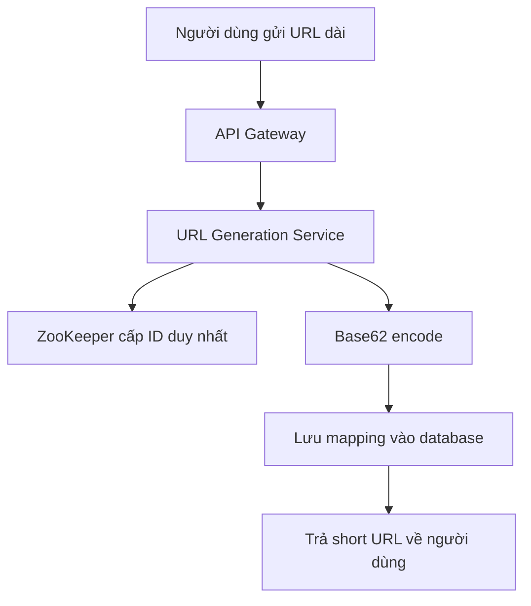
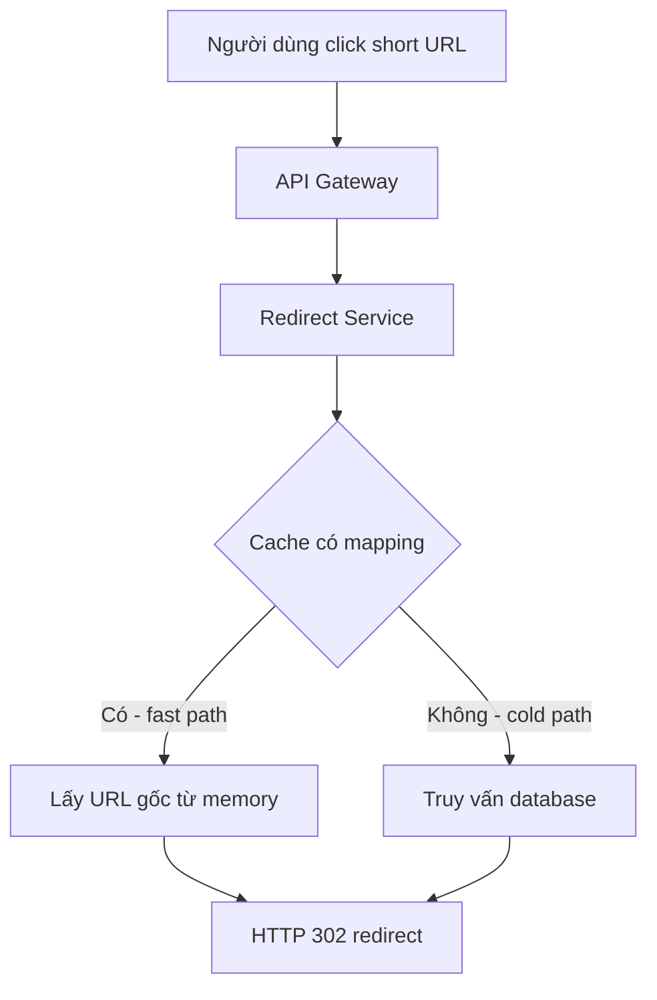

# 🏁 Thiết kế TinyURL (phần 5) — final design và hai luồng chính

> Nguồn: `067-The-Final-Design---URL-Shortener.txt` · [Udemy](https://ua.udemy.com/course/mastering-system-design-from-basics-to-cracking-interviews/learn/lecture/49737259)

Chúng ta đã đến **kiến trúc cuối cùng** của dịch vụ TinyURL. Suốt case study, thiết kế được dựng lên **từng quyết định một**: hiểu yêu cầu, ước lượng scale, nhận diện điểm nghẽn, thiết kế API, chọn thành phần lõi và ra quyết định công nghệ. Bài này sẽ cho các bạn thấy **tất cả các mảnh ghép vận hành cùng nhau** trong hai luồng chính: tạo link và redirect.

---

### 🧭 Bức tranh cuối cùng

Hãy nhìn lại hành trình: chúng ta có **API gateway** làm điểm vào duy nhất; **URL generation service** chuyên tạo link; **ZooKeeper** đảm bảo sinh ID không trùng; **redirect service** tối ưu cho tra cứu nhanh; **cache** tăng tốc workload read-heavy; và **database** lưu trữ bền vững mọi mapping. Bây giờ là lúc xem chúng **phối hợp với nhau như thế nào** trong từng bước của vòng đời một short URL.

---

### 🏗️ Luồng tạo short URL

Mọi thứ bắt đầu khi người dùng gửi **một URL dài**. Từng bước diễn ra như sau:

1. Request trước tiên tới **API gateway** — điểm vào duy nhất của hệ thống. Tại đây, các mối quan tâm chung như **authentication, request validation và rate limiting** được xử lý trước khi vào business logic.
2. Request được chuyển tới **URL generation service**. Vì có thể chạy **nhiều instance đồng thời**, các instance cần cách sinh ID duy nhất đáng tin cậy, không collision.
3. Thay vì tự sinh ID độc lập, service **xin ID kế tiếp từ ZooKeeper**: dịch vụ này tự tăng **bộ đếm toàn cục** và **đảm bảo mọi instance nhận giá trị duy nhất**.
4. Service **encode Base62** numeric ID đó để tạo short key ngắn, gọn.
5. Mapping giữa short URL và URL dài gốc được **lưu vào database**.
6. Cuối cùng, **short URL được trả về cho người dùng** — hoàn tất workflow tạo link.

---

### 🔁 Luồng redirect — fast path và cold path

Bây giờ xem điều gì xảy ra khi ai đó **click vào short URL**:

1. Request lại đi qua **API gateway**, lần này được route tới **redirect service**.
2. Nhớ rằng đây là **thành phần bận rộn nhất** trong toàn hệ thống vì **mọi cú click đều chạy qua nó**.
3. Thay vì truy vấn database ngay, redirect service **kiểm tra cache trước**:
   * **Fast path** — nếu mapping đã nằm trong cache (rất thường gặp với link phổ biến), URL gốc được lấy **trực tiếp từ bộ nhớ**. Đường đi nhanh này **tối thiểu hóa latency và tránh truy cập database không cần thiết**.
   * **Cold path** — nếu mapping chưa có trong cache, service **tra cứu database**. Chậm hơn một chút, nhưng đảm bảo **mọi short URL hợp lệ đều được phân giải**.
4. Khi đã tìm thấy URL gốc, service phản hồi bằng **HTTP 302 redirect** — và trình duyệt tự động điều hướng người dùng tới đích.

---

### 🧩 Mỗi thành phần một trách nhiệm

Khi lùi lại nhìn toàn bộ kiến trúc, các bạn sẽ thấy **mọi thành phần đều tồn tại vì một lý do cụ thể**:

* **API gateway** tập trung hóa việc xử lý request.
* **URL generation service** chỉ tập trung vào việc tạo short URL duy nhất.
* **ZooKeeper** đảm bảo sinh ID không collision.
* **Redirect service** được tối ưu cho tra cứu nhanh.
* **Cache** tăng tốc workload read-heavy.
* **Database** cung cấp lưu trữ bền vững, đáng tin cậy cho mọi mapping.

*Đây chính là tinh túy của system design tốt: mỗi thành phần có trách nhiệm rõ ràng, và cùng nhau chúng thỏa mãn các yêu cầu đã đặt ra từ đầu — **high availability, low latency, scalability, reliability và quản lý người dùng an toàn**.*

---

### 🎓 Bài học quy trình

Điều quan trọng hơn cả sơ đồ cuối cùng là **quy trình chúng ta đã đi**: không bắt đầu bằng cách chọn công nghệ hay vẽ diagram, mà bằng cách **hiểu bài toán, ước lượng scale, nhận diện điểm nghẽn** — rồi mới ra quyết định kiến trúc để giải quyết chính những thách thức đó.

*Đó là tư duy của một kiến trúc sư, và là quy trình các bạn có thể áp dụng cho gần như mọi hệ thống quy mô lớn. Hiếm khi có thiết kế hoàn hảo — mọi quyết định đều là trade-off, và điều quan trọng là ra quyết định **có lý do**.*

---

### 🎯 Tự kiểm tra nhanh

**Câu 1:** Trong luồng tạo short URL, ZooKeeper đóng vai trò gì?

<b>Xem đáp án</b>

**Đáp án:** Cấp ID kế tiếp từ bộ đếm toàn cục, đảm bảo mọi service instance nhận giá trị duy nhất, không collision.

Giải thích: ID sau đó được encode Base62 thành short key và lưu mapping vào database.

Tham chiếu: Mục Luồng tạo short URL.

**Câu 2:** AI xử lý authentication, validation và rate limiting trước khi vào business logic?

<b>Xem đáp án</b>

**Đáp án:** API gateway — điểm vào duy nhất của hệ thống.

Giải thích: Gateway tập trung các mối quan tâm chung để service tập trung vào nghiệp vụ.

Tham chiếu: Mục Luồng tạo short URL.

**Câu 3:** Fast path và cold path trong luồng redirect khác nhau thế nào?

<b>Xem đáp án</b>

**Đáp án:** Fast path lấy URL gốc trực tiếp từ cache memory; cold path tra cứu database khi mapping chưa có trong cache.

Giải thích: Fast path tối thiểu hóa latency; cold path đảm bảo mọi short URL hợp lệ đều được phân giải.

Tham chiếu: Mục Luồng redirect.

**Câu 4:** Vì sao redirect service là thành phần bận rộn nhất?

<b>Xem đáp án</b>

**Đáp án:** Vì mọi cú click vào short URL đều chạy qua nó — số redirect lớn hơn hẳn số lần tạo link.

Giải thích: Đây là lý do service được tối ưu cho tra cứu nhanh và cache được đặt phía trước database.

Tham chiếu: Mục Luồng redirect.

**Câu 5:** Kiến trúc cuối cùng thỏa mãn những yêu cầu nào đặt ra từ đầu?

<b>Xem đáp án</b>

**Đáp án:** High availability, low latency, scalability, reliability và quản lý người dùng an toàn.

Giải thích: Mỗi thành phần ra đời để giải quyết một điểm nghẽn đã nhận diện ở bước ước lượng scale.

Tham chiếu: Mục Mỗi thành phần một trách nhiệm.

---

Vậy là case study TinyURL đã khép lại: các bạn không chỉ hiểu kiến trúc trông như thế nào, mà quan trọng hơn — **vì sao nó được thiết kế như vậy**. *Nếu có một điều đáng mang theo, thì đó là quy trình: hiểu bài toán → ước lượng scale → thiết kế high-level → quyết định công nghệ — lặp lại được cho mọi hệ thống.*

Ở case study tiếp theo, chúng ta sẽ áp dụng đúng quy trình này cho một hệ thống thực tế khác, với một bộ thách thức kiến trúc hoàn toàn mới. Hẹn gặp lại các bạn! 🚀
