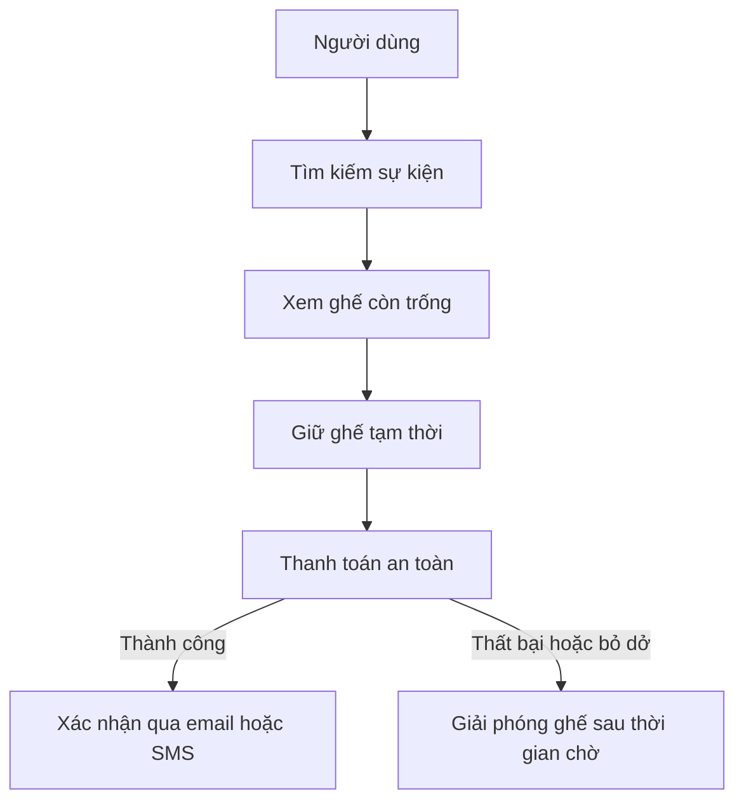

# 🎬 Thiết kế Ticketing System (BookMyShow) — hiểu bài toán và xác định phạm vi

> Nguồn: `068-Understanding-the-Problem-Defining-the-Scope.txt` · [Udemy](https://ua.udemy.com/course/mastering-system-design-from-basics-to-cracking-interviews/learn/lecture/49756425)

Chào mừng các bạn đến với case study mới: **thiết kế một ticketing system (hệ thống bán vé)** quy mô production như **BookMyShow**. Trong loạt bài này, chúng ta sẽ xây dựng kiến trúc xử lý **đặt vé theo thời gian thực, lượng truy cập tăng vọt và giao dịch đáng tin cậy** mà không đánh đổi hiệu năng hay tính nhất quán. Bài đầu tiên là bước quan trọng nhất: **hiểu đúng bài toán trước khi vẽ bất kỳ kiến trúc nào**.

---

### 🎬 Bối cảnh: ticketing system là gì và vì sao khó?

Trước khi nghĩ đến kiến trúc, chúng ta cần hiểu rõ bài toán mình đang giải. **Ticketing system** là nền tảng trực tuyến nơi người dùng có thể **khám phá sự kiện, chọn ghế, mua vé và quản lý booking** của mình. Dù là đặt vé xem phim, giữ chỗ cho concert, mua vé trận cricket, hay thậm chí đặt vé tàu, vé máy bay — **luồng công việc cốt lõi gần như giống hệt nhau**.

Thoạt nhìn, đây có vẻ là một ứng dụng web đơn giản: người dùng tìm sự kiện, chọn ghế, thanh toán và nhận vé. Nhưng **thách thức thật sự bắt đầu khi hàng nghìn, thậm chí hàng triệu người cùng làm đúng những thao tác đó trong cùng một thời điểm**.

Hãy tưởng tượng một concert cực hot mở bán vé lúc **10 giờ sáng**. Trong vài giây, **hàng trăm nghìn người đang refresh trang**, cùng tranh nhau một tập ghế có hạn. Hệ thống phải **hiển thị tình trạng ghế chính xác theo thời gian thực**, **ngăn hai người cùng mua một ghế**, xử lý thanh toán an toàn, và vẫn **nhanh, phản hồi tốt dưới lưu lượng khổng lồ**.

Sự kết hợp giữa **dữ liệu thời gian thực, giao dịch tài chính và concurrency (tính đồng thời) cực lớn** chính là điều biến ticketing system thành một case study system design tuyệt vời. Đây không chỉ là phục vụ web — mà là **duy trì tính đúng đắn trong khi vận hành ở quy mô lớn**.

Xuyên suốt case study, chúng ta sẽ thấy kiến trúc **tiến hóa từng bước**. *Thay vì học thuộc một kiến trúc cuối cùng, các bạn hãy tập trung hiểu vì sao mỗi quyết định thiết kế trở nên cần thiết khi hệ thống lớn lên* — đó là tư duy áp dụng được cho mọi ứng dụng phân tán quy mô lớn, không riêng gì hệ thống bán vé.

---

### 🧩 Functional requirements — hành trình người dùng và góc nhìn admin

Trước khi thiết kế kiến trúc, chúng ta phải thống nhất **hệ thống cần làm được những gì**. Hãy bắt đầu từ **hành trình người dùng**:

1. **Duyệt danh sách sự kiện** đang có.
2. **Xem những ghế hiện còn trống**.
3. **Giữ chỗ hoặc đặt ghế** mong muốn.
4. **Hoàn tất thanh toán** một cách an toàn.
5. **Nhận xác nhận** qua email hoặc SMS.

Nếu thiếu bất kỳ bước nào, trải nghiệm đặt vé là **không trọn vẹn**.

Một yêu cầu cần được chú ý đặc biệt: **real-time seat availability (tình trạng ghế theo thời gian thực)**. Đây **không chỉ là một tính năng giao diện** — thông tin hiển thị cho mọi người dùng phải **chính xác nhất có thể**, bởi nhiều người có thể đang cố đặt cùng một ghế tại cùng một thời điểm. Như chúng ta sẽ thấy ở các bước sau, chỉ riêng yêu cầu này đã có **ảnh hưởng lớn đến thiết kế tổng thể**.

Ở phía **quản trị**, nền tảng cũng cần công cụ để vận hành kinh doanh:

* **Tạo sự kiện**, **cấu hình địa điểm (venue)**.
* **Định nghĩa sơ đồ ghế (seat layout)** và **thiết lập giá vé**.

Không có những năng lực này, sẽ **không có dữ liệu cho người dùng duyệt và đặt vé**.

Để ý rằng những yêu cầu trên mô tả **hệ thống nên làm gì, chứ không phải làm như thế nào** — đây là phân biệt quan trọng trong system design. Chúng ta xác lập chức năng kinh doanh trước, rồi mới quyết định kiến trúc hỗ trợ nó.

---

### 📊 Non-functional requirements — những ràng buộc định hình kiến trúc

Biết hệ thống cần làm gì rồi, giờ là lúc nói về **mức độ tốt mà nó phải đạt**. Trong hệ thống quy mô lớn, **non-functional requirements (yêu cầu phi chức năng)** thường chi phối kiến trúc còn mạnh hơn cả yêu cầu chức năng:

* **High availability (sẵn sàng cao)** — vé cho concert lớn mở bán đúng 10 giờ sáng. Nếu nền tảng sập dù chỉ vài phút, hậu quả là **mất doanh thu, người dùng bực bội và tổn hại uy tín công ty**. Hệ thống phải duy trì sẵn sàng ngay cả dưới nhu cầu cực đoan.
* **Low latency (độ trễ thấp)** — đặt vé là trải nghiệm mang tính tương tác cao. Người dùng mong **sơ đồ ghế tải nhanh, tình trạng ghế cập nhật tức thì và booking hoàn tất trong vài mili giây**. Chỉ một độ trễ nhỏ cũng gây trải nghiệm kém, đặc biệt khi mọi người đang tranh nhau những ghế có hạn.
* **Scalability (khả năng mở rộng)** — lưu lượng hiếm khi ổn định. Phần lớn thời gian nền tảng có mức sử dụng vừa phải, nhưng trong **flash sale hoặc lúc mở bán sự kiện hot**, lưu lượng có thể **tăng vọt trong vài phút**. Kiến trúc phải xử lý được những cú spike đó mà không suy giảm hiệu năng.
* **Data consistency (nhất quán dữ liệu)** — có lẽ là yêu cầu then chốt nhất. Chúng ta có thể chấp nhận **email xác nhận đến hơi muộn**, nhưng **tuyệt đối không thể để một ghế được bán cho hai người khác nhau**. Duy trì tình trạng ghế chính xác dưới concurrency lớn sẽ là **một trong những thách thức kiến trúc lớn nhất** của case study này.
* **Audit logs (nhật ký kiểm toán)** — những hành động quan trọng như **đặt vé, thanh toán, hủy vé hoặc hoàn tiền** đều phải **truy vết được**. Nhật ký giúp **xử lý sự cố và giải quyết tranh chấp với khách hàng**, hỗ trợ **phát hiện gian lận** và đáp ứng **yêu cầu tuân thủ**.

| Yêu cầu | Vì sao quan trọng | Ảnh hưởng thiết kế |
|---|---|---|
| High availability | Sập vài phút là mất doanh thu và uy tín | Chiến lược triển khai |
| Low latency | Người dùng đang tranh ghế, chậm là mất trải nghiệm | Caching và truy cập dữ liệu |
| Scalability | Traffic tăng vọt khi flash sale | Thiết kế hạ tầng |
| Data consistency | Không thể bán một ghế cho hai người | Cách xử lý booking |
| Audit logs | Truy vết, tranh chấp, chống gian lận, tuân thủ | Cách ghi nhận sự kiện |

Hãy để ý cách những yêu cầu này dẫn dắt quyết định kiến trúc: **high availability ảnh hưởng chiến lược triển khai, low latency chi phối caching và truy cập dữ liệu, scalability tác động thiết kế hạ tầng, consistency định hình cách xử lý booking, còn auditability quyết định cách ghi nhận sự kiện**. Gần như mọi quyết định kiến trúc trong case study này đều nhằm thỏa mãn một hoặc nhiều yêu cầu trên.

---

### 🔒 Quy mô, đa vùng và bài toán khóa ghế

Một thiết kế tốt không được tạo ra trong chân không — nó được định hình bởi **quy mô và thách thức của bài toán**. Trong case study này, chúng ta giả định nền tảng có khoảng **5 triệu người dùng đã đăng ký**, với tới **100.000 người dùng hoạt động đồng thời** trong các đợt mở bán lớn. Để ý rằng thách thức **không nằm ở tổng số ghế**, mà ở **sự tăng vọt đột ngột của hoạt động đồng thời** — hàng nghìn người có thể cố giữ ghế **đúng cùng một khoảnh khắc**, tạo áp lực khổng lồ lên hệ thống.

Một ràng buộc nữa: nền tảng phục vụ **các nhà tổ chức sự kiện toàn cầu**, nghĩa là người dùng có thể đặt vé từ nhiều nơi trên thế giới. Kiến trúc cần **hỗ trợ nhiều region** để người dùng có độ trễ thấp bất kể vị trí, đồng thời cho phép nhà tổ chức quản lý sự kiện xuyên nhiều khu vực địa lý.

Cuối cùng, hãy xét tình huống người dùng chọn một ghế rồi tiến hành thanh toán. Chúng ta **không thể để ghế đó tiếp tục mở cho người khác mua**, nên hệ thống **tạm khóa ghế**. Nhưng nếu thanh toán thất bại hoặc người dùng bỏ ngang thì sao?

* Nếu **không bao giờ giải phóng** khóa, những ghế giá trị sẽ **mãi không bán được dù chẳng ai thực sự mua**.
* Nếu **giải phóng quá nhanh**, bạn có thể **làm gián đoạn người đang trả tiền một cách hợp lệ**.

Đây là **thách thức kinh điển của hệ phân tán**: cân bằng giữa **fairness (công bằng), trải nghiệm người dùng và hiệu quả sử dụng tài nguyên**. Hệ thống cần một cơ chế đáng tin cậy để **tạm giữ ghế và tự động giải phóng nếu booking không hoàn tất trong khoảng thời gian hợp lý**.

Những ràng buộc này sẽ **ảnh hưởng mạnh mẽ đến kiến trúc** của chúng ta. Khi đi tiếp, các bạn sẽ thấy nhiều thành phần được giới thiệu **không phải lựa chọn tùy ý, mà là phản ứng trực tiếp với những thách thức thực tế này**.

---

### 🎯 Tự kiểm tra nhanh

**Câu 1:** Điều gì khiến ticketing system trở thành case study system design hấp dẫn?

<b>Xem đáp án</b>

**Đáp án:** Sự kết hợp giữa dữ liệu thời gian thực, giao dịch tài chính và concurrency cực lớn — bài toán duy trì tính đúng đắn ở quy mô lớn.

Giải thích: Không chỉ là phục vụ web, hệ thống phải đúng dưới áp lực hàng nghìn người tranh cùng tài nguyên.

Tham chiếu: Mục Bối cảnh.

**Câu 2:** Vì sao real-time seat availability không chỉ là một tính năng giao diện?

<b>Xem đáp án</b>

**Đáp án:** Vì nhiều người có thể đang đặt cùng một ghế tại cùng thời điểm, nên thông tin hiển thị phải chính xác và có ảnh hưởng lớn đến thiết kế tổng thể.

Giải thích: Độ chính xác của tình trạng ghế là điều kiện để ngăn bán trùng.

Tham chiếu: Mục Functional requirements.

**Câu 3:** Yêu cầu phi chức năng nào ảnh hưởng trực tiếp đến chiến lược triển khai?

<b>Xem đáp án</b>

**Đáp án:** High availability.

Giải thích: Các yêu cầu khác cũng có ảnh hưởng riêng: latency đến caching, scalability đến hạ tầng, consistency đến cách xử lý booking.

Tham chiếu: Mục Non-functional requirements.

**Câu 4:** Vì sao cần cơ chế khóa ghế có thời hạn tự động giải phóng?

<b>Xem đáp án</b>

**Đáp án:** Để ghế không bị giữ mãi khi thanh toán thất bại hoặc người dùng bỏ ngang, nhưng cũng không giải phóng quá nhanh làm gián đoạn người đang trả tiền.

Giải thích: Đây là bài toán cân bằng fairness, trải nghiệm người dùng và hiệu quả tài nguyên.

Tham chiếu: Mục Quy mô, đa vùng và bài toán khóa ghế.

**Câu 5:** Quy mô giả định của case study này là gì?

<b>Xem đáp án</b>

**Đáp án:** Khoảng 5 triệu người dùng đã đăng ký, với tối đa 100.000 người hoạt động đồng thời trong các đợt mở bán lớn.

Giải thích: Thách thức nằm ở sự tăng vọt hoạt động đồng thời, không phải tổng số ghế.

Tham chiếu: Mục Quy mô, đa vùng và bài toán khóa ghế.

---

Vậy là chúng ta đã hoàn thành **bước 1** của quy trình thiết kế: hiểu bài toán, xác định **functional requirements**, **non-functional requirements** và những ràng buộc về quy mô, đa vùng, khóa ghế. Đây là nền móng để mọi quyết định kiến trúc phía sau trở nên **có lý do rõ ràng** thay vì tùy hứng.

Ở bài tiếp theo, chúng ta sẽ làm **bước 2: ước lượng scale và xác định các điểm nghẽn** — nơi những con số sẽ cho chúng ta biết hệ thống có thể vỡ ở đâu đầu tiên. Hẹn gặp lại các bạn! 🚀
