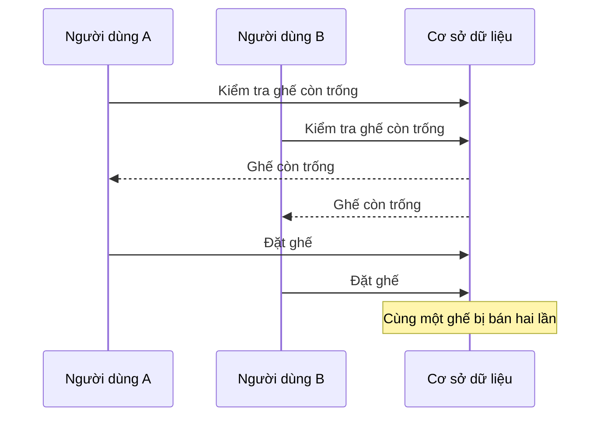

# 📏 Ước lượng scale và tìm điểm nghẽn — con số không bao giờ nói dối

> Nguồn: `069-Estimating-Scale-Identifying-Bottlenecks.txt` · [Udemy](https://ua.udemy.com/course/mastering-system-design-from-basics-to-cracking-interviews/learn/lecture/49756437)

Chúng ta đang ở **bước 2** của quy trình thiết kế: **ước lượng scale và xác định bottleneck (điểm nghẽn)**. Trước khi vẽ bất kỳ kiến trúc nào, những kiến trúc sư giàu kinh nghiệm luôn hỏi một câu: *"Chúng ta đang thiết kế cho quy mô nào?"* — vì giải pháp đúng cho 1.000 người dùng rất khác giải pháp đúng cho một triệu người dùng. Bài này sẽ cho các bạn thấy cách những con số định hình toàn bộ thiết kế phía sau.

---

### 📏 Ước lượng scale: một hệ thống đọc nhiều, ghi ít

Hãy bắt đầu với các giả định. Chúng ta giả định nền tảng có khoảng **1 triệu daily active user (người dùng hoạt động hàng ngày)**, với tối đa **100.000 người dùng online đồng thời** trong các sự kiện lớn — một lượng traffic đồng thời đáng kể.

Nhưng điều quan trọng hơn cả con số người dùng là **cách họ tương tác với hệ thống**. Phần lớn người dùng dành thời gian để **duyệt**:

* Nếu mỗi người xem khoảng **10 sự kiện mỗi ngày**, tổng cộng rơi vào khoảng **10 triệu read request (yêu cầu đọc) mỗi ngày**.
* Con số này cho chúng ta biết ngay một điều quan trọng: đây là **read-heavy system (hệ thống nặng về đọc)**. Phần lớn request chỉ đơn thuần **lấy thông tin sự kiện và tình trạng ghế**, chứ không thực sự tạo booking.

Giờ hãy nhìn sang **workload ghi**. Chúng ta kỳ vọng khoảng **500.000 booking mỗi ngày**, tức trung bình chỉ khoảng **6 booking mỗi giây**. Thoạt nghe, con số này có vẻ không mấy thách thức — nhưng hãy nhớ rằng **giá trị trung bình có thể đánh lừa chúng ta**.

---

### 🔢 Booking workload và cú spike "2.000 booking mỗi giây"

Ticketing system có đặc điểm traffic **cực kỳ không đồng đều**. Trong một concert hot hoặc trận thể thao lớn, **hàng nghìn người ập đến đúng cùng một thời điểm**, khiến traffic booking **tăng vọt lên 2.000 booking mỗi giây** — cao hơn **hơn 300 lần** so với mức trung bình hàng ngày.

*Đó là lý do các kiến trúc sư không bao giờ thiết kế theo giá trị trung bình. Họ thiết kế theo **peak load (tải đỉnh)**.*

Những con số này cũng giúp chúng ta nhận diện các bottleneck tiềm năng:

* Khối lượng read request lớn nghĩa là **dữ liệu sự kiện và ghế phải được phục vụ thật hiệu quả**, nếu không database sẽ quá tải.
* Quan trọng hơn, **booking path (luồng đặt vé) trở thành critical path (đường đi quan trọng nhất) của hệ thống**. Mỗi booking đều cố **giữ một tài nguyên có hạn là chiếc ghế**, và dưới concurrency lớn, hàng nghìn người có thể tranh nhau cùng một inventory (tồn kho ghế) trong cùng một khoảnh khắc.

Kết quả là kiến trúc của chúng ta cần **tối ưu cho hai workload khác nhau**: **read có khả năng mở rộng tốt** cho việc duyệt, và **write đúng đắn, nhất quán** cho việc đặt vé. Nhận diện sớm sự khác biệt này là điều cho phép chúng ta đưa ra những quyết định kiến trúc tốt hơn ở các bước sau.

---

### ⚠️ Bốn điểm nghẽn sẽ "vỡ" đầu tiên

Giờ đã có ước lượng scale, bước tiếp theo là xác định **nơi hệ thống dễ vỡ nhất**. Đây chính là cách kiến trúc sư suy nghĩ: họ không chỉ hỏi *"làm sao xây hệ thống?"*, mà hỏi *"điều gì sẽ hỏng trước tiên khi hệ thống lớn lên?"*

1. **Concurrency khi phân ghế** — đây là thách thức lớn nhất. Hãy tưởng tượng một concert chỉ còn **đúng một ghế**, và hàng trăm người bấm "book now" trong cùng một giây. Nếu hệ thống chỉ **kiểm tra ghế còn trống rồi cập nhật database**, nhiều request có thể **đọc cùng một trạng thái trước khi bất kỳ ai ghi thay đổi**. Kết quả là **race condition (điều kiện tranh chấp)** kinh điển: cùng một ghế bị bán nhiều lần. Ngăn chặn điều này là một trong những phần quan trọng nhất của toàn bộ kiến trúc.

2. **Áp lực ghi lên database** — đặt vé chủ yếu là thao tác đọc, nhưng mỗi booking lại tạo ra **nhiều thao tác ghi**: khóa một ghế, ghi nhận booking, cập nhật tình trạng ghế, và xử lý thông tin thanh toán. Trong một đợt flash sale, hàng nghìn thao tác ghi này **ập đến gần như đồng thời**. Nếu database không theo kịp, **booking latency tăng, request bắt đầu timeout, và người dùng có thể mất reservation** của mình.

3. **Dịch vụ thanh toán bên ngoài** — hệ thống booking **không kiểm soát payment gateway (cổng thanh toán)**, và các API bên ngoài đương nhiên **chậm hơn, kém ổn định hơn** so với service nội bộ. Nếu một giao dịch thanh toán mất quá lâu hoặc thất bại, **ghế vẫn bị khóa trong lúc hệ thống chờ phản hồi**. Nếu quá nhiều ghế bị khóa vì thanh toán chậm, **khách hàng hợp lệ có thể thấy sự kiện như đã cháy vé một cách sai lệch**.

4. **Hệ thống thông báo** — mỗi booking thành công đều sinh ra email hoặc SMS xác nhận. Với traffic bình thường, đây không phải vấn đề; nhưng trong một đợt mở bán lớn, **hàng trăm nghìn thông báo** có thể cần gửi trong thời gian rất ngắn. Nếu notification service không theo kịp, **xác nhận bị trễ — dù bản thân booking đã thành công**.

| Điểm nghẽn | Bản chất | Rủi ro |
|---|---|---|
| Concurrency khi phân ghế | Race condition kiểu check-then-update | Cùng một ghế bị bán hai lần |
| Áp lực ghi database | Nhiều thao tác ghi cho mỗi booking | Latency tăng, timeout, mất reservation |
| Payment gateway bên ngoài | Phụ thuộc dịch vụ chậm, kém ổn định | Ghế khóa lâu, khách thấy sai là cháy vé |
| Notification service | Hàng trăm nghìn thông báo trong thời gian ngắn | Xác nhận trễ dù booking thành công |

---

### 💡 Bài học: scalable không chỉ là "nhanh hơn"

Có một chi tiết rất thú vị về bốn điểm nghẽn trên: **chỉ một trong số đó thực sự liên quan đến hiệu năng**. Những cái còn lại xoay quanh **correctness (tính đúng đắn), reliability (độ tin cậy) và dependency management (quản lý phụ thuộc)**.

Đó là một bài học quan trọng của system design: **xây hệ thống scalable không chỉ là làm nó nhanh hơn**. Đó là đảm bảo hệ thống **tiếp tục hành xử đúng dưới tải cực lớn**, và cả **khi một phần hệ thống trở nên chậm hoặc thất bại** — điều chắc chắn sẽ xảy ra.

Khi chúng ta xây kiến trúc ở các bước tiếp theo, các bạn sẽ thấy **gần như mọi thành phần được giới thiệu đều tồn tại để giải quyết một hoặc nhiều điểm nghẽn cụ thể ở trên** — không có thành phần nào là lựa chọn tùy hứng.

---

### 🎯 Tự kiểm tra nhanh

**Câu 1:** Vì sao chúng ta kết luận đây là hệ thống read-heavy?

<b>Xem đáp án</b>

**Đáp án:** Vì khoảng 10 triệu read request mỗi ngày, trong khi chỉ có khoảng 500.000 booking mỗi ngày — phần lớn request chỉ để xem thông tin sự kiện và ghế.

Giải thích: Đây là lý do kiến trúc phải tối ưu riêng cho read và write.

Tham chiếu: Mục Ước lượng scale.

**Câu 2:** Vì sao không được thiết kế theo giá trị trung bình 6 booking mỗi giây?

<b>Xem đáp án</b>

**Đáp án:** Vì traffic của ticketing system rất không đồng đều — lúc mở bán sự kiện hot có thể spike lên 2.000 booking mỗi giây, hơn 300 lần mức trung bình.

Giải thích: Kiến trúc sư luôn thiết kế theo peak load, không thiết kế theo average.

Tham chiếu: Mục Booking workload và cú spike.

**Câu 3:** Race condition khi phân ghế xảy ra như thế nào?

<b>Xem đáp án</b>

**Đáp án:** Nhiều request cùng đọc trạng thái ghế trước khi bất kỳ request nào ghi thay đổi, dẫn tới cùng một ghế bị bán nhiều lần.

Giải thích: Ngăn chặn tình huống này là một trong những phần quan trọng nhất của kiến trúc.

Tham chiếu: Mục Bốn điểm nghẽn sẽ vỡ đầu tiên.

**Câu 4:** Vì sao payment gateway bên ngoài có thể khiến khách thấy sai là "cháy vé"?

<b>Xem đáp án</b>

**Đáp án:** Vì khi thanh toán chậm hoặc thất bại, ghế vẫn bị khóa trong lúc chờ; quá nhiều ghế bị khóa khiến sự kiện trông như đã hết vé dù chưa ai mua.

Giải thích: Hệ thống không kiểm soát được dịch vụ bên ngoài, nên cần cô lập và xử lý phụ thuộc này.

Tham chiếu: Mục Bốn điểm nghẽn sẽ vỡ đầu tiên.

**Câu 5:** Bài học lớn nhất từ bốn điểm nghẽn là gì?

<b>Xem đáp án</b>

**Đáp án:** Chỉ một điểm nghẽn liên quan đến hiệu năng; còn lại là correctness, reliability và dependency management — scalable không chỉ là nhanh hơn.

Giải thích: Hệ thống phải hành xử đúng dưới tải cực lớn và khi một phần hệ thống chậm hoặc lỗi.

Tham chiếu: Mục Bài học: scalable không chỉ là nhanh hơn.

---

Vậy là chúng ta đã hoàn thành **bước 2**: biết hệ thống đọc nhiều hơn ghi, biết cú spike có thể gấp hơn 300 lần mức trung bình, và biết chính xác **bốn điểm nghẽn** cần giải quyết. Đây chính là "bản đồ rủi ro" để chúng ta thiết kế phần tiếp theo.

Ở bài sau, chúng ta sẽ bắt đầu **bước 3: high-level design** — xác định các service, API và cách chúng giao tiếp với nhau. Hẹn gặp lại các bạn! 🚀
