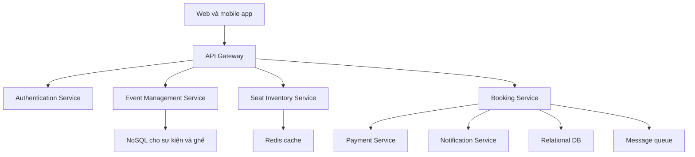

# 🏗️ High-Level Design — services, API và cách hệ thống giao tiếp

> Nguồn: `070-High-Level-Design-Services-APIs-Communication.txt` · [Udemy](https://ua.udemy.com/course/mastering-system-design-from-basics-to-cracking-interviews/learn/lecture/49756443)

Sau khi đã hiểu bài toán, yêu cầu và các điểm nghẽn, chúng ta bước vào **bước 3: high-level design** — thiết kế tổng thể về **services, API và communication (giao tiếp)**. Mình sẽ bắt đầu từ những khối xây dựng lớn nhất, rồi mở rộng dần — đúng tinh thần *"kiến trúc tốt được xây từng bước, không phải vẽ một lần là xong"*.

---

### 🧱 Những khối xây dựng đầu tiên và các back-end service

**Front end** gồm cả **web application** và **mobile application** — nơi người dùng duyệt sự kiện, xem tình trạng ghế, chọn ghế, thanh toán và quản lý booking. Từ góc nhìn người dùng, đây là toàn bộ hệ thống; nhưng phía sau, nó chỉ gửi request đến các service back-end.

Thay vì để client giao tiếp trực tiếp với mọi service, chúng ta đưa vào một **API gateway** — **điểm vào duy nhất** của hệ thống. Mọi request của client đều đến gateway trước; gateway chịu trách nhiệm **routing request đến service phù hợp**, đồng thời xử lý các trách nhiệm chung như **authentication (xác thực)**. Cách này cho phép quản lý traffic tập trung và giữ back-end **độc lập với các client app**. Bên cạnh đó, **Authentication Service** tách riêng xác thực thành một service chuyên trách, quản lý danh tính người dùng ở một nơi để phần còn lại tập trung vào nghiệp vụ; còn **admin portal** phục vụ nhóm người dùng thứ hai — **nhà tổ chức** — với năng lực tạo sự kiện, cấu hình venue, định nghĩa seat layout và đặt giá vé, đồng thời **nuôi dữ liệu sự kiện** mà khách hàng nhìn thấy sau này.

Một tầng sâu hơn là các **back-end service** triển khai logic nghiệp vụ cốt lõi. Thay vì nhồi mọi thứ vào một ứng dụng duy nhất, chúng ta **tách trách nhiệm** để hệ thống dễ mở rộng, dễ bảo trì và tiến hóa:

1. **Event Management Service** — quản lý dữ liệu liên quan sự kiện: tạo sự kiện, cấu hình venue, seat layout, giá vé. Nói cách khác, đây là service quản lý **danh mục sự kiện** cho người dùng duyệt và đặt vé.
2. **Seat Inventory Service** — một trong những service quan trọng nhất: duy trì **trạng thái của từng ghế** (còn trống, đang tạm khóa, hay đã được đặt vĩnh viễn). Giữ thông tin này chính xác là điều kiện để toàn bộ luồng booking hoạt động đúng.
3. **Booking Service** — **điều phối luồng đặt vé**: giữ ghế, khởi tạo luồng thanh toán, và xác nhận booking khi thanh toán thành công. Nó không sở hữu mọi logic mà **phối hợp các service liên quan** để hoàn tất một booking.
4. **Payment Service** — giao tiếp với **payment gateway bên ngoài**. Vì thanh toán phụ thuộc hệ thống bên thứ ba có thể chậm hoặc đôi khi không khả dụng, tách payment thành service riêng cho phép **xử lý lỗi và retry mà không ảnh hưởng phần còn lại của nền tảng**.
5. **Notification Service** — sau khi booking hoàn tất, người dùng mong nhận xác nhận ngay. Thay vì bắt luồng đặt vé chờ gửi SMS hay email, một service riêng đảm nhận việc gửi xác nhận.

Điểm đáng chú ý: **mỗi service có một trách nhiệm được định nghĩa rõ ràng**. Sự tách biệt này không chỉ để code sạch hơn — nó cho phép **từng service tiến hóa và mở rộng độc lập theo workload riêng**.

---

### 💾 Data & caching — không phải dữ liệu nào cũng giống nhau

Khi hệ thống lớn lên, **chọn nơi lưu trữ phù hợp quan trọng không kém việc thiết kế service**. Các loại dữ liệu khác nhau có access pattern khác nhau, nên thay vì dùng một database cho mọi thứ, chúng ta dùng **công nghệ phù hợp nhất cho từng workload**:

* **Relational database** — lưu dữ liệu có cấu trúc cao và mang tính giao dịch như **người dùng, booking, bản ghi thanh toán**. Những thao tác này cần **strong consistency (nhất quán mạnh)** vì không thể chấp nhận booking hoàn tất dở dang hay dữ liệu giao dịch mâu thuẫn.
* **NoSQL document database** — dùng cho **sự kiện và sơ đồ ghế**. Thông tin sự kiện có thể khác nhau giữa các sự kiện, và seat layout có thể rất phức tạp tùy venue; database dạng document cho **độ linh hoạt** để mô hình hóa dữ liệu này mà không phải ép vào bảng quan hệ cứng nhắc.
* **Caching layer** — hệ thống của chúng ta **nặng về đọc**, với hàng triệu request chỉ để kiểm tra sự kiện và tình trạng ghế. Nếu mọi request đều chạm database, nó sẽ nhanh chóng thành bottleneck. Dùng các công nghệ như **Redis hoặc Memcached**, thông tin được truy cập thường xuyên — đặc biệt là **tình trạng ghế theo thời gian thực** — được phục vụ trực tiếp từ cache, **giảm mạnh tải database và cải thiện thời gian phản hồi**.
* **Message queue** — dùng các công nghệ như **Kafka** hay những nền tảng message queue phổ biến khác. Không phải tác vụ nào cũng cần hoàn thành trong lúc người dùng đang chờ: gửi email xác nhận, retry thanh toán thất bại, hay ghi audit log — tất cả đều có thể diễn ra **bất đồng bộ**. Đưa những tác vụ này vào queue giữ luồng booking nhanh và phản hồi tốt, trong khi các background worker xử lý chúng độc lập.

| Loại dữ liệu | Công nghệ | Lý do |
|---|---|---|
| User, booking, payment | Relational DB | Dữ liệu giao dịch cần nhất quán mạnh |
| Sự kiện, sơ đồ ghế | NoSQL document | Cấu trúc linh hoạt theo từng sự kiện |
| Tình trạng ghế, dữ liệu đọc nhiều | Cache Redis hoặc Memcached | Giảm tải database, tăng tốc phản hồi |
| Email, retry, audit log | Message queue | Tác vụ dài, không cần bắt người dùng chờ |

Nguyên tắc kiến trúc then chốt ở đây: **không phải dữ liệu nào cũng được đối xử như nhau**. Dữ liệu giao dịch vào relational database để đảm bảo nhất quán, dữ liệu linh hoạt vào NoSQL, thông tin đọc nhiều được phục vụ từ cache cho nhanh, còn tác vụ dài và không quan trọng được giao cho queue để không làm chậm trải nghiệm người dùng.

Sự kết hợp này cho phép xây một hệ thống **nhất quán ở nơi tính đúng đắn quan trọng, và nhanh ở nơi hiệu năng quan trọng** — chính xác là sự cân bằng mà một nền tảng ticketing quy mô lớn cần.

---

### 🧠 Bốn quyết định thiết kế then chốt

Đến đây chúng ta đã lắp ghép các thành phần chính. Giờ hãy bàn về những **quyết định thiết kế** giúp hệ thống đáng tin cậy trong điều kiện thực tế — chúng **không phải tính năng mới, mà là kỹ thuật kiến trúc** giải quyết đúng những thách thức đã nhận diện:

* **Concurrency control (kiểm soát đồng thời)** — đảm bảo chỉ một booking thành công. **Optimistic locking** giả định xung đột tương đối hiếm: trước khi cập nhật ghế, hệ thống kiểm tra **version** chưa thay đổi; nếu người khác đã sửa, booking thất bại và người dùng thử lại. **Pessimistic locking** thì **khóa ghế ngay** khi một người đang đặt, ngăn người khác sửa cho đến khi transaction hoàn tất.
* **Seat hold timeout** — khi người dùng chọn ghế, ta tạm giữ ghế đó, nhưng người dùng có thể bỏ ngang hoặc thanh toán lỗi. Để tránh khóa ghế vĩnh viễn, hệ thống dùng **Redis với TTL (Time to Live)**: nếu booking không hoàn tất trong **5 phút**, reservation **tự động hết hạn** và ghế trở lại trạng thái trống — inventory chính xác mà không cần can thiệp thủ công.
* **CQRS** — tách thao tác đọc khỏi thao tác ghi. Nhìn lại ước lượng traffic: phần lớn request chỉ kiểm tra sự kiện và tình trạng ghế, chỉ một tỷ lệ nhỏ thực sự tạo booking. Tách hai workload cho phép **tối ưu độc lập**: read path tập trung vào **tốc độ và khả năng mở rộng**, write path tập trung vào **tính đúng đắn và nhất quán**.
* **Idempotency keys cho payment** — thanh toán vốn không đáng tin, và người dùng thường bấm nút thanh toán nhiều lần nếu chưa thấy phản hồi ngay. Không có bảo vệ, cùng một yêu cầu thanh toán có thể bị xử lý nhiều lần, dẫn đến **trừ tiền trùng**. **Idempotency key** cho phép hệ thống nhận ra request lặp lại là **cùng một thao tác thanh toán**, giúp retry an toàn mà không tính tiền khách hai lần.

| Tiêu chí | Optimistic locking | Pessimistic locking |
|---|---|---|
| Giả định | Xung đột tương đối hiếm | Xung đột có thể xảy ra ngay |
| Cách làm | Kiểm tra version trước khi cập nhật | Khóa ghế ngay khi đang đặt |
| Khi va chạm | Booking thất bại, người dùng thử lại | Người khác phải chờ transaction xong |
| Phù hợp với | Mức tranh chấp thấp | Mức tranh chấp cao |

Nhìn kỹ, cả bốn quyết định đều có **một mục tiêu chung**: không thêm chức năng mới, mà **làm cho chức năng hiện có trở nên đáng tin cậy** — hành xử đúng dưới concurrency, phục hồi duyên dáng khi lỗi, mở rộng hiệu quả và mang lại trải nghiệm đáng tin. Đó là khác biệt giữa **hệ thống chạy được trong demo** và **hệ thống sẵn sàng production**.

---

### 🔌 API design — hợp đồng sạch giữa client và backend

Trong system design, chúng ta **không cố ghi lại mọi endpoint** — mục tiêu là định nghĩa **giao diện sạch, trực quan** giữa client và backend. Vì vậy mình chỉ tập trung vào vài API tiêu biểu theo phong cách **REST**:

* **Event Management Service** — resource chính là `/events`. **POST** tạo sự kiện mới (thường do admin portal gọi). **GET** trả về danh sách sự kiện, hỗ trợ **filtering, sorting và pagination** vì số sự kiện có thể rất lớn. Muốn chi tiết một sự kiện, client gọi `/events/eventId` — nếu tồn tại, trả về chi tiết; nếu không, trả về **404 not found**.
* **Booking Service** — theo cùng thiết kế RESTful, resource chính là **bookings**. **POST** tạo booking mới với các thông tin như sự kiện, người dùng và số lượng vé. Thành công trả về **201 created**; nếu không thể đáp ứng — ví dụ **không đủ ghế** — trả về lỗi client phù hợp như **400 bad request**. Client cũng có thể lấy thông tin booking qua collection hoặc một booking cụ thể bằng định danh duy nhất.

Điểm hay là cả hai service **nhất quán về phong cách API**: tài nguyên được biểu diễn bằng **danh từ** như `events`, `bookings`, còn **HTTP method** mô tả hành động — `GET` để lấy, `POST` để tạo. Sự nhất quán này giúp API **trực quan với lập trình viên client** và dễ bảo trì lâu dài.

Cuối cùng, hãy nhớ rằng những API này chỉ là **hợp đồng bên ngoài**. Đằng sau một request đặt vé duy nhất, hệ thống có thể thực hiện rất nhiều thao tác nội bộ: kiểm tra tình trạng ghế, khóa ghế, xử lý thanh toán, tạo thông báo. Client **không cần biết** tất cả sự phức tạp đó — nó chỉ tương tác với một API sạch, được thiết kế tốt, còn các service back-end phối hợp mọi thứ phía sau. Đó chính là một trong những mục tiêu quan trọng của API design tốt: **giữ giao diện đơn giản trong khi che giấu độ phức tạp của hệ thống bên dưới**.

---

### 🎯 Tự kiểm tra nhanh

**Câu 1:** API gateway mang lại lợi ích gì?

<b>Xem đáp án</b>

**Đáp án:** Là điểm vào duy nhất cho mọi request, đảm nhận routing và các trách nhiệm chung như authentication, giúp back-end độc lập với client app.

Giải thích: Gateway cũng cho phép quản lý traffic tập trung.

Tham chiếu: Mục Những khối xây dựng đầu tiên và các back-end service.

**Câu 2:** Seat Inventory Service theo dõi những trạng thái nào của ghế?

<b>Xem đáp án</b>

**Đáp án:** Còn trống, đang tạm khóa, và đã được đặt vĩnh viễn.

Giải thích: Đây là một trong những service quan trọng nhất vì toàn bộ luồng booking phụ thuộc vào độ chính xác của nó.

Tham chiếu: Mục Những khối xây dựng đầu tiên và các back-end service.

**Câu 3:** Optimistic locking và pessimistic locking khác nhau thế nào?

<b>Xem đáp án</b>

**Đáp án:** Optimistic kiểm tra version trước khi cập nhật, xung đột thì booking thất bại và thử lại; pessimistic khóa ghế ngay khi đang đặt.

Giải thích: Chọn cách nào phụ thuộc mức tranh chấp, cả hai đều nhằm ngăn double booking.

Tham chiếu: Mục Bốn quyết định thiết kế then chốt.

**Câu 4:** Seat hold timeout hoạt động ra sao?

<b>Xem đáp án</b>

**Đáp án:** Ghế được tạm giữ bằng Redis với TTL; nếu booking không hoàn tất trong 5 phút, reservation tự động hết hạn và ghế mở lại.

Giải thích: Cách này giữ inventory chính xác mà không cần can thiệp thủ công.

Tham chiếu: Mục Bốn quyết định thiết kế then chốt.

**Câu 5:** Idempotency keys bảo vệ điều gì trong thanh toán?

<b>Xem đáp án</b>

**Đáp án:** Ngăn cùng một yêu cầu thanh toán bị xử lý nhiều lần và trừ tiền trùng khi người dùng bấm nhiều lần hoặc retry.

Giải thích: Hệ thống nhận ra request lặp lại là cùng một thao tác thanh toán, nên retry trở nên an toàn.

Tham chiếu: Mục Bốn quyết định thiết kế then chốt.

---

Vậy là chúng ta đã hoàn thành **bước 3**: hệ thống có đủ các **khối chức năng**, các **back-end service tách trách nhiệm**, tầng **dữ liệu và caching phù hợp từng workload**, bốn **quyết định thiết kế** đảm bảo đúng đắn dưới tải lớn, cùng **bộ API REST** sạch sẽ. Các bạn có thể thấy mọi thành phần đều truy vết được về một điểm nghẽn đã nhận diện ở bước 2 — đó chính là tư duy thiết kế có chủ đích.

Ở bài tiếp theo, chúng ta sẽ đi vào **bước 4: chọn công nghệ và hạ tầng** cho từng thành phần này. Hẹn gặp lại các bạn! 🚀
