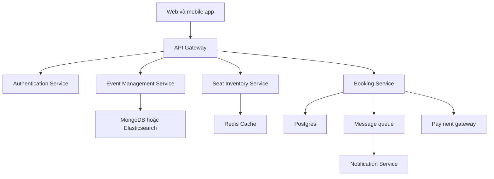

# 🗺️ Final Design — ghép mọi mảnh ghép thành hệ thống bán vé hoàn chỉnh

> Nguồn: `072-The-Final-Design---Ticketing-System.txt` · [Udemy](https://ua.udemy.com/course/mastering-system-design-from-basics-to-cracking-interviews/learn/lecture/49756453)

Chúng ta đã thiết kế từng phần của hệ thống bán vé một cách riêng lẻ. Giờ là lúc **đặt tất cả cạnh nhau và nhìn vào kiến trúc hoàn chỉnh**. Thay vì chăm chăm vào từng ô vuông trong sơ đồ, mình muốn các bạn hiểu **cách toàn bộ hệ thống vận hành như một giải pháp thống nhất** — và quan trọng hơn, hiểu vì sao từng quyết định lại ở đó.

---

### 🗺️ Điểm khởi đầu: mọi request đều đi qua API gateway

Hành trình đặt vé bắt đầu khi người dùng truy cập nền tảng qua **web hoặc mobile application**. Thay vì giao tiếp trực tiếp với các back-end service, **mọi request đều đến API gateway trước tiên**.

Gateway là **điểm vào duy nhất** cho **authentication, request routing, security và traffic management**, đồng thời **che giấu toàn bộ độ phức tạp của back-end** khỏi client. Phía sau gateway, request được định tuyến đến một trong các **service chuyên trách**:

* **Event Management Service** cung cấp thông tin sự kiện và chi tiết venue; **Seat Inventory Service** duy trì **trạng thái thời gian thực của từng ghế**.
* **Booking Service** điều phối toàn bộ luồng đặt vé; **Payment Service** xử lý giao dịch tài chính.
* **Authentication Service** quản lý danh tính người dùng; **Notification Service** gửi xác nhận booking.

Mỗi service có **một trách nhiệm duy nhất**, giúp hệ thống **dễ mở rộng, dễ bảo trì và tiến hóa độc lập**.

---

### ⚙️ Lưu trữ, bất đồng bộ và các tích hợp bên ngoài

Các service được hỗ trợ bởi những công nghệ lưu trữ khác nhau, mỗi lựa chọn phục vụ một mục đích riêng:

* **Postgres** lưu dữ liệu giao dịch như booking và payment — nơi **tính nhất quán là thiết yếu**.
* **MongoDB hoặc Elasticsearch** quản lý thông tin sự kiện, cho phép **tìm kiếm và lọc hiệu quả**.
* **Redis Cache** giảm tải database bằng cách phục vụ dữ liệu được truy cập thường xuyên — đặc biệt là **tình trạng ghế với độ trễ rất thấp**.

Các bạn cũng sẽ thấy **giao tiếp bất đồng bộ** trong kiến trúc: thay vì bắt người dùng chờ gửi email xác nhận hay ghi audit log, những tác vụ này được **giao cho message queue và xử lý ở background**. Điều này giữ **trải nghiệm đặt vé nhanh**, trong khi vẫn đảm bảo các thao tác hỗ trợ được hoàn thành đáng tin cậy.

Cuối cùng, hệ thống tích hợp với **các nhà cung cấp bên ngoài** như payment gateway và dịch vụ thông báo. Những tích hợp này được **cô lập phía sau các service chuyên trách**, để phụ thuộc bên ngoài **không ảnh hưởng không cần thiết** đến phần còn lại của kiến trúc.

---

### 🧠 Mọi quyết định đều trả lời một vấn đề cụ thể

Hãy lùi lại một bước và **so sánh sơ đồ này với những thách thức đã nhận diện ở đầu case study**. Các bạn sẽ thấy **mọi quyết định kiến trúc lớn đều giải quyết một bài toán cụ thể**:

* **API gateway** đơn giản hóa giao tiếp của client; **các service tách biệt** cải thiện khả năng mở rộng.
* **Redis** xử lý lượng đọc khổng lồ; **Postgres** đảm bảo tính nhất quán của booking.
* **Message queue** giữ các tác vụ chạy lâu ở dạng bất đồng bộ; **payment và notification service riêng** cô lập các phụ thuộc bên ngoài.

Đó có lẽ là bài học quan trọng nhất của toàn bộ case study: **system design tốt không phải là lắp ghép những công nghệ phổ biến hay học thuộc các pattern kiến trúc**. Nó là việc **hiểu bài toán, nhận diện điểm nghẽn, và đưa ra những quyết định thiết kế có chủ đích** để giải quyết đúng những vấn đề đó — trong khi cân bằng giữa **scalability, performance, reliability và maintainability**.

---

### 🎓 Tư duy mang vào phỏng vấn và production

Nhìn lại toàn bộ hành trình, chúng ta đã đi đúng **bốn bước của một buổi phỏng vấn system design thực thụ**: hiểu bài toán và xác định phạm vi → ước lượng scale và tìm điểm nghẽn → high-level design với service, API, communication → chọn công nghệ và hạ tầng. Mỗi bước đều **kế thừa và trả lời** những gì bước trước đặt ra.

*Các bạn hãy mang tư duy này vào mọi buổi phỏng vấn và mọi kiến trúc production mà mình xây dựng: đừng bắt đầu bằng "dùng công nghệ gì", hãy bắt đầu bằng "vấn đề là gì".*

Vậy là chúng ta đã khép lại case study **thiết kế ticketing system**. Ở section tiếp theo, chúng ta sẽ áp dụng chính **bản thiết kế tư duy** này để giải một bài toán thực tế khác. Hẹn gặp lại các bạn! 🚀
