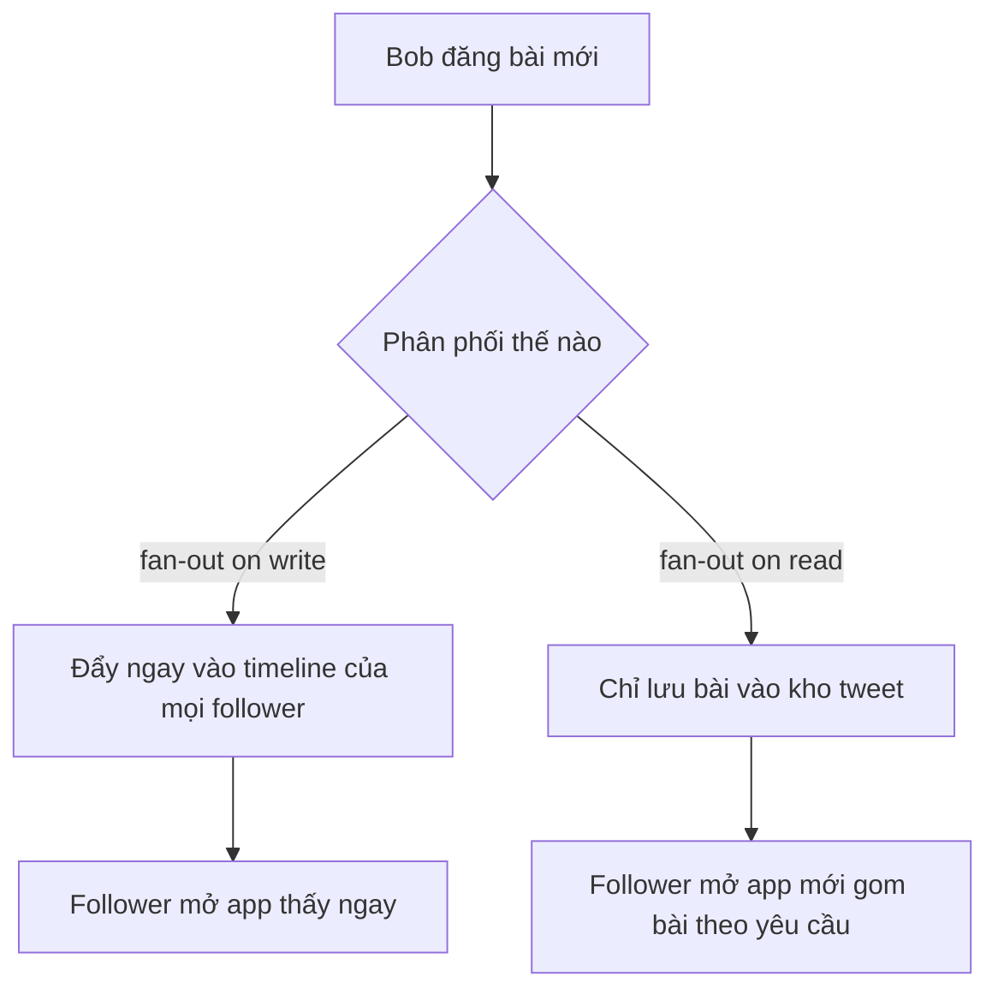

# 🐦 Thiết kế News Feed kiểu Twitter/Instagram: Hiểu đúng bài toán trước khi vẽ kiến trúc

> Nguồn: `073-Understanding-the-Problem-Defining-the-Scope.txt` · [Udemy](https://ua.udemy.com/course/mastering-system-design-from-basics-to-cracking-interviews/learn/lecture/49775837)

Trong case study đầu tiên của phần thiết kế hệ thống thực tế, mình và các bạn sẽ cùng thiết kế **news feed** (bảng tin) cho một nền tảng mạng xã hội quy mô lớn kiểu Twitter hay Instagram. Mục tiêu không chỉ là vẽ ra một sơ đồ đẹp, mà là hiểu cách các kiến trúc sư cân bằng giữa **giao nội dung theo thời gian thực**, **quy mô khổng lồ** và **độ trễ thấp** thông qua những đánh đổi kiến trúc thông minh.

---

### 🎯 News feed thực chất là gì?

Nói đến thiết kế news feed, chúng ta đang nói đến **tính năng giữ người dùng gắn bó với nền tảng mạng xã hội**: dòng bài đăng và cập nhật mà người dùng nhìn thấy mỗi khi mở ứng dụng — một **timeline (dòng thời gian)** liên tục thay đổi, gồm nội dung từ người, trang hoặc tài khoản mà họ theo dõi.

Thoạt nhìn, đây có vẻ chỉ là một danh sách bài viết. Nhưng khi nghĩ đến quy mô của Twitter, Instagram hay Facebook, các bạn sẽ thấy nó phức tạp hơn rất nhiều:

* Hàng triệu người dùng liên tục tạo nội dung mới.
* Hàng triệu người dùng khác mở ứng dụng và kỳ vọng thấy cập nhật mới gần như tức thì.

News feed phục vụ hai mục đích quan trọng:

1. Giúp người dùng duy trì kết nối với những người và cộng đồng mà họ quan tâm.
2. Khuyến khích tương tác qua lượt thích, bình luận, chia sẻ và nhiều hình thức **engagement (tương tác)** khác.

Theo góc nhìn system design, hệ thống phải liên tục **thu thập bài đăng mới**, **quyết định bài nào sẽ xuất hiện trong feed của từng người**, rồi **giao đi thật nhanh** trong khi hàng triệu người đang hoạt động cùng lúc. Mục tiêu không chỉ là hiển thị bài viết, mà là **đưa đúng bài viết đến đúng người dùng với độ trễ tối thiểu, ở quy mô internet**.

---

### 🧩 Functional requirements — hệ thống phải làm được gì?

Trước khi nghĩ đến database, caching hay scalability, chúng ta cần định nghĩa hệ thống phải làm gì. Đây là các **functional requirements (yêu cầu chức năng)**:

1. **Tạo và đăng bài viết:** người dùng có thể đăng cập nhật văn bản ngắn, ảnh hoặc video; hệ thống cần một cách đáng tin cậy để nhận và lưu nội dung mới.
2. **Social graph (đồ thị quan hệ xã hội):** người dùng có thể theo dõi hoặc bỏ theo dõi người khác — chính mối quan hệ này quyết định nội dung nào xuất hiện trong feed. Không có kết nối này, nền tảng không có cách nào biết nên hiển thị nội dung của ai.
3. **Home timeline cá nhân hóa:** thay vì hiển thị mọi bài từ mọi người, timeline chỉ nên hiển thị cập nhật từ các tài khoản mà người dùng theo dõi. Đây là điều làm feed trở nên hữu ích và liên quan.
4. **Tương tác:** người dùng mong đợi có thể thích, trả lời và retweet; đây là những tính năng tương tác thiết yếu giữ cuộc trò chuyện sống động, khiến nền tảng mang tính xã hội chứ không chỉ là nơi đọc tin.
5. **Nội dung đa phương tiện:** hỗ trợ ảnh và video, vì mạng xã hội hiện đại không còn giới hạn ở bài viết văn bản.

Hãy hình dung một hành trình người dùng đơn giản: **Alice theo dõi Bob. Bob đăng tweet "Hello World". Khi Alice mở ứng dụng, cô ấy kỳ vọng thấy tweet của Bob gần như ngay lập tức.** Với người dùng, điều này hiển nhiên. Nhưng với system design, đây chính là thách thức trung tâm mà cả case study này sẽ giải quyết: làm sao giao nội dung mới đến đúng người dùng thật nhanh và đáng tin cậy, ngay cả khi hàng triệu người vừa đăng bài vừa đọc cùng lúc.

---

### ⚡ Non-functional requirements — phải làm tốt đến mức nào?

Biết "làm gì" rồi, câu hỏi tiếp theo quan trọng không kém: "làm tốt đến đâu?". Đây là các **non-functional requirements (yêu cầu phi chức năng)** — không thêm tính năng mới nhưng định hình chất lượng trải nghiệm:

* **Timeline tải gần như tức thì:** không ai muốn nhìn màn hình chờ chỉ để xem cập nhật mới; tốc độ ảnh hưởng trực tiếp đến mức độ tương tác.
* **Độ tươi mới:** khi ai đó đăng bài mới, người theo dõi kỳ vọng thấy nó trong vài giây, không phải vài phút — mạng xã hội xoay quanh những cuộc trò chuyện thời sự.
* **Liên quan và nhất quán:** người dùng thấy cập nhật gần đây từ người họ theo dõi, hệ thống tránh bỏ sót bài hoặc hiển thị lặp cùng một bài nhiều lần. *Một feed nhanh vẫn là chưa đủ nếu người dùng không thể tin vào những gì họ thấy.*
* **High availability (tính sẵn sàng cao):** mạng xã hội được dùng 24/7, hệ thống phải tiếp tục phục vụ kể cả khi một server hay thành phần nào đó gặp sự cố.
* **Low latency (độ trễ thấp):** mọi thao tác — tải timeline, đăng bài, làm mới feed — đều phải phản hồi nhanh; độ trễ nhỏ cũng trở nên đáng chú ý khi hàng triệu người thực hiện mỗi ngày.
* **Khả năng mở rộng cao:** khi nền tảng lớn lên, hệ thống vẫn xử lý được số người dùng, bài viết, lượt thích, trả lời và upload media tăng lên mà không suy giảm hiệu năng.

Một quan sát quan trọng: **các yêu cầu này thường cạnh tranh lẫn nhau**. Giao mọi bài viết mới tức thì đến hàng triệu người trong khi vẫn giữ độ trễ thấp, sẵn sàng cao và timeline nhất quán là bài toán không hề đơn giản. Chính những non-functional requirements này sẽ dẫn dắt nhiều quyết định kiến trúc ở các phần sau.

---

### ⚠️ Fan-out on write hay fan-out on read — quyết định định hình cả hệ thống

Đây là một trong những thách thức kiến trúc quan trọng nhất của mọi hệ thống news feed. Điều thú vị: thử thách không nằm ở việc **lưu** tweet, mà ở việc **giao** chúng một cách hiệu quả.

Hãy tưởng tượng một người dùng chỉ có vài follower — việc giao bài rất đơn giản. Nhưng nếu người đó có **1 triệu follower**, một tweet bỗng phải trở nên hiển thị trên 1 triệu timeline khác nhau. Đó là lúc bài toán mở rộng thật sự bắt đầu.

Về mặt kiến trúc, chúng ta có hai hướng:

1. **Đẩy (push)** tweet mới vào timeline của mọi follower ngay khi nó được tạo.
2. **Chờ (pull)** đến khi từng follower mở ứng dụng rồi mới dựng timeline theo yêu cầu bằng cách lấy các bài mới nhất.

Không hướng nào tốt hơn tuyệt đối. Đẩy ngay giúp timeline đọc rất nhanh vì phần lớn công việc đã xong trước — nhưng đăng bài trở nên đắt đỏ, nhất là với người có hàng triệu follower. Ngược lại, sinh feed khi người dùng yêu cầu giúp việc đăng bài rẻ hơn nhiều, nhưng mỗi lần mở app lại phải làm nhiều việc hơn, làm tăng độ trễ cho người dùng.

| Tiêu chí | Fan-out on write | Fan-out on read |
|---|---|---|
| Thời điểm làm việc | Ngay khi bài được đăng | Khi người dùng mở feed |
| Đọc timeline | Rất nhanh, timeline đã sẵn sàng | Chậm hơn, phải gom và sắp xếp |
| Đăng bài | Đắt, nhất là với người nhiều follower | Rẻ, gần như chỉ cần lưu |
| Rủi ro chính | Bùng nổ ghi khi tài khoản quá nổi tiếng | Tăng độ trễ ở phía đọc |

Sự lựa chọn kiến trúc này được gọi là **fan-out on write (phân phối khi ghi) so với fan-out on read (phân phối khi đọc)**. Nó ảnh hưởng đến gần như mọi phần của hệ thống, từ storage, caching đến scalability và performance.

Trong suốt case study, chúng ta sẽ liên tục quay lại quyết định này, vì nhiều thành phần được giới thiệu ở các phần sau tồn tại chính để cân bằng đánh đổi ấy. Đây là một trong những quyết định thiết kế mang tính định hình của hệ thống news feed quy mô lớn.

---

### 🎯 Tự kiểm tra nhanh

**Câu 1:** News feed phục vụ hai mục đích chính nào?

<b>Xem đáp án</b>

**Đáp án:** Giúp người dùng kết nối với người và cộng đồng họ quan tâm; khuyến khích tương tác qua like, comment, share.

Giải thích: Chất lượng news feed quyết định nền tảng hữu ích và hấp dẫn đến mức nào.

Tham chiếu: Mục News feed thực chất là gì.

**Câu 2:** Vì sao social graph là yêu cầu chức năng thiết yếu?

<b>Xem đáp án</b>

**Đáp án:** Vì quan hệ theo dõi quyết định nội dung của ai sẽ xuất hiện trong feed người dùng.

Giải thích: Không có social graph, nền tảng không có cách nào quyết định nên hiển thị nội dung của ai.

Tham chiếu: Mục Functional requirements.

**Câu 3:** Kể tên ba non-functional requirements được nhấn mạnh trong bài.

<b>Xem đáp án</b>

**Đáp án:** High availability, low latency và khả năng mở rộng cao (cùng với tốc độ tải, độ tươi mới, tính nhất quán).

Giải thích: Đây là những phẩm chất định hình trải nghiệm người dùng ở quy mô lớn.

Tham chiếu: Mục Non-functional requirements.

**Câu 4:** Fan-out on write đánh đổi điều gì để có timeline đọc nhanh?

<b>Xem đáp án</b>

**Đáp án:** Thao tác đăng bài trở nên đắt đỏ, đặc biệt với người có hàng triệu follower.

Giải thích: Mỗi tweet mới kích hoạt cập nhật cho toàn bộ timeline của follower ngay lúc ghi.

Tham chiếu: Mục Fan-out on write hay fan-out on read.

**Câu 5:** Vì sao không có hướng fan-out nào "tốt hơn tuyệt đối"?

<b>Xem đáp án</b>

**Đáp án:** Vì mỗi hướng có đánh đổi riêng: push nhanh khi đọc nhưng đắt khi ghi; pull rẻ khi ghi nhưng tăng độ trễ khi đọc.

Giải thích: Đây chính là kiểu đánh đổi mà các phần sau của case study sẽ tiếp tục cân bằng.

Tham chiếu: Mục Fan-out on write hay fan-out on read.

---

Vậy là chúng ta đã hiểu rõ bài toán: hệ thống phải giao đúng nội dung đến đúng người, thật nhanh và đáng tin cậy, ở quy mô hàng triệu người dùng — và mọi lựa chọn đều xoay quanh đánh đổi push hay pull. Ở bài tiếp theo, chúng ta sẽ **ước lượng quy mô** của hệ thống này bằng những con số cụ thể, để biết chính xác mình đang thiết kế cho khối lượng lớn đến mức nào. Hẹn gặp lại các bạn! 🚀
