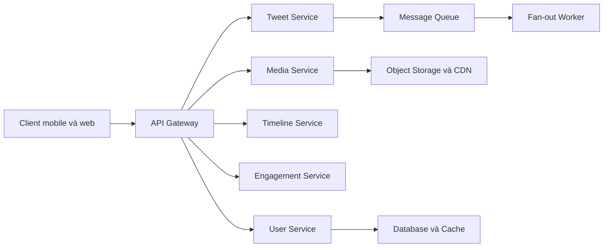

# 🏗️ High-Level Design cho News Feed: Services, API và chiến lược sinh timeline

> Nguồn: `075-High-Level-Design-Services-APIs-Communication.txt` · [Udemy](https://ua.udemy.com/course/mastering-system-design-from-basics-to-cracking-interviews/learn/lecture/49775847)

Khi đã hiểu yêu cầu và thách thức, chúng ta có thể bắt đầu bước thú vị nhất: **high-level design (thiết kế tổng quan)**. Thay vì xây một ứng dụng khổng lồ ôm đồm mọi thứ, mình và các bạn sẽ chia hệ thống thành các **service chuyên trách**, mỗi service tập trung vào một năng lực nghiệp vụ — cách này giúp hệ thống dễ mở rộng, dễ bảo trì và dễ tiến hóa hơn hẳn.

---

### 🧩 Các service chuyên trách và kiến trúc tổng thể qua API gateway

Hệ thống của chúng ta gồm những service sau, mỗi service một trách nhiệm rõ ràng:

1. **User service:** quản lý hồ sơ người dùng và **social graph** — các quan hệ follow/unfollow, thứ quyết định nội dung của ai sẽ xuất hiện trong timeline.
2. **Tweet service:** xử lý phần lõi của nội dung; chịu trách nhiệm lưu và truy xuất tweet khi ai đó đăng bài mới hoặc yêu cầu bài đã có.
3. **Timeline service:** nơi news feed hình thành; lắp ghép feed cá nhân hóa mà từng người dùng nhìn thấy — bất kể timeline được tạo trước hay dựng ngay khi người dùng mở app.
4. **Engagement service:** quản lý mọi tương tác — like, reply, retweet; tách riêng để hoạt động tương tác có thể tăng trưởng độc lập với việc lưu trữ tweet.
5. **Media service:** xử lý ảnh và video; vì file media lớn hơn văn bản rất nhiều, quản lý upload, lưu trữ và truy xuất tách riêng giúp tweet service nhẹ nhàng, tập trung.
6. **Notification service:** phụ trách thông báo hoạt động cho người dùng; việc gửi thông báo nhờ đó độc lập với luồng request chính.
7. **Fan-out worker:** thay vì bắt người dùng chờ trong khi tweet được phân phối đến hàng triệu timeline, thành phần chạy nền này thực hiện việc lan truyền **bất đồng bộ (asynchronously)** — công việc đắt đỏ diễn ra ngoài request của người dùng.

Điểm đáng chú ý: mỗi service có **một trách nhiệm duy nhất, được định nghĩa rõ ràng**. Sự tách biệt này không chỉ để code sạch hơn — nó cho phép các phần khác nhau của hệ thống **mở rộng độc lập**. Ví dụ, timeline service có thể nhận hàng tỷ request mỗi ngày trong khi media service chủ yếu xử lý truyền file lớn; tách thành service riêng giúp tối ưu từng phần theo khối lượng công việc của chính nó.

Nhìn ở mức cao nhất, mọi tương tác đều bắt đầu từ ứng dụng mobile hoặc web. Request đầu tiên đi đến **API gateway** — "cửa chính" của toàn bộ backend. Thay vì phơi bày từng microservice trực tiếp cho client, chúng ta đặt gateway phía trước để xử lý tập trung các mối quan tâm chung:

* Xác định service nào sẽ xử lý request.
* Xác thực người dùng đã đăng nhập hay chưa.
* Áp dụng **rate limiting (giới hạn tần suất)** để bảo vệ nền tảng khỏi lạm dụng.
* Khi cần, gộp phản hồi từ nhiều service thành một response duy nhất cho client.

Sau gateway, request được định tuyến đến microservice phù hợp; phía sau các service là hạ tầng nâng đỡ: database lưu dữ liệu ứng dụng, queue xử lý công việc nền bất đồng bộ như fan-out, và hệ thống lưu trữ cho media. Cách tiếp cận phân lớp này giữ kiến trúc **module hóa, dễ mở rộng và đơn giản hơn nhiều khi cần tiến hóa**.

---

### 🌐 Thiết kế API và nguyên tắc stateless

Giờ hãy định nghĩa cách client giao tiếp với backend. Ở giai đoạn này, chúng ta chưa thiết kế từng trường request/response, mà xác định **các API contract cốt lõi** thể hiện năng lực chính của nền tảng:

* **POST /tweets:** cho phép người dùng đăng nội dung mới; request chứa tweet cùng tham chiếu đến media đã upload. Sau khi được chấp nhận, hệ thống bắt đầu xử lý và dần đưa tweet vào timeline của follower.
* **GET /timeline:** một trong những endpoint được gọi nhiều nhất toàn nền tảng; mỗi lần người dùng mở hoặc làm mới feed, API này trả về timeline mới nhất. Xây dựng timeline hiệu quả chính là một trong những thách thức kiến trúc lớn nhất của hệ thống.
* **POST /follow và POST /unfollow:** quản lý social graph. Tuy trông như thao tác đơn giản, chúng ảnh hưởng trực tiếp đến việc nội dung của ai xuất hiện trong news feed.
* **POST /like, retweet và reply:** ghi nhận tương tác của người dùng với nội dung có sẵn; hệ thống cập nhật thông tin tương tác tương ứng ở phía nền.
* **POST /media/upload:** xử lý ảnh và video tách biệt khỏi việc tạo tweet. Media được upload trước, lưu vào object storage chuyên dụng, rồi API trả về một tham chiếu — thường là URL CDN — để sau đó gắn vào tweet.

Một nguyên tắc thiết kế rất quan trọng áp dụng cho toàn bộ các API trên: **chúng đều stateless**. Mỗi request chứa mọi thứ server cần để xử lý, bao gồm cả token xác thực; server không dựa vào thông tin phiên được lưu giữa các request. Đây là lý do then chốt khiến các hệ phân tán hiện đại mở rộng tốt đến vậy: vì các request độc lập với nhau, **bất kỳ server instance nào còn rảnh đều có thể xử lý chúng**, giúp cân bằng tải đơn giản hơn nhiều và cho phép nền tảng mở rộng theo chiều ngang khi lưu lượng tăng.

---

### 🔀 Chiến lược sinh timeline: write, read và hybrid

Chúng ta đã đến một trong những quyết định kiến trúc quan trọng nhất của toàn bộ hệ thống news feed: **sinh timeline cho người dùng bằng cách nào?**

* **Fan-out on write:** mỗi khi ai đó đăng tweet, hệ thống phân phối ngay tweet đó vào timeline của mọi follower. Công việc diễn ra lúc ghi, nên khi follower mở app, timeline đã sẵn sàng — cho **lượt đọc cực nhanh và trải nghiệm tuyệt vời**. Thách thức nằm ở khả năng mở rộng: với người có ít hoặc trung bình follower thì rất ổn, nhưng một người nổi tiếng với hàng triệu follower sẽ khiến mỗi tweet kích hoạt hàng triệu cập nhật timeline — đăng một tweet trở thành thao tác đắt đỏ có thể làm quá tải cả hệ thống.
* **Fan-out on read:** thay vì cập nhật timeline của mọi người trước, hệ thống chỉ lưu tweet. Khi follower mở app, timeline được sinh bằng cách lấy bài từ những tài khoản họ theo dõi. Đăng bài vì thế rẻ hơn nhiều, nhưng đánh đổi là **đọc đắt hơn**: mỗi request timeline phải gom, trộn và sắp xếp nội dung trước khi trả về, làm tăng độ trễ.

Vậy hướng nào tốt hơn? Thực tế, **không hướng nào hoàn hảo khi đứng một mình**. Đó là lý do hầu hết nền tảng mạng xã hội quy mô lớn áp dụng **mô hình hybrid (lai)**:

1. Với người dùng thường, ít follower: dùng **fan-out on write** để có lượt đọc timeline nhanh với chi phí hợp lý.
2. Với **hot users** như người nổi tiếng, influencer hay thương hiệu lớn: tránh hàng triệu lượt ghi tức thời, thay vào đó **lấy bài mới nhất của họ khi follower yêu cầu timeline**.

Chiến lược hybrid này cân bằng khối lượng công việc trên toàn hệ thống: giữ trường hợp phổ biến luôn nhanh, đồng thời ngăn các tài khoản cực kỳ nổi tiếng tạo ra những cơn **write-storm**. Đây là ví dụ tuyệt vời cho thấy thiết kế hệ thống thực tế hiếm khi là chọn một kỹ thuật thay vì kỹ thuật khác — mà là **kết hợp các cách tiếp cận** để đạt sự cân bằng tổng thể tốt nhất giữa hiệu năng, khả năng mở rộng và chi phí vận hành.

---

### ⚡ Sync hay async — "người dùng có đang chờ kết quả không?"

Khi hệ thống lớn lên, một quyết định kiến trúc quan trọng khác là **cách các service giao tiếp với nhau**. Không phải thao tác nào cũng cần xảy ra ngay lập tức: có hành động nhạy cảm với độ trễ, có hành động an toàn khi chạy nền.

**Giao tiếp đồng bộ (synchronous)** được dùng khi người dùng đang chủ động chờ phản hồi — ví dụ mở timeline, xem chi tiết tweet, hay gửi like/reply/retweet. Những thao tác này thường đi qua các lời gọi API trực tiếp vì client không thể tiếp tục cho đến khi nhận được phản hồi. Nhưng nếu mọi thứ đều đồng bộ, hệ thống sẽ tạo ra độ trễ không cần thiết: hãy tưởng tượng người dùng phải chờ trong khi tweet được phân phối đến hàng triệu follower trước khi nhận được tín hiệu thành công — trải nghiệm sẽ rất tệ.

Đó là lúc **giao tiếp bất đồng bộ (asynchronous)** phát huy giá trị. Thay vì làm việc nặng trong request của người dùng, hệ thống đặt một message vào **event queue (hàng đợi sự kiện)** và để các **background worker** xử lý độc lập: sau khi tweet mới được tạo, các job fan-out được đưa vào queue để xử lý sau; media upload được xử lý và liên kết ở phía nền; còn các sự kiện tương tác có thể kích hoạt notification bất đồng bộ mà không làm chậm request gốc.

Cách tách biệt này mang lại hai lợi ích lớn: **tăng throughput** (hệ thống tốn ít thời gian hơn cho mỗi request người dùng) và **giảm ghép nối giữa các service** (thành phần nhận request không cần chờ mọi tác vụ phía sau hoàn tất mới phản hồi).

| Tiêu chí | Đồng bộ | Bất đồng bộ |
|---|---|---|
| Khi nào dùng | Người dùng đang chờ kết quả | Không cần kết quả ngay |
| Ví dụ | Mở timeline, like, reply, xem chi tiết tweet | Fan-out, xử lý media, gửi notification |
| Cách hoạt động | Gọi API trực tiếp và chờ phản hồi | Đưa message vào queue, worker xử lý nền |
| Lợi ích chính | Phản hồi tức thì cho người dùng | Tăng throughput, tách rời service |

Một cách rất hữu ích để quyết định: hãy tự hỏi một câu đơn giản — **"Người dùng có đang chờ kết quả không?"** Nếu câu trả lời là có, giao tiếp đồng bộ thường phù hợp. Nếu là không, xử lý bất đồng bộ gần như luôn là lựa chọn kiến trúc tốt hơn. Phân biệt được hai trường hợp này giúp chúng ta xây hệ thống vừa phản hồi nhanh cho người dùng, vừa mở rộng tốt dưới tải cao.

---

### 🎯 Tự kiểm tra nhanh

**Câu 1:** Vì sao tách hệ thống thành nhiều service chuyên trách thay vì một ứng dụng lớn?

<b>Xem đáp án</b>

**Đáp án:** Vì mỗi service có một trách nhiệm rõ ràng và có thể mở rộng độc lập theo khối lượng công việc riêng.

Giải thích: Ví dụ timeline service nhận hàng tỷ request mỗi ngày, còn media service chủ yếu truyền file lớn.

Tham chiếu: Mục Các service chuyên trách.

**Câu 2:** API gateway chịu trách nhiệm những việc gì?

<b>Xem đáp án</b>

**Đáp án:** Định tuyến request, xác thực, rate limiting và gộp phản hồi từ nhiều service.

Giải thích: Gateway là "cửa chính" xử lý các mối quan tâm chung trước khi request đến business logic.

Tham chiếu: Mục Các service chuyên trách.

**Câu 3:** Vì sao các API được thiết kế stateless lại giúp hệ thống mở rộng tốt?

<b>Xem đáp án</b>

**Đáp án:** Vì mọi request độc lập, bất kỳ server instance nào cũng xử lý được, giúp cân bằng tải đơn giản và mở rộng ngang.

Giải thích: Mỗi request chứa đủ thông tin cần thiết, kể cả token xác thực; server không lưu phiên.

Tham chiếu: Mục Thiết kế API.

**Câu 4:** Mô hình hybrid sinh timeline hoạt động thế nào?

<b>Xem đáp án</b>

**Đáp án:** Người dùng thường dùng fan-out on write; hot users được lấy bài theo yêu cầu khi follower mở timeline.

Giải thích: Cách này giữ trường hợp phổ biến nhanh mà không tạo write-storm từ tài khoản nổi tiếng.

Tham chiếu: Mục Chiến lược sinh timeline.

**Câu 5:** Câu hỏi đơn giản nào giúp quyết định dùng sync hay async?

<b>Xem đáp án</b>

**Đáp án:** "Người dùng có đang chờ kết quả không?" — có thì đồng bộ, không thì bất đồng bộ.

Giải thích: Câu hỏi này giúp giữ hệ thống vừa phản hồi nhanh vừa mở rộng tốt dưới tải cao.

Tham chiếu: Mục Sync hay async.

---

Vậy là chúng ta đã có thiết kế tổng quan: các service chuyên trách giao tiếp qua gateway, bộ API stateless, chiến lược timeline hybrid và cách phân biệt sync/async. Ở bài tiếp theo, chúng ta sẽ **chọn công nghệ và hạ tầng** cụ thể để hiện thực hóa kiến trúc này — từ database, object storage, CDN đến message broker và caching. Hẹn gặp lại các bạn! 🚀
