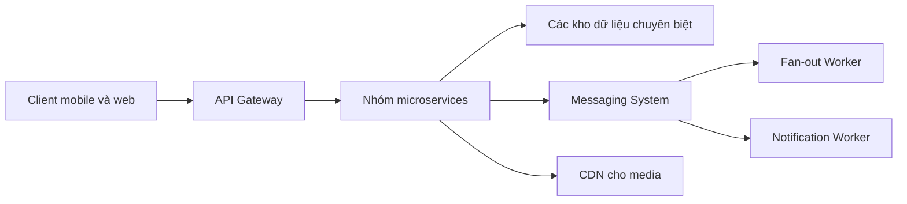

# 🗺️ Final Design News Feed: Ghép mọi mảnh ghép thành một hệ thống hoàn chỉnh

> Nguồn: `077-The-Final-Design---News-Feed.txt` · [Udemy](https://ua.udemy.com/course/mastering-system-design-from-basics-to-cracking-interviews/learn/lecture/49775859)

Chúng ta đã đi qua toàn bộ quy trình thiết kế, và giờ là lúc tất cả các mảnh ghép hội tụ thành **kiến trúc news feed hoàn chỉnh**. Hãy đừng nhìn nó như một tập hợp các thành phần rời rạc, mà như **một bộ service chuyên trách cùng phối hợp** để giải một bài toán rất cụ thể: giao timeline cá nhân hóa đến hàng triệu người dùng với **độ trễ thấp** và **độ tin cậy cao**.

---

### 🗺️ Kiến trúc cuối cùng — hành trình của một request

Hành trình bắt đầu từ **client application**. Dù người dùng đăng tweet, mở timeline, upload ảnh hay like một bài viết, mọi request trước tiên đều đi đến **API gateway**. Đây là điểm vào duy nhất cho **xác thực, định tuyến request, rate limiting** và các mối quan tâm xuyên suốt khác, trước khi request chạm đến service backend phù hợp.

Phía sau gateway, hệ thống được tách thành các microservice tập trung:

* **User service** quản lý quan hệ người dùng.
* **Tweet service** lưu và truy xuất tweet.
* **Timeline service** lắp ghép feed cá nhân hóa.
* **Engagement service** xử lý like, reply, retweet.
* **Media service** quản lý ảnh và video.

Vì mỗi service có một trách nhiệm duy nhất, chúng đều có thể **mở rộng độc lập theo mô hình lưu lượng của riêng mình**. Mỗi service cũng lưu dữ liệu vào kho phù hợp nhất với khối lượng công việc của nó: dữ liệu timeline được tối ưu cho đọc nhanh; tweet nằm trong database mở rộng tốt, chịu được lưu lượng ghi lớn; thông tin tương tác được quản lý riêng; còn file media lớn sống trong object storage. Những file media đó sau đó được giao qua **CDN**, để người dùng nhận ảnh và video nhanh chóng bất kể họ ở đâu.

---

### 🔀 Giữ việc nặng ra khỏi đường đi của request

Một trong những quyết định kiến trúc quan trọng nhất là **không để công việc đắt đỏ nằm trong request path của người dùng**.

Khi ai đó đăng tweet, hệ thống **không** cập nhật đồng bộ hàng triệu timeline rồi mới trả phản hồi. Thay vào đó, nó **publish một event vào messaging system**. Các **background worker** tiêu thụ những event này để thực hiện fan-out và các xử lý khác một cách bất đồng bộ, trong khi **notification worker** độc lập giao thông báo cho người dùng. Nhờ vậy, ứng dụng vẫn phản hồi nhanh ngay cả trong giai đoạn lưu lượng cực cao, và nếu một phần của hệ thống gặp tải bất thường, phần còn lại vẫn tiếp tục vận hành với ảnh hưởng tối thiểu.

Xuyên suốt kiến trúc:

* **Caching** giảm tải cho database.
* **Queue** hấp thụ các đỉnh lưu lượng đột ngột.
* **Các service mở rộng độc lập** ngăn một thành phần quá tải trở thành điểm nghẽn của toàn nền tảng.

---

### 💡 Mọi quyết định đều truy về non-functional requirements

Nếu các bạn lùi lại một bước và nhìn toàn cảnh, sẽ thấy **mọi quyết định lớn đều bắt nguồn từ các non-functional requirements đã định nghĩa ban đầu**:

1. Tối ưu cho khối lượng **read-heavy** bằng caching và cách sinh timeline hiệu quả.
2. Đạt **khả năng mở rộng** nhờ phân rã nền tảng thành các service độc lập.
3. Cải thiện **độ phản hồi** thông qua xử lý bất đồng bộ.
4. Tăng **khả năng chịu lỗi** bằng cách cô lập lỗi và tránh ghép nối chặt giữa các thành phần.

Đó là bài học quan trọng nhất của case study này: system design **không phải** là lắp ghép một bộ sưu tập công nghệ, mà là hiểu bài toán mình đang giải và đưa ra các quyết định kiến trúc giải quyết bài toán đó, trong khi cân bằng giữa hiệu năng, khả năng mở rộng, độ tin cậy và độ phức tạp vận hành.

---

### 🎓 Bài học lớn: giải thích được "vì sao" mới là tư duy kiến trúc

Kiến trúc này **không phải là giải pháp duy nhất có thể**, cũng **không hoàn hảo**. Các công ty khác nhau đưa ra những đánh đổi khác nhau dựa trên ưu tiên và quy mô của riêng họ. Điều quan trọng là **lý lẽ đằng sau các lựa chọn**.

Nếu các bạn có thể giải thích **vì sao một thành phần tồn tại**, **nó giải quyết bài toán gì** và **nó mang lại đánh đổi nào**, thì các bạn đang tư duy như một kiến trúc sư hệ thống — thay vì chỉ học thuộc lòng một sơ đồ.

Vậy là chúng ta đã khép lại case study thiết kế news feed. Mình hy vọng phần walkthrough này đã cho các bạn một **khung phương pháp thực dụng** để tiếp cận các hệ phân tán quy mô lớn. Ở case study tiếp theo, chúng ta sẽ áp dụng đúng quy trình thiết kế có cấu trúc này cho một bài toán hoàn toàn khác, và tiếp tục xây dựng tư duy kiến trúc mà những system designer giỏi nhất dựa vào. Hẹn gặp lại các bạn! 🚀
