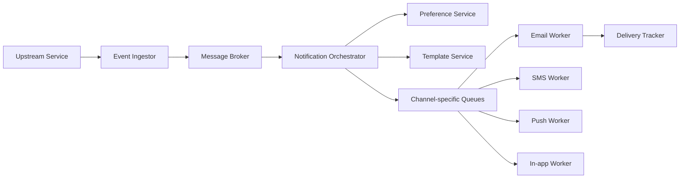

# 🏗️ High-Level Design cho Notification System: Pipeline, luồng giao tiếp và API

> Nguồn: `080-High-Level-Design-Services-APIs-Communication.txt` · [Udemy](https://ua.udemy.com/course/mastering-system-design-from-basics-to-cracking-interviews/learn/lecture/49819511)

Sau khi đã nhận diện các thách thức, chúng ta bước vào bước 3: **high-level design**. Hãy nghĩ về notification system không phải như một tập hợp service rời rạc, mà như **một pipeline (đường ống)** trong đó mỗi thành phần có trách nhiệm rất rõ ràng. Giữ các trách nhiệm tách biệt chính là điều giúp hệ thống dễ mở rộng, dễ bảo trì và dễ tiến hóa.

---

### 🔔 Các thành phần chính của pipeline thông báo

1. **Event ingestor (bộ tiếp nhận sự kiện):** điểm vào của mọi thông báo. Các **upstream system** như order service hay authentication service publish business event, và event ingestor nhận chúng. Vì lưu lượng đến theo những đợt khó lường, nó **không xử lý ngay từng sự kiện**; thay vào đó, nó dùng buffering và rate control qua các công nghệ như **Kafka** hoặc **SQS**, để phần còn lại của hệ thống nhận được dòng công việc ổn định, dễ xử lý.
2. **Notification orchestrator (bộ điều phối thông báo):** tầng ra quyết định của hệ thống. Nhiệm vụ của nó **không phải là gửi thông báo trực tiếp**, mà chỉ quyết định **điều gì nên xảy ra**: dựa trên sự kiện đầu vào, xác định cần sinh thông báo nào, kiểm tra tùy chọn người dùng, rồi phối hợp với các service hỗ trợ trước khi bàn giao công việc cho kênh giao nhận phù hợp.
3. **Preference service (service tùy chọn người dùng):** lưu thiết lập thông báo của từng người — kênh ưa thích, loại thông báo, **quiet hours**. Vì tùy chọn được tra cứu cho gần như mọi thông báo, đây là ứng viên lý tưởng để **cache bằng Redis**, cho phép xử lý khối lượng đọc lớn mà không phải liên tục truy vấn database.
4. **Template service:** sinh nội dung thông điệp thật sự. Thay vì mỗi ứng dụng tự tạo email hay push notification, service này tạo ra thông điệp **nhất quán, đã bản địa hóa** từ các template tái sử dụng. Những template dùng thường xuyên có thể được cache để giảm chi phí dựng nội dung và cải thiện thời gian phản hồi.
5. **Channel workers (worker theo kênh):** thay vì một thành phần ôm mọi cơ chế giao nhận, chúng ta duy trì các worker riêng cho **email, SMS, push và in-app**. Mỗi worker hiểu giao thức và API của kênh mình, biết cách quản lý retry, và **mở rộng độc lập theo nhu cầu**. Ví dụ, nếu lưu lượng email đột ngột tăng, ta thêm email worker mà không ảnh hưởng đến việc xử lý SMS hay push.
6. **Delivery tracker và dead-letter queue:** delivery tracker ghi lại kết quả của mọi thông báo, cho ta tầm nhìn về cái gì đã gửi thành công và cái gì thất bại. Nếu một thông báo vẫn tiếp tục lỗi sau nhiều lần retry, nó được chuyển vào **dead-letter queue** để điều tra sau, thay vì bị âm thầm loại bỏ — điều này cải thiện cả độ tin cậy lẫn khả năng quan sát vận hành.

Triết lý thiết kế tổng thể: **mỗi thành phần tập trung vào một trách nhiệm** và cộng tác với nhau qua những ranh giới được định nghĩa rõ ràng. Chính sự tách biệt đó cho phép hệ thống giữ được khả năng mở rộng, kiên cường và dễ mở rộng tính năng khi có kênh mới, loại thông báo mới hay khối lượng lớn hơn trong tương lai.

---

### 🌊 Luồng giao tiếp từ đầu đến cuối

Hãy đặt tất cả các thành phần cạnh nhau và nhìn vào **luồng giao tiếp end-to-end**. Điều đáng chú ý không nằm ở từng service riêng lẻ, mà ở cách **trách nhiệm dịch chuyển** qua hệ thống:

1. **Upstream service sinh business event** — một đơn hàng được gửi đi, một mật khẩu bị thay đổi, hay một tin nhắn được nhận. Thay vì gửi thông báo trực tiếp, ứng dụng chỉ **publish một event**.
2. **Event ingestor** nhận lưu lượng đầu vào một cách an toàn: xác thực request, áp rate limiting cần thiết, rồi đặt sự kiện vào **message broker**. Đây là quyết định kiến trúc quan trọng vì broker **tách rời event producer khỏi phần còn lại của pipeline**, đồng thời cho phép hệ thống hấp thụ các đỉnh lưu lượng đột ngột mà không làm quá tải các thành phần phía sau.
3. **Notification orchestrator** tiêu thụ sự kiện từ broker — đây là nơi diễn ra các quyết định nghiệp vụ. Nó xác định thông báo nào cần gửi, tham vấn **preference service** để tôn trọng thiết lập của người dùng, và yêu cầu **template service** sinh thông điệp bản địa hóa phù hợp.
4. **Khi thông báo đã sẵn sàng**, nó **không được gửi trực tiếp** đến nhà cung cấp bên ngoài, mà được đặt vào **các queue riêng theo kênh**. Sự tách biệt này rất giá trị vì mỗi kênh hành xử khác nhau: email, SMS, push và in-app có throughput, chính sách retry và giới hạn provider hoàn toàn khác nhau. Cô lập chúng ngăn một kênh đang bận hoặc đang lỗi ảnh hưởng đến các kênh còn lại.
5. **Các channel worker chuyên trách** xử lý queue của mình một cách độc lập. Mỗi worker hiểu cách giao tiếp với provider bên ngoài tương ứng và chịu trách nhiệm về các lần thử gửi cũng như retry cho kênh đó.
6. **Mọi lần thử gửi đều được báo về delivery tracker** — thông báo thành công ngay, hoặc thất bại hoàn toàn sau nhiều lần retry. Kết quả được ghi lại để hệ thống có **tầm nhìn đầy đủ về vòng đời của thông báo**. Những thất bại dai dẳng sau đó có thể được chuyển vào dead-letter queue để điều tra, thay vì mất im lặng.

Hãy để ý: kiến trúc này **gần như hoàn toàn bất đồng bộ**, và đó là chủ ý. Bằng cách tách ingestion, ra quyết định và giao nhận thành các chặng độc lập nối với nhau qua queue, hệ thống trở nên **dễ mở rộng hơn, kiên cường hơn trước lỗi**, và sẵn sàng hơn cho khối lượng lưu lượng khổng lồ đã ước lượng. Đây là một trong những nguyên tắc kiến trúc then chốt mà các bạn sẽ gặp lặp đi lặp lại trong các hệ phân tán quy mô lớn.

---

### 🌐 Thiết kế API cho người dùng và quản trị viên

Thiết kế API tốt không chỉ là định nghĩa endpoint, mà là **phơi bày đúng năng lực cho đúng đối tượng sử dụng**, trong khi vẫn giữ nền tảng an toàn và dễ dùng.

**API phía người dùng:**

* `GET /notifications` trả về các thông báo in-app mới nhất cho người dùng, đồng thời hỗ trợ **pagination, filtering và sorting**. Những tính năng này trở nên quan trọng khi lịch sử thông báo lớn dần: thay vì trả về hàng nghìn bản ghi, ta chỉ lấy đúng phần người dùng cần — cải thiện cả hiệu năng lẫn trải nghiệm.
* `POST /notifications/read` cho phép người dùng quản lý thông báo của mình. Thay vì gửi request riêng cho từng thông báo, API nhận **danh sách ID thông báo**, cho phép đánh dấu đã đọc nhiều thông báo trong một thao tác — giảm lưu lượng mạng không cần thiết và đơn giản hóa ứng dụng client.

**API phía quản trị:**

* `POST /notifications` cho phép quản trị viên hoặc hệ thống nội bộ **kích hoạt thông báo thủ công**, phục vụ các tình huống như thông báo toàn hệ thống, cảnh báo bảo trì hay chiến dịch marketing — những thông báo không gắn với business event nào từ service khác.
* `GET /delivery-report` cung cấp trạng thái giao nhận và metadata của một sự kiện thông báo. Gửi thông báo mới chỉ là một nửa câu chuyện; đội ngũ vận hành còn cần thấy **điều gì đã thực sự xảy ra** — rất hữu ích để debug các giao nhận thất bại, thực hiện audit hoặc cung cấp dữ liệu cho dashboard phân tích.

**Bảo mật:** vì các API này phơi bày chức năng nhạy cảm, mọi request cần được xác thực bằng các cơ chế như **JWT** hoặc **OAuth2**. Quan trọng hơn, chỉ xác thực là chưa đủ — cần cả **authorization (phân quyền)**: người dùng thường chỉ được truy cập thông báo của chính mình, còn endpoint quản trị yêu cầu quyền hạn dựa trên vai trò. Đặt các API này sau **API gateway** cũng cho phép chúng ta thực thi rate limiting và bảo vệ nền tảng khỏi lạm dụng.

Một điều cần lưu ý: những API này phục vụ **tương tác** với nền tảng thông báo, chứ **không tự giao thông báo**. Phần việc nặng vẫn diễn ra bất đồng bộ bên trong pipeline đã bàn ở trên; API chỉ cung cấp giao diện sạch sẽ, an toàn để người dùng và quản trị viên làm việc với nền tảng, trong khi kiến trúc bên dưới vẫn được tách rời và mở rộng tốt.

---

### 🎯 Tự kiểm tra nhanh

**Câu 1:** Vì sao event ingestor không xử lý ngay từng sự kiện?

<b>Xem đáp án</b>

**Đáp án:** Để hấp thụ các đợt lưu lượng khó lường và tạo dòng công việc ổn định cho phần còn lại của hệ thống, qua buffering và rate control với Kafka hoặc SQS.

Giải thích: Xử lý ngay mọi sự kiện có thể làm quá tải các service phía sau.

Tham chiếu: Mục Các thành phần chính.

**Câu 2:** Vai trò của notification orchestrator khác gì channel worker?

<b>Xem đáp án</b>

**Đáp án:** Orchestrator chỉ ra quyết định — sinh thông báo nào, kiểm tra tùy chọn, phối hợp service; còn channel worker thực hiện giao nhận và retry theo kênh.

Giải thích: Orchestrator không gửi thông báo trực tiếp.

Tham chiếu: Mục Các thành phần chính.

**Câu 3:** Vì sao thông báo được đặt vào queue riêng theo từng kênh thay vì gửi trực tiếp?

<b>Xem đáp án</b>

**Đáp án:** Vì mỗi kênh có throughput, chính sách retry và giới hạn provider khác nhau; cô lập kênh ngăn một kênh bận hoặc lỗi ảnh hưởng các kênh khác.

Giải thích: Đây là lý do pipeline gần như hoàn toàn bất đồng bộ.

Tham chiếu: Mục Luồng giao tiếp.

**Câu 4:** API `GET /notifications` hỗ trợ những tính năng nào và vì sao cần?

<b>Xem đáp án</b>

**Đáp án:** Pagination, filtering và sorting — để chỉ lấy phần dữ liệu người dùng cần khi lịch sử thông báo lớn dần.

Giải thích: Tránh trả về hàng nghìn bản ghi, cải thiện hiệu năng và trải nghiệm.

Tham chiếu: Mục Thiết kế API.

**Câu 5:** Vì sao chỉ xác thực là chưa đủ với các API này?

<b>Xem đáp án</b>

**Đáp án:** Cần cả authorization: người dùng chỉ truy cập thông báo của chính mình, endpoint quản trị yêu cầu quyền dựa trên vai trò.

Giải thích: API gateway cũng được dùng để thực thi rate limiting và bảo vệ nền tảng.

Tham chiếu: Mục Thiết kế API.

---

Vậy là chúng ta đã có thiết kế tổng quan hoàn chỉnh: pipeline sáu thành phần, luồng giao tiếp end-to-end gần như hoàn toàn bất đồng bộ, và bộ API tách biệt cho người dùng lẫn quản trị viên. Ở bài tiếp theo, chúng ta sẽ **chọn công nghệ và hạ tầng** để hiện thực hóa kiến trúc này — từ Kafka hay SQS, template engine, các nhà cung cấp gửi tin, đến Kubernetes và observability. Hẹn gặp lại các bạn! 🚀
