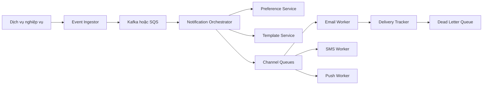

# 🚀 Final Design Notification System: Từ sự kiện nghiệp vụ đến thông báo trong tay người dùng

> Nguồn: `082-The-Final-Design---Notification-System.txt` · [Udemy](https://ua.udemy.com/course/mastering-system-design-from-basics-to-cracking-interviews/learn/lecture/49819517)

Đây là lúc tất cả các mảnh ghép hội tụ lại. Thay vì nhìn từng service trong sự cô lập, mình và các bạn hãy xem chúng **phối hợp với nhau** như thế nào để giao thông báo một cách đáng tin cậy, hiệu quả và ở quy mô lớn — đi hết vòng đời của một thông báo từ sự kiện nghiệp vụ cho đến tay người dùng.

---

### 🗺️ Kiến trúc cuối cùng — từ sự kiện đến thông báo

Luồng bắt đầu khi một trong các **business service** phát sinh sự kiện: một đơn hàng được gửi đi, người dùng nhận tin nhắn mới, hay ai đó đặt lại mật khẩu. Điểm quan trọng nhất: **các service này không tự gửi thông báo** — chúng chỉ **publish business event**. Nhờ vậy, business logic luôn sạch sẽ và **tách rời (decoupled)** khỏi nền tảng thông báo.

Sự kiện sau đó được **event ingestor** tiếp nhận. Vì lưu lượng có thể dao động dữ dội, ingestor đóng vai trò **lớp bảo vệ**: thay vì xử lý ngay mọi sự kiện, nó xác thực request rồi đặt sự kiện vào **message broker** như **Kafka** hoặc **SQS**. Ranh giới bất đồng bộ này cho phép hệ thống **hấp thụ đỉnh lưu lượng mà không làm quá tải** các thành phần phía sau.

---

### 🔔 Bộ não của hệ thống: orchestrator, preferences và templates

**Notification orchestrator** tiêu thụ sự kiện từ broker — đây là **động cơ ra quyết định** của toàn nền tảng. Nó xác định thông báo có nên được sinh ra không, ai là người nhận, và kênh giao nhận nào phù hợp nhất.

Trước khi đưa ra quyết định đó, orchestrator **tham vấn preference service**. Mỗi người dùng có thể có thiết lập khác nhau: người thích email, người thích push, một số người tắt hẳn vài loại thông báo. Bằng cách **tập trung hóa các tùy chọn này**, chúng ta đảm bảo mọi thông báo đều tôn trọng lựa chọn của người dùng — mà **không bắt từng ứng dụng phải tự triển khai logic đó**.

Khi kênh giao nhận đã được xác định, orchestrator yêu cầu **template service** sinh nội dung thật sự. Dùng template tập trung giúp thông điệp **nhất quán trên toàn nền tảng**, đồng thời khiến việc bản địa hóa và cá nhân hóa trở nên đơn giản.

---

### 📬 Kênh gửi độc lập, retry và dead-letter queue

Sau khi thông điệp được sinh ra, chúng **không được gửi trực tiếp** đến nhà cung cấp bên ngoài, mà được đặt vào **các queue riêng theo kênh**. Đây là quyết định kiến trúc then chốt, vì mỗi kênh hành xử rất khác nhau: email, SMS, push và in-app có throughput, chiến lược retry và giới hạn nhà cung cấp hoàn toàn khác biệt. Cô lập chúng đảm bảo **lưu lượng lớn hay lỗi ở một kênh không ảnh hưởng đến các kênh còn lại**.

Tiếp đó, **các channel worker chuyên trách** liên tục tiêu thụ thông điệp từ queue tương ứng. Mỗi worker chỉ chuyên một cơ chế giao nhận và giao tiếp với nhà cung cấp phù hợp: **SendGrid** cho email, **Twilio** cho SMS, **Firebase Cloud Messaging** cho push, hay hạ tầng in-app của chính ứng dụng. Vì khối lượng giao nhận thay đổi theo kênh, các worker **mở rộng độc lập**: trong một chiến dịch marketing chẳng hạn, lưu lượng email có thể tăng mạnh trong khi SMS vẫn thấp — ta thêm năng lực đúng nơi cần, thay vì mở rộng toàn hệ thống một cách lãng phí. **Load balancer** phân phối công việc giữa các worker instance để không node nào trở thành điểm nghẽn.

Với **in-app notification**, thông điệp đã giao còn được lưu vào **in-app notification store**. Điều này cho phép người dùng truy xuất lịch sử thông báo sau này qua API thông báo người dùng, **kể cả khi họ không dùng ứng dụng vào thời điểm thông báo được sinh ra**.

Xuyên suốt quá trình, **delivery tracker** ghi nhận mọi lần thử giao: thành công được lưu lại, thất bại kích hoạt retry theo chính sách đã cấu hình. Nếu sau nhiều lần vẫn không giao được, thông báo **không bị vứt bỏ** mà được chuyển vào **dead-letter queue** để kiểm tra, phân tích hoặc xử lý lại sau. Nhờ đó, **thất bại luôn hữu hình thay vì biến mất im lặng**.

---

### 🎓 Bốn nguyên tắc của một nền tảng production-grade

Nếu lùi lại nhìn toàn bộ kiến trúc, các bạn sẽ thấy vài nguyên tắc thiết kế quan trọng:

1. **Hệ thống bất đồng bộ** — các đỉnh lưu lượng không làm quá tải service phía sau.
2. **Trách nhiệm được tách bạch rõ ràng** — từng thành phần có thể tiến hóa và mở rộng độc lập.
3. **Lỗi của nhà cung cấp bên ngoài được cô lập** trong kênh bị ảnh hưởng, ngăn lỗi dây chuyền lan khắp nền tảng.
4. **Mọi chặng của vòng đời thông báo đều quan sát được** — giúp vận hành và xử lý sự cố dễ dàng hơn trong production.

Đây chính xác là những gì một nền tảng thông báo chuẩn production cần đạt được: nó **không chỉ gửi tin nhắn**, mà chuyển hóa sự kiện nghiệp vụ thành thông báo cho người dùng một cách đáng tin cậy — tôn trọng tùy chọn, hỗ trợ nhiều kênh, xử lý lỗi một cách duyên dáng, và mở rộng tới hàng trăm triệu thông báo mỗi ngày.

Hãy mang theo tư duy kiến trúc này từ case study: **xây hệ thống với trách nhiệm rõ ràng, ghép nối lỏng, xử lý bất đồng bộ, và coi khả năng chịu lỗi là mục tiêu thiết kế hạng nhất**. Vậy là chúng ta đã khép lại case study notification system. Ở section tiếp theo, chúng ta sẽ đến với một case study thực tế mới và áp dụng đúng quy trình thiết kế có cấu trúc này một lần nữa. Hẹn gặp lại các bạn! 🚀
