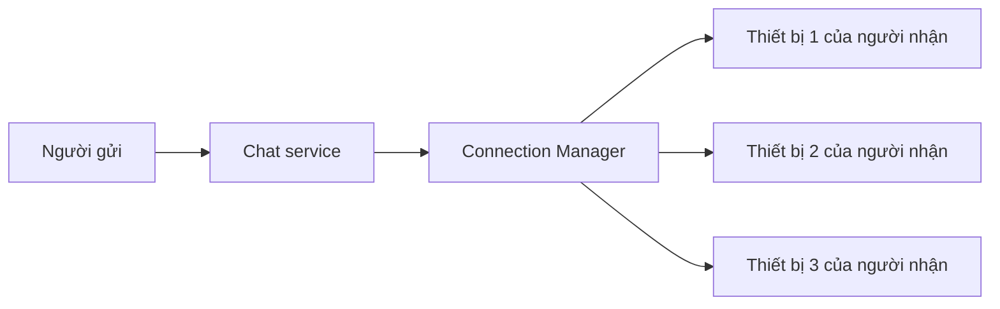

# 📊 Chat app — Bước 2: Ước lượng quy mô và tìm điểm nghẽn

> Nguồn: `084-Estimating-Scale-Identifying-Bottlenecks.txt` · [Udemy](https://ua.udemy.com/course/mastering-system-design-from-basics-to-cracking-interviews/learn/lecture/49824339)

Sang bước 2, chúng ta sẽ **ước lượng quy mô** mà hệ thống phải phục vụ và **xác định những điểm nghẽn** có khả năng xuất hiện. Những con số ở đây không cần chính xác tuyệt đối — mục đích của chúng là giúp mình và các bạn đưa ra những **quyết định kiến trúc hợp lý**.

Đây cũng là bước mà các bạn sẽ thấy rõ một điều: **thiết kế hệ thống được dẫn dắt bởi con số, chứ không phải bởi cảm tính**. Cùng đi qua từng ước lượng nhé.

---

### 📈 Ước lượng quy mô — những con số định hình thiết kế

Giả sử ứng dụng chat của chúng ta có khoảng **100 triệu người dùng active mỗi ngày**. Nếu mỗi người gửi trung bình **50 tin nhắn mỗi ngày**, nền tảng cần xử lý khoảng **5 tỷ tin nhắn mỗi ngày**.

Tất nhiên, traffic không bao giờ phân bố đều. Vào các dịp **lễ hội, sự kiện thể thao hay những thông báo toàn cầu lớn**, hoạt động của người dùng có thể **tăng vọt**. Vì vậy chúng ta giả định **hệ số peak (đỉnh tải) khoảng 3 lần** so với tải bình thường. Kiến trúc không chỉ phải "sống sót" qua những đỉnh này — nó phải **tiếp tục giao tin với độ nhanh nhạy như cũ**.

Một chỉ số quan trọng khác là **concurrent connections (kết nối đồng thời)**. Ở thời điểm cao điểm, có thể có **20 đến 30 triệu người online cùng lúc**. Khác với ứng dụng web thông thường — nơi request chỉ tồn tại trong thời gian ngắn — ứng dụng chat duy trì **persistent connection (kết nối thường trực)** để người dùng nhận tin ngay lập tức. **Duy trì hàng triệu kết nối luôn mở là một trong những thách thức kiến trúc lớn nhất** trong các hệ thống thực tế.

| Chỉ số | Con số ước lượng | Hàm ý cho kiến trúc |
|---|---|---|
| Người dùng active mỗi ngày | ~100 triệu | Thiết kế cho quy mô toàn cầu |
| Tin nhắn mỗi ngày | ~5 tỷ | Cần hệ thống ghi cực lớn |
| Hệ số peak | ~3 lần tải thường | Phải chịu được đỉnh tải đột ngột |
| Kết nối đồng thời | 20-30 triệu | Cần quản lý kết nối thường trực |

Điểm mấu chốt **không nằm ở những con số chính xác**, mà ở việc hiểu rằng **khi đã đạt tới quy mô này, gần như mọi quyết định thiết kế đều thay đổi**. Một giải pháp chạy hoàn hảo với vài nghìn người dùng có thể **sụp đổ hoàn toàn** khi phải xử lý hàng tỷ tin nhắn và hàng chục triệu kết nối đồng thời. Đó là lý do **capacity estimation (ước lượng năng lực)** là một bước quan trọng hàng đầu trong thiết kế hệ thống: nó tạo ra bối cảnh cho mọi quyết định về sau trong case study này.

---

### 🧩 Sáu điểm nghẽn cần lường trước

Trước khi vẽ kiến trúc, rất đáng để nhận diện nơi hệ thống dễ gặp khó khăn nhất. Trong hệ thống quy mô lớn, **vấn đề hiệu năng hiếm khi xuất hiện ở khắp mọi nơi** — chúng thường tập trung quanh một vài **điểm nghẽn (bottleneck)** quan trọng. Nhận diện sớm giúp chúng ta thiết kế đúng giải pháp:

1. **Message ingestion và fan-out** — nhận một tin nhắn từ một người dùng thì tương đối đơn giản. Nhưng **giao tin đó đến mọi người nhận** — và với mỗi người nhận, có thể là **nhiều thiết bị** — mới là lúc khối lượng công việc tăng vọt. Kiến trúc cần **phân tán công việc này một cách hiệu quả**, thay vì cố xử lý tất cả một cách đồng bộ.
2. **Presence update (cập nhật trạng thái online)** — trạng thái online/offline thay đổi liên tục khi người dùng kết nối, ngắt kết nối hoặc chuyển mạng. Những cập nhật này **nhỏ nhưng tần suất cực lớn**, nên cần cách lan truyền hiệu quả **mà không liên tục đập vào database**.
3. **Delivery acknowledgement (xác nhận giao tin)** — trạng thái đã gửi/đã đọc thực chất là **một thao tác ghi (write) khác**. Ở quy mô mục tiêu, những xác nhận này có thể sinh ra **thêm hàng tỷ lượt ghi**, đòi hỏi tầng lưu trữ phải tối ưu cho **write throughput (thông lượng ghi) cực cao**.
4. **Multi-device synchronization (đồng bộ đa thiết bị)** — một người dùng có thể đăng nhập đồng thời từ điện thoại, tablet và desktop. Mọi tin nhắn và cập nhật trạng thái phải đến đúng thiết bị **đúng một lần**, tránh trùng lặp và giữ cuộc trò chuyện nhất quán.
5. **Storage (lưu trữ)** — với hàng tỷ tin nhắn được sinh ra, cần chiến lược lưu trữ vừa **ghi liên tục** vừa cho phép **truy xuất hội thoại hiệu quả**. Khi dữ liệu lớn lên, **partitioning (phân vùng)** trở nên thiết yếu để không node database nào trở thành điểm nghẽn.
6. **Security không hề miễn phí** — end-to-end encryption bảo vệ quyền riêng tư, nhưng việc mã hóa, **quản lý khóa** và xử lý metadata an toàn đều **tiêu tốn compute** và tăng độ phức tạp vận hành. Thách thức là giữ bảo mật mạnh **mà không đánh đổi độ nhanh nhạy**.

Bài học quan trọng nhất ở đây: xây ứng dụng chat **không chỉ là gửi tin nhắn**. Đó là việc **nhận diện nơi quy mô tạo ra áp lực** và thiết kế từng phần của hệ thống để chịu được áp lực đó. Những điểm nghẽn này sẽ trực tiếp định hình kiến trúc mà chúng ta xây ở các bước sau.

---

### ⚡ Điểm nghẽn lớn nhất — giao tin theo thời gian thực

Thách thức lớn nhất của mọi ứng dụng chat **không phải là lưu tin nhắn, mà là giao tin tức thì**. Người dùng kỳ vọng tin nhắn xuất hiện gần như ngay khi được gửi, và chính kỳ vọng đó khiến **real-time delivery trở thành điểm nghẽn quan trọng bậc nhất** của toàn hệ thống.

Để làm được điều này, client duy trì **persistent WebSocket connection** thay vì liên tục gọi HTTP. Những kết nối dài hạn này cho phép server **đẩy tin nhắn mới ngay lập tức**, không cần chờ client hỏi lại. Nhưng hãy thử tưởng tượng điều đó ở quy mô lớn:

* Thay vì xử lý request ngắn, hạ tầng phải **giữ hàng triệu kết nối WebSocket mở cùng lúc**.
* **Load balancer và application server không chỉ xử lý request nữa** — chúng liên tục **quản lý kết nối đang hoạt động**, và mỗi kết nối đều **tiêu tốn bộ nhớ cùng các tài nguyên hệ thống khác**.
* Vì vậy chúng ta cần một **connection management service (service quản lý kết nối) chuyên trách**. Nhiệm vụ của nó là biết **ai đang kết nối, dùng thiết bị nào, và tin nhắn đến phải được định tuyến đi đâu**. Không có thông tin này, real-time delivery đơn giản là không thể.

Thách thức còn lớn hơn với thiết bị di động. Người dùng liên tục **chuyển giữa Wi-Fi và dữ liệu di động**, mất kết nối, hoặc đưa ứng dụng xuống background. Kết nối **ngắt và kết nối lại liên tục** — hiện tượng này gọi là **connection churn (kết nối biến động)**. Hệ thống phải phục hồi khỏi những gián đoạn đó một cách êm ái để trải nghiệm nhắn tin vẫn liền mạch.

Điểm mấu chốt: **khó khăn không nằm ở bản thân WebSocket, mà ở việc vận hành hàng triệu kết nối thường trực một cách đáng tin cậy**. Điều đó đòi hỏi **quản lý vòng đời kết nối (connection lifecycle)** cẩn thận, **định tuyến hiệu quả**, và hạ tầng **mở rộng theo chiều ngang (horizontal scaling)** khi số người dùng active tăng lên. Giải xong điểm nghẽn này chính là một trong những nền tảng để xây ứng dụng chat real-time quy mô production.

---

### 🎯 Tự kiểm tra nhanh

**Câu 1:** Với 100 triệu người dùng và trung bình 50 tin nhắn mỗi ngày, nền tảng phải xử lý khoảng bao nhiêu tin nhắn một ngày?

<b>Xem đáp án</b>

**Đáp án:** Khoảng 5 tỷ tin nhắn mỗi ngày.

Giải thích: Con số này cho thấy quy mô ghi dữ liệu mà kiến trúc phải chịu được.

Tham chiếu: Mục Ước lượng quy mô — những con số định hình thiết kế.

**Câu 2:** Vì sao phải tính đến hệ số peak khoảng 3 lần?

<b>Xem đáp án</b>

**Đáp án:** Vì traffic tăng vọt vào dịp lễ hội, sự kiện thể thao hay thông báo toàn cầu.

Giải thích: Kiến trúc không chỉ sống sót qua đỉnh tải mà còn phải giữ nguyên độ nhanh nhạy.

Tham chiếu: Mục Ước lượng quy mô — những con số định hình thiết kế.

**Câu 3:** Vì sao delivery acknowledgement lại tạo ra khối lượng công việc nặng?

<b>Xem đáp án</b>

**Đáp án:** Vì nó thực chất là một thao tác ghi khác, và có thể sinh ra thêm hàng tỷ lượt ghi.

Giải thích: Do đó tầng lưu trữ phải được tối ưu cho thông lượng ghi cực cao.

Tham chiếu: Mục Sáu điểm nghẽn cần lường trước.

**Câu 4:** Vì sao WebSocket không phải là phần khó nhất của real-time delivery?

<b>Xem đáp án</b>

**Đáp án:** Vì khó khăn thật sự nằm ở việc vận hành hàng triệu kết nối thường trực đáng tin cậy.

Giải thích: Cần quản lý vòng đời kết nối, định tuyến hiệu quả và mở rộng theo chiều ngang.

Tham chiếu: Mục Điểm nghẽn lớn nhất — giao tin theo thời gian thực.

**Câu 5:** Connection churn là gì?

<b>Xem đáp án</b>

**Đáp án:** Là hiện tượng kết nối liên tục ngắt rồi kết nối lại của người dùng di động.

Giải thích: Người dùng chuyển mạng, mất sóng hoặc đưa app vào background, nên hệ thống phải phục hồi êm ái.

Tham chiếu: Mục Điểm nghẽn lớn nhất — giao tin theo thời gian thực.

---

Vậy là chúng ta đã lượng hóa được quy mô: **~100 triệu người dùng mỗi ngày, ~5 tỷ tin nhắn, đỉnh tải gấp 3 lần, 20-30 triệu kết nối đồng thời** — cùng 6 điểm nghẽn và điểm nghẽn lớn nhất là **real-time delivery**.

Ở bài tiếp theo, chúng ta sẽ bắt tay vào **high-level design**: các service chính, cách chúng phối hợp, và luồng tin nhắn chạy xuyên hệ thống như thế nào. Hẹn gặp lại các bạn! 🚀
